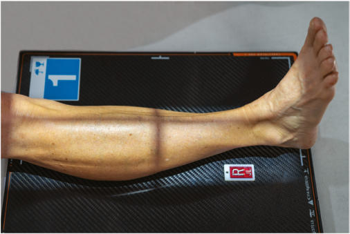
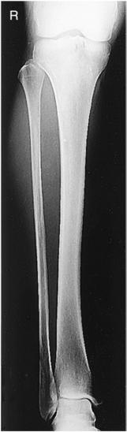
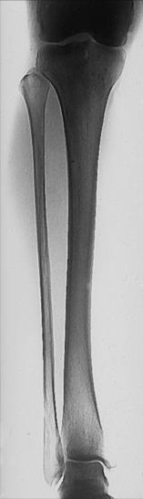

# Rx gambă (tibie și fibulă) AP (antero-posterior)

  📷 Radiografie Convențională (Rx)
  <strong>Actualizat:</strong> 2026-09-15
  <strong>Autor:</strong> Departamentul de Radiologie / Referință Bontrager

---

-   __1. Rezumat Clinic & Indicații__

    ---

    === "Indicații Clinice"

        - Patologii care implică suspiciune de fractură, corp străin/corpuri străine radioopace sau leziuni osoase

    === "Ghid Național IRIS"

        !!! info "Referință Primară: Ghidul Național IRIS (Ordinul MS 1342/2012)"
            - **Capitol Ghid IRIS:** *Aparat locomotor & Membru inferior*
            - **Grad de Recomandare:** **Grad A**
            - **Nivel de Iradiere Estimată:** `Clasa 1 (Minimă < 0.01 mSv)`

            [:octicons-search-16: Deschide Ghidul IRIS](../../iris.md){ .md-button .md-button--primary } [:material-open-in-new: Aplicația Oficială PWA](https://radiologie-pediatrica.ro/iris/){ .md-button target="_blank" rel="noopener" }

-   __2. Poziționare & Centrare Fascicul__

    ---

    - **Poziție Pacient:** Pacient: Se plasează pacientul în decubit dorsal; se oferă o pernă pentru capul pacientului; întregul membru inferior trebuie să fie complet extins. Regiune anatomică: Se ajustează bazinul, genunchiul și membrul inferior în incidență AP strictă, cu absența rotației anatomice: claviculele echidistante față de linia apofizelor spinoase (Fig. 6.98). Se plasează săculeți cu nisip lângă picior, dacă este necesar pentru stabilizare, și se face dorsiflexia piciorului la 90° față de gambă, dacă este posibil. Se asigură că ambele glezne (articulații talocrurale) și articulațiile genunchilor se află la 1 la 2 țoli (2.5 la 5 cm) de extremitățile receptorului de imagine, astfel încât razele divergente să nu proiecteze niciuna dintre articulații în afara receptorului de imagine. Dacă membrul este prea lung, se plasează gamba diagonal, din colț în colț, pe un receptor de imagine de 14 × 17 țol (35 × 43- cm), pentru a se asigura includerea ambelor articulații. (De asemenea, dacă este necesar, se poate efectua un al doilea receptor de imagine mai mic pentru articulația cea mai îndepărtată de locul leziunii.)
    - **Punct de Centrare Fascicul:** perpendicular pe receptorul de imagine, orientat la mijlocul gambei
    - **Distanță Focar-Film (DFF / SID):** 100 cm
    - **Comandă Respiratorie:** Apnee pe durata expunerii (sau conform cooperării pacientului)

-   __3. Parametri Tehnici Expunere__

    ---

    | Parametru Tehnic | Valoare Configurare Generator / Tub |
    |:-----------------|:-------------------------------------|
    | **Tensiune Tub (kV)** | 70-80 kV |
    | **Sarcină / Produs Curent-Timp (mAs)** | DE CONFIGURAT PE APARAT |
    | **Distanță Focar-Film (DFF / SID)** | 100 cm |
    | **Grilă Antidifuzoare (Bucky)** | Fără grilă (expunere directă) |
    | **Dimensiune Focar** | Focar Mic (0.6 mm) |
    | **Camere de Ionizare AEC** | DE CONFIGURAT PE APARAT |
    | **Colimare Fascicul** | Se colimează bilateral la marginile cutanate, cu colimare completă la marginile receptorului de imagine, pentru a include maximum de articulație a genunchiului și gleznă (articulația talocrurală). Alternativa de rutină pentru examinările de urmărire ale oaselor lungi în unele departamente constă în includerea numai a articulației aflate cel mai aproape de locul leziunii și plasarea acestei articulații la minimum 2 țoli (5 cm) de extremitatea receptorului de imagine, pentru o mai bună demonstrare a articulației. Totuși, pentru examinările inițiale, este important, mai ales când locul leziunii se află în membrul inferior distal, să se includă regiunea articulației tibiofibulare proximale, deoarece este frecventă existența unei a doua suspiciuni de fractură la acest nivel. Pentru pacienții mari, poate fi necesară o a doua incidență antero-posterioară (AP) a genunchiului și gambei proximale pe un receptor de imagine mai mic. Condil lateral; capul fibulei; fibula; maleolă laterală (fibulară); astragal (talus); maleolă medială (tibială); tibia; condil medial; femur; eminență intercondiliană. Fig. 6.100 AP gambă — ambele articulații. (Cu amabilitatea J. Sanderson, RT.) Fig. 6.99 AP gambă — ambele articulații. (Cu amabilitatea J. Sanderson, RT.) Gambă AP de profil. Fig. 6.98 AP gambă — include ambele articulații. |
    | **Filtrare Tub** | Totală ≥ 2.5 mm Al echivalent |

-   __4. Criterii de Calitate & Reușită Imagine__

    ---

    - Întreaga tibie și fibulă trebuie să includă articulația gleznei (articulația talocrurală) și articulațiile genunchiului în această incidență (sau două, dacă este necesar).
    - Excepția este poziția alternativă de rutină la examinările de urmărire (Fig. 6.99 și 6.100).
    - Absența rotației anatomice: claviculele echidistante față de linia apofizelor spinoase, evidențiată prin demonstrarea condililor femurali și tibiali în profil, cu eminența intercondiliană centrată în fosa intercondiliană.
    - O anumită suprapunere a fibulei și tibiei este vizibilă la ambele extremități, proximală și distală.
    - Colimare la aria de interes diagnostic. Expunere:
    - Utilizarea corectă a efectului anode heel produce o imagine cu vizualizare aproape egală a anatomiei la ambele extremități ale receptorului de imagine.
    - Nu este prezentă mișcare, fapt evidențiat de marginile corticale nete și de structurile trabeculare.
    - Expunerea optimă a receptorului de imagine și contrastul trebuie să fie optime pentru vizualizarea țesuturilor moi și a desenului trabecular osos la ambele extremități ale tibiei.

-   __5. Protecție Radiologică (ALARA)__

    ---

    - Ecranare gonadică și a organelor radiosensibile conform procedurilor locale de radioprotecție ALARA.
    - Colimare strictă la aria de interes pentru limitarea radiației difuze.
    - Verificarea posibilității unei sarcini la pacientele de vârstă fertilă înainte de expunere.

### 🖼️ Imagini

<figure class="protocol-image-card" markdown>

<figcaption><strong>Fig. 6.100 AP gambă — ambele articulații.</strong> — Poziționarea pacientului conform Ghidului Bontrager (Fig. 6.100 AP membru inferior — ambele articulații).</figcaption>

</figure>

<figure class="protocol-image-card" markdown>

<figcaption><strong>Fig. 6.99 AP gambă —</strong> — Aspect radiografic de referință conform Ghidului Bontrager (Fig. 6.99 AP membru inferior —)</figcaption>

</figure>

<figure class="protocol-image-card" markdown>

<figcaption><strong>Fig. 6.98 AP gambă — include ambele articulații.</strong> — Aspect radiografic de referință conform Ghidului Bontrager (Fig. 6.98 AP membru inferior — include ambele articulații).</figcaption>

</figure>

=== "Ghid Rapid de Execuție"

    1. **Identificarea și verificarea pacientului:** verificare identitate, zonă de examinat, consimțământ conform procedurii și evaluarea posibilității unei sarcini, când este relevantă.
    2. **Pregătire:** îndepărtarea oricăror obiecte radiopace (bijuterii, agrafe, fermoare, proteze, pansamente dense).
    3. **Poziționare precisă:** alinierea receptorului de imagine și a tubului la distanța prescrisă (100 cm).
    4. **Colimare strictă:** adaptarea fasciculului strict la regiunea de diagnostic pentru scăderea iradierii și reducerea radiației difuze.
    5. **Radioprotecție:** verificarea [politicii RX](../radioprotectie.md), cu măsuri distincte pentru pacient, personal și însoțitor.

## Surse de documentare

- [Bontrager's Textbook of Radiographic Positioning (Ed. 9/10), Pagina 259](https://www.elsevier.com/books/textbook-of-radiographic-positioning-and-related-anatomy/lampignano/978-0-323-65367-1)
