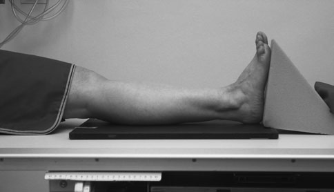
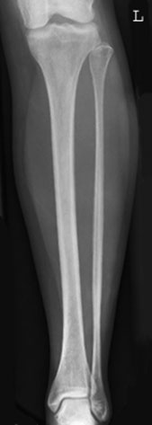
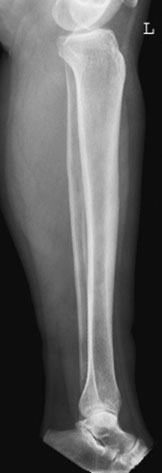
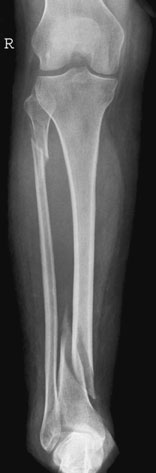
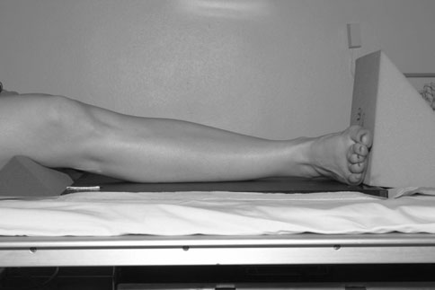
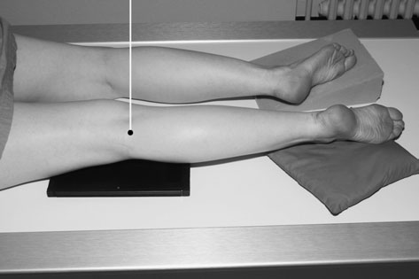
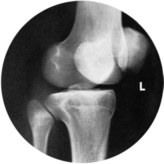
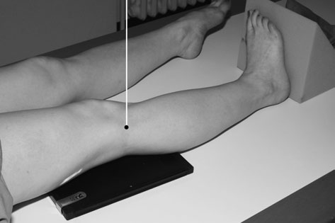
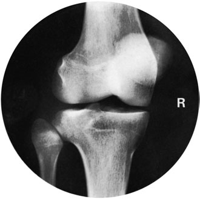

# Rx Gambă (Tibie și Peroneu) Incidențe Standard de Bază

  📷 Radiografie Convențională (Rx)
  <strong>Actualizat:</strong> 2026-09-16
  <strong>Autor:</strong> Departamentul de Radiologie / Referință Clark (Ed. 12)

---

-   __1. Rezumat Clinic & Indicații__

    ---

    === "Indicații Clinice"

        - This pair de bones constitutes ring. ca pentru other bony rings, suspiciune de fractură la one site poate fie associated cu suspiciune de fractură elsewhere. example este Maissonneuve’s suspiciune de fractură, which este suspiciune de fractură de distal tibia și proximal fibula. If suspiciune de fractură de one de pair este seen, cu overlap sau shortening, then entire length de ambele bones trebuie să fie evidențiat.

    === "Ghid Național IRIS"

        !!! info "Referință Primară: Ghidul Național IRIS (Ordinul MS 1342/2012)"
            - **Capitol Ghid IRIS:** *Ghidul Național IRIS*
            - **Grad de Recomandare:** **De verificat pe indicație; fără grad atribuit automat**
            - **Nivel de Iradiere Estimată:** `De verificat pentru examinarea și populația selectate`

            [:octicons-search-16: Deschide Ghidul IRIS](../../iris.md){ .md-button .md-button--primary } [:material-open-in-new: Aplicația Oficială PWA](https://radiologie-pediatrica.ro/iris/){ .md-button target="_blank" rel="noopener" }
-   __2. Poziționare & Centrare Fascicul__

    ---

    - **Poziție Pacient:** • de la Decubit dorsal/așezat pe scaun poziție, pacientul rotates pe la partea afectată.
• membru inferior este rotit further until malleoli sunt superimposed vertically.
• tibia trebuie să fie paralel cu casetă.
• Se plasează un suport/pernă sub genunchi pentru sprijin și relaxare.
• lower edge de caseta este poziționat just below plantar aspect de heel.

• pacientul este either Decubit dorsal sau așezat pe scaun pe masa radiologică, cu ambele membre inferioare extins.
• Palpate capul de fibula și Profil (lateral) tibial condyle.
• se rotește limb medially la project tibial condyle clear de articulație.
• limb este sprijinit prin pads și săculeți cu nisip.
• centre de caseta este poziționat la nivelul capul de fibula.
    - **Punct de Centrare Fascicul:** • Centre la middle de caseta, cu raza centrală centrală la drept-angles la axa longitudinală de tibia și paralel la imaginary line joining malleoli.

• raza centrală verticală centrală este orientat la capul de fibula.
    - **Distanță Focar-Film (DFF / SID):** 100 cm
    - **Comandă Respiratorie:** Apnee pe durata expunerii (apnee în inspir pentru torace; expir pentru Abdomen/bazin).

-   __3. Parametri Tehnici Expunere__

    ---

    | Parametru Tehnic | Valoare Configurare Generator / Tub |
    |:-----------------|:-------------------------------------|
    | **Tensiune Tub (kV)** | DE CONFIGURAT PE APARAT |
    | **Sarcină / Produs Curent-Timp (mAs)** | Conform AEC / grosime anatomică |
    | **Distanță Focar-Film (DFF / SID)** | 100 cm |
    | **Grilă Antidifuzoare (Bucky)** | Conform grosimii anatomice (> 10-12 cm cu grilă) |
    | **Dimensiune Focar** | Focar Mic (0.6 mm) |
    | **Camere de Ionizare AEC** | DE CONFIGURAT PE APARAT |
    | **Colimare Fascicul** | Colimare strictă la aria anatomică de interes diagnostic |
    | **Filtrare Tub** | Totală ≥ 2.5 mm Al echivalent (conform Clark: 3.0 mm Al eq.) |

-   __4. Criterii de Calitate & Reușită Imagine__

    ---

    - Genunchi și Gleznă (Articulație Talocrurală) articulații trebuie să fie included, since extremitatea proximală fibula poate also fie suspiciune de fracturăd when there este suspiciune de fractură de distal fibula.

-   __5. Protecție Radiologică (ALARA)__

    ---

    - Ecranare gonadică cu șorț plumbat dacă gonadele sunt în apropierea fasciculului util (regula ALARA).
    - Colimare precisă la dimensiunea anatomică strict necesară pentru reducerea dozei și a radiației difuze.
    - Verificarea posibilității unei sarcini la pacientele de vârstă fertilă înainte de expunere.

!!! note "Observații Clinice & Tehnice"
    • If it este impossible la include ambele articulații pe one imagine, then two filme radiologice trebuie să fie exposed separately, one pentru include Gleznă (Articulație Talocrurală) și other pentru include Genunchi. ambele imagini trebuie să 124 include middle third de lower membru inferior, so general alignment de bones poate fie seen.
• If it este impossible pentru pacientul la rotate pe la partea afectată, then caseta trebuie să fie sprijinit vertically pe / sprijinit de medial side de membru inferior și fascicul Orientat orizontal la middle de caseta.
Antero-posterior (AP) Profil (lateral) Antero-posterior (AP) radiografie evidențiind suspiciune de fractură de proximal fibula și distal tibia

### 🖼️ Imagini

<figure class="protocol-image-card" markdown>

<figcaption><strong>imal end de fibula poate also fie suspiciune de fracturăd when there este a</strong> — Poziționare pacient și centrare fascicul conform Clark (Ed. 12)</figcaption>

</figure>

<figure class="protocol-image-card" markdown>

<figcaption><strong>suspiciune de fractură de distal fibula.</strong> — Aspect radiografic / ghid de poziționare conform tratatului Clark (Ed. 12)</figcaption>

</figure>

<figure class="protocol-image-card" markdown>

<figcaption><strong>radiografie evidențiind</strong> — Aspect radiografic / ghid de poziționare conform tratatului Clark (Ed. 12)</figcaption>

</figure>

<figure class="protocol-image-card" markdown>

<figcaption><strong>suspiciune de fractură de proximal</strong> — Aspect radiografic / ghid de poziționare conform tratatului Clark (Ed. 12)</figcaption>

</figure>

<figure class="protocol-image-card" markdown>

<figcaption><strong>Figura 5: Aspect radiografic / Poziționare (Clark Ed. 12)</strong> — Aspect radiografic / ghid de poziționare conform tratatului Clark (Ed. 12)</figcaption>

</figure>

<figure class="protocol-image-card" markdown>

<figcaption><strong>suspiciune de fractură la one site poate fie associated cu suspiciune de fractură elsewhere.</strong> — Aspect radiografic / ghid de poziționare conform tratatului Clark (Ed. 12)</figcaption>

</figure>

<figure class="protocol-image-card" markdown>

<figcaption><strong>example este Maissonneuve’s suspiciune de fractură, which este suspiciune de fractură</strong> — Aspect radiografic / ghid de poziționare conform tratatului Clark (Ed. 12)</figcaption>

</figure>

<figure class="protocol-image-card" markdown>

<figcaption><strong>de distal tibia și proximal fibula. If suspiciune de fractură de one de the</strong> — Aspect radiografic / ghid de poziționare conform tratatului Clark (Ed. 12)</figcaption>

</figure>

<figure class="protocol-image-card" markdown>

<figcaption><strong>Figura 9: Aspect radiografic / Poziționare (Clark Ed. 12)</strong> — Aspect radiografic / ghid de poziționare conform tratatului Clark (Ed. 12)</figcaption>

</figure>

=== "Ghid Rapid de Execuție"

    1. **Identificarea și verificarea pacientului:** verificare identitate, zonă de examinat, consimțământ conform procedurii și evaluarea posibilității unei sarcini, când este relevantă.
    2. **Pregătire:** îndepărtarea oricăror obiecte radiopace (bijuterii, agrafe, fermoare, proteze, pansamente dense).
    3. **Poziționare precisă:** alinierea receptorului de imagine și a tubului la distanța prescrisă (100 cm).
    4. **Colimare strictă:** adaptarea fasciculului strict la regiunea de diagnostic pentru scăderea iradierii și reducerea radiației difuze.
    5. **Radioprotecție:** verificarea [politicii RX](../radioprotectie.md), cu măsuri distincte pentru pacient, personal și însoțitor.

## Surse de documentare

- [Clark's Positioning in Radiography (Ed. 12), Pagina 139](../../assets/protocols/sources/Clark___Positioning_in_Radiography__12th_edition.pdf#page=139)
