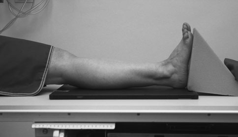
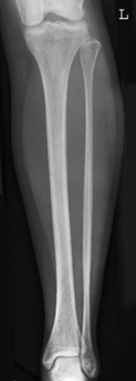
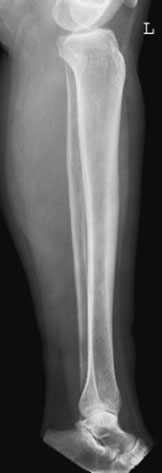
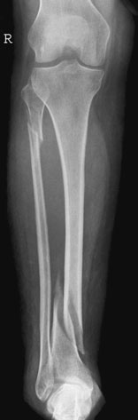
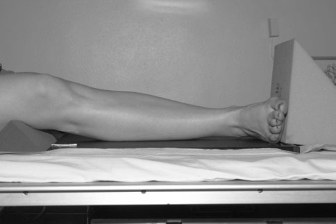
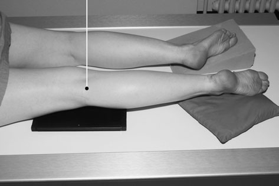
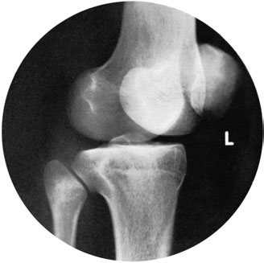
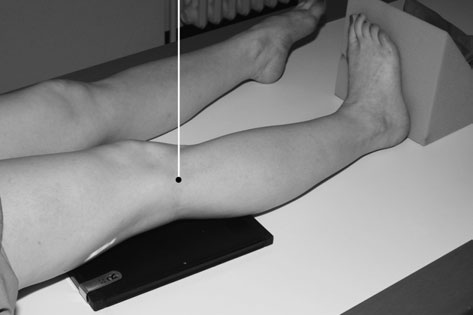
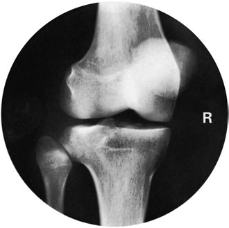

# Rx gambă (tibie și peroneu) – incidențe standard de bază

  📷 Radiografie Convențională (Rx)
  <strong>Actualizat:</strong> 2026-09-16
  <strong>Autor:</strong> Departamentul de Radiologie / Referință Clark (Ed. 12)

---

-   __1. Rezumat Clinic & Indicații__

    ---

    === "Indicații Clinice"

        - Această pereche de oase constituie un inel. Ca și în cazul altor inele osoase, suspiciunea de fractură într-un loc poate fi asociată cu suspiciunea de fractură în altă parte. Un exemplu este suspiciunea de fractură Maisonneuve, care reprezintă suspiciunea de fractură a tibiei distale și a fibulei proximale. Dacă se observă suspiciunea de fractură a unuia dintre oasele perechii, cu suprapunere sau scurtare, trebuie evidențiată întreaga lungime a ambelor oase.

    === "Ghid Național IRIS"

        !!! info "Referință Primară: Ghidul Național IRIS (Ordinul MS 1342/2012)"
            - **Capitol Ghid IRIS:** *Aparat locomotor & Membru inferior*
            - **Grad de Recomandare:** **Grad A**
            - **Nivel de Iradiere Estimată:** `Clasa 1 (Minimă < 0.01 mSv)`

            [:octicons-search-16: Deschide Ghidul IRIS](../../iris.md){ .md-button .md-button--primary } [:material-open-in-new: Aplicația Oficială PWA](https://radiologie-pediatrica.ro/iris/){ .md-button target="_blank" rel="noopener" }

-   __2. Poziționare & Centrare Fascicul__

    ---

    - **Poziție Pacient:**
        - Din poziția de decubit dorsal sau așezat pe scaun, pacientul se rotește spre partea afectată.
        - Membrul inferior este rotit suplimentar până când maleolele se suprapun vertical.
        - Tibia trebuie să fie paralelă cu caseta.
        - Se plasează un suport/o pernă sub genunchi pentru sprijin și relaxare.
        - Marginea inferioară a casetei este poziționată imediat sub aspectul plantar al călcâiului.
        - Pacientul se află fie în decubit dorsal, fie așezat pe scaun pe masa radiologică, cu ambele membre inferioare extinse.
        - Se palpează capul fibulei și condilul tibial de profil.
        - Se rotește membrul medial pentru a proiecta condilul tibial liber de articulație.
        - Membrul este susținut cu tampoane și săculeți cu nisip.
        - Centrul casetei este poziționat la nivelul capului fibulei.
    - **Punct de Centrare Fascicul:**
        - Se centrează la mijlocul casetei, cu raza centrală perpendiculară pe axa longitudinală a tibiei și paralelă cu linia imaginară care unește maleolele.
        - Raza centrală verticală este orientată la capul fibulei.
    - **Distanță Focar-Film (DFF / SID):** 100 cm
    - **Comandă Respiratorie:** Apnee pe durata expunerii (apnee în inspir pentru torace; expir pentru Abdomen/bazin).

-   __3. Parametri Tehnici Expunere__

    ---

    | Parametru Tehnic | Valoare Configurare Generator / Tub |
    |:-----------------|:-------------------------------------|
    | **Tensiune Tub (kV)** | DE CONFIGURAT PE APARAT |
    | **Sarcină / Produs Curent-Timp (mAs)** | Conform AEC / grosimii anatomice |
    | **Distanță Focar-Film (DFF / SID)** | 100 cm |
    | **Grilă Antidifuzoare (Bucky)** | Conform grosimii anatomice (> 10-12 cm cu grilă) |
    | **Dimensiune Focar** | Focar Mic (0.6 mm) |
    | **Camere de Ionizare AEC** | DE CONFIGURAT PE APARAT |
    | **Colimare Fascicul** | Colimare strictă la aria anatomică de interes diagnostic |
    | **Filtrare Tub** | Totală ≥ 2.5 mm Al echivalent (conform Clark: 3.0 mm Al echivalent) |

-   __4. Criterii de Calitate & Reușită Imagine__

    ---

    - Articulațiile genunchiului și gleznei (articulația talocrurală) trebuie incluse, deoarece extremitatea proximală a fibulei poate prezenta, de asemenea, suspiciune de fractură atunci când există suspiciune de fractură a fibulei distale.

-   __5. Protecție Radiologică (ALARA)__

    ---

    - Ecranare gonadică cu șorț plumbat dacă gonadele sunt în apropierea fasciculului util (regula ALARA).
    - Colimare precisă la dimensiunea anatomică strict necesară pentru reducerea dozei și a radiației difuze.
    - Verificarea posibilității unei sarcini la pacientele de vârstă fertilă înainte de expunere.

!!! note "Observații Clinice & Tehnice"
    - Dacă nu este posibilă includerea ambelor articulații pe o singură imagine, trebuie expuse separat două filme radiologice: unul care să includă glezna (articulația talocrurală) și celălalt care să includă genunchiul. Ambele imagini trebuie să includă treimea mijlocie a segmentului inferior al membrului inferior, astfel încât alinierea generală a oaselor să poată fi observată. [Număr intercalat în sursă: 124.]
    - Dacă pacientul nu se poate roti pe partea afectată, caseta trebuie sprijinită vertical de partea medială a membrului inferior, iar fasciculul trebuie orientat orizontal către centrul casetei. Antero-posterior (AP). Profil (lateral). Radiografie antero-posterioară (AP) care evidențiază suspiciunea unei fracturi a fibulei proximale și a tibiei distale.

### 🖼️ Imagini

<figure class="protocol-image-card" markdown>

<figcaption><strong>Extremitatea proximală a fibulei poate prezenta, de asemenea, suspiciune de fractură atunci când există o</strong> — Poziționarea pacientului și centrarea fasciculului conform Clark (Ed. 12)</figcaption>

</figure>

<figure class="protocol-image-card" markdown>

<figcaption><strong>suspiciune de fractură a fibulei distale.</strong> — Aspect radiografic / ghid de poziționare conform tratatului Clark (Ed. 12)</figcaption>

</figure>

<figure class="protocol-image-card" markdown>

<figcaption><strong>radiografie evidențiind</strong> — Aspect radiografic / ghid de poziționare conform tratatului Clark (Ed. 12)</figcaption>

</figure>

<figure class="protocol-image-card" markdown>

<figcaption><strong>suspiciune de fractură proximală</strong> — Aspect radiografic / ghid de poziționare conform tratatului Clark (Ed. 12)</figcaption>

</figure>

<figure class="protocol-image-card" markdown>

<figcaption><strong>Figura 5: Aspect radiografic / Poziționare (Clark Ed. 12)</strong> — Aspect radiografic / ghid de poziționare conform tratatului Clark (Ed. 12)</figcaption>

</figure>

<figure class="protocol-image-card" markdown>

<figcaption><strong>suspiciunea de fractură într-un loc poate fi asociată cu suspiciunea de fractură în altă parte.</strong> — Aspect radiografic / ghid de poziționare conform tratatului Clark (Ed. 12)</figcaption>

</figure>

<figure class="protocol-image-card" markdown>

<figcaption><strong>un exemplu este suspiciunea de fractură Maisonneuve, care este o suspiciune de fractură</strong> — Aspect radiografic / ghid de poziționare conform tratatului Clark (Ed. 12)</figcaption>

</figure>

<figure class="protocol-image-card" markdown>

<figcaption><strong>a tibiei distale și a fibulei proximale. Dacă există suspiciunea de fractură a uneia dintre</strong> — Aspect radiografic / ghid de poziționare conform tratatului Clark (Ed. 12)</figcaption>

</figure>

<figure class="protocol-image-card" markdown>

<figcaption><strong>Figura 9: Aspect radiografic / Poziționare (Clark Ed. 12)</strong> — Aspect radiografic / ghid de poziționare conform tratatului Clark (Ed. 12)</figcaption>

</figure>

=== "Ghid Rapid de Execuție"

    1. **Identificarea și verificarea pacientului:** verificare identitate, zonă de examinat, consimțământ conform procedurii și evaluarea posibilității unei sarcini, când este relevantă.
    2. **Pregătire:** îndepărtarea oricăror obiecte radiopace (bijuterii, agrafe, fermoare, proteze, pansamente dense).
    3. **Poziționare precisă:** alinierea receptorului de imagine și a tubului la distanța prescrisă (100 cm).
    4. **Colimare strictă:** adaptarea fasciculului strict la regiunea de diagnostic pentru scăderea iradierii și reducerea radiației difuze.
    5. **Radioprotecție:** verificarea [politicii RX](../radioprotectie.md), cu măsuri distincte pentru pacient, personal și însoțitor.

## Surse de documentare

- [Clark's Positioning in Radiography (Ed. 12), Pagina 139](https://books.google.com/books/about/Clark_s_Positioning_in_Radiography.html?id=Xxu6MwEACAAJ)
