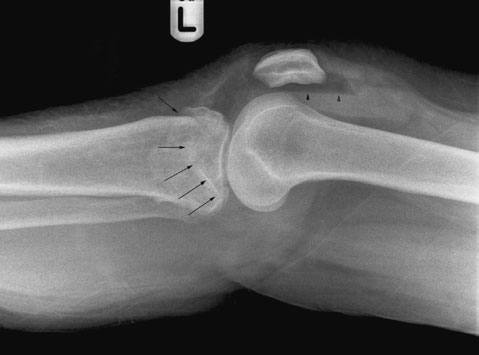
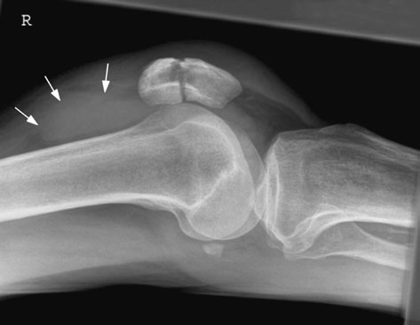
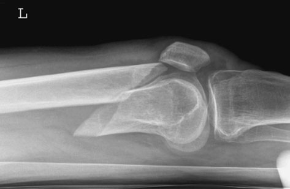
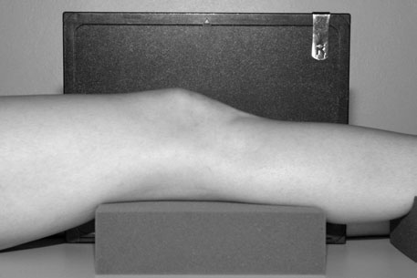

# Rx Genunchi Additional Incidență

  📷 Radiografie Convențională (Rx)
  <strong>Actualizat:</strong> 2026-09-16
  <strong>Autor:</strong> Departamentul de Radiologie / Referință Clark (Ed. 12)

---

-   __1. Rezumat Clinic & Indicații__

    ---

    === "Indicații Clinice"

        - Profil (lateral) incidență de Genunchi și tibial tubercle poate fie useful în Osgood Schlatter’s disease, although this este primarily clinical diagnosis și radiografie este reserved pentru exclusion de other pathology în cases de doubt. Ultrasound poate also fie useful în this clinical situation. Profil (lateral) – Fascicul Orizontal This incidență replaces conventional Profil (lateral) în toate cases de gross injury și suspected suspiciune de fractură de Rotulă (Patelă).

    === "Ghid Național IRIS"

        !!! info "Referință Primară: Ghidul Național IRIS (Ordinul MS 1342/2012)"
            - **Capitol Ghid IRIS:** *Ghidul Național IRIS*
            - **Grad de Recomandare:** **De verificat pe indicație; fără grad atribuit automat**
            - **Nivel de Iradiere Estimată:** `De verificat pentru examinarea și populația selectate`

            [:octicons-search-16: Deschide Ghidul IRIS](../../iris.md){ .md-button .md-button--primary } [:material-open-in-new: Aplicația Oficială PWA](https://radiologie-pediatrica.ro/iris/){ .md-button target="_blank" rel="noopener" }
-   __2. Poziționare & Centrare Fascicul__

    ---

    - **Poziție Pacient:** • pacientul remains pe trolley/bed, cu limb gently raised și sprijinit pe pads.
• If possible, membru inferior poate fie rotit slightly la centralize Rotulă (Patelă) între femoral condyles.
• film radiologic este sprijinit vertically pe / sprijinit de medial aspect de Genunchi.
• centre de caseta este level cu upper margine de tibial condyle.
    - **Punct de Centrare Fascicul:** • raza centrală orizontală centrală este orientat la upper margine de Profil (lateral) tibial condyle, la 90 grade la axa longitudinală de tibia.
    - **Distanță Focar-Film (DFF / SID):** 100 cm
    - **Comandă Respiratorie:** Apnee pe durata expunerii (apnee în inspir pentru torace; expir pentru Abdomen/bazin).

-   __3. Parametri Tehnici Expunere__

    ---

    | Parametru Tehnic | Valoare Configurare Generator / Tub |
    |:-----------------|:-------------------------------------|
    | **Tensiune Tub (kV)** | DE CONFIGURAT PE APARAT |
    | **Sarcină / Produs Curent-Timp (mAs)** | Conform AEC / grosime anatomică |
    | **Distanță Focar-Film (DFF / SID)** | 100 cm |
    | **Grilă Antidifuzoare (Bucky)** | Conform grosimii anatomice (> 10-12 cm cu grilă) |
    | **Dimensiune Focar** | Focar Mic (0.6 mm) |
    | **Camere de Ionizare AEC** | DE CONFIGURAT PE APARAT |
    | **Colimare Fascicul** | Colimare strictă la aria anatomică de interes diagnostic |
    | **Filtrare Tub** | Totală ≥ 2.5 mm Al echivalent (conform Clark: 3.0 mm Al eq.) |

-   __4. Criterii de Calitate & Reușită Imagine__

    ---

    - Vizualizarea clară întregii arii anatomice (Genunchi).
    - Absența artefactelor de mișcare; trabeculație osoasă și contururi nete.
    - Densitate optică și contrast adecvate pentru diferențierea țesuturilor moi de structurile osoase.

-   __5. Protecție Radiologică (ALARA)__

    ---

    - Ecranare gonadică cu șorț plumbat dacă gonadele sunt în apropierea fasciculului util (regula ALARA).
    - Colimare precisă la dimensiunea anatomică strict necesară pentru reducerea dozei și a radiației difuze.
    - Verificarea posibilității unei sarcini la pacientele de vârstă fertilă înainte de expunere.

!!! note "Observații Clinice & Tehnice"
    • fără attempt trebuie să fie made la either flex sau se extinde Genunchi.
• Additional flexion poate result în fragments de transverse patellar suspiciune de fractură being separated prin opposing muscle pull.
• orice rotație de limb trebuie să fie de la Șold, cu support given la whole membru inferior.
• prin using Fascicul Orizontal, nivele hidroaerice poate fie evidențiat, indicating lipohaemarthrosis.
128 Fascicul Orizontal Fascicul Orizontal Profil (lateral) evidențiind coborât suspiciune de fractură de platou tibial (arrows) și lipohaemarthrosis (arrowheads) Fascicul Orizontal Fascicul Orizontal Profil (lateral) evidențiind transverse suspiciune de fractură de Rotulă (Patelă) și articulație effusion în suprapatellar bursa (arrows) Fascicul Orizontal Fascicul Orizontal Profil (lateral) evidențiind distal femoral suspiciune de fractură

### 🖼️ Imagini

<figure class="protocol-image-card" markdown>

<figcaption><strong>Further incidențe sunt used la evidențiază suspiciune de fractură de the</strong> — Poziționare pacient și centrare fascicul conform Clark (Ed. 12)</figcaption>

</figure>

<figure class="protocol-image-card" markdown>

<figcaption><strong>clinical diagnosis și radiografie este reserved pentru exclusion</strong> — Aspect radiografic / ghid de poziționare conform tratatului Clark (Ed. 12)</figcaption>

</figure>

<figure class="protocol-image-card" markdown>

<figcaption><strong>gross injury și suspected suspiciune de fractură de Rotulă (Patelă).</strong> — Aspect radiografic / ghid de poziționare conform tratatului Clark (Ed. 12)</figcaption>

</figure>

<figure class="protocol-image-card" markdown>

<figcaption><strong>patellar suspiciune de fractură being separated prin opposing muscle pull.</strong> — Aspect radiografic / ghid de poziționare conform tratatului Clark (Ed. 12)</figcaption>

</figure>

=== "Ghid Rapid de Execuție"

    1. **Identificarea și verificarea pacientului:** verificare identitate, zonă de examinat, consimțământ conform procedurii și evaluarea posibilității unei sarcini, când este relevantă.
    2. **Pregătire:** îndepărtarea oricăror obiecte radiopace (bijuterii, agrafe, fermoare, proteze, pansamente dense).
    3. **Poziționare precisă:** alinierea receptorului de imagine și a tubului la distanța prescrisă (100 cm).
    4. **Colimare strictă:** adaptarea fasciculului strict la regiunea de diagnostic pentru scăderea iradierii și reducerea radiației difuze.
    5. **Radioprotecție:** verificarea [politicii RX](../radioprotectie.md), cu măsuri distincte pentru pacient, personal și însoțitor.

## Surse de documentare

- [Clark's Positioning in Radiography (Ed. 12), Pagina 143](../../assets/protocols/sources/Clark___Positioning_in_Radiography__12th_edition.pdf#page=143)
