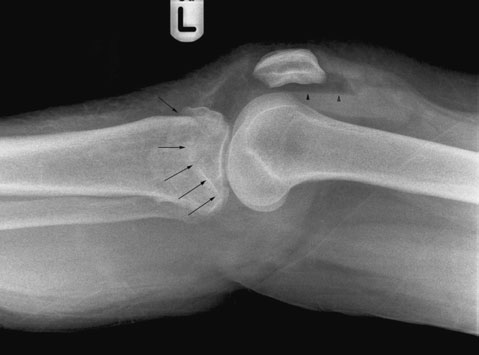
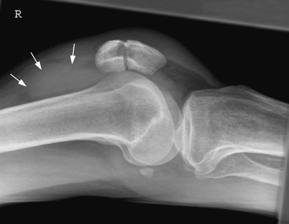
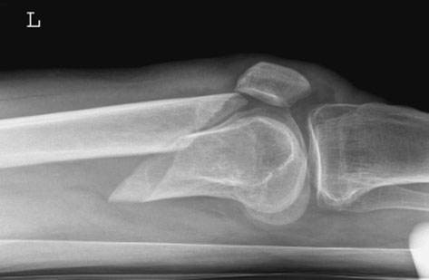
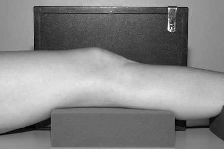

# Rx genunchi – incidență suplimentară

  📷 Radiografie Convențională (Rx)
  <strong>Actualizat:</strong> 2026-09-16
  <strong>Autor:</strong> Departamentul de Radiologie / Referință Clark (Ed. 12)

---

-   __1. Rezumat Clinic & Indicații__

    ---

    === "Indicații Clinice"

        - Incidența de profil a genunchiului și a tuberculului tibial poate fi utilă în boala Osgood-Schlatter, deși aceasta este în primul rând un diagnostic clinic, iar radiografia este rezervată excluderii altor patologii în cazurile neclare. Ecografia poate fi, de asemenea, utilă în această situație clinică. Profil – fascicul orizontal. Această incidență înlocuiește incidența convențională de profil în toate cazurile de traumatism sever și de suspiciune de fractură a rotulei (patela).

    === "Ghid Național IRIS"

        !!! info "Referință Primară: Ghidul Național IRIS (Ordinul MS 1342/2012)"
            - **Capitol Ghid IRIS:** *Aparat locomotor & Membru inferior*
            - **Grad de Recomandare:** **Grad A**
            - **Nivel de Iradiere Estimată:** `Clasa 1 (Minimă < 0.05 mSv)`

            [:octicons-search-16: Deschide Ghidul IRIS](../../iris.md){ .md-button .md-button--primary } [:material-open-in-new: Aplicația Oficială PWA](https://radiologie-pediatrica.ro/iris/){ .md-button target="_blank" rel="noopener" }

-   __2. Poziționare & Centrare Fascicul__

    ---

    - **Poziție Pacient:**
        - pacientul rămâne pe targa/patul mobil, cu membrul ușor ridicat și sprijinit pe perne.
        - Dacă este posibil, membrul inferior poate fi rotit ușor pentru a centra rotula (patela) între condilii femurali.
        - filmul radiologic este sprijinit vertical pe / de aspectul medial al genunchiului.
        - centrul casetei este la nivelul marginii superioare a condilului tibial.
    - **Punct de Centrare Fascicul:** • raza centrală orizontală este orientată la marginea superioară a condilului tibial de profil, la 90 grade față de axa longitudinală a tibiei.
    - **Distanță Focar-Film (DFF / SID):** 100 cm
    - **Comandă Respiratorie:** Apnee pe durata expunerii (apnee în inspir pentru torace; expir pentru Abdomen/bazin).

-   __3. Parametri Tehnici Expunere__

    ---

    | Parametru Tehnic | Valoare Configurare Generator / Tub |
    |:-----------------|:-------------------------------------|
    | **Tensiune Tub (kV)** | DE CONFIGURAT PE APARAT |
    | **Sarcină / Produs Curent-Timp (mAs)** | Conform AEC / grosimii anatomice |
    | **Distanță Focar-Film (DFF / SID)** | 100 cm |
    | **Grilă Antidifuzoare (Bucky)** | Conform grosimii anatomice (> 10-12 cm cu grilă) |
    | **Dimensiune Focar** | Focar Mic (0.6 mm) |
    | **Camere de Ionizare AEC** | DE CONFIGURAT PE APARAT |
    | **Colimare Fascicul** | Colimare strictă la aria anatomică de interes diagnostic |
    | **Filtrare Tub** | Totală ≥ 2.5 mm Al echivalent (conform Clark: 3.0 mm Al echivalent) |

-   __4. Criterii de Calitate & Reușită Imagine__

    ---

    - Vizualizarea clară a întregii arii anatomice (genunchi).
    - Absența artefactelor de mișcare; trabeculație osoasă și contururi nete.
    - Densitate optică și contrast adecvate pentru diferențierea țesuturilor moi de structurile osoase.

-   __5. Protecție Radiologică (ALARA)__

    ---

    - Ecranare gonadică cu șorț plumbat dacă gonadele sunt în apropierea fasciculului util (regula ALARA).
    - Colimare precisă la dimensiunea anatomică strict necesară pentru reducerea dozei și a radiației difuze.
    - Verificarea posibilității unei sarcini la pacientele de vârstă fertilă înainte de expunere.

!!! note "Observații Clinice & Tehnice"
    - Nu trebuie făcută nicio încercare de flectare sau extensie a genunchiului.
    - Flexia suplimentară poate determina separarea fragmentelor unei suspiciuni de fractură transversală a rotulei prin tracțiunea musculară opusă.
    - Orice rotație a membrului trebuie realizată de la șold, cu sprijin pentru întregul membru inferior.
    - Utilizarea fasciculului orizontal poate evidenția niveluri hidroaerice, indicând lipohemartroză. 128 Fascicul orizontal Profil (lateral) cu fascicul orizontal, evidențiind suspiciunea de fractură înfundată a platoului tibial (săgeți) și lipohemartroza (capete de săgeată) Fascicul orizontal Profil (lateral) cu fascicul orizontal, evidențiind suspiciunea de fractură transversală a rotulei (patela) și revărsat articular în bursa suprapatelară (săgeți) Fascicul orizontal Profil (lateral) cu fascicul orizontal, evidențiind suspiciunea de fractură femurală distală

### 🖼️ Imagini

<figure class="protocol-image-card" markdown>

<figcaption><strong>Incidențe suplimentare sunt utilizate pentru evidențierea suspiciunii de fractură a</strong> — Poziționarea pacientului și centrarea fasciculului conform Clark (Ed. 12)</figcaption>

</figure>

<figure class="protocol-image-card" markdown>

<figcaption><strong>diagnosticul clinic, iar radiografia este rezervată excluderii</strong> — Aspect radiografic / ghid de poziționare conform tratatului Clark (Ed. 12)</figcaption>

</figure>

<figure class="protocol-image-card" markdown>

<figcaption><strong>traumatismului sever și suspiciunii de fractură a rotulei (patela).</strong> — Aspect radiografic / ghid de poziționare conform tratatului Clark (Ed. 12)</figcaption>

</figure>

<figure class="protocol-image-card" markdown>

<figcaption><strong>fragmentelor unei suspiciuni de fractură patelară care se separă prin tracțiunea musculară opusă.</strong> — Aspect radiografic / ghid de poziționare conform tratatului Clark (Ed. 12)</figcaption>

</figure>

=== "Ghid Rapid de Execuție"

    1. **Identificarea și verificarea pacientului:** verificare identitate, zonă de examinat, consimțământ conform procedurii și evaluarea posibilității unei sarcini, când este relevantă.
    2. **Pregătire:** îndepărtarea oricăror obiecte radiopace (bijuterii, agrafe, fermoare, proteze, pansamente dense).
    3. **Poziționare precisă:** alinierea receptorului de imagine și a tubului la distanța prescrisă (100 cm).
    4. **Colimare strictă:** adaptarea fasciculului strict la regiunea de diagnostic pentru scăderea iradierii și reducerea radiației difuze.
    5. **Radioprotecție:** verificarea [politicii RX](../radioprotectie.md), cu măsuri distincte pentru pacient, personal și însoțitor.

## Surse de documentare

- [Clark's Positioning in Radiography (Ed. 12), Pagina 143](https://books.google.com/books/about/Clark_s_Positioning_in_Radiography.html?id=Xxu6MwEACAAJ)
