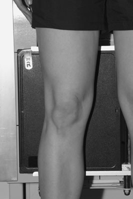
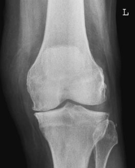
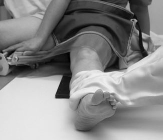
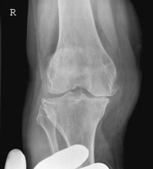
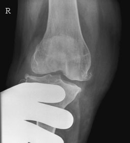
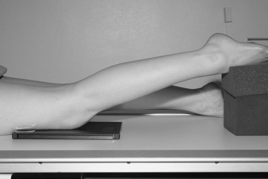
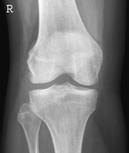
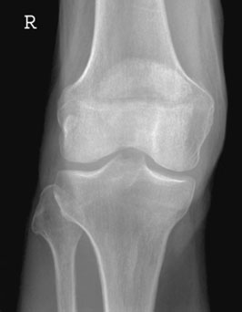

# Rx Genunchi Antero-Posterior (AP) - standing

  📷 Radiografie Convențională (Rx)
  <strong>Actualizat:</strong> 2026-09-16
  <strong>Autor:</strong> Departamentul de Radiologie / Referință Clark (Ed. 12)

---

-   __1. Rezumat Clinic & Indicații__

    ---

    === "Indicații Clinice"

        - articulație effusion este well evidențiat pe Profil (lateral) incidență ca ovoid densitate optică rising above postero-superior aspect de Rotulă (Patelă). Its significance varies according la clinical setting. Causes include proces infecțios / inflamator, haemorrhage și arthritis, but it poate also fie marker de occult suspiciune de fractură, e.g. tibial coloană vertebrală sau platou tibial suspiciune de fractură. Lipohaemarthrosis occurs when suspiciune de fractură passes into marrow-containing medullary space. Fat (bone marrow) leaks into articulație, producing nivele hidroaerice între fat și lichid (blood) that poate fie seen when Fascicul Orizontal este used.
        - suspiciune de fractură de anterior tibial coloană vertebrală poate fie subtle, cu demonstration requiring attention la expunere și rotație. It este important ca attachment de anterior cruciate ligament, avulsion de which poate cause debilitating instability de Genunchi.
        - vertical suspiciune de fractură de Rotulă (Patelă) este nu vizibil pe Profil (lateral) incidență și will fie seen pe Antero-posterior (AP) incidență only if exposed properly (i.e. nu underexposed). If clinically suspected, then skyline incidență maybe requested. 130
        - platou tibial suspiciune de fractură poate fie subtle și hard la detect, but again they sunt functionally very important. Good technique este key. Full evaluation poate fie aided prin three-dimensional CT în some cases.
        - fabella este sesamoid bone în tendon de medial cap de gastrocnemius, behind medial femoral condyle, și trebuie să nu fie confused cu loose corp.
        - Osgood–Schlatters disease este clinical diagnosis și does nu usually require radiografie pentru diagnosis. Ultrasound poate fie useful if confirmation este required. incidențe de contralateral Genunchi trebuie să nu normally fie needed. Postero-anterior (PA) radiografie de normal Rotulă (Patelă) radiografie de Rotulă (Patelă) evidențiind transverse suspiciune de fractură

    === "Ghid Național IRIS"

        !!! info "Referință Primară: Ghidul Național IRIS (Ordinul MS 1342/2012)"
            - **Capitol Ghid IRIS:** *Ghidul Național IRIS*
            - **Grad de Recomandare:** **De verificat pe indicație; fără grad atribuit automat**
            - **Nivel de Iradiere Estimată:** `De verificat pentru examinarea și populația selectate`

            [:octicons-search-16: Deschide Ghidul IRIS](../../iris.md){ .md-button .md-button--primary } [:material-open-in-new: Aplicația Oficială PWA](https://radiologie-pediatrica.ro/iris/){ .md-button target="_blank" rel="noopener" }
-   __2. Poziționare & Centrare Fascicul__

    ---

    - **Poziție Pacient:** • pacientul și casetă sunt poziționat pentru routine anteroposterior incidență.
• doctor forcibly abducts sau adducts Genunchi, fără rotating membru inferior.

• pacientul este culcat Decubit ventral pe masa de examinare, cu Genunchi slightly flectat.
• Foam pads sunt plasat under Gleznă (Articulație Talocrurală) și thigh pentru support.
• limb este rotit la centralize Rotulă (Patelă).
• centre de caseta este level cu crease de Genunchi.
    - **Punct de Centrare Fascicul:** • Centre midway între upper margini de tibial condyles, cu raza centrală centrală la 90 grade la axa longitudinală de tibia.
Valgus Antero-posterior (AP) Genunchi cu valgus stress Varus Antero-posterior (AP) Genunchi cu varus stress în ortostatism Antero-posterior (AP) Genunchi radiografie evidențiind loss de height de medial compartment due la artroză / modificări degenerative articulare

• Centre midway între upper margini de tibial condyles la nivelul crease de Genunchi, cu raza centrală centrală la 90 grade la axa longitudinală de tibia.
    - **Distanță Focar-Film (DFF / SID):** 100 cm
    - **Comandă Respiratorie:** Apnee pe durata expunerii (apnee în inspir pentru torace; expir pentru Abdomen/bazin).

-   __3. Parametri Tehnici Expunere__

    ---

    | Parametru Tehnic | Valoare Configurare Generator / Tub |
    |:-----------------|:-------------------------------------|
    | **Tensiune Tub (kV)** | DE CONFIGURAT PE APARAT |
    | **Sarcină / Produs Curent-Timp (mAs)** | Conform AEC / grosime anatomică |
    | **Distanță Focar-Film (DFF / SID)** | 100 cm |
    | **Grilă Antidifuzoare (Bucky)** | Cu grilă antidifuzoare Bucky |
    | **Dimensiune Focar** | Focar Mic (0.6 mm) |
    | **Camere de Ionizare AEC** | Camerele laterale (sau camera centrală funcție de regiune) |
    | **Colimare Fascicul** | Colimare strictă la aria anatomică de interes diagnostic |
    | **Filtrare Tub** | Totală ≥ 2.5 mm Al echivalent (conform Clark: 3.0 mm Al eq.) |

-   __4. Criterii de Calitate & Reușită Imagine__

    ---

    - Vizualizarea clară întregii arii anatomice (Genunchi).
    - Absența artefactelor de mișcare; trabeculație osoasă și contururi nete.
    - Densitate optică și contrast adecvate pentru diferențierea țesuturilor moi de structurile osoase.

-   __5. Protecție Radiologică (ALARA)__

    ---

    - Ecranare gonadică cu șorț plumbat dacă gonadele sunt în apropierea fasciculului util (regula ALARA).
    - Colimare precisă la dimensiunea anatomică strict necesară pentru reducerea dozei și a radiației difuze.
    - Verificarea posibilității unei sarcini la pacientele de vârstă fertilă înainte de expunere.

!!! note "Observații Clinice & Tehnice"
    • fascicul poate have la fie înclinat caudally la fie la rightangles la axa longitudinală de tibia.
• Rotulă (Patelă) poate fie evidențiat more clearly ca it este now adjacent la receptorul de imagine și nu distant de la it, ca în conventional Antero-posterior (AP) incidență.
• Subtle abnormalities poate nu fie detected, ca trabecular pattern de Femur will still predominate.
• This incidență depends pe fitness de pacientul și trebuie să nu fie attempted if it results în undue discomfort sau if it poate exacerbate pacientul’s condition.

### 🖼️ Imagini

<figure class="protocol-image-card" markdown>

<figcaption><strong>articulație replacement, ca narrowing de one side la spații articulare</strong> — Poziționare pacient și centrare fascicul conform Clark (Ed. 12)</figcaption>

</figure>

<figure class="protocol-image-card" markdown>

<figcaption><strong>în ortostatism Antero-posterior (AP) Genunchi radiografie evidențiind loss de height de the</strong> — Aspect radiografic / ghid de poziționare conform tratatului Clark (Ed. 12)</figcaption>

</figure>

<figure class="protocol-image-card" markdown>

<figcaption><strong>Figura 3: Aspect radiografic / Poziționare (Clark Ed. 12)</strong> — Aspect radiografic / ghid de poziționare conform tratatului Clark (Ed. 12)</figcaption>

</figure>

<figure class="protocol-image-card" markdown>

<figcaption><strong>Figura 4: Aspect radiografic / Poziționare (Clark Ed. 12)</strong> — Aspect radiografic / ghid de poziționare conform tratatului Clark (Ed. 12)</figcaption>

</figure>

<figure class="protocol-image-card" markdown>

<figcaption><strong>Figura 5: Aspect radiografic / Poziționare (Clark Ed. 12)</strong> — Aspect radiografic / ghid de poziționare conform tratatului Clark (Ed. 12)</figcaption>

</figure>

<figure class="protocol-image-card" markdown>

<figcaption><strong>• Subtle abnormalities poate nu fie detected, ca trabecular</strong> — Aspect radiografic / ghid de poziționare conform tratatului Clark (Ed. 12)</figcaption>

</figure>

<figure class="protocol-image-card" markdown>

<figcaption><strong>but it poate also fie marker de occult suspiciune de fractură, e.g. tibial coloană vertebrală</strong> — Aspect radiografic / ghid de poziționare conform tratatului Clark (Ed. 12)</figcaption>

</figure>

<figure class="protocol-image-card" markdown>

<figcaption><strong>sau platou tibial suspiciune de fractură. Lipohaemarthrosis occurs when a</strong> — Aspect radiografic / ghid de poziționare conform tratatului Clark (Ed. 12)</figcaption>

</figure>

=== "Ghid Rapid de Execuție"

    1. **Identificarea și verificarea pacientului:** verificare identitate, zonă de examinat, consimțământ conform procedurii și evaluarea posibilității unei sarcini, când este relevantă.
    2. **Pregătire:** îndepărtarea oricăror obiecte radiopace (bijuterii, agrafe, fermoare, proteze, pansamente dense).
    3. **Poziționare precisă:** alinierea receptorului de imagine și a tubului la distanța prescrisă (100 cm).
    4. **Colimare strictă:** adaptarea fasciculului strict la regiunea de diagnostic pentru scăderea iradierii și reducerea radiației difuze.
    5. **Radioprotecție:** verificarea [politicii RX](../radioprotectie.md), cu măsuri distincte pentru pacient, personal și însoțitor.

## Surse de documentare

- [Clark's Positioning in Radiography (Ed. 12), Pagina 144](../../assets/protocols/sources/Clark___Positioning_in_Radiography__12th_edition.pdf#page=144)
