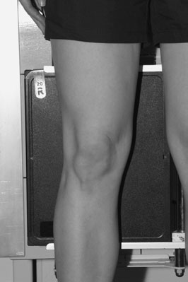
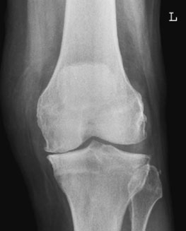
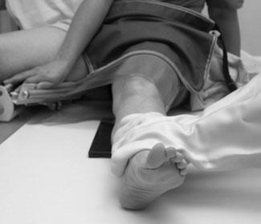
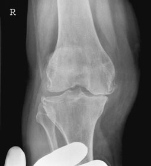
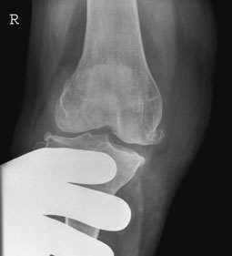
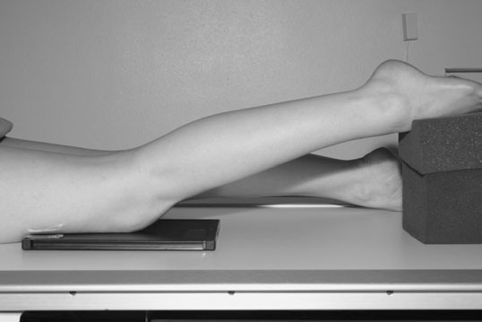
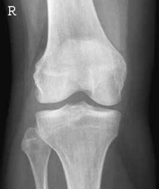
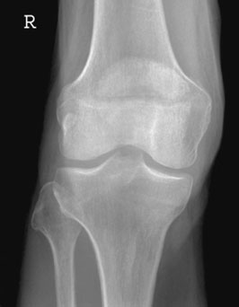

# Rx genunchi – antero-posterior (AP) – în ortostatism

  📷 Radiografie Convențională (Rx)
  <strong>Actualizat:</strong> 2026-09-16
  <strong>Autor:</strong> Departamentul de Radiologie / Referință Clark (Ed. 12)

---

-   __1. Rezumat Clinic & Indicații__

    ---

    === "Indicații Clinice"

        - Revărsatul articular este bine evidențiat pe incidența de profil ca o densitate ovoidă, situată deasupra aspectului posterosuperior al rotulei (patela). Semnificația sa variază în funcție de contextul clinic. Cauzele includ procesul infecțios/inflamator, hemoragia și artrita, dar poate fi, de asemenea, un marker al unei suspiciuni de fractură ocultă, de exemplu fractura coloanei tibiale sau a platoului tibial. Lipohemartroza apare atunci când suspiciunea de fractură pătrunde în spațiul medular care conține măduvă. Grăsimea (măduva osoasă) se scurge în articulație, producând niveluri hidroaerice între grăsime și lichid (sânge), care pot fi observate atunci când se utilizează fasciculul orizontal.
        - Suspiciunea de fractură a coloanei tibiale anterioare poate fi subtilă, demonstrarea necesitând atenție la expunere și rotație. Aceasta este importantă deoarece reprezintă locul de inserție al ligamentului încrucișat anterior, a cărui avulsie poate cauza instabilitate invalidantă a genunchiului.
        - Suspiciunea de fractură verticală a rotulei (patela) nu este vizibilă pe incidența de profil și va fi observată pe incidența antero-posterioară (AP) numai dacă este expusă corect (adică nu subexpusă). Dacă este suspectată clinic, se poate solicita o incidență skyline. 130
        - Suspiciunea de fractură a platoului tibial poate fi subtilă și dificil de detectat, dar este, de asemenea, foarte importantă din punct de vedere funcțional. Tehnica bună este esențială. Evaluarea completă poate fi susținută de CT tridimensional în unele cazuri.
        - Fabella este un os sesamoid în tendonul capului medial al gastrocnemianului, posterior de condilul femural medial, și nu trebuie confundată cu un corp liber.
        - Boala Osgood–Schlatter este un diagnostic clinic și, de obicei, nu necesită radiografie pentru diagnostic. Ecografia poate fi utilă dacă este necesară confirmarea. Incidențele genunchiului contralateral nu sunt, în mod normal, necesare. Radiografie postero-anterioară (PA) a unei rotule (patela) normale Radiografie a rotulei (patela) evidențiind suspiciunea de fractură transversală

    === "Ghid Național IRIS"

        !!! info "Referință Primară: Ghidul Național IRIS (Ordinul MS 1342/2012)"
            - **Capitol Ghid IRIS:** *Aparat locomotor & Membru inferior*
            - **Grad de Recomandare:** **Grad A**
            - **Nivel de Iradiere Estimată:** `Clasa 1 (Minimă < 0.05 mSv)`

            [:octicons-search-16: Deschide Ghidul IRIS](../../iris.md){ .md-button .md-button--primary } [:material-open-in-new: Aplicația Oficială PWA](https://radiologie-pediatrica.ro/iris/){ .md-button target="_blank" rel="noopener" }

-   __2. Poziționare & Centrare Fascicul__

    ---

    - **Poziție Pacient:**
        - pacientul și caseta sunt poziționate pentru incidența anteroposterioară de rutină.
        - medicul abduce sau adduce forțat genunchiul, fără a roti membrul inferior.
        - pacientul este culcat în decubit ventral pe masa de examinare, cu genunchiul ușor flectat.
        - pernele de spumă sunt plasate sub gleznă (articulația talocrurală) și coapsă pentru sprijin.
        - membrul este rotit pentru a centra rotula (patela).
        - centrul casetei este la nivelul pliului genunchiului.
    - **Punct de Centrare Fascicul:**
        - Centrați la mijlocul distanței dintre marginile superioare ale condililor tibiali, cu raza centrală la 90 grade față de axa longitudinală a tibiei. Valgus Genunchi antero-posterior (AP) cu stres în valgus Varus Genunchi antero-posterior (AP) cu stres în varus în ortostatism Genunchi antero-posterior (AP), radiografie evidențiind pierderea înălțimii compartimentului medial din cauza artrozei / modificărilor degenerative articulare
        - Centrați la mijlocul distanței dintre marginile superioare ale condililor tibiali, la nivelul pliului genunchiului, cu raza centrală la 90 grade față de axa longitudinală a tibiei.
    - **Distanță Focar-Film (DFF / SID):** 100 cm
    - **Comandă Respiratorie:** Apnee pe durata expunerii (apnee în inspir pentru torace; expir pentru Abdomen/bazin).

-   __3. Parametri Tehnici Expunere__

    ---

    | Parametru Tehnic | Valoare Configurare Generator / Tub |
    |:-----------------|:-------------------------------------|
    | **Tensiune Tub (kV)** | DE CONFIGURAT PE APARAT |
    | **Sarcină / Produs Curent-Timp (mAs)** | Conform AEC / grosimii anatomice |
    | **Distanță Focar-Film (DFF / SID)** | 100 cm |
    | **Grilă Antidifuzoare (Bucky)** | Cu grilă antidifuzoare Bucky |
    | **Dimensiune Focar** | Focar Mic (0.6 mm) |
    | **Camere de Ionizare AEC** | Camerele laterale (sau camera centrală, în funcție de regiune) |
    | **Colimare Fascicul** | Colimare strictă la aria anatomică de interes diagnostic |
    | **Filtrare Tub** | Totală ≥ 2.5 mm Al echivalent (conform Clark: 3.0 mm Al echivalent) |

-   __4. Criterii de Calitate & Reușită Imagine__

    ---

    - Vizualizarea clară a întregii arii anatomice (genunchi).
    - Absența artefactelor de mișcare; trabeculație osoasă și contururi nete.
    - Densitate optică și contrast adecvate pentru diferențierea țesuturilor moi de structurile osoase.

-   __5. Protecție Radiologică (ALARA)__

    ---

    - Ecranare gonadică cu șorț plumbat dacă gonadele sunt în apropierea fasciculului util (regula ALARA).
    - Colimare precisă la dimensiunea anatomică strict necesară pentru reducerea dozei și a radiației difuze.
    - Verificarea posibilității unei sarcini la pacientele de vârstă fertilă înainte de expunere.

!!! note "Observații Clinice & Tehnice"
    - fasciculul poate fi înclinat caudal pentru a fi perpendicular pe axa longitudinală a tibiei.
    - Rotula (patela) poate fi evidențiată mai clar, deoarece este acum adiacentă receptorului de imagine și nu îndepărtată de acesta, ca în incidența antero-posterioară (AP) convențională.
    - Anomaliile subtile pot să nu fie detectate, deoarece desenul trabecular al femurului va predomina în continuare.
    - Această incidență depinde de condiția fizică a pacientului și nu trebuie efectuată dacă provoacă disconfort nejustificat sau poate agrava starea pacientului.

### 🖼️ Imagini

<figure class="protocol-image-card" markdown>

<figcaption><strong>înlocuirea articulației, precum îngustarea spațiului articular pe o parte</strong> — Poziționarea pacientului și centrarea fasciculului conform Clark (Ed. 12)</figcaption>

</figure>

<figure class="protocol-image-card" markdown>

<figcaption><strong>în ortostatism Genunchi antero-posterior (AP), radiografie evidențiind pierderea înălțimii</strong> — Aspect radiografic / ghid de poziționare conform tratatului Clark (Ed. 12)</figcaption>

</figure>

<figure class="protocol-image-card" markdown>

<figcaption><strong>Figura 3: Aspect radiografic / Poziționare (Clark Ed. 12)</strong> — Aspect radiografic / ghid de poziționare conform tratatului Clark (Ed. 12)</figcaption>

</figure>

<figure class="protocol-image-card" markdown>

<figcaption><strong>Figura 4: Aspect radiografic / Poziționare (Clark Ed. 12)</strong> — Aspect radiografic / ghid de poziționare conform tratatului Clark (Ed. 12)</figcaption>

</figure>

<figure class="protocol-image-card" markdown>

<figcaption><strong>Figura 5: Aspect radiografic / Poziționare (Clark Ed. 12)</strong> — Aspect radiografic / ghid de poziționare conform tratatului Clark (Ed. 12)</figcaption>

</figure>

<figure class="protocol-image-card" markdown>

<figcaption><strong>• Anomaliile subtile pot să nu fie detectate, deoarece desenul trabecular</strong> — Aspect radiografic / ghid de poziționare conform tratatului Clark (Ed. 12)</figcaption>

</figure>

<figure class="protocol-image-card" markdown>

<figcaption><strong>dar poate fi, de asemenea, un marker al unei suspiciuni de fractură oculte, de exemplu, al coloanei tibiale</strong> — Aspect radiografic / ghid de poziționare conform tratatului Clark (Ed. 12)</figcaption>

</figure>

<figure class="protocol-image-card" markdown>

<figcaption><strong>sau al suspiciunii de fractură a platoului tibial. Lipohemartroza apare atunci când o</strong> — Aspect radiografic / ghid de poziționare conform tratatului Clark (Ed. 12)</figcaption>

</figure>

=== "Ghid Rapid de Execuție"

    1. **Identificarea și verificarea pacientului:** verificare identitate, zonă de examinat, consimțământ conform procedurii și evaluarea posibilității unei sarcini, când este relevantă.
    2. **Pregătire:** îndepărtarea oricăror obiecte radiopace (bijuterii, agrafe, fermoare, proteze, pansamente dense).
    3. **Poziționare precisă:** alinierea receptorului de imagine și a tubului la distanța prescrisă (100 cm).
    4. **Colimare strictă:** adaptarea fasciculului strict la regiunea de diagnostic pentru scăderea iradierii și reducerea radiației difuze.
    5. **Radioprotecție:** verificarea [politicii RX](../radioprotectie.md), cu măsuri distincte pentru pacient, personal și însoțitor.

## Surse de documentare

- [Clark's Positioning in Radiography (Ed. 12), Pagina 144](https://books.google.com/books/about/Clark_s_Positioning_in_Radiography.html?id=Xxu6MwEACAAJ)
