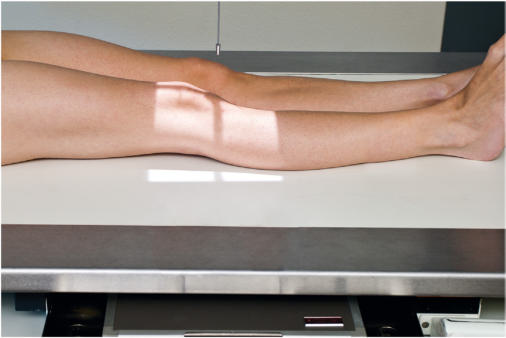
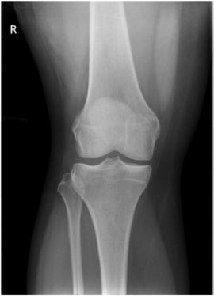
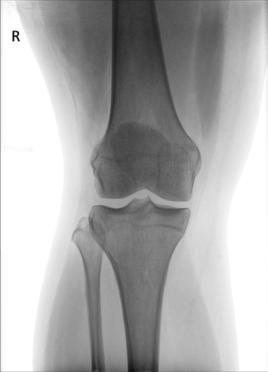

# Rx Genunchi AP (Antero-Posterior)

  📷 Radiografie Convențională (Rx)
  <strong>Actualizat:</strong> 2026-09-15
  <strong>Autor:</strong> Departamentul de Radiologie / Referință Bontrager

---

-   __1. Rezumat Clinic & Indicații__

    ---

    === "Indicații Clinice"

        - suspiciune de fractură, lesions, sau bony changes related la degenerative articulație disease involving distal Femur, proximal tibia și fibula, Rotulă (Patelă), și Genunchi articulație

    === "Ghid Național IRIS"

        !!! info "Referință Primară: Ghidul Național IRIS (Ordinul MS 1342/2012)"
            - **Capitol Ghid IRIS:** *Ghidul Național IRIS*
            - **Grad de Recomandare:** **De verificat pe indicație; fără grad atribuit automat**
            - **Nivel de Iradiere Estimată:** `De verificat pentru examinarea și populația selectate`

            [:octicons-search-16: Deschide Ghidul IRIS](../../iris.md){ .md-button .md-button--primary } [:material-open-in-new: Aplicația Oficială PWA](https://radiologie-pediatrica.ro/iris/){ .md-button target="_blank" rel="noopener" }
-   __2. Poziționare & Centrare Fascicul__

    ---

    - **Poziție Pacient:** Pacient: Place pacient în Decubit dorsal poziție cu Absența rotației anatomice: clavicule echidistante față de linia apofizelor spinoase de Bazin (bazin (pelvis)); provide pillow pentru pacient’s cap; membru inferior trebuie să fie fully extins.; Regiune anatomică: Align și center membru inferior și Genunchi la raza centrală și la linia mediană mesei sau receptorul de imagine (Fig. 6.103). Rotate membru inferior internally 3° la 5° pentru true AP Genunchi (sau until interepicondylar line este paralel la plane de receptorul de imagine). Place săculeți cu nisip prin Picior și Gleznă (Articulație Talocrurală) la stabilize if needed.
    - **Punct de Centrare Fascicul:** Align raza centrală paralel la articular facets (platou tibial); pentru averagesized pacient, raza centrală este perpendicular pe receptorul de imagine (see NOTE). Raza centrală se orientează spre point ½ inch (1.25 cm) distal la apex de Rotulă (Patelă).
    - **Distanță Focar-Film (DFF / SID):** 100 cm
    - **Comandă Respiratorie:** Apnee pe durata expunerii (sau conform cooperării pacientului)

-   __3. Parametri Tehnici Expunere__

    ---

    | Parametru Tehnic | Valoare Configurare Generator / Tub |
    |:-----------------|:-------------------------------------|
    | **Tensiune Tub (kV)** | 65-80 kV |
    | **Sarcină / Produs Curent-Timp (mAs)** | DE CONFIGURAT PE APARAT |
    | **Distanță Focar-Film (DFF / SID)** | 100 cm |
    | **Grilă Antidifuzoare (Bucky)** | Fără grilă (expunere directă) |
    | **Dimensiune Focar** | Focar Mic (0.6 mm) |
    | **Camere de Ionizare AEC** | DE CONFIGURAT PE APARAT |
    | **Colimare Fascicul** | Collimate pe ambele părți (bilateral) la skin margins la ends la receptorul de imagine margini. |
    | **Filtrare Tub** | Totală ≥ 2.5 mm Al echivalent |

-   __4. Criterii de Calitate & Reușită Imagine__

    ---

    - distal Femur și proximal tibia și fibula sunt vizualizat.
    - Femorotibial spații articulare trebuie să fie open, cu articular facets de tibia seen pe end cu only minimal surface area visualized (Figs. 6.104 și 6.105). poziție:
    - Absența rotației anatomice: clavicule echidistante față de linia apofizelor spinoase, ca evidenced prin simetric appearance de femoral și tibial condyles și spații articulare.
    - approximate medial half de cap peronier (fibular) trebuie să fie superimposed prin tibia.
    - intercondylar eminence este seen în center de intercondylar fossa.
    - Center de collimation field (raza centrală) trebuie să fie la midknee spații articulare. expunere:
    - optim receptorul de imagine expunere și contrast visualizes outline de Rotulă (Patelă) through distal Femur, și cap peronier (fibular) și neck do nu appear overexposed.
    - fără mișcare trebuie să occur; trabecular markings de toate bones trebuie să fie vizibil și appear net.
    - părți moi detail trebuie să fie vizibil. Fig. 6.104 AP Genunchi—0° raza centrală. (Courtesy Joss Wertz, DO.) epicondil lateral epicondil medial (epitrohlee) Rotulă (Patelă) cap de fibula Tibia Femorotibial spații articulare Articular facets (platou tibial) medial condyle lateral condyle Fig. 6.105 AP Genunchi—0° raza centrală. (Courtesy Joss Wertz, DO.)

-   __5. Protecție Radiologică (ALARA)__

    ---

    - Ecranare gonadică și a organelor radiosensibile conform procedurilor locale de radioprotecție ALARA.
    - Colimare strictă la aria de interes pentru limitarea radiației difuze.
    - Verificarea posibilității unei sarcini la pacientele de vârstă fertilă înainte de expunere.

!!! note "Observații Clinice & Tehnice"
    suggested guideline pentru determining that raza centrală este paralel la articular facets (platou tibial) pentru open spații articulare este la measure distance de la anterior superior iliac spines (spină iliacă antero-superioară (SIAS)) la tabletop la determine raza centrală angle ca follows6: <19 cm: 5° caudal (thin thighs și buttocks) 19 la 24 cm: 0° angle (average thighs și buttocks) >24 cm: 5° cranial (thick thighs și buttocks) Genunchi ROUTINE AP oblic (medial și lateral) lateral Fig. 6.103 AP Genunchi—Raza centrală (RC) perpendiculară pe receptorul de imagine (average pacient—19 la 24 cm).

### 🖼️ Imagini

<figure class="protocol-image-card" markdown>

<figcaption><strong>Fig. 6.103 AP Genunchi—Raza centrală (RC) perpendiculară pe receptorul de imagine (average pacient—19 la</strong> — Poziționare pacient conform Ghidului Bontrager (Fig. 6.103 AP genunchi—raza centrală perpendicular pe receptorul de imagine (average pacient—19 la)</figcaption>

</figure>

<figure class="protocol-image-card" markdown>

<figcaption><strong>Fig. 6.104 AP Genunchi—0° raza centrală. (Courtesy Joss Wertz, DO.)</strong> — Aspect radiografic de referință conform Ghidului Bontrager (Fig. 6.104 AP genunchi—0° raza centrală. (Courtesy Joss Wertz, DO.))</figcaption>

</figure>

<figure class="protocol-image-card" markdown>

<figcaption><strong>Fig. 6.105 AP Genunchi—0° raza centrală. (Courtesy Joss Wertz, DO.)</strong> — Aspect radiografic de referință conform Ghidului Bontrager (Fig. 6.105 AP genunchi—0° raza centrală. (Courtesy Joss Wertz, DO.))</figcaption>

</figure>

=== "Ghid Rapid de Execuție"

    1. **Identificarea și verificarea pacientului:** verificare identitate, zonă de examinat, consimțământ conform procedurii și evaluarea posibilității unei sarcini, când este relevantă.
    2. **Pregătire:** îndepărtarea oricăror obiecte radiopace (bijuterii, agrafe, fermoare, proteze, pansamente dense).
    3. **Poziționare precisă:** alinierea receptorului de imagine și a tubului la distanța prescrisă (100 cm).
    4. **Colimare strictă:** adaptarea fasciculului strict la regiunea de diagnostic pentru scăderea iradierii și reducerea radiației difuze.
    5. **Radioprotecție:** verificarea [politicii RX](../radioprotectie.md), cu măsuri distincte pentru pacient, personal și însoțitor.

## Surse de documentare

- [Bontrager's Textbook of Radiographic Positioning (Ed. 9/10), Pagina 261](https://www.elsevier.com/books/textbook-of-radiographic-positioning-and-related-anatomy/lampignano/978-0-323-65367-1)
