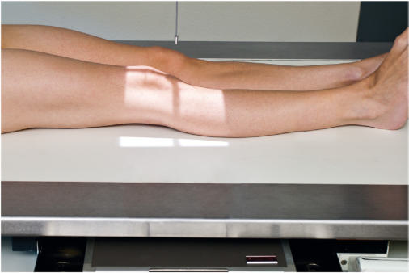
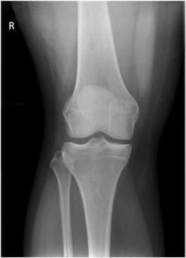
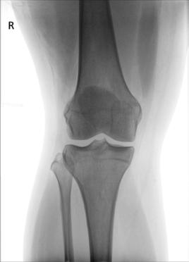

# Rx genunchi AP (anteroposterior)

  📷 Radiografie Convențională (Rx)
  <strong>Actualizat:</strong> 2026-09-15
  <strong>Autor:</strong> Departamentul de Radiologie / Referință Bontrager

---

-   __1. Rezumat Clinic & Indicații__

    ---

    === "Indicații Clinice"

        - suspiciune de fractură, leziuni sau modificări osoase asociate bolii articulare degenerative care implică femurul distal, tibia și fibula proximale, rotula (patela) și articulația genunchiului

    === "Ghid Național IRIS"

        !!! info "Referință Primară: Ghidul Național IRIS (Ordinul MS 1342/2012)"
            - **Capitol Ghid IRIS:** *Aparat locomotor & Membru inferior*
            - **Grad de Recomandare:** **Grad A**
            - **Nivel de Iradiere Estimată:** `Clasa 1 (Minimă < 0.05 mSv)`

            [:octicons-search-16: Deschide Ghidul IRIS](../../iris.md){ .md-button .md-button--primary } [:material-open-in-new: Aplicația Oficială PWA](https://radiologie-pediatrica.ro/iris/){ .md-button target="_blank" rel="noopener" }

-   __2. Poziționare & Centrare Fascicul__

    ---

    - **Poziție Pacient:** Pacient: Așezați pacientul în decubit dorsal, cu absența rotației anatomice: claviculele echidistante față de linia apofizelor spinoase ale bazinului (bazin (pelvis)); asigurați o pernă pentru capul pacientului; membrul inferior trebuie să fie complet extins.; Regiune anatomică: Aliniați și centrați membrul inferior și genunchiul la raza centrală și la linia mediană a mesei sau a receptorului de imagine (Fig. 6.103). Rotiți intern membrul inferior cu 3° la 5° pentru un genunchi AP adevărat (sau până când linia interepicondiliană este paralelă cu planul receptorului de imagine). Așezați săculeți cu nisip peste picior și gleznă (articulația talocrurală) pentru stabilizare, dacă este necesar.
    - **Punct de Centrare Fascicul:** Aliniați raza centrală paralel cu fațetele articulare (platoul tibial); pentru un pacient de talie medie, raza centrală este perpendiculară pe receptorul de imagine (consultați NOTA). Raza centrală este orientată spre un punct situat la ½ țol (1.25 cm) distal față de apexul rotulei (patela).
    - **Distanță Focar-Film (DFF / SID):** 100 cm
    - **Comandă Respiratorie:** Apnee pe durata expunerii (sau conform cooperării pacientului)

-   __3. Parametri Tehnici Expunere__

    ---

    | Parametru Tehnic | Valoare Configurare Generator / Tub |
    |:-----------------|:-------------------------------------|
    | **Tensiune Tub (kV)** | 65-80 kV |
    | **Sarcină / Produs Curent-Timp (mAs)** | DE CONFIGURAT PE APARAT |
    | **Distanță Focar-Film (DFF / SID)** | 100 cm |
    | **Grilă Antidifuzoare (Bucky)** | Fără grilă (expunere directă) |
    | **Dimensiune Focar** | Focar Mic (0.6 mm) |
    | **Camere de Ionizare AEC** | DE CONFIGURAT PE APARAT |
    | **Colimare Fascicul** | Colimați pe ambele părți până la marginile cutanate, la capetele marginilor receptorului de imagine. |
    | **Filtrare Tub** | Totală ≥ 2.5 mm Al echivalent |

-   __4. Criterii de Calitate & Reușită Imagine__

    ---

    - Femurul distal și tibia și fibula proximale sunt vizualizate.
    - Spațiile articulare femorotibiale trebuie să fie deschise, cu fațetele articulare ale tibiei vizibile la extremitate, cu doar o suprafață minimă vizualizată (Fig. 6.104 și 6.105). Poziție:
    - Absența rotației anatomice: clavicule echidistante față de linia apofizelor spinoase, evidențiată prin aspectul simetric al condililor femurali și tibiali și al spațiilor articulare.
    - Aproximativ jumătatea medială a capului peronier (fibular) trebuie să fie suprapusă de tibie.
    - Eminența intercondiliană este vizibilă în centrul fosei intercondiliene.
    - Centrul câmpului de colimare (raza centrală) trebuie să fie la nivelul spațiilor articulare ale genunchiului. Expunere:
    - Expunerea optimă a receptorului de imagine și contrastul vizualizează conturul rotulei (patelă) prin femurul distal, iar capul și colul peronier (fibular) nu apar supraexpuse.
    - Nu trebuie să apară mișcare; desenul trabecular al tuturor oaselor trebuie să fie vizibil și să apară clar.
    - Detaliile părților moi trebuie să fie vizibile. Fig. 6.104 Genunchi AP—raza centrală 0°. (Cu amabilitatea lui Joss Wertz, DO.) Epicondil lateral; epicondil medial (epitrohlee); rotulă (patelă); capul fibulei; tibie; spațiile articulare femorotibiale; fațete articulare (platou tibial); condil medial; condil lateral. Fig. 6.105 Genunchi AP—raza centrală 0°. (Cu amabilitatea lui Joss Wertz, DO.)

-   __5. Protecție Radiologică (ALARA)__

    ---

    - Ecranare gonadică și a organelor radiosensibile conform procedurilor locale de radioprotecție ALARA.
    - Colimare strictă la aria de interes pentru limitarea radiației difuze.
    - Verificarea posibilității unei sarcini la pacientele de vârstă fertilă înainte de expunere.

!!! note "Observații Clinice & Tehnice"
    Ghidul sugerat pentru determinarea faptului că raza centrală este paralelă cu fațetele articulare (platoul tibial), pentru spații articulare deschise, constă în măsurarea distanței de la spinele iliace anterosuperioare (SIAS) la masa radiologică, pentru determinarea unghiului razei centrale, după cum urmează6: <19 cm: 5° caudal (coapse și fese subțiri) 19 la 24 cm: unghi de 0° (coapse și fese medii) >24 cm: 5° cranial (coapse și fese groase) Genunchi INCIDENȚĂ AP DE RUTINĂ oblică (medială și laterală) laterală Fig. 6.103 AP genunchi — raza centrală (RC) perpendiculară pe receptorul de imagine (pacient mediu — 19 la 24 cm).

### 🖼️ Imagini

<figure class="protocol-image-card" markdown>

<figcaption><strong>Fig. 6.103 Genunchi AP—raza centrală (RC) perpendiculară pe receptorul de imagine (pacient mediu—19 la</strong> — Poziționarea pacientului conform Ghidului Bontrager (Fig. 6.103 genunchi AP—raza centrală perpendiculară pe receptorul de imagine (pacient mediu—19 la)</figcaption>

</figure>

<figure class="protocol-image-card" markdown>

<figcaption><strong>Fig. 6.104 Genunchi AP—raza centrală 0°. (Cu amabilitatea lui Joss Wertz, DO.)</strong> — Aspect radiografic de referință conform Ghidului Bontrager (Fig. 6.104 genunchi AP—raza centrală 0°. (Cu amabilitatea lui Joss Wertz, DO.))</figcaption>

</figure>

<figure class="protocol-image-card" markdown>

<figcaption><strong>Fig. 6.105 Genunchi AP—raza centrală 0°. (Cu amabilitatea lui Joss Wertz, DO.)</strong> — Aspect radiografic de referință conform Ghidului Bontrager (Fig. 6.105 genunchi AP—raza centrală 0°. (Cu amabilitatea lui Joss Wertz, DO.))</figcaption>

</figure>

=== "Ghid Rapid de Execuție"

    1. **Identificarea și verificarea pacientului:** verificare identitate, zonă de examinat, consimțământ conform procedurii și evaluarea posibilității unei sarcini, când este relevantă.
    2. **Pregătire:** îndepărtarea oricăror obiecte radiopace (bijuterii, agrafe, fermoare, proteze, pansamente dense).
    3. **Poziționare precisă:** alinierea receptorului de imagine și a tubului la distanța prescrisă (100 cm).
    4. **Colimare strictă:** adaptarea fasciculului strict la regiunea de diagnostic pentru scăderea iradierii și reducerea radiației difuze.
    5. **Radioprotecție:** verificarea [politicii RX](../radioprotectie.md), cu măsuri distincte pentru pacient, personal și însoțitor.

## Surse de documentare

- [Bontrager's Textbook of Radiographic Positioning (Ed. 9/10), Pagina 261](https://www.elsevier.com/books/textbook-of-radiographic-positioning-and-related-anatomy/lampignano/978-0-323-65367-1)
