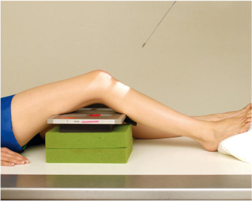
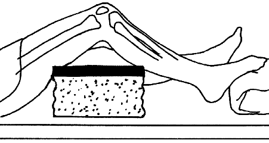
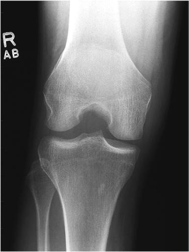

# Rx Genunchi AP Axială (“TUNNEL Incidență”) (INTERCONDYLAR FOSSA - BÉCLERE METHOD)

  📷 Radiografie Convențională (Rx)
  <strong>Actualizat:</strong> 2026-09-15
  <strong>Autor:</strong> Departamentul de Radiologie / Referință Bontrager

---

-   __1. Rezumat Clinic & Indicații__

    ---

    === "Indicații Clinice"

        - Intercondylar fossa, femoral condyles, tibial plateaus, și intercondylar eminence evidențiat la look pentru evidence de bony sau cartilaginous pathology
        - Osteochondral defects, sau narrowing de spații articulare

    === "Ghid Național IRIS"

        !!! info "Referință Primară: Ghidul Național IRIS (Ordinul MS 1342/2012)"
            - **Capitol Ghid IRIS:** *Ghidul Național IRIS*
            - **Grad de Recomandare:** **De verificat pe indicație; fără grad atribuit automat**
            - **Nivel de Iradiere Estimată:** `De verificat pentru examinarea și populația selectate`

            [:octicons-search-16: Deschide Ghidul IRIS](../../iris.md){ .md-button .md-button--primary } [:material-open-in-new: Aplicația Oficială PWA](https://radiologie-pediatrica.ro/iris/){ .md-button target="_blank" rel="noopener" }
-   __2. Poziționare & Centrare Fascicul__

    ---

    - **Poziție Pacient:** Pacient: Place pacient în Decubit dorsal poziție. Provide support under partially flectat Genunchi cu entire membru inferior în anatomic poziție cu Absența rotației anatomice: clavicule echidistante față de linia apofizelor spinoase.; Regiune anatomică: Flex Genunchi 40° la 45°, și poziție support under receptorul de imagine ca needed la place receptorul de imagine firmly against posterior thigh și Gambă, ca vizualizat în Figs. 6.127 și 6.128. Adjust receptorul de imagine ca needed la center receptorul de imagine la midknee articulație area.
    - **Punct de Centrare Fascicul:** 90° 40°-45° Fig. 6.128 8 × 10 inches (18 × 24 cm) receptorul de imagine.
    - **Distanță Focar-Film (DFF / SID):** 100 cm
    - **Comandă Respiratorie:** Apnee pe durata expunerii (sau conform cooperării pacientului)

-   __3. Parametri Tehnici Expunere__

    ---

    | Parametru Tehnic | Valoare Configurare Generator / Tub |
    |:-----------------|:-------------------------------------|
    | **Tensiune Tub (kV)** | 65-80 kV |
    | **Sarcină / Produs Curent-Timp (mAs)** | DE CONFIGURAT PE APARAT |
    | **Distanță Focar-Film (DFF / SID)** | 100 cm |
    | **Grilă Antidifuzoare (Bucky)** | Cu grilă antidifuzoare Bucky |
    | **Dimensiune Focar** | Focar Mic (0.6 mm) |
    | **Camere de Ionizare AEC** | Camerele laterale (sau camera centrală funcție de regiune) |
    | **Colimare Fascicul** | Collimate pe four sides la Genunchi articulație area. Genunchi—Intercondylar Fossa SPECIAL AP axial Fig. 6.127 AP axial—(40° flexion, Raza centrală perpendiculară la Gambă approximately 40° cranial). |
    | **Filtrare Tub** | Totală ≥ 2.5 mm Al echivalent |

-   __4. Criterii de Calitate & Reușită Imagine__

    ---

    - Intercondylar fossa, femoral condyles, tibial plateaus, și intercondylar eminence. poziție:
    - Center de foursided collimation field trebuie să fie la midknee articulație area.
    - Intercondylar fossa trebuie să appear în profile, open fără superimposition prin Rotulă (Patelă).
    - Intercondylar eminence și platou tibial și distal condyles de Femur trebuie să fie clearly visualized.
    - Absența rotației anatomice: clavicule echidistante față de linia apofizelor spinoase este evidenced prin simetric appearance de distal posterior femoral condyles și superimposition de approximately half de cap peronier (fibular) prin tibia (Fig. 6.129). expunere:
    - optim expunere trebuie să visualize părți moi în Genunchi spații articulare și outline de Rotulă (Patelă) through Femur.
    - Trabecular markings de femoral condyles și proximal tibia trebuie să appear clear și net, cu fără mișcare. Fig. 6.129 AP axial—40° flexion și raza centrală angle.

-   __5. Protecție Radiologică (ALARA)__

    ---

    - Ecranare gonadică și a organelor radiosensibile conform procedurilor locale de radioprotecție ALARA.
    - Colimare strictă la aria de interes pentru limitarea radiației difuze.
    - Verificarea posibilității unei sarcini la pacientele de vârstă fertilă înainte de expunere.

!!! note "Observații Clinice & Tehnice"
    This este reversal de Incidență PA Axială pentru pacienți who cannot assume Decubit ventral poziție. However, this este nu preferred incidență because de distortion de la raza centrală angle și increased partIR distance. This incidență also increases expunere pentru gonadal region.

### 🖼️ Imagini

<figure class="protocol-image-card" markdown>

<figcaption><strong>Fig. 6.127 AP axial—(40° flexion, Raza centrală perpendiculară la Gambă</strong> — Poziționare pacient conform Ghidului Bontrager (Fig. 6.127 AP axial—(40° flexion, raza centrală perpendicular la lower membru inferior)</figcaption>

</figure>

<figure class="protocol-image-card" markdown>

<figcaption><strong>Fig. 6.128 8 × 10 inches (18 × 24 cm) receptorul de imagine.</strong> — Aspect radiografic de referință conform Ghidului Bontrager (Fig. 6.128 8 × 10 inches (18 × 24 cm) receptorul de imagine.)</figcaption>

</figure>

<figure class="protocol-image-card" markdown>

<figcaption><strong>Fig. 6.129 AP axial—40° flexion și raza centrală angle.</strong> — Aspect radiografic de referință conform Ghidului Bontrager (Fig. 6.129 AP axial—40° flexion și raza centrală angle.)</figcaption>

</figure>

=== "Ghid Rapid de Execuție"

    1. **Identificarea și verificarea pacientului:** verificare identitate, zonă de examinat, consimțământ conform procedurii și evaluarea posibilității unei sarcini, când este relevantă.
    2. **Pregătire:** îndepărtarea oricăror obiecte radiopace (bijuterii, agrafe, fermoare, proteze, pansamente dense).
    3. **Poziționare precisă:** alinierea receptorului de imagine și a tubului la distanța prescrisă (100 cm).
    4. **Colimare strictă:** adaptarea fasciculului strict la regiunea de diagnostic pentru scăderea iradierii și reducerea radiației difuze.
    5. **Radioprotecție:** verificarea [politicii RX](../radioprotectie.md), cu măsuri distincte pentru pacient, personal și însoțitor.

## Surse de documentare

- [Bontrager's Textbook of Radiographic Positioning (Ed. 9/10), Pagina 270](https://www.elsevier.com/books/textbook-of-radiographic-positioning-and-related-anatomy/lampignano/978-0-323-65367-1)
