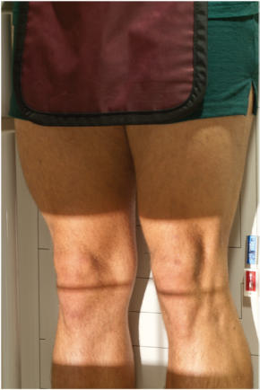
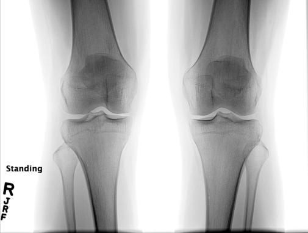

# Rx Genunchi AP În Încărcare (Ortostatism) BILATERAL Genunchi Incidență

  📷 Radiografie Convențională (Rx)
  <strong>Actualizat:</strong> 2026-09-15
  <strong>Autor:</strong> Departamentul de Radiologie / Referință Bontrager

---

-   __1. Rezumat Clinic & Indicații__

    ---

    === "Indicații Clinice"

        - Femorotibial spații articulare de genunchii evidențiat pentru possible cartilage degeneration sau other Genunchi articulație pathologies
        - bilateral genunchi included pe same expunere pentru comparison

    === "Ghid Național IRIS"

        !!! info "Referință Primară: Ghidul Național IRIS (Ordinul MS 1342/2012)"
            - **Capitol Ghid IRIS:** *Ghidul Național IRIS*
            - **Grad de Recomandare:** **De verificat pe indicație; fără grad atribuit automat**
            - **Nivel de Iradiere Estimată:** `De verificat pentru examinarea și populația selectate`

            [:octicons-search-16: Deschide Ghidul IRIS](../../iris.md){ .md-button .md-button--primary } [:material-open-in-new: Aplicația Oficială PWA](https://radiologie-pediatrica.ro/iris/){ .md-button target="_blank" rel="noopener" }
-   __2. Poziționare & Centrare Fascicul__

    ---

    - **Poziție Pacient:** Conform incidenței standard descrise
    - **Punct de Centrare Fascicul:** perpendicular pe receptorul de imagine (averagesized pacient), sau 5° la 10° caudal pe thin pacient, orientat la midpoint între Genunchi articulații la level ½ inch (1.25 cm) below apex de patellae.
    - **Distanță Focar-Film (DFF / SID):** 100 cm
    - **Comandă Respiratorie:** Apnee pe durata expunerii (sau conform cooperării pacientului)

-   __3. Parametri Tehnici Expunere__

    ---

    | Parametru Tehnic | Valoare Configurare Generator / Tub |
    |:-----------------|:-------------------------------------|
    | **Tensiune Tub (kV)** | 70-80 kV |
    | **Sarcină / Produs Curent-Timp (mAs)** | DE CONFIGURAT PE APARAT |
    | **Distanță Focar-Film (DFF / SID)** | 100 cm |
    | **Grilă Antidifuzoare (Bucky)** | Cu grilă antidifuzoare Bucky |
    | **Dimensiune Focar** | Focar Mic (0.6 mm) |
    | **Camere de Ionizare AEC** | Camerele laterale (sau camera centrală funcție de regiune) |
    | **Colimare Fascicul** | Collimate la bilateral Genunchi articulație region, including some distal femurs și proximal tibia pentru alignment purposes. Alternative PA If requested, alternative PA poate fie performed cu pacient facing masa de examinare sau receptorul de imagine holder, genunchi flectat la approximately 20°, picioare straight ahead, și thighs against tabletop sau receptorul de imagine holder. Direct raza centrală 10° caudal (paralel la articular facets) la level de Genunchi articulații pentru Incidență Postero-Anterioară (PA). Genunchi SPECIAL AP bilateral weightbearing Fig. 6.115 AP bilateral weightbearing—Raza centrală (RC) perpendiculară pe receptorul de imagine. |
    | **Filtrare Tub** | Totală ≥ 2.5 mm Al echivalent |

-   __4. Criterii de Calitate & Reușită Imagine__

    ---

    - distal Femur, proximal tibia, și fibula și femorotibial spații articulare sunt evidențiat bilaterally (Fig. 6.116). poziție:
    - Absența rotației anatomice: clavicule echidistante față de linia apofizelor spinoase de ambele genunchi este evident prin simetric appearance de femoral și tibial condyles.
    - Approximately onehalf de proximal fibula este superimposed prin tibia.
    - Collimation field trebuie să fie centrat pe Genunchi spații articulare și trebuie să include sufficient Femur și tibia la determine long axes de these long bones pentru alignment. expunere:
    - optim receptorul de imagine expunere și contrast la visualize faint outlines de patellae through femora.
    - părți moi trebuie să fie vizibil, și trabecular markings de toate bones trebuie să appear clear și net, indicating fără mișcare. Articular facets (platou tibial) Articular facets (platou tibial) Intercondylar fossa Fig. 6.116 AP bilateral weightbearing—raza centrală 10° caudal. (Courtesy Joss Wertz, DO.)

-   __5. Protecție Radiologică (ALARA)__

    ---

    - Ecranare gonadică și a organelor radiosensibile conform procedurilor locale de radioprotecție ALARA.
    - Colimare strictă la aria de interes pentru limitarea radiației difuze.
    - Verificarea posibilității unei sarcini la pacientele de vârstă fertilă înainte de expunere.

!!! note "Observații Clinice & Tehnice"
    This incidență most commonly este taken AP but poate fie taken PA cu cephalic raza centrală angle rather than caudal ca cu AP. (This poate fie easier pentru pacienți who sunt unable la straighten their Genunchi articulații fully, such ca pacienți cu arthritic conditions sau cu certain neuromuscular disorders involving lower limbs.)

### 🖼️ Imagini

<figure class="protocol-image-card" markdown>

<figcaption><strong>Fig. 6.115 AP bilateral weight-</strong> — Poziționare pacient conform Ghidului Bontrager (Fig. 6.115 AP bilateral weight-)</figcaption>

</figure>

<figure class="protocol-image-card" markdown>

<figcaption><strong>Fig. 6.116 AP bilateral weight-</strong> — Aspect radiografic de referință conform Ghidului Bontrager (Fig. 6.116 AP bilateral weight-)</figcaption>

</figure>

=== "Ghid Rapid de Execuție"

    1. **Identificarea și verificarea pacientului:** verificare identitate, zonă de examinat, consimțământ conform procedurii și evaluarea posibilității unei sarcini, când este relevantă.
    2. **Pregătire:** îndepărtarea oricăror obiecte radiopace (bijuterii, agrafe, fermoare, proteze, pansamente dense).
    3. **Poziționare precisă:** alinierea receptorului de imagine și a tubului la distanța prescrisă (100 cm).
    4. **Colimare strictă:** adaptarea fasciculului strict la regiunea de diagnostic pentru scăderea iradierii și reducerea radiației difuze.
    5. **Radioprotecție:** verificarea [politicii RX](../radioprotectie.md), cu măsuri distincte pentru pacient, personal și însoțitor.

## Surse de documentare

- [Bontrager's Textbook of Radiographic Positioning (Ed. 9/10), Pagina 265](https://www.elsevier.com/books/textbook-of-radiographic-positioning-and-related-anatomy/lampignano/978-0-323-65367-1)
