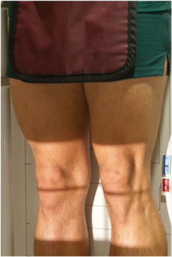
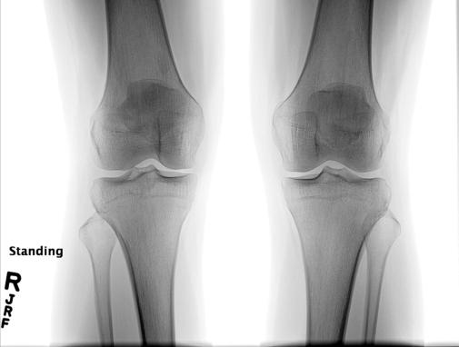

# Rx genunchi AP în încărcare (ortostatism) bilateral, incidență a genunchilor

  📷 Radiografie Convențională (Rx)
  <strong>Actualizat:</strong> 2026-09-15
  <strong>Autor:</strong> Departamentul de Radiologie / Referință Bontrager

---

-   __1. Rezumat Clinic & Indicații__

    ---

    === "Indicații Clinice"

        - Spațiile articulare femorotibiale ale genunchilor sunt evidențiate pentru posibila degenerare a cartilajului sau alte patologii ale articulației genunchiului.
        - Ambii genunchi sunt incluși în aceeași expunere pentru comparație.

    === "Ghid Național IRIS"

        !!! info "Referință Primară: Ghidul Național IRIS (Ordinul MS 1342/2012)"
            - **Capitol Ghid IRIS:** *Aparat locomotor & Membru inferior*
            - **Grad de Recomandare:** **Grad A**
            - **Nivel de Iradiere Estimată:** `Clasa 1 (Minimă < 0.05 mSv)`

            [:octicons-search-16: Deschide Ghidul IRIS](../../iris.md){ .md-button .md-button--primary } [:material-open-in-new: Aplicația Oficială PWA](https://radiologie-pediatrica.ro/iris/){ .md-button target="_blank" rel="noopener" }

-   __2. Poziționare & Centrare Fascicul__

    ---

    - **Poziție Pacient:** Conform incidenței standard descrise
    - **Punct de Centrare Fascicul:** Perpendicular pe receptorul de imagine (pacient de dimensiuni medii) sau 5° până la 10° caudal pentru un pacient slab, orientat spre punctul median dintre articulațiile genunchilor, la nivelul de ½ țol (1.25 cm) sub vârful rotulei.
    - **Distanță Focar-Film (DFF / SID):** 100 cm
    - **Comandă Respiratorie:** Apnee pe durata expunerii (sau conform cooperării pacientului)

-   __3. Parametri Tehnici Expunere__

    ---

    | Parametru Tehnic | Valoare Configurare Generator / Tub |
    |:-----------------|:-------------------------------------|
    | **Tensiune Tub (kV)** | 70-80 kV |
    | **Sarcină / Produs Curent-Timp (mAs)** | DE CONFIGURAT PE APARAT |
    | **Distanță Focar-Film (DFF / SID)** | 100 cm |
    | **Grilă Antidifuzoare (Bucky)** | Cu grilă antidifuzoare Bucky |
    | **Dimensiune Focar** | Focar Mic (0.6 mm) |
    | **Camere de Ionizare AEC** | Camerele laterale (sau camera centrală, în funcție de regiune) |
    | **Colimare Fascicul** | Colimați la nivelul regiunii articulațiilor genunchilor bilateral, incluzând o parte din femurele distale și tibiile proximale pentru aliniere. Alternativă PA: Dacă se solicită, alternativa PA poate fi efectuată cu pacientul orientat spre masa de examinare sau suportul receptorului de imagine, genunchii flectați la aproximativ 20°, picioarele îndreptate înainte și coapsele lipite de masa radiologică sau de suportul receptorului de imagine. Orientați raza centrală 10° caudal (paralelă cu fațetele articulare) la nivelul articulațiilor genunchilor pentru incidența postero-anterioară (PA). Genunchi, incidență AP bilaterală SPECIALĂ în încărcare. Fig. 6.115 AP bilateral în încărcare—raza centrală (RC) perpendiculară pe receptorul de imagine. |
    | **Filtrare Tub** | Totală ≥ 2.5 mm Al echivalent |

-   __4. Criterii de Calitate & Reușită Imagine__

    ---

    - Femurul distal, tibia proximală, fibula și spațiile articulare femorotibiale sunt evidențiate bilateral (Fig. 6.116). Poziție:
    - Absența rotației anatomice: clavicule echidistante față de linia apofizelor spinoase la ambii genunchi, evidențiată prin aspectul simetric al condililor femurali și tibiali.
    - Aproximativ jumătate din fibula proximală este suprapusă de tibie.
    - Câmpul de colimare trebuie să fie centrat pe spațiile articulare ale genunchilor și trebuie să includă suficient femur și tibie pentru a determina axele longitudinale ale acestor oase lungi în vederea alinierii. Expunere:
    - Expunerea optimă a receptorului de imagine și contrastul trebuie să vizualizeze contururile discrete ale rotulelor prin femure.
    - Părțile moi trebuie să fie vizibile, iar desenul trabecular al tuturor oaselor trebuie să apară clar și net, indicând absența mișcării. Fațete articulare (platou tibial); fațete articulare (platou tibial); fosa intercondiliană. Fig. 6.116 AP bilateral în încărcare—raza centrală 10° caudal. (Cu amabilitatea lui Joss Wertz, DO.)

-   __5. Protecție Radiologică (ALARA)__

    ---

    - Ecranare gonadică și a organelor radiosensibile conform procedurilor locale de radioprotecție ALARA.
    - Colimare strictă la aria de interes pentru limitarea radiației difuze.
    - Verificarea posibilității unei sarcini la pacientele de vârstă fertilă înainte de expunere.

!!! note "Observații Clinice & Tehnice"
    Această incidență este efectuată cel mai frecvent AP, dar poate fi efectuată PA cu unghiul razei centrale cefalic, în loc de caudal, ca în cazul AP. (Aceasta poate fi mai ușoară pentru pacienții care nu își pot întinde complet articulațiile genunchilor, precum pacienții cu afecțiuni artritice sau cu anumite tulburări neuromusculare care implică membrele inferioare.)

### 🖼️ Imagini

<figure class="protocol-image-card" markdown>

<figcaption><strong>Fig. 6.115 AP bilateral în încărcare-</strong> — Poziționarea pacientului conform Ghidului Bontrager (Fig. 6.115 AP bilateral în încărcare-)</figcaption>

</figure>

<figure class="protocol-image-card" markdown>

<figcaption><strong>Fig. 6.116 AP bilateral în încărcare-</strong> — Aspect radiografic de referință conform Ghidului Bontrager (Fig. 6.116 AP bilateral în încărcare-)</figcaption>

</figure>

=== "Ghid Rapid de Execuție"

    1. **Identificarea și verificarea pacientului:** verificare identitate, zonă de examinat, consimțământ conform procedurii și evaluarea posibilității unei sarcini, când este relevantă.
    2. **Pregătire:** îndepărtarea oricăror obiecte radiopace (bijuterii, agrafe, fermoare, proteze, pansamente dense).
    3. **Poziționare precisă:** alinierea receptorului de imagine și a tubului la distanța prescrisă (100 cm).
    4. **Colimare strictă:** adaptarea fasciculului strict la regiunea de diagnostic pentru scăderea iradierii și reducerea radiației difuze.
    5. **Radioprotecție:** verificarea [politicii RX](../radioprotectie.md), cu măsuri distincte pentru pacient, personal și însoțitor.

## Surse de documentare

- [Bontrager's Textbook of Radiographic Positioning (Ed. 9/10), Pagina 265](https://www.elsevier.com/books/textbook-of-radiographic-positioning-and-related-anatomy/lampignano/978-0-323-65367-1)
