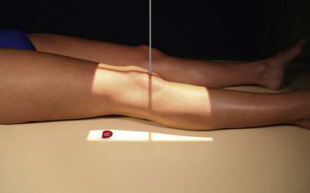
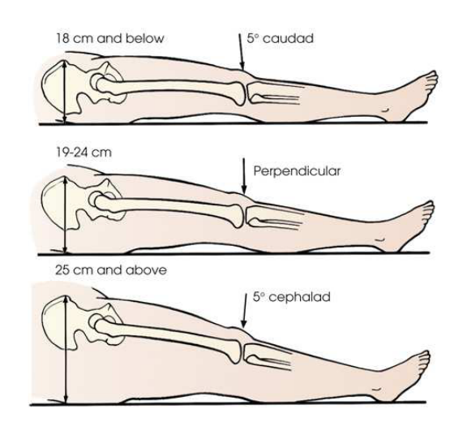
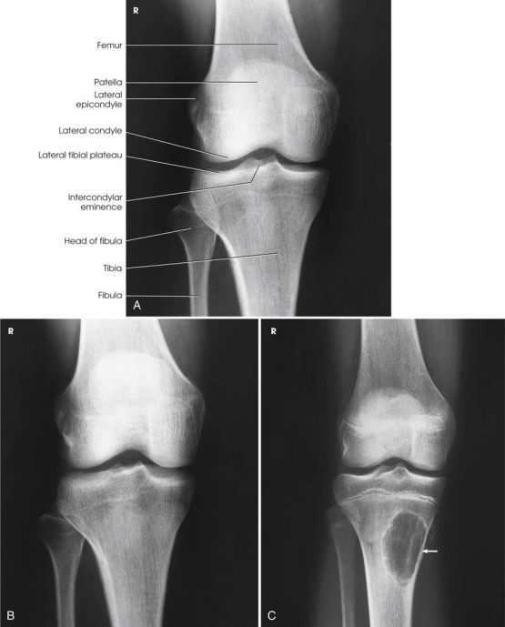

# Rx Genunchi — Incidență Antero-Posterioară (AP) (Merrill)

  📷 Radiografie Convențională (Rx)
  <strong>Actualizat:</strong> 2026-09-16
  <strong>Autor:</strong> Referință Merrill

---

-   __1. Rezumat Clinic & Indicații__

    ---

    === "Indicații Clinice"

        - Conform reperelor anatomice standard din tratat

    === "Ghid Național IRIS"

        !!! info "Referință Primară: Ghidul Național IRIS (Ordinul MS 1342/2012)"
            - **Capitol Ghid IRIS:** *Ghidul Național IRIS*
            - **Grad de Recomandare:** **De verificat pe indicație; fără grad atribuit automat**
            - **Nivel de Iradiere Estimată:** `De verificat pentru examinarea și populația selectate`

            [:octicons-search-16: Deschide Ghidul IRIS](../../iris.md){ .md-button .md-button--primary } [:material-open-in-new: Aplicația Oficială PWA](https://radiologie-pediatrica.ro/iris/){ .md-button target="_blank" rel="noopener" }
-   __2. Poziționare & Centrare Fascicul__

    ---

    - **Poziție Pacient:** se așază pacientul în Decubit dorsal poziție și se ajustează corp astfel încât Bazin (bazin (pelvis)) este nu rotit.; cu receptorul de imagine under pacientul’s Genunchi, se flectează articulație slightly, locate apex de Rotulă (Patelă), și ca pacientul extends Genunchi, se centrează receptorul de imagine about ½ inch (1.3 cm) below patellar apex. This centers receptorul de imagine la spații articulare. se ajustează pacient’s membru inferior prin placing femoral epicondyles paralel cu receptorul de imagine pentru true Incidență Antero-Posterioară (AP) (Fig. 7.119). Rotulă (Patelă) lies slightly de center la medial side. If Genunchi cannot fie fully extins, curved receptorul de imagine poate fie used. se efectuează ecranarea gonadelor cu șorț plumbat.
    - **Punct de Centrare Fascicul:** orientat la point ½ inch (1.3 cm) inferior la patellar apex. Variable, depending pe measurement între spină iliacă antero-superioară (SIAS) (spină iliacă antero-superioară (SIAS)) și tabletop (Fig. 7.120), ca follows: 18 <19 cm 3–5 grade caudal (thin Bazin (bazin (pelvis))) 19–24 cm 0 grade >24 cm 3–5 grade cranial (large Bazin (bazin (pelvis)))
    - **Distanță Focar-Film (DFF / SID):** Nespecificat în fragmentul extras; de verificat în sursă
    - **Comandă Respiratorie:** Conform reperelor anatomice standard din tratat

-   __3. Parametri Tehnici Expunere__

    ---

    | Parametru Tehnic | Valoare Configurare Generator / Tub |
    |:-----------------|:-------------------------------------|
    | **Tensiune Tub (kV)** | DE CONFIGURAT PE APARAT |
    | **Sarcină / Produs Curent-Timp (mAs)** | DE CONFIGURAT PE APARAT |
    | **Distanță Focar-Film (DFF / SID)** | Nespecificat în fragmentul extras; de verificat în sursă |
    | **Grilă Antidifuzoare (Bucky)** | DE CONFIGURAT PE APARAT |
    | **Dimensiune Focar** | DE CONFIGURAT PE APARAT |
    | **Camere de Ionizare AEC** | DE CONFIGURAT PE APARAT |
    | **Colimare Fascicul** | se ajustează câmp de iradiere la 8 × 10 inches (18 × 24 cm) pe collimator. Adjust la 1 inch (2.5 cm) beyond sides. Se plasează markerul de lateralitate în câmpul colimat. |
    | **Filtrare Tub** | DE CONFIGURAT PE APARAT |

-   __4. Criterii de Calitate & Reușită Imagine__

    ---

    - Criterii radiologice de calitate imaginii:
    - Evidence de corect collimation și presence de marker de lateralitate (D/S) plasat clear de anatomy de interest
    - Genunchi fully extins if pacient’s condition permits
    - Entire Genunchi fără rotație
    - Femoral condyles simetric și tibia intercondylar eminence centrat
    - Slight superimposition de cap peronier (fibular) if tibia este normal
    - Rotulă (Patelă) completely superimposed pe Femur
    - Open femorotibial spații articulare, cu interspaces de equal width pe ambele părți (bilateral) if Genunchi este normal
    - Bony detalii trabeculare osoase și surrounding soft tissues

-   __5. Protecție Radiologică (ALARA)__

    ---

    - Nespecificat în fragmentul extras; de verificat în sursă

!!! note "Observații Clinice & Tehnice"
    Conform reperelor anatomice standard din tratat

### 🖼️ Imagini

<figure class="protocol-image-card" markdown>

<figcaption><strong>Merrill — pagina PDF 542, imaginea 1</strong> — Imagine din fragmentul sursă; asocierea necesită revizie.</figcaption>

</figure>

<figure class="protocol-image-card" markdown>

<figcaption><strong>Merrill — pagina PDF 543, imaginea 2</strong> — Imagine din fragmentul sursă; asocierea necesită revizie.</figcaption>

</figure>

<figure class="protocol-image-card" markdown>

<figcaption><strong>Merrill — pagina PDF 544, imaginea 3</strong> — Imagine din fragmentul sursă; asocierea necesită revizie.</figcaption>

</figure>

=== "Ghid Rapid de Execuție"

    1. **Identificarea și verificarea pacientului:** verificare identitate, zonă de examinat, consimțământ conform procedurii și evaluarea posibilității unei sarcini, când este relevantă.
    2. **Pregătire:** îndepărtarea oricăror obiecte radiopace (bijuterii, agrafe, fermoare, proteze, pansamente dense).
    3. **Poziționare precisă:** alinierea receptorului de imagine și a tubului la distanța prescrisă (Nespecificat în fragmentul extras; de verificat în sursă).
    4. **Colimare strictă:** adaptarea fasciculului strict la regiunea de diagnostic pentru scăderea iradierii și reducerea radiației difuze.
    5. **Radioprotecție:** verificarea [politicii RX](../radioprotectie.md), cu măsuri distincte pentru pacient, personal și însoțitor.

## Surse de documentare

- [Merrill’s Atlas, 7. Lower Extremity, pagini PDF 541–544](../../assets/protocols/sources/a56d45c16829_Merrills_Atlas_of_Radiographic_Positioning__Procedures_3Vol_Set.pdf#page=541)

## Fragmente sursă traduse (referință tehnică)

### anatomy

AP incidență de genunchi structures (Fig. 7.121).

### collimation

• se ajustează câmp de iradiere la 8 × 10 inches (18 × 24 cm) pe collimator. Adjust la 1 inch (2.5 cm) beyond sides. Place marker de lateralitate (D/S) în
collimated expunere field.

### cr

• orientat la point ½ inch (1.3 cm) inferior la patellar apex.
• Variable, depending pe measurement între spină iliacă antero-superioară (SIAS) (spină iliacă antero-superioară (SIAS)) și tabletop (Fig. 7.120), ca follows: 18
<19 cm
3–5 grade caudal (thin bazin (pelvis))
19–24 cm
0 grade
>24 cm
3–5 grade cranial (large bazin (pelvis))

### criteria

Criterii radiologice de calitate imaginii:
• Evidence de corect collimation și presence de marker de lateralitate (D/S) plasat clear de anatomy de interest
• genunchi fully extins if pacient’s condition permits
• Entire genunchi fără rotație
• Femoral condyles simetric și tibia intercondylar eminence centrat
• Slight superimposition de cap peronier (fibular) if tibia este normal
• rotulă (patelă) completely superimposed pe femur
• Open femorotibial spații articulare, cu interspaces de equal width pe ambele părți (bilateral) if genunchi este normal
• Bony detalii trabeculare osoase și surrounding soft tissues

### part_pos

• cu receptorul de imagine under pacientul’s genunchi, se flectează articulație slightly, locate apex de rotulă (patelă), și ca pacientul extends genunchi, center
receptorul de imagine about ½ inch (1.3 cm) below patellar apex. This centers receptorul de imagine la spații articulare.
• se ajustează pacient’s membru inferior prin placing femoral epicondyles paralel cu receptorul de imagine pentru true AP incidență (Fig. 7.119). rotulă (patelă) lies
slightly de center la medial side. If genunchi cannot fie fully extins, curved receptorul de imagine poate fie used.
• se efectuează ecranarea gonadelor cu șorț plumbat.

### patient_pos

• se așază pacientul în decubit dorsal și se ajustează corp astfel încât bazin (pelvis) este nu rotit.

### tech

poziționat prin manufacturer sau department protocol pentru corect anatomy display orientation; raza centrală plate: 10 × 12 inches (24 × 30 cm) longitudinal.

