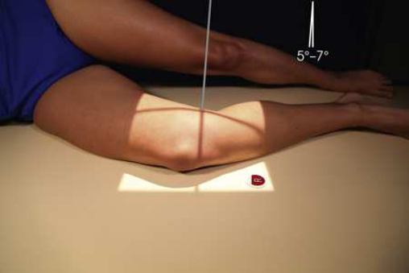
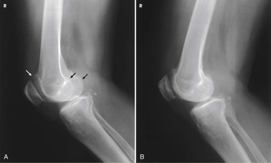

# Rx Genunchi — Incidență de Profil (Lateral) — Medio-Lateral (Merrill)

  📷 Radiografie Convențională (Rx)
  <strong>Actualizat:</strong> 2026-09-16
  <strong>Autor:</strong> Referință Merrill

---

-   __1. Rezumat Clinic & Indicații__

    ---

    === "Indicații Clinice"

        - Conform reperelor anatomice standard din tratat

    === "Ghid Național IRIS"

        !!! info "Referință Primară: Ghidul Național IRIS (Ordinul MS 1342/2012)"
            - **Capitol Ghid IRIS:** *Ghidul Național IRIS*
            - **Grad de Recomandare:** **De verificat pe indicație; fără grad atribuit automat**
            - **Nivel de Iradiere Estimată:** `De verificat pentru examinarea și populația selectate`

            [:octicons-search-16: Deschide Ghidul IRIS](../../iris.md){ .md-button .md-button--primary } [:material-open-in-new: Aplicația Oficială PWA](https://radiologie-pediatrica.ro/iris/){ .md-button target="_blank" rel="noopener" }
-   __2. Poziționare & Centrare Fascicul__

    ---

    - **Poziție Pacient:** Se instruiește pacientul să turn onto afected side. Ensure that Bazin (bazin (pelvis)) este nu rotit. pentru standard Incidență de Profil (lateral), Se instruiește pacientul să bring afected Genunchi forward și se extinde other extremity behind it (Fig. 7.124). other extremity poate also fie plasat în front de afected Genunchi pe support block.; Flexion de 20 la 30 grade este usually preferred because this poziție relaxes muscles și shows maximum volume de articulație cavity. 19 la prevent fragment separation în new sau unhealed patellar suspiciune de fractură, Genunchi trebuie să nu fie flectat more than 10 grade. Place support under Gleznă (Articulație Talocrurală). Grasp epicondyles și adjust them so that they sunt perpendicular pe receptorul de imagine (RI) (condyles superimposed). Rotulă (Patelă) este perpendicular pe plane de receptorul de imagine (Fig. 7.125). se efectuează ecranarea gonadelor cu șorț plumbat.
    - **Punct de Centrare Fascicul:** orientat la Genunchi articulație 1 inch (2.5 cm) distal la epicondil medial (epitrohlee) la un unghi de 5 la 7 grade cranial. This slight angulation de raza centrală prevents spații articulare de la being obscured prin magnified imagine de medial femoral condyle. în addition, în lateral Decubit poziție, medial condyle este slightly inferior la lateral condyle. Se centrează receptorul de imagine pe raza centrală.
    - **Distanță Focar-Film (DFF / SID):** Nespecificat în fragmentul extras; de verificat în sursă
    - **Comandă Respiratorie:** Conform reperelor anatomice standard din tratat

-   __3. Parametri Tehnici Expunere__

    ---

    | Parametru Tehnic | Valoare Configurare Generator / Tub |
    |:-----------------|:-------------------------------------|
    | **Tensiune Tub (kV)** | DE CONFIGURAT PE APARAT |
    | **Sarcină / Produs Curent-Timp (mAs)** | DE CONFIGURAT PE APARAT |
    | **Distanță Focar-Film (DFF / SID)** | Nespecificat în fragmentul extras; de verificat în sursă |
    | **Grilă Antidifuzoare (Bucky)** | DE CONFIGURAT PE APARAT |
    | **Dimensiune Focar** | DE CONFIGURAT PE APARAT |
    | **Camere de Ionizare AEC** | DE CONFIGURAT PE APARAT |
    | **Colimare Fascicul** | Conform reperelor anatomice standard din tratat |
    | **Filtrare Tub** | DE CONFIGURAT PE APARAT |

-   __4. Criterii de Calitate & Reușită Imagine__

    ---

    - Conform reperelor anatomice standard din tratat

-   __5. Protecție Radiologică (ALARA)__

    ---

    - Nespecificat în fragmentul extras; de verificat în sursă

!!! note "Observații Clinice & Tehnice"
    Conform reperelor anatomice standard din tratat

### 🖼️ Imagini

<figure class="protocol-image-card" markdown>

<figcaption><strong>Merrill — pagina PDF 547, imaginea 1</strong> — Imagine din fragmentul sursă; asocierea necesită revizie.</figcaption>

</figure>

<figure class="protocol-image-card" markdown>

<figcaption><strong>Merrill — pagina PDF 547, imaginea 2</strong> — Imagine din fragmentul sursă; asocierea necesită revizie.</figcaption>

</figure>

=== "Ghid Rapid de Execuție"

    1. **Identificarea și verificarea pacientului:** verificare identitate, zonă de examinat, consimțământ conform procedurii și evaluarea posibilității unei sarcini, când este relevantă.
    2. **Pregătire:** îndepărtarea oricăror obiecte radiopace (bijuterii, agrafe, fermoare, proteze, pansamente dense).
    3. **Poziționare precisă:** alinierea receptorului de imagine și a tubului la distanța prescrisă (Nespecificat în fragmentul extras; de verificat în sursă).
    4. **Colimare strictă:** adaptarea fasciculului strict la regiunea de diagnostic pentru scăderea iradierii și reducerea radiației difuze.
    5. **Radioprotecție:** verificarea [politicii RX](../radioprotectie.md), cu măsuri distincte pentru pacient, personal și însoțitor.

## Surse de documentare

- [Merrill’s Atlas, 7. Lower Extremity, pagini PDF 546–547](../../assets/protocols/sources/a56d45c16829_Merrills_Atlas_of_Radiographic_Positioning__Procedures_3Vol_Set.pdf#page=546)

## Fragmente sursă traduse (referință tehnică)

### cr

• orientat la genunchi articulație 1 inch (2.5 cm) distal la epicondil medial (epitrohlee) la un unghi de 5 la 7 grade cranial. This slight angulation de
raza centrală prevents spații articulare de la being obscured prin magnified imagine de medial femoral condyle. în addition, în lateral recumbent poziție, medial condyle este slightly inferior la lateral condyle.
• Se centrează receptorul de imagine pe raza centrală.

### part_pos

• Flexion de 20 la 30 grade este usually preferred because this poziție relaxes muscles și shows maximum volume de articulație
cavity. 19
• la prevent fragment separation în new sau unhealed patellar suspiciune de fractură, genunchi trebuie să nu fie flectat more than 10 grade.
• Place support under ankle.
• Grasp epicondyles și adjust them so that they sunt perpendicular pe receptorul de imagine (RI) (condyles superimposed). rotulă (patelă) este perpendicular
la plane de receptorul de imagine (Fig. 7.125).
• se efectuează ecranarea gonadelor cu șorț plumbat.

### patient_pos

• Se instruiește pacientul să turn onto afected side. Ensure that bazinul este nu rotit.
• pentru standard lateral incidență, Se instruiește pacientul să bring afected genunchi forward și se extinde other extremity behind it (Fig. 7.124).
other extremity poate also fie plasat în front de afected genunchi pe support block.

### tech

poziționat prin manufacturer sau department protocol pentru corect anatomy display orientation; raza centrală plate: 10 × 12 inches (24 × 30 cm) longitudinal.

