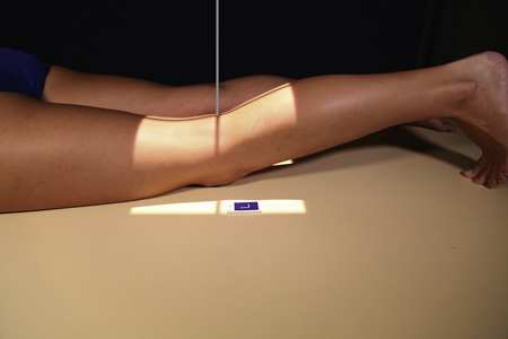
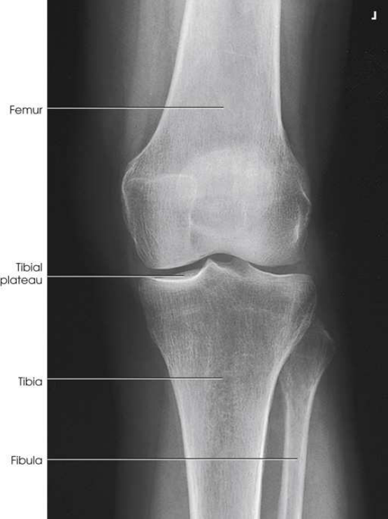

# Rx Genunchi — Incidență Postero-Anterioară (PA) (Merrill)

  📷 Radiografie Convențională (Rx)
  <strong>Actualizat:</strong> 2026-09-16
  <strong>Autor:</strong> Referință Merrill

---

-   __1. Rezumat Clinic & Indicații__

    ---

    === "Indicații Clinice"

        - Conform reperelor anatomice standard din tratat

    === "Ghid Național IRIS"

        !!! info "Referință Primară: Ghidul Național IRIS (Ordinul MS 1342/2012)"
            - **Capitol Ghid IRIS:** *Ghidul Național IRIS*
            - **Grad de Recomandare:** **De verificat pe indicație; fără grad atribuit automat**
            - **Nivel de Iradiere Estimată:** `De verificat pentru examinarea și populația selectate`

            [:octicons-search-16: Deschide Ghidul IRIS](../../iris.md){ .md-button .md-button--primary } [:material-open-in-new: Aplicația Oficială PWA](https://radiologie-pediatrica.ro/iris/){ .md-button target="_blank" rel="noopener" }
-   __2. Poziționare & Centrare Fascicul__

    ---

    - **Poziție Pacient:** se așază pacientul în Decubit ventral poziție cu Degete Picior resting pe masa radiologică, sau place săculeți cu nisip under Gleznă (Articulație Talocrurală) pentru support.; Center point ½ inch (1.3 cm) below patellar apex la center de receptorul de imagine, și se ajustează pacient’s membru inferior astfel încât femoral epicondyles sunt paralel cu tabletop. Because Genunchi este balanced pe medial side de obliquely located Rotulă (Patelă), care trebuie să fie used în adjusting Genunchi (Fig. 7.122). se efectuează ecranarea gonadelor cu șorț plumbat.
    - **Punct de Centrare Fascicul:** orientat la un unghi de 5 la 7 grade caudal la exit point ½ inch (1.3 cm) inferior la patellar apex. Because tibia și fibula sunt slightly inclined, raza centrală este paralel cu platou tibial. perpendicular raza centrală poate fie needed pentru pacienți cu large thighs sau when Picior este dorsiflexed.
    - **Distanță Focar-Film (DFF / SID):** Nespecificat în fragmentul extras; de verificat în sursă
    - **Comandă Respiratorie:** Conform reperelor anatomice standard din tratat

-   __3. Parametri Tehnici Expunere__

    ---

    | Parametru Tehnic | Valoare Configurare Generator / Tub |
    |:-----------------|:-------------------------------------|
    | **Tensiune Tub (kV)** | DE CONFIGURAT PE APARAT |
    | **Sarcină / Produs Curent-Timp (mAs)** | DE CONFIGURAT PE APARAT |
    | **Distanță Focar-Film (DFF / SID)** | Nespecificat în fragmentul extras; de verificat în sursă |
    | **Grilă Antidifuzoare (Bucky)** | DE CONFIGURAT PE APARAT |
    | **Dimensiune Focar** | DE CONFIGURAT PE APARAT |
    | **Camere de Ionizare AEC** | DE CONFIGURAT PE APARAT |
    | **Colimare Fascicul** | se ajustează câmp de iradiere la 8 × 10 inches (18 × 24 cm) pe collimator. Adjust la 1 inch (2.5 cm) beyond sides. Se plasează markerul de lateralitate în câmpul colimat. |
    | **Filtrare Tub** | DE CONFIGURAT PE APARAT |

-   __4. Criterii de Calitate & Reușită Imagine__

    ---

    - Criterii radiologice de calitate imaginii:
    - Evidence de corect collimation și presence de marker de lateralitate (D/S) plasat clear de anatomy de interest
    - Open femorotibial spații articulare cu interspaces de equal width pe ambele părți (bilateral) if Genunchi este normal
    - Genunchi fully extins if pacientul’s condition permits
    - Absența rotației anatomice (simetrie bilaterală perfectă) de Femur if tibia este normal
    - Slight superimposition de cap peronier (fibular) cu tibia
    - Bony detalii trabeculare osoase și surrounding soft tissues

-   __5. Protecție Radiologică (ALARA)__

    ---

    - Nespecificat în fragmentul extras; de verificat în sursă

!!! note "Observații Clinice & Tehnice"
    Conform reperelor anatomice standard din tratat

### 🖼️ Imagini

<figure class="protocol-image-card" markdown>

<figcaption><strong>Merrill — pagina PDF 545, imaginea 1</strong> — Imagine din fragmentul sursă; asocierea necesită revizie.</figcaption>

</figure>

<figure class="protocol-image-card" markdown>

<figcaption><strong>Merrill — pagina PDF 546, imaginea 2</strong> — Imagine din fragmentul sursă; asocierea necesită revizie.</figcaption>

</figure>

=== "Ghid Rapid de Execuție"

    1. **Identificarea și verificarea pacientului:** verificare identitate, zonă de examinat, consimțământ conform procedurii și evaluarea posibilității unei sarcini, când este relevantă.
    2. **Pregătire:** îndepărtarea oricăror obiecte radiopace (bijuterii, agrafe, fermoare, proteze, pansamente dense).
    3. **Poziționare precisă:** alinierea receptorului de imagine și a tubului la distanța prescrisă (Nespecificat în fragmentul extras; de verificat în sursă).
    4. **Colimare strictă:** adaptarea fasciculului strict la regiunea de diagnostic pentru scăderea iradierii și reducerea radiației difuze.
    5. **Radioprotecție:** verificarea [politicii RX](../radioprotectie.md), cu măsuri distincte pentru pacient, personal și însoțitor.

## Surse de documentare

- [Merrill’s Atlas, 7. Lower Extremity, pagini PDF 544–546](../../assets/protocols/sources/a56d45c16829_Merrills_Atlas_of_Radiographic_Positioning__Procedures_3Vol_Set.pdf#page=544)

## Fragmente sursă traduse (referință tehnică)

### anatomy

PA incidență de genunchi (Fig. 7.123).

### collimation

• se ajustează câmp de iradiere la 8 × 10 inches (18 × 24 cm) pe collimator. Adjust la 1 inch (2.5 cm) beyond sides. Place marker de lateralitate (D/S) în
collimated expunere field.

### cr

• orientat la un unghi de 5 la 7 grade caudal la exit point ½ inch (1.3 cm) inferior la patellar apex. Because tibia și fibula sunt
slightly inclined, raza centrală este paralel cu platou tibial. perpendicular raza centrală poate fie needed pentru pacienți cu large thighs sau
when picior este dorsiflexed.

### criteria

Criterii radiologice de calitate imaginii:
• Evidence de corect collimation și presence de marker de lateralitate (D/S) plasat clear de anatomy de interest
• Open femorotibial spații articulare cu interspaces de equal width pe ambele părți (bilateral) if genunchi este normal
• genunchi fully extins if pacientul’s condition permits
• Absența rotației anatomice (simetrie bilaterală perfectă) de femur if tibia este normal
• Slight superimposition de cap peronier (fibular) cu tibia
• Bony detalii trabeculare osoase și surrounding soft tissues

### part_pos

• Center point ½ inch (1.3 cm) below patellar apex la center de receptorul de imagine, și se ajustează pacient’s membru inferior astfel încât femoral
epicondyles sunt paralel cu tabletop. Because genunchi este balanced pe medial side de obliquely located rotulă (patelă), care trebuie să
fie used în adjusting genunchi (Fig. 7.122).
• se efectuează ecranarea gonadelor cu șorț plumbat.

### patient_pos

• se așază pacientul în decubit ventral cu toes resting pe masa radiologică, sau place săculeți cu nisip under ankle pentru support.

### tech

poziționat prin manufacturer sau department protocol pentru corect anatomy display orientation; raza centrală plate: 10 × 12 inches (24 × 30 cm) longitudinal.

