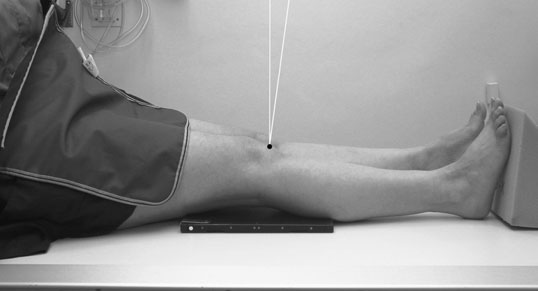
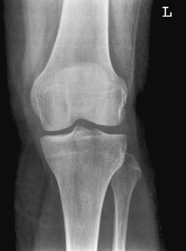
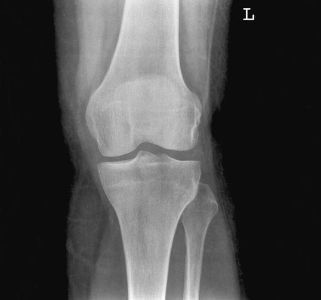
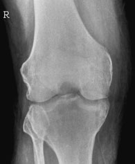
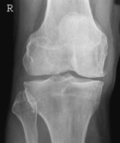

# Rx Genunchi Incidențe Standard de Bază

  📷 Radiografie Convențională (Rx)
  <strong>Actualizat:</strong> 2026-09-16
  <strong>Autor:</strong> Departamentul de Radiologie / Referință Clark (Ed. 12)

---

-   __1. Rezumat Clinic & Indicații__

    ---

    === "Indicații Clinice"

        - Evaluare radiografică regiunii Genunchi (Incidențe Standard de Bază).
        - Suspiciune de leziuni traumatice (fracturi, luxații sau diastazis articular).
        - Bilanț osteoarticular / visceral conform recomandării medicale de trimitere.

    === "Ghid Național IRIS"

        !!! info "Referință Primară: Ghidul Național IRIS (Ordinul MS 1342/2012)"
            - **Capitol Ghid IRIS:** *Ghidul Național IRIS*
            - **Grad de Recomandare:** **De verificat pe indicație; fără grad atribuit automat**
            - **Nivel de Iradiere Estimată:** `De verificat pentru examinarea și populația selectate`

            [:octicons-search-16: Deschide Ghidul IRIS](../../iris.md){ .md-button .md-button--primary } [:material-open-in-new: Aplicația Oficială PWA](https://radiologie-pediatrica.ro/iris/){ .md-button target="_blank" rel="noopener" }
-   __2. Poziționare & Centrare Fascicul__

    ---

    - **Poziție Pacient:** • pacientul este either Decubit dorsal sau așezat pe scaun pe masa radiologică, cu ambele membre inferioare extins. affected limb este rotit la centralize Rotulă (Patelă) între femoral condyles, și săculeți cu nisip sunt plasat pe / sprijinit de Gleznă (Articulație Talocrurală) la help maintain this poziție.
• caseta trebuie să fie în close contact cu posterior aspect de Genunchi, cu its centre level cu upper margini de tibial condyles.
    - **Punct de Centrare Fascicul:** • Centre 2.5 cm below apex de Rotulă (Patelă) through spații articulare, cu raza centrală centrală la 90 grade la axa longitudinală de tibia.
    - **Distanță Focar-Film (DFF / SID):** 100 cm
    - **Comandă Respiratorie:** Apnee pe durata expunerii (apnee în inspir pentru torace; expir pentru Abdomen/bazin).

-   __3. Parametri Tehnici Expunere__

    ---

    | Parametru Tehnic | Valoare Configurare Generator / Tub |
    |:-----------------|:-------------------------------------|
    | **Tensiune Tub (kV)** | DE CONFIGURAT PE APARAT |
    | **Sarcină / Produs Curent-Timp (mAs)** | Conform AEC / grosime anatomică |
    | **Distanță Focar-Film (DFF / SID)** | 100 cm |
    | **Grilă Antidifuzoare (Bucky)** | Conform grosimii anatomice (> 10-12 cm cu grilă) |
    | **Dimensiune Focar** | Focar Mic (0.6 mm) |
    | **Camere de Ionizare AEC** | DE CONFIGURAT PE APARAT |
    | **Colimare Fascicul** | Colimare strictă adaptată pe receptor 18 x 24 cm |
    | **Filtrare Tub** | Totală ≥ 2.5 mm Al echivalent (conform Clark: 3.0 mm Al eq.) |

-   __4. Criterii de Calitate & Reușită Imagine__

    ---

    - Rotulă (Patelă) trebuie să fie centralized over Femur.

-   __5. Protecție Radiologică (ALARA)__

    ---

    - Ecranare gonadică cu șorț plumbat dacă gonadele sunt în apropierea fasciculului util (regula ALARA).
    - Colimare precisă la dimensiunea anatomică strict necesară pentru reducerea dozei și a radiației difuze.
    - Verificarea posibilității unei sarcini la pacientele de vârstă fertilă înainte de expunere.

!!! note "Observații Clinice & Tehnice"
    • la enable correct assessment de spații articulare, raza centrală trebuie să fie la 90 grade la axa longitudinală de tibia și, if necessary, înclinat slightly cranially. If raza centrală este nu perpendicular pe axa longitudinală de tibia, then anterior și posterior margins de platou tibial will fie separated widely și assessment de true width de spații articulare will fie difficult.
• If raza centrală este too high, then Rotulă (Patelă) este thrown down over spații articulare și spații articulare appears narrower.
• If Genunchi este flectat și pacientul este unable la se extinde limb, then caseta poate fie raised pe pads la bring it ca close ca possible la posterior aspect de Genunchi.
• în Antero-posterior (AP) incidență, Rotulă (Patelă) este remote de la caseta. Although relationship de Rotulă (Patelă) la surrounding structures poate fie assessed trabecular pattern de Femur este superimposed. Therefore, this incidență este nu ideal pentru evidențiind discrete Rotulă (Patelă) bony abnormalities.
126 Normal Antero-posterior (AP) radiografie Adductor tubercle de Femur Profil (lateral) femoral condyle Genunchi Fibula Tibia Femur Rotulă (Patelă) anterior și posterior tibial spines medial platou tibial medial femoral condyle Intercondylar notch Profil (lateral) platou tibial Profil (lateral) condyle de tibia Effect de intern rotație Effect de flexion de Genunchi

### 🖼️ Imagini

<figure class="protocol-image-card" markdown>

<figcaption><strong>Profil (lateral). fiecare imagine este normally acquired using a 18  24-cm</strong> — Poziționare pacient și centrare fascicul conform Clark (Ed. 12)</figcaption>

</figure>

<figure class="protocol-image-card" markdown>

<figcaption><strong>• la enable correct assessment de spații articulare, raza centrală</strong> — Aspect radiografic / ghid de poziționare conform tratatului Clark (Ed. 12)</figcaption>

</figure>

<figure class="protocol-image-card" markdown>

<figcaption><strong>ment de true width de spații articulare will fie difficult.</strong> — Aspect radiografic / ghid de poziționare conform tratatului Clark (Ed. 12)</figcaption>

</figure>

<figure class="protocol-image-card" markdown>

<figcaption><strong>over spații articulare și spații articulare appears narrower.</strong> — Aspect radiografic / ghid de poziționare conform tratatului Clark (Ed. 12)</figcaption>

</figure>

<figure class="protocol-image-card" markdown>

<figcaption><strong>ideal pentru evidențiind discrete Rotulă (Patelă) bony abnormalities.</strong> — Aspect radiografic / ghid de poziționare conform tratatului Clark (Ed. 12)</figcaption>

</figure>

=== "Ghid Rapid de Execuție"

    1. **Identificarea și verificarea pacientului:** verificare identitate, zonă de examinat, consimțământ conform procedurii și evaluarea posibilității unei sarcini, când este relevantă.
    2. **Pregătire:** îndepărtarea oricăror obiecte radiopace (bijuterii, agrafe, fermoare, proteze, pansamente dense).
    3. **Poziționare precisă:** alinierea receptorului de imagine și a tubului la distanța prescrisă (100 cm).
    4. **Colimare strictă:** adaptarea fasciculului strict la regiunea de diagnostic pentru scăderea iradierii și reducerea radiației difuze.
    5. **Radioprotecție:** verificarea [politicii RX](../radioprotectie.md), cu măsuri distincte pentru pacient, personal și însoțitor.

## Surse de documentare

- [Clark's Positioning in Radiography (Ed. 12), Pagina 141](../../assets/protocols/sources/Clark___Positioning_in_Radiography__12th_edition.pdf#page=141)
