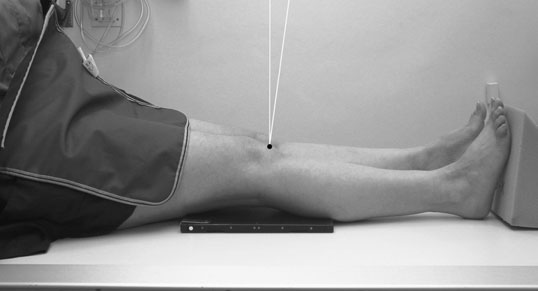
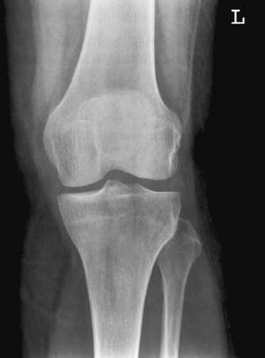
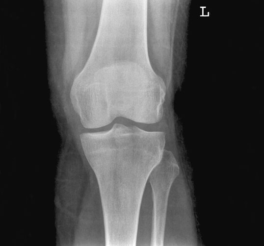
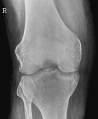
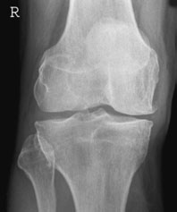

# Rx genunchi — incidențe standard de bază

  📷 Radiografie Convențională (Rx)
  <strong>Actualizat:</strong> 2026-09-16
  <strong>Autor:</strong> Departamentul de Radiologie / Referință Clark (Ed. 12)

---

-   __1. Rezumat Clinic & Indicații__

    ---

    === "Indicații Clinice"

        - Evaluarea radiografică a regiunii genunchiului (incidențe standard de bază).
        - Suspiciune de leziuni traumatice (fracturi, luxații sau diastazis articular).
        - Bilanț osteoarticular / visceral conform recomandării medicale de trimitere.

    === "Ghid Național IRIS"

        !!! info "Referință Primară: Ghidul Național IRIS (Ordinul MS 1342/2012)"
            - **Capitol Ghid IRIS:** *Aparat locomotor & Membru inferior*
            - **Grad de Recomandare:** **Grad A**
            - **Nivel de Iradiere Estimată:** `Clasa 1 (Minimă < 0.05 mSv)`

            [:octicons-search-16: Deschide Ghidul IRIS](../../iris.md){ .md-button .md-button--primary } [:material-open-in-new: Aplicația Oficială PWA](https://radiologie-pediatrica.ro/iris/){ .md-button target="_blank" rel="noopener" }

-   __2. Poziționare & Centrare Fascicul__

    ---

    - **Poziție Pacient:**
        - Pacientul este fie în decubit dorsal, fie așezat pe un scaun pe masa radiologică, cu ambele membre inferioare extinse. Membrul afectat este rotit pentru a centra rotula între condilii femurali, iar săculeți cu nisip sunt plasați pe gleznă sau sprijiniți de aceasta pentru a ajuta la menținerea poziției.
        - Caseta trebuie să fie în contact strâns cu aspectul posterior al genunchiului, cu centrul său la nivelul marginilor superioare ale condililor tibiali.
    - **Punct de Centrare Fascicul:** • Se centrează la 2.5 cm sub vârful rotulei, prin spațiile articulare, cu raza centrală perpendiculară la 90 de grade pe axa longitudinală a tibiei.
    - **Distanță Focar-Film (DFF / SID):** 100 cm
    - **Comandă Respiratorie:** Apnee pe durata expunerii (apnee în inspir pentru torace; expir pentru Abdomen/bazin).

-   __3. Parametri Tehnici Expunere__

    ---

    | Parametru Tehnic | Valoare Configurare Generator / Tub |
    |:-----------------|:-------------------------------------|
    | **Tensiune Tub (kV)** | DE CONFIGURAT PE APARAT |
    | **Sarcină / Produs Curent-Timp (mAs)** | Conform AEC / grosimii anatomice |
    | **Distanță Focar-Film (DFF / SID)** | 100 cm |
    | **Grilă Antidifuzoare (Bucky)** | Conform grosimii anatomice (> 10-12 cm cu grilă) |
    | **Dimensiune Focar** | Focar Mic (0.6 mm) |
    | **Camere de Ionizare AEC** | DE CONFIGURAT PE APARAT |
    | **Colimare Fascicul** | Colimare strictă adaptată pe receptor 18 x 24 cm |
    | **Filtrare Tub** | Totală ≥ 2.5 mm Al echivalent (conform Clark: 3.0 mm Al echivalent) |

-   __4. Criterii de Calitate & Reușită Imagine__

    ---

    - Rotula trebuie să fie centrată peste femur.

-   __5. Protecție Radiologică (ALARA)__

    ---

    - Ecranare gonadică cu șorț plumbat dacă gonadele sunt în apropierea fasciculului util (regula ALARA).
    - Colimare precisă la dimensiunea anatomică strict necesară pentru reducerea dozei și a radiației difuze.
    - Verificarea posibilității unei sarcini la pacientele de vârstă fertilă înainte de expunere.

!!! note "Observații Clinice & Tehnice"
    - Pentru a permite evaluarea corectă a spațiilor articulare, raza centrală trebuie să fie perpendiculară la 90 de grade pe axa longitudinală a tibiei și, dacă este necesar, înclinată ușor cranial. Dacă raza centrală nu este perpendiculară pe axa longitudinală a tibiei, marginile anterioară și posterioară ale platoului tibial vor fi larg separate, iar evaluarea lățimii reale a spațiilor articulare va fi dificilă.
    - Dacă raza centrală este prea sus, rotula este proiectată peste spațiile articulare, iar spațiile articulare apar mai înguste.
    - Dacă genunchiul este flectat și pacientul nu poate extinde membrul, caseta poate fi ridicată pe suporturi pentru a fi adusă cât mai aproape de aspectul posterior al genunchiului.
    - În incidența antero-posterioară (AP), rotula este îndepărtată de casetă. Deși relația rotulei cu structurile înconjurătoare poate fi evaluată, modelul trabecular al femurului este suprapus. Prin urmare, această incidență nu este ideală pentru evidențierea anomaliilor osoase discrete ale rotulei. 126 Radiografie antero-posterioară (AP) normală Adductor tubercle al femurului Condil femural de profil (lateral) Genunchi Fibulă Tibie Femur Rotulă coloane tibiale anterioară și posterioară platou tibial medial condil femural medial incizură intercondiliană platou tibial de profil (lateral) condil tibial de profil (lateral) Efectul rotației interne Efectul flexiei genunchiului

### 🖼️ Imagini

<figure class="protocol-image-card" markdown>

<figcaption><strong>Profil (lateral). Fiecare imagine este de obicei obținută folosind o casetă de 18 × 24 cm</strong> — Poziționarea pacientului și centrarea fasciculului conform Clark (Ed. 12)</figcaption>

</figure>

<figure class="protocol-image-card" markdown>

<figcaption><strong>• Pentru a permite evaluarea corectă a spațiilor articulare, raza centrală</strong> — Aspect radiografic / ghid de poziționare conform tratatului Clark (Ed. 12)</figcaption>

</figure>

<figure class="protocol-image-card" markdown>

<figcaption><strong>mentul lățimii reale a spațiilor articulare va fi dificil.</strong> — Aspect radiografic / ghid de poziționare conform tratatului Clark (Ed. 12)</figcaption>

</figure>

<figure class="protocol-image-card" markdown>

<figcaption><strong>peste spațiile articulare, iar spațiile articulare apar mai înguste.</strong> — Aspect radiografic / ghid de poziționare conform tratatului Clark (Ed. 12)</figcaption>

</figure>

<figure class="protocol-image-card" markdown>

<figcaption><strong>ideală pentru evidențierea anomaliilor osoase discrete ale rotulei.</strong> — Aspect radiografic / ghid de poziționare conform tratatului Clark (Ed. 12)</figcaption>

</figure>

=== "Ghid Rapid de Execuție"

    1. **Identificarea și verificarea pacientului:** verificare identitate, zonă de examinat, consimțământ conform procedurii și evaluarea posibilității unei sarcini, când este relevantă.
    2. **Pregătire:** îndepărtarea oricăror obiecte radiopace (bijuterii, agrafe, fermoare, proteze, pansamente dense).
    3. **Poziționare precisă:** alinierea receptorului de imagine și a tubului la distanța prescrisă (100 cm).
    4. **Colimare strictă:** adaptarea fasciculului strict la regiunea de diagnostic pentru scăderea iradierii și reducerea radiației difuze.
    5. **Radioprotecție:** verificarea [politicii RX](../radioprotectie.md), cu măsuri distincte pentru pacient, personal și însoțitor.

## Surse de documentare

- [Clark's Positioning in Radiography (Ed. 12), Pagina 141](https://books.google.com/books/about/Clark_s_Positioning_in_Radiography.html?id=Xxu6MwEACAAJ)
