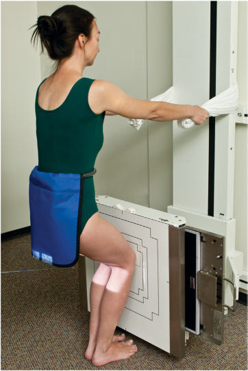
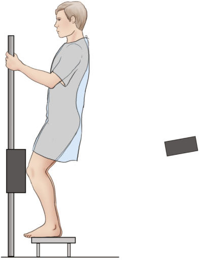

# Rx genunchi — incidență PA axială bilaterală în încărcare (ortostatism), incidență bilaterală a genunchilor (metoda Rosenberg)

  📷 Radiografie Convențională (Rx)
  <strong>Actualizat:</strong> 2026-09-15
  <strong>Autor:</strong> Departamentul de Radiologie / Referință Bontrager

---

-   __1. Rezumat Clinic & Indicații__

    ---

    === "Indicații Clinice"

        - Spațiile articulare femorotibiale ale genunchilor sunt evidențiate pentru posibila degenerare a cartilajului sau alte patologii ale articulației genunchiului.
        - Spațiile articulare ale genunchiului și fosa intercondiliană evidențiate
        - Ambii genunchi sunt incluși în aceeași expunere pentru comparație.

    === "Ghid Național IRIS"

        !!! info "Referință Primară: Ghidul Național IRIS (Ordinul MS 1342/2012)"
            - **Capitol Ghid IRIS:** *Aparat locomotor & Membru inferior*
            - **Grad de Recomandare:** **Grad A**
            - **Nivel de Iradiere Estimată:** `Clasa 1 (Minimă < 0.05 mSv)`

            [:octicons-search-16: Deschide Ghidul IRIS](../../iris.md){ .md-button .md-button--primary } [:material-open-in-new: Aplicația Oficială PWA](https://radiologie-pediatrica.ro/iris/){ .md-button target="_blank" rel="noopener" }

-   __2. Poziționare & Centrare Fascicul__

    ---

    - **Poziție Pacient:** Conform incidenței standard descrise
    - **Punct de Centrare Fascicul:** centrată direct la mijlocul articulației genunchiului, la nivelul de ½ țol (1.25 cm) sub vârful rotulei, atunci când se efectuează un studiu unilateral.
    - **Distanță Focar-Film (DFF / SID):** 100 cm
    - **Comandă Respiratorie:** Apnee pe durata expunerii (sau conform cooperării pacientului)

-   __3. Parametri Tehnici Expunere__

    ---

    | Parametru Tehnic | Valoare Configurare Generator / Tub |
    |:-----------------|:-------------------------------------|
    | **Tensiune Tub (kV)** | 70-80 kV |
    | **Sarcină / Produs Curent-Timp (mAs)** | DE CONFIGURAT PE APARAT |
    | **Distanță Focar-Film (DFF / SID)** | 100 cm |
    | **Grilă Antidifuzoare (Bucky)** | Cu grilă antidifuzoare Bucky |
    | **Dimensiune Focar** | Focar Mic (0.6 mm) |
    | **Camere de Ionizare AEC** | Camerele laterale (sau camera centrală, în funcție de regiune) |
    | **Colimare Fascicul** | Se colimează regiunea articulațiilor genunchilor bilateral, incluzând o parte din femurii distali și tibia proximală pentru evaluarea alinierii. Incidență unilaterală alternativă: dacă este solicitată, această examinare poate fi efectuată unilateral, cu pacientul orientat spre stativul vertical Bucky sau suportul receptorului de imagine, cu genunchiul flectat la 45° și picioarele orientate drept înainte. Pacientul trebuie să își pună întreaga greutate pe extremitatea afectată. Aceasta impune ca pacientul să își mențină echilibrul, cu presiune minimă pe partea contralaterală. Se direcționează raza centrală la 10° caudal, paralelă cu suprafețele articulare, la nivelul articulației genunchiului, pentru această incidență PA unilaterală. Genunchi SPECIAL AP bilateral în încărcare PA axială bilaterală în încărcare Fig. 6.117 Metoda Rosenberg. Poziția în ortostatism, cu flexie PA la 45° în încărcare, pentru genunchii bilateral. 10° 40” 45° fascicul de raze X receptorul de imagine Fig. 6.118 Metoda Rosenberg — incidență PA axială bilaterală cu 10° caudal. |
    | **Filtrare Tub** | Totală ≥ 2.5 mm Al echivalent |

-   __4. Criterii de Calitate & Reușită Imagine__

    ---

    - Vizualizarea completă a regiunii anatomice explorate
    - Absența artefactelor de mișcare sau a suprapunerilor neadecvate
    - Contrast și penetrare optime pentru decelarea structurilor osoase și a părților moi

-   __5. Protecție Radiologică (ALARA)__

    ---

    - Ecranare gonadică și a organelor radiosensibile conform procedurilor locale de radioprotecție ALARA.
    - Colimare strictă la aria de interes pentru limitarea radiației difuze.
    - Verificarea posibilității unei sarcini la pacientele de vârstă fertilă înainte de expunere.

### 🖼️ Imagini

<figure class="protocol-image-card" markdown>

<figcaption><strong>Fig. 6.117 Metoda Rosenberg. Poziție în ortostatism, cu flexie PA la 45°</strong> — Poziționarea pacientului conform Ghidului Bontrager (Fig. 6.117 Metoda Rosenberg. Poziție în ortostatism, cu flexie PA la 45°)</figcaption>

</figure>

<figure class="protocol-image-card" markdown>

<figcaption><strong>Fig. 6.118 Metoda Rosenberg — incidență PA axială bilaterală cu 10°</strong> — Aspect radiografic de referință conform Ghidului Bontrager (Fig. 6.118 Metoda Rosenberg — incidență PA axială bilaterală cu 10° caudal)</figcaption>

</figure>

=== "Ghid Rapid de Execuție"

    1. **Identificarea și verificarea pacientului:** verificare identitate, zonă de examinat, consimțământ conform procedurii și evaluarea posibilității unei sarcini, când este relevantă.
    2. **Pregătire:** îndepărtarea oricăror obiecte radiopace (bijuterii, agrafe, fermoare, proteze, pansamente dense).
    3. **Poziționare precisă:** alinierea receptorului de imagine și a tubului la distanța prescrisă (100 cm).
    4. **Colimare strictă:** adaptarea fasciculului strict la regiunea de diagnostic pentru scăderea iradierii și reducerea radiației difuze.
    5. **Radioprotecție:** verificarea [politicii RX](../radioprotectie.md), cu măsuri distincte pentru pacient, personal și însoțitor.

## Surse de documentare

- [Bontrager's Textbook of Radiographic Positioning (Ed. 9/10), Pagina 266](https://www.elsevier.com/books/textbook-of-radiographic-positioning-and-related-anatomy/lampignano/978-0-323-65367-1)
