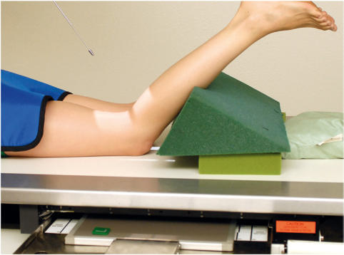
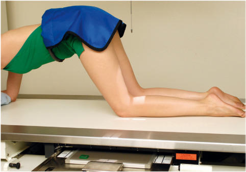
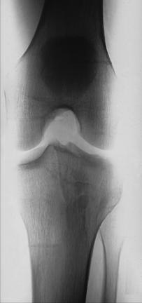
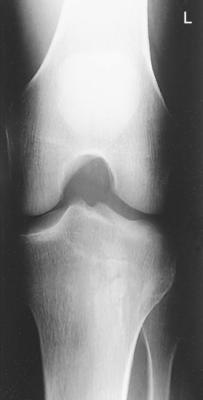

# Rx Genunchi PA AXIAL Incidență (“TUNNEL Incidență”) (INTERCONDYLAR FOSSA - Metoda Camp-Coventry AND Metoda Holmblad (PLUS VARIATIONS))

  📷 Radiografie Convențională (Rx)
  <strong>Actualizat:</strong> 2026-09-15
  <strong>Autor:</strong> Departamentul de Radiologie / Referință Bontrager

---

-   __1. Rezumat Clinic & Indicații__

    ---

    === "Indicații Clinice"

        - Intercondylar fossa, femoral condyles, tibial plateaus, și intercondylar eminence evidențiat
        - Evidence de bony sau cartilaginous pathology, osteochondral defects, sau narrowing de spații articulare

    === "Ghid Național IRIS"

        !!! info "Referință Primară: Ghidul Național IRIS (Ordinul MS 1342/2012)"
            - **Capitol Ghid IRIS:** *Ghidul Național IRIS*
            - **Grad de Recomandare:** **De verificat pe indicație; fără grad atribuit automat**
            - **Nivel de Iradiere Estimată:** `De verificat pentru examinarea și populația selectate`

            [:octicons-search-16: Deschide Ghidul IRIS](../../iris.md){ .md-button .md-button--primary } [:material-open-in-new: Aplicația Oficială PWA](https://radiologie-pediatrica.ro/iris/){ .md-button target="_blank" rel="noopener" }
-   __2. Poziționare & Centrare Fascicul__

    ---

    - **Poziție Pacient:** Pacient: 1. Place pacient Decubit ventral; provide pillow pentru pacient’s cap (Metoda Camp-Coventry). 2. Have pacient kneel pe xray table (Metoda Holmblad). 3. Have pacient partially în ortostatism, straddling xray table cu one membru inferior (Holmblad variation, requires elevation de examination table). 4. Have pacient partially în ortostatism cu affected membru inferior pe stool sau chair (Holmblad variation). Genunchi—Intercondylar Fossa incidențe ROUTINE PA axial Fig. 6.121 Metoda Camp-Coventry—Decubit ventral poziție (40° la 50° flexion). (poziție credited la Rosenberg TD, Paulos LE, Parker RD, et al: 45° posteroanterior flexion weightbearing radiografie de Genunchi. J Bone articulație Surg Am 70:1479, 1988.) Fig. 6.122 Metoda Holmblad—kneeling poziție (60° la 70° flexion).
    - **Punct de Centrare Fascicul:** perpendicular pe centrul ariei de interes
    - **Distanță Focar-Film (DFF / SID):** 100 cm
    - **Comandă Respiratorie:** Apnee pe durata expunerii (sau conform cooperării pacientului)

-   __3. Parametri Tehnici Expunere__

    ---

    | Parametru Tehnic | Valoare Configurare Generator / Tub |
    |:-----------------|:-------------------------------------|
    | **Tensiune Tub (kV)** | 70-80 kV |
    | **Sarcină / Produs Curent-Timp (mAs)** | DE CONFIGURAT PE APARAT |
    | **Distanță Focar-Film (DFF / SID)** | 100 cm |
    | **Grilă Antidifuzoare (Bucky)** | Cu grilă antidifuzoare Bucky |
    | **Dimensiune Focar** | Focar Mic (0.6 mm) |
    | **Camere de Ionizare AEC** | Camerele laterale (sau camera centrală funcție de regiune) |
    | **Colimare Fascicul** | Colimare strictă pe regiunea anatomică de interes diagnostic anatomic |
    | **Filtrare Tub** | Totală ≥ 2.5 mm Al echivalent |

-   __4. Criterii de Calitate & Reușită Imagine__

    ---

    - Intercondylar fossa, articular facets (tibial plateaus), și Genunchi spații articulare sunt clar evidențiat(e) (Figs. 6.123 și 6.124). poziție:
    - Intercondylar fossa trebuie să appear în profile, open fără superimposition prin Rotulă (Patelă).
    - Absența rotației anatomice: clavicule echidistante față de linia apofizelor spinoase este evidenced prin simetric appearance de distal posterior femoral condyles și superimposition de approximately half de cap peronier (fibular) prin tibia.
    - Articular facets și intercondylar eminence de tibia trebuie să fie well visualized fără superimposition. expunere:
    - optim receptorul de imagine expunere și contrast la visualize părți moi în Genunchi spații articulare și outline de Rotulă (Patelă) through Femur.
    - Trabecular markings de femoral condyles și proximal tibia trebuie să appear clear și net, cu fără mișcare. Fig. 6.123 Incidență PA Axială. Rotulă (Patelă) L Intercondylar fossa medial femoral condyle lateral femoral condyle Articular facet cap peronier (fibular) Tibia Intercondylar eminence Articular facet Fig. 6.124 Incidență PA Axială.

-   __5. Protecție Radiologică (ALARA)__

    ---

    - Ecranare gonadică și a organelor radiosensibile conform procedurilor locale de radioprotecție ALARA.
    - Colimare strictă la aria de interes pentru limitarea radiației difuze.
    - Verificarea posibilității unei sarcini la pacientele de vârstă fertilă înainte de expunere.

!!! note "Observații Clinice & Tehnice"
    Several methods sunt described pentru evidențiind these structures. Decubit ventral poziție (Fig. 6.121) este easier poziție pentru pacientul la assume. Holmblad kneeling method provides another option cu slightly different incidență de these structures (Fig. 6.122). disadvantage este that this poziție este sometimes uncomfortable pentru pacientul. ca result de advent de xray tables that poate fie raised și lowered, several Holmblad variations poate fie used la alleviate pain de kneeling pe ambele genunchi. These methods do nu require complete kneeling poziție, but they do require cooperative Pacient Mobil / Cooperant (Ortostatism).

### 🖼️ Imagini

<figure class="protocol-image-card" markdown>

<figcaption><strong>Fig. 6.121 Metoda Camp-Coventry—Decubit ventral poziție (40° la 50°</strong> — Poziționare pacient conform Ghidului Bontrager (Fig. 6.121 Camp Coventry method—decubit ventral (40° la 50°)</figcaption>

</figure>

<figure class="protocol-image-card" markdown>

<figcaption><strong>Fig. 6.122 Metoda Holmblad—kneeling poziție (60° la 70° flexion).</strong> — Aspect radiografic de referință conform Ghidului Bontrager (Fig. 6.122 Holmblad method—kneeling poziție (60° la 70° flexion).)</figcaption>

</figure>

<figure class="protocol-image-card" markdown>

<figcaption><strong>Fig. 6.123 Incidență PA Axială.</strong> — Aspect radiografic de referință conform Ghidului Bontrager (Fig. 6.123 PA axial incidență.)</figcaption>

</figure>

<figure class="protocol-image-card" markdown>

<figcaption><strong>Fig. 6.124 Incidență PA Axială.</strong> — Aspect radiografic de referință conform Ghidului Bontrager (Fig. 6.124 PA axial incidență.)</figcaption>

</figure>

=== "Ghid Rapid de Execuție"

    1. **Identificarea și verificarea pacientului:** verificare identitate, zonă de examinat, consimțământ conform procedurii și evaluarea posibilității unei sarcini, când este relevantă.
    2. **Pregătire:** îndepărtarea oricăror obiecte radiopace (bijuterii, agrafe, fermoare, proteze, pansamente dense).
    3. **Poziționare precisă:** alinierea receptorului de imagine și a tubului la distanța prescrisă (100 cm).
    4. **Colimare strictă:** adaptarea fasciculului strict la regiunea de diagnostic pentru scăderea iradierii și reducerea radiației difuze.
    5. **Radioprotecție:** verificarea [politicii RX](../radioprotectie.md), cu măsuri distincte pentru pacient, personal și însoțitor.

## Surse de documentare

- [Bontrager's Textbook of Radiographic Positioning (Ed. 9/10), Pagina 268](https://www.elsevier.com/books/textbook-of-radiographic-positioning-and-related-anatomy/lampignano/978-0-323-65367-1)
