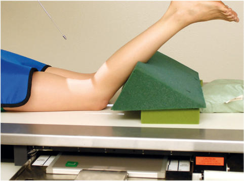
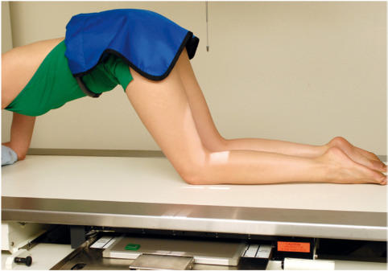
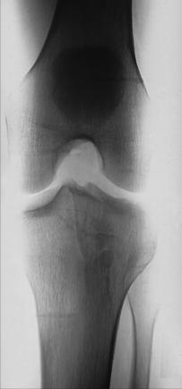
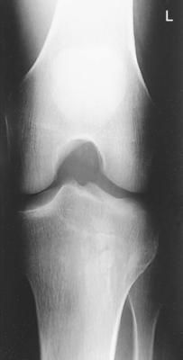

# Rx genunchi — incidență PA axială („incidența tunelului”) (fosa intercondiliană — metoda Camp-Coventry și metoda Holmblad, plus variante)

  📷 Radiografie Convențională (Rx)
  <strong>Actualizat:</strong> 2026-09-15
  <strong>Autor:</strong> Departamentul de Radiologie / Referință Bontrager

---

-   __1. Rezumat Clinic & Indicații__

    ---

    === "Indicații Clinice"

        - Fosa intercondiliană, condilii femurali, platourile tibiale și eminența intercondiliană evidențiate
        - Dovezi de patologie osoasă sau cartilaginoasă, defecte osteocondrale sau îngustarea spațiilor articulare

    === "Ghid Național IRIS"

        !!! info "Referință Primară: Ghidul Național IRIS (Ordinul MS 1342/2012)"
            - **Capitol Ghid IRIS:** *Aparat locomotor & Membru inferior*
            - **Grad de Recomandare:** **Grad A**
            - **Nivel de Iradiere Estimată:** `Clasa 1 (Minimă < 0.05 mSv)`

            [:octicons-search-16: Deschide Ghidul IRIS](../../iris.md){ .md-button .md-button--primary } [:material-open-in-new: Aplicația Oficială PWA](https://radiologie-pediatrica.ro/iris/){ .md-button target="_blank" rel="noopener" }

-   __2. Poziționare & Centrare Fascicul__

    ---

    - **Poziție Pacient:** Pacient: 1. Așezați pacientul în decubit ventral; asigurați o pernă pentru capul pacientului (metoda Camp-Coventry). 2. Pacientul îngenunchează pe masa radiologică (metoda Holmblad). 3. Pacientul se află parțial în ortostatism, încălecând masa radiologică cu un membru inferior (variantă Holmblad, necesită ridicarea mesei de examinare). 4. Pacientul se află parțial în ortostatism, cu membrul inferior afectat pe un taburet sau scaun (variantă Holmblad). Genunchi — incidențe ale fosei intercondiliene PA axială de rutină Fig. 6.121 Metoda Camp-Coventry — poziție în decubit ventral (flexie de la 40° la 50°). (Poziție atribuită lui Rosenberg TD, Paulos LE, Parker RD și colab.: Radiografie postero-anterioară de genunchi, cu flexie la 45° și încărcare. J Bone Joint Surg Am 70:1479, 1988.) Fig. 6.122 Metoda Holmblad — poziție în genunchi (flexie de la 60° la 70°).
    - **Punct de Centrare Fascicul:** perpendiculară pe centrul ariei de interes
    - **Distanță Focar-Film (DFF / SID):** 100 cm
    - **Comandă Respiratorie:** Apnee pe durata expunerii (sau conform cooperării pacientului)

-   __3. Parametri Tehnici Expunere__

    ---

    | Parametru Tehnic | Valoare Configurare Generator / Tub |
    |:-----------------|:-------------------------------------|
    | **Tensiune Tub (kV)** | 70-80 kV |
    | **Sarcină / Produs Curent-Timp (mAs)** | DE CONFIGURAT PE APARAT |
    | **Distanță Focar-Film (DFF / SID)** | 100 cm |
    | **Grilă Antidifuzoare (Bucky)** | Cu grilă antidifuzoare Bucky |
    | **Dimensiune Focar** | Focar Mic (0.6 mm) |
    | **Camere de Ionizare AEC** | Camerele laterale (sau camera centrală, în funcție de regiune) |
    | **Colimare Fascicul** | Colimare strictă pe regiunea anatomică de interes diagnostic |
    | **Filtrare Tub** | Totală ≥ 2.5 mm Al echivalent |

-   __4. Criterii de Calitate & Reușită Imagine__

    ---

    - Fosa intercondiliană, suprafețele articulare (platourile tibiale) și spațiile articulare ale genunchiului sunt evidențiate clar (Fig. 6.123 și 6.124). Poziție:
    - Fosa intercondiliană trebuie să apară de profil, deschisă, fără suprapunerea rotulei (patelă).
    - Absența rotației anatomice: claviculele echidistante față de linia apofizelor spinoase este evidențiată prin aspectul simetric al condililor femurali posteriori distali și prin suprapunerea a aproximativ jumătate din capul peronier (fibular) peste tibie.
    - Suprafețele articulare și eminența intercondiliană a tibiei trebuie să fie bine vizualizate, fără suprapunere. Expunere:
    - Expunerea și contrastul optime ale receptorului de imagine pentru vizualizarea țesuturilor moi din spațiile articulare ale genunchiului și a conturului rotulei prin femur.
    - Desenele trabeculare ale condililor femurali și ale tibiei proximale trebuie să apară clare și nete, fără mișcare. Fig. 6.123 Incidență PA axială. Rotulă L Fosa intercondiliană condil femural medial condil femural lateral suprafață articulară cap peronier (fibular) Tibie eminență intercondiliană suprafață articulară Fig. 6.124 Incidență PA axială.

-   __5. Protecție Radiologică (ALARA)__

    ---

    - Ecranare gonadică și a organelor radiosensibile conform procedurilor locale de radioprotecție ALARA.
    - Colimare strictă la aria de interes pentru limitarea radiației difuze.
    - Verificarea posibilității unei sarcini la pacientele de vârstă fertilă înainte de expunere.

!!! note "Observații Clinice & Tehnice"
    Sunt descrise mai multe metode pentru evidențierea acestor structuri. Poziția în decubit ventral (Fig. 6.121) este mai ușor de adoptat de către pacient. Metoda Holmblad în genunchi oferă o altă opțiune, cu o incidență ușor diferită a acestor structuri (Fig. 6.122). Dezavantajul este că această poziție este uneori incomodă pentru pacient. Ca urmare a apariției meselor radiografice care pot fi ridicate și coborâte, pot fi utilizate mai multe variante Holmblad pentru a ameliora durerea provocată de îngenuncherea pe ambii genunchi. Aceste metode nu necesită poziția completă în genunchi, dar necesită un pacient mobil/cooperant (în ortostatism).

### 🖼️ Imagini

<figure class="protocol-image-card" markdown>

<figcaption><strong>Fig. 6.121 Metoda Camp-Coventry — poziție în decubit ventral (de la 40° la 50°</strong> — Poziționarea pacientului conform Ghidului Bontrager (Fig. 6.121 Metoda Camp-Coventry — decubit ventral (de la 40° la 50°)</figcaption>

</figure>

<figure class="protocol-image-card" markdown>

<figcaption><strong>Fig. 6.122 Metoda Holmblad — poziție în genunchi (flexie de la 60° la 70°).</strong> — Aspect radiografic de referință conform Ghidului Bontrager (Fig. 6.122 Metoda Holmblad — poziție în genunchi (flexie de la 60° la 70°).)</figcaption>

</figure>

<figure class="protocol-image-card" markdown>

<figcaption><strong>Fig. 6.123 Incidență PA axială.</strong> — Aspect radiografic de referință conform Ghidului Bontrager (Fig. 6.123 Incidență PA axială.)</figcaption>

</figure>

<figure class="protocol-image-card" markdown>

<figcaption><strong>Fig. 6.124 Incidență PA axială.</strong> — Aspect radiografic de referință conform Ghidului Bontrager (Fig. 6.124 Incidență PA axială.)</figcaption>

</figure>

=== "Ghid Rapid de Execuție"

    1. **Identificarea și verificarea pacientului:** verificare identitate, zonă de examinat, consimțământ conform procedurii și evaluarea posibilității unei sarcini, când este relevantă.
    2. **Pregătire:** îndepărtarea oricăror obiecte radiopace (bijuterii, agrafe, fermoare, proteze, pansamente dense).
    3. **Poziționare precisă:** alinierea receptorului de imagine și a tubului la distanța prescrisă (100 cm).
    4. **Colimare strictă:** adaptarea fasciculului strict la regiunea de diagnostic pentru scăderea iradierii și reducerea radiației difuze.
    5. **Radioprotecție:** verificarea [politicii RX](../radioprotectie.md), cu măsuri distincte pentru pacient, personal și însoțitor.

## Surse de documentare

- [Bontrager's Textbook of Radiographic Positioning (Ed. 9/10), Pagina 268](https://www.elsevier.com/books/textbook-of-radiographic-positioning-and-related-anatomy/lampignano/978-0-323-65367-1)
