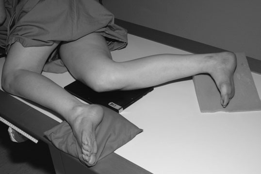
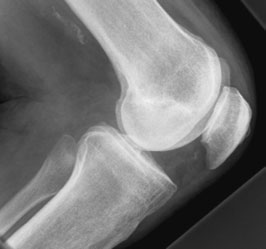
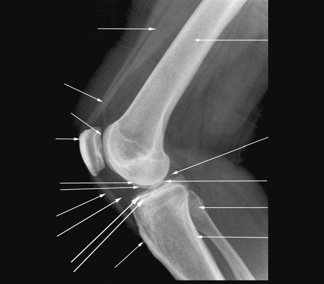
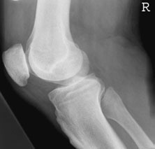
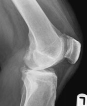

# Rx Genunchi Profil (Lateral) - basic

  📷 Radiografie Convențională (Rx)
  <strong>Actualizat:</strong> 2026-09-16
  <strong>Autor:</strong> Departamentul de Radiologie / Referință Clark (Ed. 12)

---

-   __1. Rezumat Clinic & Indicații__

    ---

    === "Indicații Clinice"

        - Evaluare radiografică regiunii Genunchi (Profil (lateral) - basic).
        - Suspiciune de leziuni traumatice (fracturi, luxații sau diastazis articular).
        - Bilanț osteoarticular / visceral conform recomandării medicale de trimitere.

    === "Ghid Național IRIS"

        !!! info "Referință Primară: Ghidul Național IRIS (Ordinul MS 1342/2012)"
            - **Capitol Ghid IRIS:** *Ghidul Național IRIS*
            - **Grad de Recomandare:** **De verificat pe indicație; fără grad atribuit automat**
            - **Nivel de Iradiere Estimată:** `De verificat pentru examinarea și populația selectate`

            [:octicons-search-16: Deschide Ghidul IRIS](../../iris.md){ .md-button .md-button--primary } [:material-open-in-new: Aplicația Oficială PWA](https://radiologie-pediatrica.ro/iris/){ .md-button target="_blank" rel="noopener" }
-   __2. Poziționare & Centrare Fascicul__

    ---

    - **Poziție Pacient:** • pacientul este culcat pe side la fie examined, cu Genunchi flectat la 45 sau 90 grade (see below).
• other limb este brought forward în front de one being examined și sprijinit pe săculeți cu nisip.
• săculeți cu nisip este plasat under Gleznă (Articulație Talocrurală) de partea afectată la bring axa longitudinală de tibia paralel cu casetă.
• poziție de limb este now ajustat la ensure that femoral condyles sunt superimposed vertically.
• centre de caseta este plasat level cu medial tibial condyle.
    - **Punct de Centrare Fascicul:** • Centre la middle de superior margine de medial tibial condyle, cu raza centrală centrală la 90 grade la axa longitudinală de tibia.
    - **Distanță Focar-Film (DFF / SID):** 100 cm
    - **Comandă Respiratorie:** Apnee pe durata expunerii (apnee în inspir pentru torace; expir pentru Abdomen/bazin).

-   __3. Parametri Tehnici Expunere__

    ---

    | Parametru Tehnic | Valoare Configurare Generator / Tub |
    |:-----------------|:-------------------------------------|
    | **Tensiune Tub (kV)** | DE CONFIGURAT PE APARAT |
    | **Sarcină / Produs Curent-Timp (mAs)** | Conform AEC / grosime anatomică |
    | **Distanță Focar-Film (DFF / SID)** | 100 cm |
    | **Grilă Antidifuzoare (Bucky)** | Conform grosimii anatomice (> 10-12 cm cu grilă) |
    | **Dimensiune Focar** | Focar Mic (0.6 mm) |
    | **Camere de Ionizare AEC** | DE CONFIGURAT PE APARAT |
    | **Colimare Fascicul** | Colimare strictă la aria anatomică de interes diagnostic |
    | **Filtrare Tub** | Totală ≥ 2.5 mm Al echivalent (conform Clark: 3.0 mm Al eq.) |

-   __4. Criterii de Calitate & Reușită Imagine__

    ---

    - Rotulă (Patelă) trebuie să fie projected clear de Femur.
    - femoral condyles trebuie să fie superimposed.
    - proximal tibio-fibular articulație este nu clearly vizibil.

-   __5. Protecție Radiologică (ALARA)__

    ---

    - Ecranare gonadică cu șorț plumbat dacă gonadele sunt în apropierea fasciculului util (regula ALARA).
    - Colimare precisă la dimensiunea anatomică strict necesară pentru reducerea dozei și a radiației difuze.
    - Verificarea posibilității unei sarcini la pacientele de vârstă fertilă înainte de expunere.

!!! note "Observații Clinice & Tehnice"
    • If over-rotit, medial femoral condyle este projected în front de Profil (lateral) condyle și proximal tibio-fibular articulație will fie well evidențiat.
• If under-rotit, medial femoral condyle este projected behind Profil (lateral) condyle și capul de fibula este superimposed pe tibia.
• If raza centrală este nu la 90 grade la axa longitudinală de tibia, femoral condyles will nu fie superimposed.
• Flexion de Genunchi la 90 grade este most easily reproducible angle și allows assessment de orice grade de Rotulă (Patelă) alta sau Rotulă (Patelă) baja (Rotulă (Patelă) riding too high sau too low). cu Genunchi flectat la 90 grade, Rotulă (Patelă) în normal poziție will lie între two paralel lines drawn along anterior și posterior surfaces de Femur.
• în pacienți who sunt unable la flex la 90 grade, examination trebuie să fie performed la 45-grade flexion. This poate permit clearer incidență de patello-femoral articulation.
Profil (lateral) radiografie de Genunchi cu 90 grade de flexion Effect de over rotație Effect de under rotație Quadriceps muscle Quadriceps tendon Rotulă (Patelă) Patello-femoral articulație Femoral condyles Profil (lateral) medial Patellar ligament Hoffa‘s fat pad platou tibial Tibial tubercle Femur Genunchi Tibial spines cap de fibula Tibia Profil (lateral) medial Profil (lateral) radiografie de Genunchi cu 45 grade de flexion

### 🖼️ Imagini

<figure class="protocol-image-card" markdown>

<figcaption><strong>Genunchi flectat la 90 grade, Rotulă (Patelă) în normal poziție</strong> — Poziționare pacient și centrare fascicul conform Clark (Ed. 12)</figcaption>

</figure>

<figure class="protocol-image-card" markdown>

<figcaption><strong>Profil (lateral) radiografie de Genunchi cu</strong> — Aspect radiografic / ghid de poziționare conform tratatului Clark (Ed. 12)</figcaption>

</figure>

<figure class="protocol-image-card" markdown>

<figcaption><strong>Profil (lateral) radiografie de Genunchi cu 45 grade de flexion</strong> — Aspect radiografic / ghid de poziționare conform tratatului Clark (Ed. 12)</figcaption>

</figure>

<figure class="protocol-image-card" markdown>

<figcaption><strong>Figura 4: Aspect radiografic / Poziționare (Clark Ed. 12)</strong> — Aspect radiografic / ghid de poziționare conform tratatului Clark (Ed. 12)</figcaption>

</figure>

<figure class="protocol-image-card" markdown>

<figcaption><strong>Figura 5: Aspect radiografic / Poziționare (Clark Ed. 12)</strong> — Aspect radiografic / ghid de poziționare conform tratatului Clark (Ed. 12)</figcaption>

</figure>

=== "Ghid Rapid de Execuție"

    1. **Identificarea și verificarea pacientului:** verificare identitate, zonă de examinat, consimțământ conform procedurii și evaluarea posibilității unei sarcini, când este relevantă.
    2. **Pregătire:** îndepărtarea oricăror obiecte radiopace (bijuterii, agrafe, fermoare, proteze, pansamente dense).
    3. **Poziționare precisă:** alinierea receptorului de imagine și a tubului la distanța prescrisă (100 cm).
    4. **Colimare strictă:** adaptarea fasciculului strict la regiunea de diagnostic pentru scăderea iradierii și reducerea radiației difuze.
    5. **Radioprotecție:** verificarea [politicii RX](../radioprotectie.md), cu măsuri distincte pentru pacient, personal și însoțitor.

## Surse de documentare

- [Clark's Positioning in Radiography (Ed. 12), Pagina 142](../../assets/protocols/sources/Clark___Positioning_in_Radiography__12th_edition.pdf#page=142)
