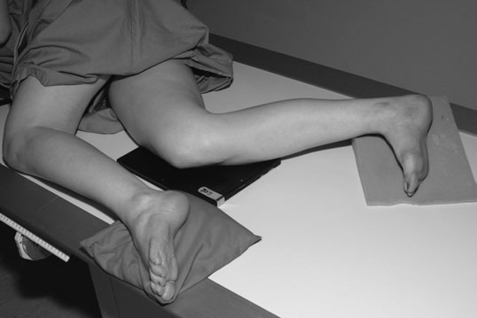
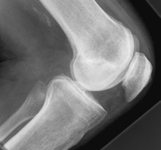
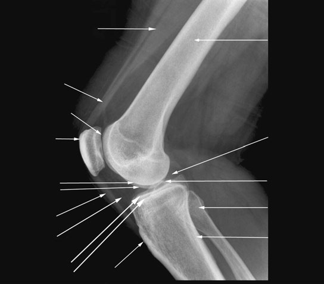
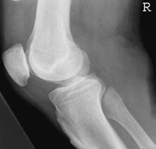
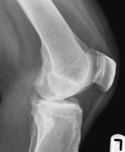

# Rx genunchi profil - de bază

  📷 Radiografie Convențională (Rx)
  <strong>Actualizat:</strong> 2026-09-16
  <strong>Autor:</strong> Departamentul de Radiologie / Referință Clark (Ed. 12)

---

-   __1. Rezumat Clinic & Indicații__

    ---

    === "Indicații Clinice"

        - Evaluarea radiografică a regiunii genunchiului (incidență de profil - de bază).
        - Suspiciune de leziuni traumatice (fracturi, luxații sau diastazis articular).
        - Bilanț osteoarticular / visceral conform recomandării medicale de trimitere.

    === "Ghid Național IRIS"

        !!! info "Referință Primară: Ghidul Național IRIS (Ordinul MS 1342/2012)"
            - **Capitol Ghid IRIS:** *Aparat locomotor & Membru inferior*
            - **Grad de Recomandare:** **Grad A**
            - **Nivel de Iradiere Estimată:** `Clasa 1 (Minimă < 0.05 mSv)`

            [:octicons-search-16: Deschide Ghidul IRIS](../../iris.md){ .md-button .md-button--primary } [:material-open-in-new: Aplicația Oficială PWA](https://radiologie-pediatrica.ro/iris/){ .md-button target="_blank" rel="noopener" }

-   __2. Poziționare & Centrare Fascicul__

    ---

    - **Poziție Pacient:**
        - Pacientul este culcat pe partea examinată, cu genunchiul flectat la 45 sau 90 grade (vezi mai jos).
        - Celălalt membru este adus anterior, în fața celui examinat, și susținut pe saci cu nisip.
        - Sacul cu nisip este plasat sub gleznă, pe partea afectată, pentru a aduce axa longitudinală a tibiei paralelă cu caseta.
        - Poziția membrului este apoi ajustată pentru a asigura suprapunerea verticală a condililor femurali.
        - Centrul casetei este plasat la nivelul condilului tibial medial.
    - **Punct de Centrare Fascicul:** • Centrați pe mijlocul marginii superioare a condilului tibial medial, cu raza centrală la 90 grade față de axa longitudinală a tibiei.
    - **Distanță Focar-Film (DFF / SID):** 100 cm
    - **Comandă Respiratorie:** Apnee pe durata expunerii (apnee în inspir pentru torace; expir pentru Abdomen/bazin).

-   __3. Parametri Tehnici Expunere__

    ---

    | Parametru Tehnic | Valoare Configurare Generator / Tub |
    |:-----------------|:-------------------------------------|
    | **Tensiune Tub (kV)** | DE CONFIGURAT PE APARAT |
    | **Sarcină / Produs Curent-Timp (mAs)** | Conform AEC / grosimii anatomice |
    | **Distanță Focar-Film (DFF / SID)** | 100 cm |
    | **Grilă Antidifuzoare (Bucky)** | Conform grosimii anatomice (> 10-12 cm cu grilă) |
    | **Dimensiune Focar** | Focar Mic (0.6 mm) |
    | **Camere de Ionizare AEC** | DE CONFIGURAT PE APARAT |
    | **Colimare Fascicul** | Colimare strictă la aria anatomică de interes diagnostic |
    | **Filtrare Tub** | Totală ≥ 2.5 mm Al echivalent (conform Clark: 3.0 mm Al echivalent) |

-   __4. Criterii de Calitate & Reușită Imagine__

    ---

    - Rotula trebuie să fie proiectată clar departe de femur.
    - Condilii femurali trebuie să fie suprapuși.
    - Articulația tibiofibulară proximală nu este vizibilă clar.

-   __5. Protecție Radiologică (ALARA)__

    ---

    - Ecranare gonadică cu șorț plumbat dacă gonadele sunt în apropierea fasciculului util (regula ALARA).
    - Colimare precisă la dimensiunea anatomică strict necesară pentru reducerea dozei și a radiației difuze.
    - Verificarea posibilității unei sarcini la pacientele de vârstă fertilă înainte de expunere.

!!! note "Observații Clinice & Tehnice"
    - Dacă este rotit excesiv, condilul femural medial este proiectat anterior față de condilul de profil și articulația tibiofibulară proximală va fi bine evidențiată.
    - Dacă este rotit insuficient, condilul femural medial este proiectat posterior față de condilul de profil, iar capul fibulei este suprapus peste tibie.
    - Dacă raza centrală nu este la 90 grade față de axa longitudinală a tibiei, condilii femurali nu vor fi suprapuși.
    - Flexia genunchiului la 90 grade este unghiul cel mai ușor de reprodus și permite evaluarea oricărui grad de rotulă alta sau rotulă baja (rotulă situată prea sus sau prea jos). Cu genunchiul flectat la 90 grade, rotula aflată în poziție normală se va situa între două linii paralele trasate de-a lungul suprafețelor anterioară și posterioară ale femurului.
    - La pacienții incapabili să flecteze genunchiul la 90 grade, examinarea trebuie efectuată la flexie de 45 grade. Aceasta poate permite o incidență mai clară a articulației patelofemurale. Radiografie de profil a genunchiului cu flexie de 90 grade; efectul rotației excesive; efectul rotației insuficiente; mușchiul cvadriceps; tendonul cvadricepsului; rotulă; articulație patelofemurală; condili femurali; condil femural medial de profil; ligament patelar; corp adipos Hoffa; platou tibial; tubercul tibial; femur; genunchi; spine tibiale; capul fibulei; tibie; profil medial; radiografie de profil a genunchiului cu flexie de 45 grade

### 🖼️ Imagini

<figure class="protocol-image-card" markdown>

<figcaption><strong>Genunchi flectat la 90 grade, rotula în poziție normală</strong> — Poziționarea pacientului și centrarea fasciculului conform Clark (Ed. 12)</figcaption>

</figure>

<figure class="protocol-image-card" markdown>

<figcaption><strong>Radiografie de profil a genunchiului cu</strong> — Aspect radiografic / ghid de poziționare conform tratatului Clark (Ed. 12)</figcaption>

</figure>

<figure class="protocol-image-card" markdown>

<figcaption><strong>Radiografie de profil a genunchiului cu flexie de 45 grade</strong> — Aspect radiografic / ghid de poziționare conform tratatului Clark (Ed. 12)</figcaption>

</figure>

<figure class="protocol-image-card" markdown>

<figcaption><strong>Figura 4: Aspect radiografic / Poziționare (Clark Ed. 12)</strong> — Aspect radiografic / ghid de poziționare conform tratatului Clark (Ed. 12)</figcaption>

</figure>

<figure class="protocol-image-card" markdown>

<figcaption><strong>Figura 5: Aspect radiografic / Poziționare (Clark Ed. 12)</strong> — Aspect radiografic / ghid de poziționare conform tratatului Clark (Ed. 12)</figcaption>

</figure>

=== "Ghid Rapid de Execuție"

    1. **Identificarea și verificarea pacientului:** verificare identitate, zonă de examinat, consimțământ conform procedurii și evaluarea posibilității unei sarcini, când este relevantă.
    2. **Pregătire:** îndepărtarea oricăror obiecte radiopace (bijuterii, agrafe, fermoare, proteze, pansamente dense).
    3. **Poziționare precisă:** alinierea receptorului de imagine și a tubului la distanța prescrisă (100 cm).
    4. **Colimare strictă:** adaptarea fasciculului strict la regiunea de diagnostic pentru scăderea iradierii și reducerea radiației difuze.
    5. **Radioprotecție:** verificarea [politicii RX](../radioprotectie.md), cu măsuri distincte pentru pacient, personal și însoțitor.

## Surse de documentare

- [Clark's Positioning in Radiography (Ed. 12), Pagina 142](https://books.google.com/books/about/Clark_s_Positioning_in_Radiography.html?id=Xxu6MwEACAAJ)
