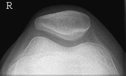
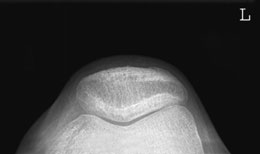
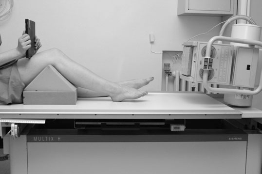
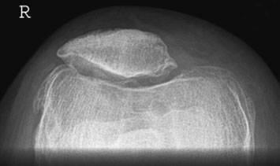

# Rx Genunchi Skyline Incidență

  📷 Radiografie Convențională (Rx)
  <strong>Actualizat:</strong> 2026-09-16
  <strong>Autor:</strong> Departamentul de Radiologie / Referință Clark (Ed. 12)

---

-   __1. Rezumat Clinic & Indicații__

    ---

    === "Indicații Clinice"

        - 131 4 Genunchi Skyline incidențe skyline incidență poate fie used la:
        - assess retro-patellar spații articulare pentru degenerative disease;
        - determine grade de orice Profil (lateral) subluxation de Rotulă (Patelă) cu ligament laxity;
        - diagnose chondromalacia patellae;
        - confirm presence de vertical Rotulă (Patelă) suspiciune de fractură în acute trauma. optimum retro-patellar articulație spacing occurs when Genunchi este flectat approximately 30–45 grade. Further flexion pulls Rotulă (Patelă) into intercondylar notch, reducing articulație spacing; ca flexion increases, Rotulă (Patelă) tracks over Profil (lateral) femoral condyle. Rotulă (Patelă) moves distance de 2 cm de la full extension la full flexion. There sunt three methods de achieving skyline incidență:
        - conventional Infero-Superioară (Axială);
        - Supero-Inferioară – fascicul orientat downwards;
        - Infero-Superioară (Axială) – pacient Decubit ventral. Conventional Infero-Superioară (Axială) incidență procedure este undertaken using an 18  24-cm casetă.

    === "Ghid Național IRIS"

        !!! info "Referință Primară: Ghidul Național IRIS (Ordinul MS 1342/2012)"
            - **Capitol Ghid IRIS:** *Ghidul Național IRIS*
            - **Grad de Recomandare:** **De verificat pe indicație; fără grad atribuit automat**
            - **Nivel de Iradiere Estimată:** `De verificat pentru examinarea și populația selectate`

            [:octicons-search-16: Deschide Ghidul IRIS](../../iris.md){ .md-button .md-button--primary } [:material-open-in-new: Aplicația Oficială PWA](https://radiologie-pediatrica.ro/iris/){ .md-button target="_blank" rel="noopener" }
-   __2. Poziționare & Centrare Fascicul__

    ---

    - **Poziție Pacient:** • pacientul stă așezat pe masa radiologică, cu Genunchi flectat 30–45 grade și sprijinit pe pad plasat below Genunchi.
• casetă este held prin pacientul pe / sprijinit de anterior distal Femur și sprijinit using non-opaque pad, which rests pe anterior aspect de thigh.
    - **Punct de Centrare Fascicul:** • tubul este lowered. Avoiding picioarele, raza centrală este orientat cranially la pass through apex de Rotulă (Patelă) paralel cu axa longitudinală.
• fascicul trebuie să fie closely collimated la Rotulă (Patelă) și femoral condyles la limit scattered radiation la trunk și cap.
    - **Distanță Focar-Film (DFF / SID):** 100 cm
    - **Comandă Respiratorie:** Apnee pe durata expunerii (apnee în inspir pentru torace; expir pentru Abdomen/bazin).

-   __3. Parametri Tehnici Expunere__

    ---

    | Parametru Tehnic | Valoare Configurare Generator / Tub |
    |:-----------------|:-------------------------------------|
    | **Tensiune Tub (kV)** | DE CONFIGURAT PE APARAT |
    | **Sarcină / Produs Curent-Timp (mAs)** | Conform AEC / grosime anatomică |
    | **Distanță Focar-Film (DFF / SID)** | 100 cm |
    | **Grilă Antidifuzoare (Bucky)** | Conform grosimii anatomice (> 10-12 cm cu grilă) |
    | **Dimensiune Focar** | Focar Mic (0.6 mm) |
    | **Camere de Ionizare AEC** | DE CONFIGURAT PE APARAT |
    | **Colimare Fascicul** | Colimare strictă adaptată pe receptor 18 x 24 cm |
    | **Filtrare Tub** | Totală ≥ 2.5 mm Al echivalent (conform Clark: 3.0 mm Al eq.) |

-   __4. Criterii de Calitate & Reușită Imagine__

    ---

    - Vizualizarea clară întregii arii anatomice (Genunchi).
    - Absența artefactelor de mișcare; trabeculație osoasă și contururi nete.
    - Densitate optică și contrast adecvate pentru diferențierea țesuturilor moi de structurile osoase.

-   __5. Protecție Radiologică (ALARA)__

    ---

    - Examination of the individual single Genunchi is recommended, rather than including Ambii Genunchi in one exposure when Ambii Genunchi are requested.
    - The total radiation field can be reduced, thus limiting the scattered radiation.
    - A lead-rubber apron is worn for protection, with additional lead-rubber protection placed over the gonads. Conventional Infero-Superioară (Axială) projection showing osteophytosis affecting the retro-patellar joint Thirty-degree flexion Sixty-degree flexion Infero-Superioară (Axială) (conventional) projection
    - Ecranare gonadică cu șorț plumbat dacă gonadele sunt în apropierea fasciculului util (regula ALARA).
    - Colimare precisă la dimensiunea anatomică strict necesară pentru reducerea dozei și a radiației difuze.
    - Verificarea posibilității unei sarcini la pacientele de vârstă fertilă înainte de expunere.

!!! note "Observații Clinice & Tehnice"
    Pregătirea pacientului prin îndepărtarea tuturor accesoriilor radio-opace.

### 🖼️ Imagini

<figure class="protocol-image-card" markdown>

<figcaption><strong>• assess retro-patellar spații articulare pentru degenerative disease;</strong> — Poziționare pacient și centrare fascicul conform Clark (Ed. 12)</figcaption>

</figure>

<figure class="protocol-image-card" markdown>

<figcaption><strong>• confirm presence de vertical Rotulă (Patelă) suspiciune de fractură în acute</strong> — Aspect radiografic / ghid de poziționare conform tratatului Clark (Ed. 12)</figcaption>

</figure>

<figure class="protocol-image-card" markdown>

<figcaption><strong>Conventional Infero-Superioară (Axială) incidență evidențiind osteophytosis</strong> — Aspect radiografic / ghid de poziționare conform tratatului Clark (Ed. 12)</figcaption>

</figure>

<figure class="protocol-image-card" markdown>

<figcaption><strong>Figura 4: Aspect radiografic / Poziționare (Clark Ed. 12)</strong> — Aspect radiografic / ghid de poziționare conform tratatului Clark (Ed. 12)</figcaption>

</figure>

=== "Ghid Rapid de Execuție"

    1. **Identificarea și verificarea pacientului:** verificare identitate, zonă de examinat, consimțământ conform procedurii și evaluarea posibilității unei sarcini, când este relevantă.
    2. **Pregătire:** îndepărtarea oricăror obiecte radiopace (bijuterii, agrafe, fermoare, proteze, pansamente dense).
    3. **Poziționare precisă:** alinierea receptorului de imagine și a tubului la distanța prescrisă (100 cm).
    4. **Colimare strictă:** adaptarea fasciculului strict la regiunea de diagnostic pentru scăderea iradierii și reducerea radiației difuze.
    5. **Radioprotecție:** verificarea [politicii RX](../radioprotectie.md), cu măsuri distincte pentru pacient, personal și însoțitor.

## Surse de documentare

- [Clark's Positioning in Radiography (Ed. 12), Pagina 146](../../assets/protocols/sources/Clark___Positioning_in_Radiography__12th_edition.pdf#page=146)
