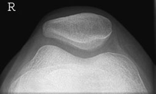
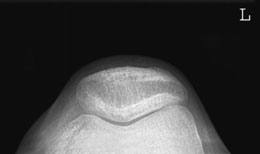
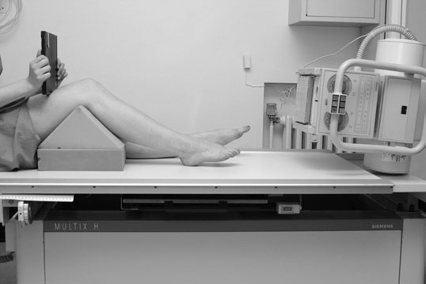
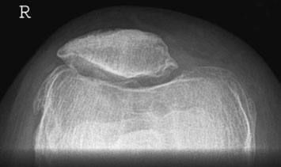

# Rx genunchi skyline

  📷 Radiografie Convențională (Rx)
  <strong>Actualizat:</strong> 2026-09-16
  <strong>Autor:</strong> Departamentul de Radiologie / Referință Clark (Ed. 12)

---

-   __1. Rezumat Clinic & Indicații__

    ---

    === "Indicații Clinice"

        - 131 4 Incidențe skyline ale genunchiului; incidența skyline poate fi utilizată pentru:
        - evaluarea spațiilor articulare retropatelare în cazul bolii degenerative;
        - determinarea gradului oricărei subluxații de profil a rotulei asociate cu laxitatea ligamentară;
        - diagnosticarea condromalaciei patelare;
        - confirmarea prezenței unei suspiciuni de fractură verticală a rotulei în traumatismele acute. Spațierea optimă a articulației retropatelare apare când genunchiul este flectat aproximativ la 30–45 grade. Flexia suplimentară trage rotula în incizura intercondiliană, reducând spațierea articulară; pe măsură ce flexia crește, rotula se deplasează peste condilul femural de profil. Rotula se deplasează pe o distanță de 2 cm de la extensia completă la flexia completă. Există trei metode de obținere a incidenței skyline:
        - incidență axială inferosuperioară convențională;
        - superoinferioară – fascicul orientat în jos;
        - incidență axială inferosuperioară – pacient în decubit ventral. Procedura convențională pentru incidența axială inferosuperioară se efectuează utilizând o casetă de 18 × 24 cm.

    === "Ghid Național IRIS"

        !!! info "Referință Primară: Ghidul Național IRIS (Ordinul MS 1342/2012)"
            - **Capitol Ghid IRIS:** *Aparat locomotor & Membru inferior*
            - **Grad de Recomandare:** **Grad A**
            - **Nivel de Iradiere Estimată:** `Clasa 1 (Minimă < 0.05 mSv)`

            [:octicons-search-16: Deschide Ghidul IRIS](../../iris.md){ .md-button .md-button--primary } [:material-open-in-new: Aplicația Oficială PWA](https://radiologie-pediatrica.ro/iris/){ .md-button target="_blank" rel="noopener" }

-   __2. Poziționare & Centrare Fascicul__

    ---

    - **Poziție Pacient:**
        - Pacientul stă așezat pe masa radiologică, cu genunchiul flectat la 30–45 grade și sprijinit pe un suport plasat sub genunchi.
        - Caseta este ținută de pacient pe sau sprijinită de femurul distal anterior și susținută utilizând un suport radiotransparent, care se sprijină pe aspectul anterior al coapsei.
    - **Punct de Centrare Fascicul:**
        - Tubul este coborât. Evitând picioarele, raza centrală este orientată cranial pentru a trece prin apexul rotulei, paralel cu axa longitudinală.
        - Fasciculul trebuie colimat strict la rotulă și condilii femurali pentru a limita radiația împrăștiată către trunchi și cap.
    - **Distanță Focar-Film (DFF / SID):** 100 cm
    - **Comandă Respiratorie:** Apnee pe durata expunerii (apnee în inspir pentru torace; expir pentru Abdomen/bazin).

-   __3. Parametri Tehnici Expunere__

    ---

    | Parametru Tehnic | Valoare Configurare Generator / Tub |
    |:-----------------|:-------------------------------------|
    | **Tensiune Tub (kV)** | DE CONFIGURAT PE APARAT |
    | **Sarcină / Produs Curent-Timp (mAs)** | Conform AEC / grosimii anatomice |
    | **Distanță Focar-Film (DFF / SID)** | 100 cm |
    | **Grilă Antidifuzoare (Bucky)** | Conform grosimii anatomice (> 10-12 cm cu grilă) |
    | **Dimensiune Focar** | Focar Mic (0.6 mm) |
    | **Camere de Ionizare AEC** | DE CONFIGURAT PE APARAT |
    | **Colimare Fascicul** | Colimare strictă adaptată pe receptor 18 x 24 cm |
    | **Filtrare Tub** | Totală ≥ 2.5 mm Al echivalent (conform Clark: 3.0 mm Al echivalent) |

-   __4. Criterii de Calitate & Reușită Imagine__

    ---

    - Vizualizarea clară a întregii arii anatomice (genunchi).
    - Absența artefactelor de mișcare; trabeculație osoasă și contururi nete.
    - Densitate optică și contrast adecvate pentru diferențierea țesuturilor moi de structurile osoase.

-   __5. Protecție Radiologică (ALARA)__

    ---

    - Se recomandă examinarea unui singur genunchi, în locul includerii ambilor genunchi într-o singură expunere atunci când sunt solicitați ambii genunchi.
    - Câmpul total de radiație poate fi redus, limitând astfel radiația împrăștiată.
    - Pentru protecție se poartă un șorț din cauciuc plumbat, iar peste gonade se aplică o protecție suplimentară din cauciuc plumbat. Incidență axială inferosuperioară convențională care evidențiază osteofitoza afectând articulația retropatelară; flexie de treizeci de grade; flexie de șaizeci de grade; incidență axială inferosuperioară convențională
    - Ecranare gonadică cu șorț plumbat dacă gonadele sunt în apropierea fasciculului util (regula ALARA).
    - Colimare precisă la dimensiunea anatomică strict necesară pentru reducerea dozei și a radiației difuze.
    - Verificarea posibilității unei sarcini la pacientele de vârstă fertilă înainte de expunere.

!!! note "Observații Clinice & Tehnice"
    Pregătirea pacientului prin îndepărtarea tuturor accesoriilor radio-opace.

### 🖼️ Imagini

<figure class="protocol-image-card" markdown>

<figcaption><strong>• evaluarea spațiilor articulare retropatelare în cazul bolii degenerative;</strong> — Poziționarea pacientului și centrarea fasciculului conform Clark (Ed. 12)</figcaption>

</figure>

<figure class="protocol-image-card" markdown>

<figcaption><strong>• confirmarea prezenței unei suspiciuni de fractură verticală a rotulei în traumatismul acut</strong> — Aspect radiografic / ghid de poziționare conform tratatului Clark (Ed. 12)</figcaption>

</figure>

<figure class="protocol-image-card" markdown>

<figcaption><strong>Incidență axială inferosuperioară convențională care evidențiază osteofitoză</strong> — Aspect radiografic / ghid de poziționare conform tratatului Clark (Ed. 12)</figcaption>

</figure>

<figure class="protocol-image-card" markdown>

<figcaption><strong>Figura 4: Aspect radiografic / Poziționare (Clark Ed. 12)</strong> — Aspect radiografic / ghid de poziționare conform tratatului Clark (Ed. 12)</figcaption>

</figure>

=== "Ghid Rapid de Execuție"

    1. **Identificarea și verificarea pacientului:** verificare identitate, zonă de examinat, consimțământ conform procedurii și evaluarea posibilității unei sarcini, când este relevantă.
    2. **Pregătire:** îndepărtarea oricăror obiecte radiopace (bijuterii, agrafe, fermoare, proteze, pansamente dense).
    3. **Poziționare precisă:** alinierea receptorului de imagine și a tubului la distanța prescrisă (100 cm).
    4. **Colimare strictă:** adaptarea fasciculului strict la regiunea de diagnostic pentru scăderea iradierii și reducerea radiației difuze.
    5. **Radioprotecție:** verificarea [politicii RX](../radioprotectie.md), cu măsuri distincte pentru pacient, personal și însoțitor.

## Surse de documentare

- [Clark's Positioning in Radiography (Ed. 12), Pagina 146](https://books.google.com/books/about/Clark_s_Positioning_in_Radiography.html?id=Xxu6MwEACAAJ)
