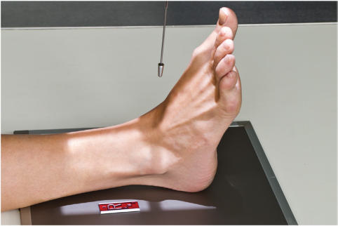
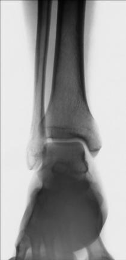
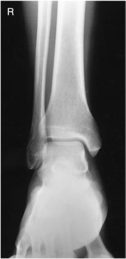

# Rx Gleznă (Articulație Talocrurală) AP (Antero-Posterior)

  📷 Radiografie Convențională (Rx)
  <strong>Actualizat:</strong> 2026-09-15
  <strong>Autor:</strong> Departamentul de Radiologie / Referință Bontrager

---

-   __1. Rezumat Clinic & Indicații__

    ---

    === "Indicații Clinice"

        - Bony lesions or diseases involving the Gleznă (Articulație Talocrurală) joint, distal tibia and fibula, proximal talus, and proximal fifth metatarsal The lateral portion of the Gleznă (Articulație Talocrurală) joint space should not appear open on this projection—(see AP Mortise Projection).

    === "Ghid Național IRIS"

        !!! info "Referință Primară: Ghidul Național IRIS (Ordinul MS 1342/2012)"
            - **Capitol Ghid IRIS:** *Ghidul Național IRIS*
            - **Grad de Recomandare:** **De verificat pe indicație; fără grad atribuit automat**
            - **Nivel de Iradiere Estimată:** `De verificat pentru examinarea și populația selectate`

            [:octicons-search-16: Deschide Ghidul IRIS](../../iris.md){ .md-button .md-button--primary } [:material-open-in-new: Aplicația Oficială PWA](https://radiologie-pediatrica.ro/iris/){ .md-button target="_blank" rel="noopener" }
-   __2. Poziționare & Centrare Fascicul__

    ---

    - **Poziție Pacient:** Pacient: Place patient in the Decubit Dorsal position; place pillow under patient’s head; legs should be fully extended.; Regiune anatomică: Center and align Gleznă (Articulație Talocrurală) joint to CR and to long axis of portion of IR being exposed (Fig. 6.81). Do not force dorsiflexion of the Picior; allow it to remain in its natural position (see NOTE 1). Adjust the Picior and Gleznă (Articulație Talocrurală) for a true Incidență Antero-Posterioară (AP). Ensure that the entire Gambă is not rotated. The intermalleolar line should not be parallel to IR (see NOTE 2).
    - **Punct de Centrare Fascicul:** perpendicular to IR, directed to a point midway between malleoli
    - **Distanță Focar-Film (DFF / SID):** 100 cm
    - **Comandă Respiratorie:** Apnee pe durata expunerii (sau conform cooperării pacientului)

-   __3. Parametri Tehnici Expunere__

    ---

    | Parametru Tehnic | Valoare Configurare Generator / Tub |
    |:-----------------|:-------------------------------------|
    | **Tensiune Tub (kV)** | 60-75 kV |
    | **Sarcină / Produs Curent-Timp (mAs)** | DE CONFIGURAT PE APARAT |
    | **Distanță Focar-Film (DFF / SID)** | 100 cm |
    | **Grilă Antidifuzoare (Bucky)** | Fără grilă (expunere directă) |
    | **Dimensiune Focar** | Focar Mic (0.6 mm) |
    | **Camere de Ionizare AEC** | DE CONFIGURAT PE APARAT |
    | **Colimare Fascicul** | field and to IR. Absența rotației anatomice: clavicule echidistante față de linia apofizelor spinoase if the medial mortise joint is open and the lateral mortise is closed. Some superimposition of the distal fibula by the distal tibia and talus exists. Foursided collimation should include the distal onethird of the Gambă to the proximal half of the metatarsals. All surrounding soft tissue also should be included. Exposure: Optimal image receptor exposure and contrast with no motion to demonstrate clear bony margins and trabecular markings. Talus must be penetrated enough to demonstrate the cortical margins and trabeculae of the bone. Soft tissue structures also must be visible. Fig. 6.82 AP Gleznă (Articulație Talocrurală). (Courtesy E. Frank, RT[R], FASRT.) Base of 5th metatarsal Lateral malleolus Talus Medial malleolus Fig. 6.83 AP Gleznă (Articulație Talocrurală). (Courtesy E. Frank, RT[R], FASRT.) |
    | **Filtrare Tub** | Totală ≥ 2.5 mm Al echivalent |

-   __4. Criterii de Calitate & Reușită Imagine__

    ---

    - Distal onethird of tibiafibula, lateral and medial malleoli, and talus and proximal half of metatarsals should be demonstrated (Figs. 6.82 and 6.83). Position:
    - Long axis of the leg should be aligned to

-   __5. Protecție Radiologică (ALARA)__

    ---

    - Ecranare gonadică și a organelor radiosensibile conform procedurilor locale de radioprotecție ALARA.
    - Colimare strictă la aria de interes pentru limitarea radiației difuze.
    - Verificarea posibilității unei sarcini la pacientele de vârstă fertilă înainte de expunere.

!!! note "Observații Clinice & Tehnice"
    The malleoli are not the same distance from the IR in the anatomic position with a true Incidență Antero-Posterioară (AP). (The lateral malleolus is approximately 15° more posterior.) The lateral portion of the mortise joint should not appear open. If this portion of the Gleznă (Articulație Talocrurală) joint does appear open on a true AP, it may suggest spread of the Gleznă (Articulație Talocrurală) mortise from ruptured ligaments.1 Gleznă (Articulație Talocrurală) ROUTINE AP AP mortise (15°) Lateral SPECIAL Oblique (45°) AP stress Fig. 6.81 AP Gleznă (Articulație Talocrurală).

### 🖼️ Imagini

<figure class="protocol-image-card" markdown>

<figcaption><strong>Fig. 6.81 AP Gleznă (Articulație Talocrurală).</strong> — Poziționare pacient conform Ghidului Bontrager (Fig. 6.81 AP ankle.)</figcaption>

</figure>

<figure class="protocol-image-card" markdown>

<figcaption><strong>Fig. 6.82 AP Gleznă (Articulație Talocrurală). (Courtesy E.</strong> — Aspect radiografic de referință conform Ghidului Bontrager (Fig. 6.82 AP ankle. (Courtesy E.)</figcaption>

</figure>

<figure class="protocol-image-card" markdown>

<figcaption><strong>Fig. 6.83 AP Gleznă (Articulație Talocrurală). (Courtesy E.</strong> — Aspect radiografic de referință conform Ghidului Bontrager (Fig. 6.83 AP ankle. (Courtesy E.)</figcaption>

</figure>

=== "Ghid Rapid de Execuție"

    1. **Identificarea și verificarea pacientului:** verificare identitate, zonă de examinat, consimțământ conform procedurii și evaluarea posibilității unei sarcini, când este relevantă.
    2. **Pregătire:** îndepărtarea oricăror obiecte radiopace (bijuterii, agrafe, fermoare, proteze, pansamente dense).
    3. **Poziționare precisă:** alinierea receptorului de imagine și a tubului la distanța prescrisă (100 cm).
    4. **Colimare strictă:** adaptarea fasciculului strict la regiunea de diagnostic pentru scăderea iradierii și reducerea radiației difuze.
    5. **Radioprotecție:** verificarea [politicii RX](../radioprotectie.md), cu măsuri distincte pentru pacient, personal și însoțitor.

## Surse de documentare

- [Bontrager's Textbook of Radiographic Positioning (Ed. 9/10), Pagina 254](https://www.elsevier.com/books/textbook-of-radiographic-positioning-and-related-anatomy/lampignano/978-0-323-65367-1)
