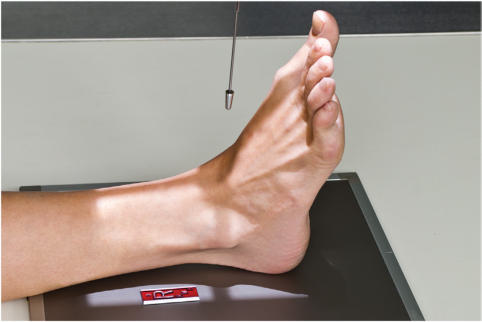
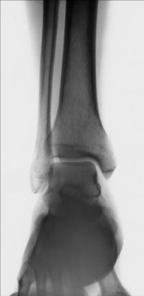
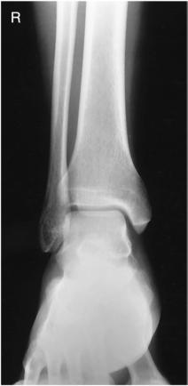

# Rx gleznă AP (anteroposterior)

  📷 Radiografie Convențională (Rx)
  <strong>Actualizat:</strong> 2026-09-15
  <strong>Autor:</strong> Departamentul de Radiologie / Referință Bontrager

---

-   __1. Rezumat Clinic & Indicații__

    ---

    === "Indicații Clinice"

        - Leziunile osoase sau bolile care implică articulația gleznei, tibia și fibula distale, astragalul proximal și porțiunea laterală a celui de-al cincilea metatarsian proximal nu trebuie să apară cu spațiile articulare deschise pe această incidență—(vezi incidența AP mortisă).

    === "Ghid Național IRIS"

        !!! info "Referință Primară: Ghidul Național IRIS (Ordinul MS 1342/2012)"
            - **Capitol Ghid IRIS:** *Aparat locomotor & Membru inferior*
            - **Grad de Recomandare:** **Grad A**
            - **Nivel de Iradiere Estimată:** `Clasa 1 (Minimă < 0.01 mSv)`

            [:octicons-search-16: Deschide Ghidul IRIS](../../iris.md){ .md-button .md-button--primary } [:material-open-in-new: Aplicația Oficială PWA](https://radiologie-pediatrica.ro/iris/){ .md-button target="_blank" rel="noopener" }

-   __2. Poziționare & Centrare Fascicul__

    ---

    - **Poziție Pacient:** Pacient: Așezați pacientul în decubit dorsal; plasați o pernă sub capul pacientului; membrele inferioare trebuie să fie complet extinse. Regiune anatomică: Centrați și aliniați articulația gleznei la raza centrală și la axa longitudinală a porțiunii receptorului de imagine expuse (Fig. 6.81). Nu forțați dorsiflexia piciorului; permiteți-i să rămână în poziția sa naturală (vezi NOTA 1). Ajustați piciorul și glezna pentru o adevărată incidență anteroposterioară (AP). Asigurați-vă că întreaga gambă nu este rotită. Linia intermalleolară nu trebuie să fie paralelă cu receptorul de imagine (vezi NOTA 2).
    - **Punct de Centrare Fascicul:** perpendicular pe receptorul de imagine, orientat la punctul situat la jumătatea distanței dintre maleole
    - **Distanță Focar-Film (DFF / SID):** 100 cm
    - **Comandă Respiratorie:** Apnee pe durata expunerii (sau conform cooperării pacientului)

-   __3. Parametri Tehnici Expunere__

    ---

    | Parametru Tehnic | Valoare Configurare Generator / Tub |
    |:-----------------|:-------------------------------------|
    | **Tensiune Tub (kV)** | 60-75 kV |
    | **Sarcină / Produs Curent-Timp (mAs)** | DE CONFIGURAT PE APARAT |
    | **Distanță Focar-Film (DFF / SID)** | 100 cm |
    | **Grilă Antidifuzoare (Bucky)** | Fără grilă (expunere directă) |
    | **Dimensiune Focar** | Focar Mic (0.6 mm) |
    | **Camere de Ionizare AEC** | DE CONFIGURAT PE APARAT |
    | **Colimare Fascicul** | câmp și la receptorul de imagine. Absența rotației anatomice: claviculele sunt echidistante față de linia apofizelor spinoase dacă mortisa medială articulară este deschisă și mortisa laterală este închisă. Există o anumită suprapunere a fibulei distale de către tibia distală și astragal. Colimarea pe patru laturi trebuie să includă treimea distală a gambei până la jumătatea proximală a oaselor metatarsiene. De asemenea, trebuie incluse toate părțile moi înconjurătoare. Expunere: expunere optimă a receptorului de imagine și contrast fără mișcare, pentru a evidenția clar marginile osoase și desenul trabecular. Astragalul trebuie penetrat suficient pentru a evidenția marginile corticale și trabeculele osoase. Structurile părților moi trebuie, de asemenea, să fie vizibile. Fig. 6.82 AP gleznă. (Cu amabilitatea E. Frank, RT[R], FASRT.) Baza celui de-al 5-lea metatarsian; maleola laterală (fibulară); astragal; maleola medială (tibială); Fig. 6.83 AP gleznă. (Cu amabilitatea E. Frank, RT[R], FASRT.) |
    | **Filtrare Tub** | Totală ≥ 2.5 mm Al echivalent |

-   __4. Criterii de Calitate & Reușită Imagine__

    ---

    - Treimea distală a tibiei și fibulei, maleolele laterală și medială, astragalul și jumătatea proximală a oaselor metatarsiene trebuie să fie evidențiate (Fig. 6.82 și 6.83). Poziție:
    - Axa longitudinală a membrului inferior trebuie să fie aliniată la

-   __5. Protecție Radiologică (ALARA)__

    ---

    - Ecranare gonadică și a organelor radiosensibile conform procedurilor locale de radioprotecție ALARA.
    - Colimare strictă la aria de interes pentru limitarea radiației difuze.
    - Verificarea posibilității unei sarcini la pacientele de vârstă fertilă înainte de expunere.

!!! note "Observații Clinice & Tehnice"
    Maleolele nu se află la aceeași distanță față de receptorul de imagine în poziția anatomică cu adevărata incidență anteroposterioară (AP). (Maleola laterală (fibulară) este situată cu aproximativ 15° mai posterior.) Porțiunea laterală a mortisei articulare nu trebuie să apară deschisă. Dacă această porțiune a articulației gleznei apare deschisă pe o incidență AP adevărată, aceasta poate sugera lărgirea mortisei gleznei din cauza ligamentelor rupte.1 GLEZNĂ DE RUTINĂ AP; AP mortisă (15°); laterală; specială oblică (45°); AP de stres; Fig. 6.81 AP gleznă.

### 🖼️ Imagini

<figure class="protocol-image-card" markdown>

<figcaption><strong>Fig. 6.81 AP gleznă.</strong> — Poziționarea pacientului conform Ghidului Bontrager (Fig. 6.81 AP gleznă.)</figcaption>

</figure>

<figure class="protocol-image-card" markdown>

<figcaption><strong>Fig. 6.82 AP gleznă. (Cu amabilitatea E.</strong> — Aspect radiografic de referință conform Ghidului Bontrager (Fig. 6.82 AP gleznă. (Cu amabilitatea E.)</figcaption>

</figure>

<figure class="protocol-image-card" markdown>

<figcaption><strong>Fig. 6.83 AP gleznă. (Cu amabilitatea E.</strong> — Aspect radiografic de referință conform Ghidului Bontrager (Fig. 6.83 AP gleznă. (Cu amabilitatea E.)</figcaption>

</figure>

=== "Ghid Rapid de Execuție"

    1. **Identificarea și verificarea pacientului:** verificare identitate, zonă de examinat, consimțământ conform procedurii și evaluarea posibilității unei sarcini, când este relevantă.
    2. **Pregătire:** îndepărtarea oricăror obiecte radiopace (bijuterii, agrafe, fermoare, proteze, pansamente dense).
    3. **Poziționare precisă:** alinierea receptorului de imagine și a tubului la distanța prescrisă (100 cm).
    4. **Colimare strictă:** adaptarea fasciculului strict la regiunea de diagnostic pentru scăderea iradierii și reducerea radiației difuze.
    5. **Radioprotecție:** verificarea [politicii RX](../radioprotectie.md), cu măsuri distincte pentru pacient, personal și însoțitor.

## Surse de documentare

- [Bontrager's Textbook of Radiographic Positioning (Ed. 9/10), Pagina 254](https://www.elsevier.com/books/textbook-of-radiographic-positioning-and-related-anatomy/lampignano/978-0-323-65367-1)
