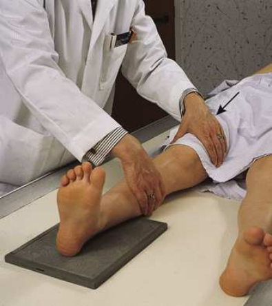
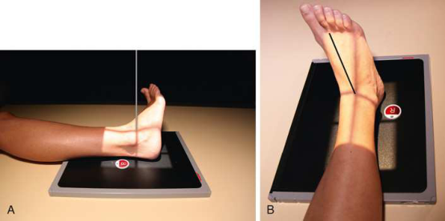
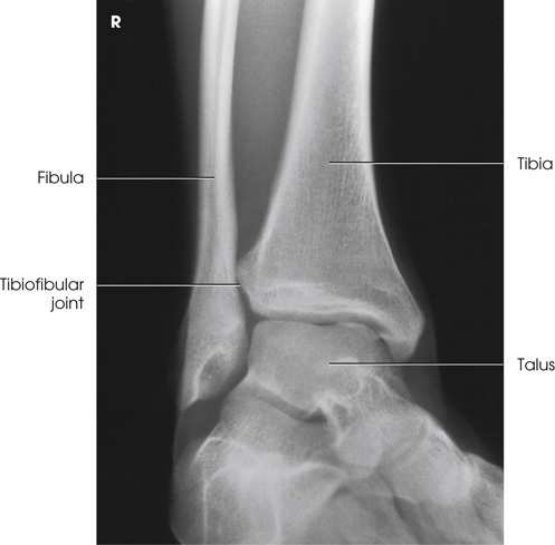
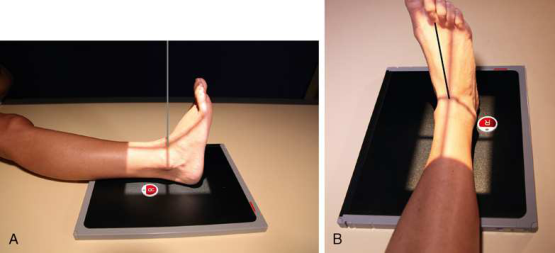
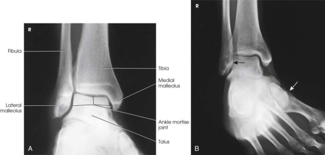
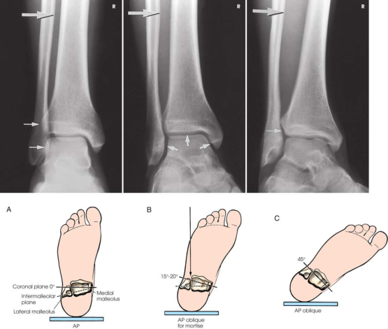

# Rx Gleznă (Articulație Talocrurală) — Oblică Antero-Posterioară (AP) — Rotație Internă (Medială) (Merrill)

  📷 Radiografie Convențională (Rx)
  <strong>Actualizat:</strong> 2026-09-16
  <strong>Autor:</strong> Referință Merrill

---

-   __1. Rezumat Clinic & Indicații__

    ---

    === "Indicații Clinice"

        - Conform reperelor anatomice standard din tratat

    === "Ghid Național IRIS"

        !!! info "Referință Primară: Ghidul Național IRIS (Ordinul MS 1342/2012)"
            - **Capitol Ghid IRIS:** *Ghidul Național IRIS*
            - **Grad de Recomandare:** **De verificat pe indicație; fără grad atribuit automat**
            - **Nivel de Iradiere Estimată:** `De verificat pentru examinarea și populația selectate`

            [:octicons-search-16: Deschide Ghidul IRIS](../../iris.md){ .md-button .md-button--primary } [:material-open-in-new: Aplicația Oficială PWA](https://radiologie-pediatrica.ro/iris/){ .md-button target="_blank" rel="noopener" }
-   __2. Poziționare & Centrare Fascicul__

    ---

    - **Poziție Pacient:** se așază pacientul în Decubit dorsal sau Poziție Șezândă poziție cu afected extremity fully extins. se așază pacientul în Decubit dorsal sau Poziție Șezândă poziție.; se centrează receptorul de imagine la Gleznă (Articulație Talocrurală) articulație midway între malleoli și se ajustează receptorul de imagine so that its axa longitudinală este paralel cu axa longitudinală de membru inferior. Dorsiflex Picior enough la place Gleznă (Articulație Talocrurală) la nearly drept-angle flexion (Fig. 7.98). Gleznă (Articulație Talocrurală) poate fie imobilizat cu săculeți cu nisip plasat pe / sprijinit de sole de Picior sau prin having pacientul hold ends de strip de bandage looped around ball de Picior. se rotește pacient’s entire membru inferior pentru toate oblic incidențe de Gleznă (Articulație Talocrurală) prin grasping lower Femur area cu one Mână și Picior cu other (see Fig. 7.98). Because Genunchi este hinge articulație, rotație de membru inferior poate come only de la Șold articulație. Internally se rotește entire membru inferior și Picior together until 45-grade Incidență Oblică este achieved (Fig. 7.99). Picior poate fie plasat against foam wedge pentru support. se efectuează ecranarea gonadelor cu șorț plumbat. se centrează pacient’s Gleznă (Articulație Talocrurală) articulație la receptorul de imagine. Grasp distal Femur area cu one Mână și Picior cu other. Assist pacientul prin internally rotating entire membru inferior și Picior together 15 la 20 grade until intermalleolar plane este paralel cu receptorul de imagine (Fig. 7.101). plantar surface de Picior trebuie să fie plasat la drept angle la membru inferior. se efectuează ecranarea gonadelor cu șorț plumbat.
    - **Punct de Centrare Fascicul:** perpendicular pe Gleznă (Articulație Talocrurală) articulație, entering midway între malleoli. perpendicular, entering Gleznă (Articulație Talocrurală) articulație midway între malleoli.
    - **Distanță Focar-Film (DFF / SID):** Nespecificat în fragmentul extras; de verificat în sursă
    - **Comandă Respiratorie:** Conform reperelor anatomice standard din tratat

-   __3. Parametri Tehnici Expunere__

    ---

    | Parametru Tehnic | Valoare Configurare Generator / Tub |
    |:-----------------|:-------------------------------------|
    | **Tensiune Tub (kV)** | DE CONFIGURAT PE APARAT |
    | **Sarcină / Produs Curent-Timp (mAs)** | DE CONFIGURAT PE APARAT |
    | **Distanță Focar-Film (DFF / SID)** | Nespecificat în fragmentul extras; de verificat în sursă |
    | **Grilă Antidifuzoare (Bucky)** | DE CONFIGURAT PE APARAT |
    | **Dimensiune Focar** | DE CONFIGURAT PE APARAT |
    | **Camere de Ionizare AEC** | DE CONFIGURAT PE APARAT |
    | **Colimare Fascicul** | se ajustează câmp de iradiere la 1 inch (2.5 cm) pe sides de Gleznă (Articulație Talocrurală) și 8 inches (18 cm) longitudinal pentru include heel. Place marker de lateralitate (D/S) în collimated expunere field. se ajustează câmp de iradiere la 1 inch (2.5 cm) pe sides de Gleznă (Articulație Talocrurală) și 8 inches (18 cm) longitudinal pentru include heel. Place marker de lateralitate (D/S) în collimated expunere field. |
    | **Filtrare Tub** | DE CONFIGURAT PE APARAT |

-   __4. Criterii de Calitate & Reușită Imagine__

    ---

    - Criterii radiologice de calitate imaginii:
    - Evidence de corect collimation și presence de marker de lateralitate (D/S) plasat clear de anatomy de interest
    - Gleznă (Articulație Talocrurală) articulație centrat pe expunere area
    - distal tibia, fibula, și astragal (talus)
    - corect 45-grade rotație de Gleznă (Articulație Talocrurală)
    - Tibiofibular articulation open
    - distal tibia și fibula overlap some de astragal (talus)
    - Bony detalii trabeculare osoase și surrounding soft tissues Criterii radiologice de calitate imaginii:
    - Evidence de corect collimation și presence de marker de lateralitate (D/S) plasat clear de anatomy de interest
    - Entire Gleznă (Articulație Talocrurală) mortise articulație centrat pe expunere area
    - distal tibia, fibula, și astragal (talus)
    - corect 15- la 20-grade rotație de Gleznă (Articulație Talocrurală)
    - Talofibular articulation open
    - Tibiotalar articulation open
    - fără overlap de anterior tubercle de tibia și superolateral portion de astragal (talus) cu fibula
    - Bony detalii trabeculare osoase și surrounding soft tissues

-   __5. Protecție Radiologică (ALARA)__

    ---

    - Nespecificat în fragmentul extras; de verificat în sursă

!!! note "Observații Clinice & Tehnice"
    Conform reperelor anatomice standard din tratat

### 🖼️ Imagini

<figure class="protocol-image-card" markdown>

<figcaption><strong>Merrill — pagina PDF 525, imaginea 1</strong> — Imagine din fragmentul sursă; asocierea necesită revizie.</figcaption>

</figure>

<figure class="protocol-image-card" markdown>

<figcaption><strong>Merrill — pagina PDF 526, imaginea 2</strong> — Imagine din fragmentul sursă; asocierea necesită revizie.</figcaption>

</figure>

<figure class="protocol-image-card" markdown>

<figcaption><strong>Merrill — pagina PDF 526, imaginea 3</strong> — Imagine din fragmentul sursă; asocierea necesită revizie.</figcaption>

</figure>

<figure class="protocol-image-card" markdown>

<figcaption><strong>Merrill — pagina PDF 527, imaginea 4</strong> — Imagine din fragmentul sursă; asocierea necesită revizie.</figcaption>

</figure>

<figure class="protocol-image-card" markdown>

<figcaption><strong>Merrill — pagina PDF 528, imaginea 5</strong> — Imagine din fragmentul sursă; asocierea necesită revizie.</figcaption>

</figure>

<figure class="protocol-image-card" markdown>

<figcaption><strong>Merrill — pagina PDF 529, imaginea 6</strong> — Imagine din fragmentul sursă; asocierea necesită revizie.</figcaption>

</figure>

=== "Ghid Rapid de Execuție"

    1. **Identificarea și verificarea pacientului:** verificare identitate, zonă de examinat, consimțământ conform procedurii și evaluarea posibilității unei sarcini, când este relevantă.
    2. **Pregătire:** îndepărtarea oricăror obiecte radiopace (bijuterii, agrafe, fermoare, proteze, pansamente dense).
    3. **Poziționare precisă:** alinierea receptorului de imagine și a tubului la distanța prescrisă (Nespecificat în fragmentul extras; de verificat în sursă).
    4. **Colimare strictă:** adaptarea fasciculului strict la regiunea de diagnostic pentru scăderea iradierii și reducerea radiației difuze.
    5. **Radioprotecție:** verificarea [politicii RX](../radioprotectie.md), cu măsuri distincte pentru pacient, personal și însoțitor.

## Surse de documentare

- [Merrill’s Atlas, 7. Lower Extremity, pagini PDF 524–529](../../assets/protocols/sources/a56d45c16829_Merrills_Atlas_of_Radiographic_Positioning__Procedures_3Vol_Set.pdf#page=524)

## Fragmente sursă traduse (referință tehnică)

### anatomy

45-grade medial oblic incidență shows distal ends de tibia și fibula, parts de which sunt often superimposed over astragal (talus). tibiofibular articulation also trebuie să fie vizualizat (Fig. 7.100).
entire ankle mortise articulație în profile. three sides de mortise articulație trebuie să fie visualized (Figs. 7.102 și 7.103).

### collimation

• se ajustează câmp de iradiere la 1 inch (2.5 cm) pe sides de ankle și 8 inches (18 cm) longitudinal pentru include heel. Place side
marker în collimated expunere field.
• se ajustează câmp de iradiere la 1 inch (2.5 cm) pe sides de ankle și 8 inches (18 cm) longitudinal pentru include heel. Place side
marker în collimated expunere field.

### cr

• perpendicular pe ankle articulație, entering midway între malleoli.
• perpendicular, entering ankle articulație midway între malleoli.

### criteria

Criterii radiologice de calitate imaginii:
• Evidence de corect collimation și presence de marker de lateralitate (D/S) plasat clear de anatomy de interest
• Ankle articulație centrat pe expunere area
• distal tibia, fibula, și astragal (talus)
• corect 45-grade rotație de ankle
• Tibiofibular articulation open
• distal tibia și fibula overlap some de astragal (talus)
• Bony detalii trabeculare osoase și surrounding soft tissues
Criterii radiologice de calitate imaginii:
• Evidence de corect collimation și presence de marker de lateralitate (D/S) plasat clear de anatomy de interest
• Entire ankle mortise articulație centrat pe expunere area
• distal tibia, fibula, și astragal (talus)
• corect 15- la 20-grade rotație de ankle
• Talofibular articulation open
• Tibiotalar articulation open
• fără overlap de anterior tubercle de tibia și superolateral portion de astragal (talus) cu fibula
• Bony detalii trabeculare osoase și surrounding soft tissues

### part_pos

• se centrează receptorul de imagine la ankle articulație midway între malleoli și se ajustează receptorul de imagine so that its axa longitudinală este paralel cu axa longitudinală de membru inferior.
• Dorsiflex picior enough la place ankle la nearly drept-angle flexion (Fig. 7.98). ankle poate fie imobilizat cu săculeți cu nisip
plasat pe / sprijinit de sole de picior sau prin having pacientul hold ends de strip de bandage looped around ball de picior.
• se rotește pacient’s entire membru inferior pentru toate oblic incidențe de ankle prin grasping lower femur area cu one mână și picior cu
other (see Fig. 7.98). Because genunchi este hinge articulație, rotație de membru inferior poate come only de la hip articulație. Internally se rotește
entire membru inferior și picior together until 45-grade oblic poziție este achieved (Fig. 7.99).
• picior poate fie plasat against foam wedge pentru support.
• se efectuează ecranarea gonadelor cu șorț plumbat.
• se centrează pacient’s ankle articulație la receptorul de imagine.
• Grasp distal femur area cu one mână și picior cu other. Assist pacientul prin internally rotating entire membru inferior și picior
together 15 la 20 grade until intermalleolar plane este paralel cu receptorul de imagine (Fig. 7.101).
• plantar surface de picior trebuie să fie plasat la drept angle la membru inferior.
• se efectuează ecranarea gonadelor cu șorț plumbat.

### patient_pos

• se așază pacientul în decubit dorsal sau așezat pe scaun poziție cu afected extremity fully extins.
• se așază pacientul în decubit dorsal sau așezat pe scaun poziție.

### tech

poziționat prin manufacturer sau department protocol pentru corect anatomy display orientation; raza centrală plate: 10 × 12 inches (24 × 30 cm) longitudinal.
poziționat prin manufacturer sau department protocol pentru corect anatomy display orientation; raza centrală plate: 10 × 12 inches (24 × 30 cm) longitudinal.

