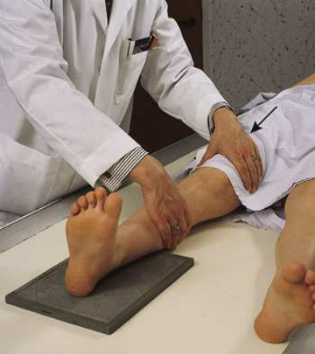
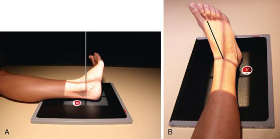
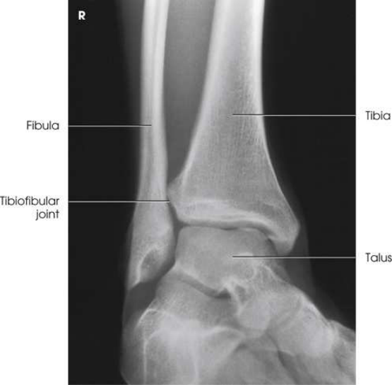
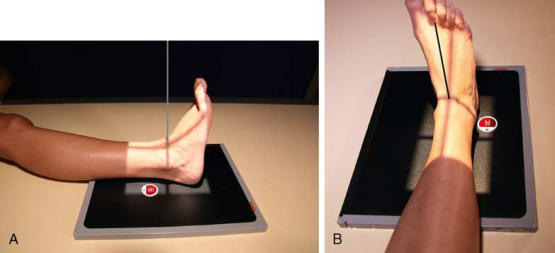
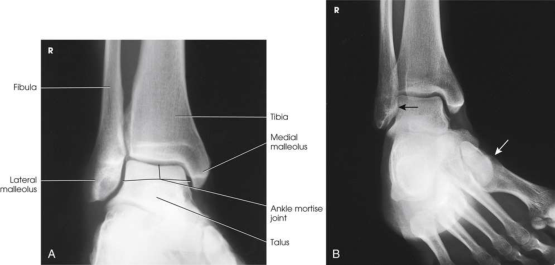
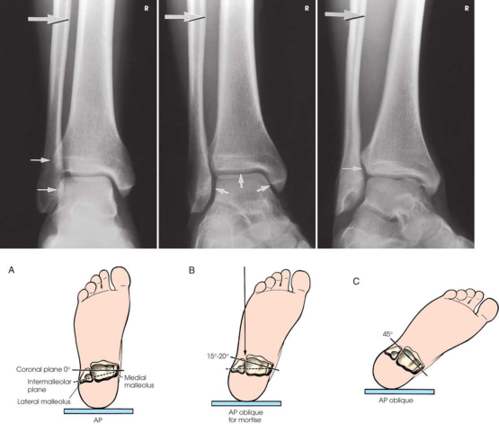

# Rx gleznă (articulație talocrurală) — oblică antero-posterioară (AP) — rotație internă (medială) (Merrill)

  📷 Radiografie Convențională (Rx)
  <strong>Actualizat:</strong> 2026-09-16
  <strong>Autor:</strong> Referință Merrill

---

-   __1. Rezumat Clinic & Indicații__

    ---

    === "Indicații Clinice"

        - Conform reperelor anatomice standard din tratat

    === "Ghid Național IRIS"

        !!! info "Referință Primară: Ghidul Național IRIS (Ordinul MS 1342/2012)"
            - **Capitol Ghid IRIS:** *Aparat locomotor & Membru inferior*
            - **Grad de Recomandare:** **Grad A**
            - **Nivel de Iradiere Estimată:** `Clasa 1 (Minimă < 0.01 mSv)`

            [:octicons-search-16: Deschide Ghidul IRIS](../../iris.md){ .md-button .md-button--primary } [:material-open-in-new: Aplicația Oficială PWA](https://radiologie-pediatrica.ro/iris/){ .md-button target="_blank" rel="noopener" }

-   __2. Poziționare & Centrare Fascicul__

    ---

    - **Poziție Pacient:** se așază pacientul în decubit dorsal sau în poziție șezândă, cu extremitatea afectată complet extinsă. se așază pacientul în decubit dorsal sau în poziție șezândă. se centrează receptorul de imagine la nivelul articulației gleznei (articulației talocrurale), la mijlocul distanței dintre maleole, și se ajustează receptorul de imagine astfel încât axa sa longitudinală să fie paralelă cu axa longitudinală a membrului inferior. Se flectează dorsal piciorul suficient pentru a plasa glezna (articulația talocrurală) în flexie aproape la un unghi drept (Fig. 7.98). Glezna (articulația talocrurală) poate fi imobilizată cu săculeți cu nisip plasați pe / sprijiniți de talpa piciorului sau punând pacientul să țină capetele unei fâșii de bandaj înfășurate în jurul antepiciorului. se rotește întregul membru inferior al pacientului pentru toate incidențele oblice ale gleznei (articulației talocrurale), prin prinderea regiunii inferioare a femurului cu o mână și a piciorului cu cealaltă (vezi Fig. 7.98). Deoarece genunchiul este o articulație de tip balama, rotația membrului inferior poate proveni numai de la articulația șoldului. Se rotește intern întregul membru inferior împreună cu piciorul până se obține o incidență oblică de 45 de grade (Fig. 7.99). Piciorul poate fi plasat pe o pană de spumă pentru susținere. se efectuează ecranarea gonadelor cu șorț plumbat. se centrează articulația gleznei (articulația talocrurală) a pacientului la receptorul de imagine. Se prinde regiunea distală a femurului cu o mână și piciorul cu cealaltă. Se asistă pacientul prin rotirea internă a întregului membru inferior împreună cu piciorul cu 15 la 20 de grade, până când planul intermalleolar este paralel cu receptorul de imagine (Fig. 7.101). Suprafața plantară a piciorului trebuie plasată la un unghi drept față de membrul inferior. se efectuează ecranarea gonadelor cu șorț plumbat.
    - **Punct de Centrare Fascicul:** perpendicular pe articulația gleznei (articulația talocrurală), cu intrare la mijlocul distanței dintre maleole. Perpendicular, cu intrare în articulația gleznei (articulația talocrurală), la mijlocul distanței dintre maleole.
    - **Distanță Focar-Film (DFF / SID):** Nespecificat în fragmentul extras; de verificat în sursă
    - **Comandă Respiratorie:** Conform reperelor anatomice standard din tratat

-   __3. Parametri Tehnici Expunere__

    ---

    | Parametru Tehnic | Valoare Configurare Generator / Tub |
    |:-----------------|:-------------------------------------|
    | **Tensiune Tub (kV)** | DE CONFIGURAT PE APARAT |
    | **Sarcină / Produs Curent-Timp (mAs)** | DE CONFIGURAT PE APARAT |
    | **Distanță Focar-Film (DFF / SID)** | Nespecificat în fragmentul extras; de verificat în sursă |
    | **Grilă Antidifuzoare (Bucky)** | DE CONFIGURAT PE APARAT |
    | **Dimensiune Focar** | DE CONFIGURAT PE APARAT |
    | **Camere de Ionizare AEC** | DE CONFIGURAT PE APARAT |
    | **Colimare Fascicul** | Se ajustează câmpul de iradiere la 1 țol (2.5 cm) pe laturile gleznei (articulația talocrurală) și la 8 țoli (18 cm) longitudinal, pentru a include călcâiul. Se plasează markerul de lateralitate (D/S) în câmpul de expunere colimat. Se ajustează câmpul de iradiere la 1 țol (2.5 cm) pe laturile gleznei (articulația talocrurală) și la 8 țoli (18 cm) longitudinal, pentru a include călcâiul. Se plasează markerul de lateralitate (D/S) în câmpul de expunere colimat. |
    | **Filtrare Tub** | DE CONFIGURAT PE APARAT |

-   __4. Criterii de Calitate & Reușită Imagine__

    ---

    - Criterii radiologice de calitate a imaginii:
    - Evidențierea colimării corecte și prezența markerului de lateralitate (D/S), plasat fără a se suprapune peste anatomia de interes
    - articulația gleznei (articulația talocrurală) centrată pe zona de expunere
    - tibia distală, fibula și astragalul
    - rotație corectă de 45 de grade a gleznei (articulației talocrurale)
    - articulația tibiofibulară deschisă
    - tibia și fibula distale se suprapun parțial peste astragal (talus)
    - detalii osoase trabeculare și țesuturile moi înconjurătoare. Criterii radiologice de calitate a imaginii:
    - Evidențierea colimării corecte și prezența markerului de lateralitate (D/S), plasat fără a se suprapune peste anatomia de interes
    - întreaga articulație a mortaise-ului gleznei (articulația talocrurală) centrată pe zona de expunere
    - tibia distală, fibula și astragalul
    - rotație corectă de 15 la 20 de grade a gleznei (articulației talocrurale)
    - articulația talofibulară deschisă
    - articulația tibiotalară deschisă
    - fără suprapunerea tuberculului anterior al tibiei și a porțiunii superolaterale a astragalului (talusului) cu fibula
    - Detalii trabeculare osoase și țesuturile moi înconjurătoare

-   __5. Protecție Radiologică (ALARA)__

    ---

    - Nespecificat în fragmentul extras; de verificat în sursă

!!! note "Observații Clinice & Tehnice"
    Conform reperelor anatomice standard din tratat

### 🖼️ Imagini

<figure class="protocol-image-card" markdown>

<figcaption><strong>Merrill — pagina 525, imaginea 1</strong> — Imagine din fragmentul sursă; asocierea necesită revizie.</figcaption>

</figure>

<figure class="protocol-image-card" markdown>

<figcaption><strong>Merrill — pagina 526, imaginea 2</strong> — Imagine din fragmentul sursă; asocierea necesită revizie.</figcaption>

</figure>

<figure class="protocol-image-card" markdown>

<figcaption><strong>Merrill — pagina 526, imaginea 3</strong> — Imagine din fragmentul sursă; asocierea necesită revizie.</figcaption>

</figure>

<figure class="protocol-image-card" markdown>

<figcaption><strong>Merrill — pagina 527, imaginea 4</strong> — Imagine din fragmentul sursă; asocierea necesită revizie.</figcaption>

</figure>

<figure class="protocol-image-card" markdown>

<figcaption><strong>Merrill — pagina 528, imaginea 5</strong> — Imagine din fragmentul sursă; asocierea necesită revizie.</figcaption>

</figure>

<figure class="protocol-image-card" markdown>

<figcaption><strong>Merrill — pagina 529, imaginea 6</strong> — Imagine din fragmentul sursă; asocierea necesită revizie.</figcaption>

</figure>

=== "Ghid Rapid de Execuție"

    1. **Identificarea și verificarea pacientului:** verificare identitate, zonă de examinat, consimțământ conform procedurii și evaluarea posibilității unei sarcini, când este relevantă.
    2. **Pregătire:** îndepărtarea oricăror obiecte radiopace (bijuterii, agrafe, fermoare, proteze, pansamente dense).
    3. **Poziționare precisă:** alinierea receptorului de imagine și a tubului la distanța prescrisă (Nespecificat în fragmentul extras; de verificat în sursă).
    4. **Colimare strictă:** adaptarea fasciculului strict la regiunea de diagnostic pentru scăderea iradierii și reducerea radiației difuze.
    5. **Radioprotecție:** verificarea [politicii RX](../radioprotectie.md), cu măsuri distincte pentru pacient, personal și însoțitor.

## Surse de documentare

- [Merrill’s Atlas, 7. Lower Extremity, pagini 524–529](https://books.google.com/books/about/Merrill_s_Atlas_of_Radiographic_Position.html?id=BM0lEQAAQBAJ)
