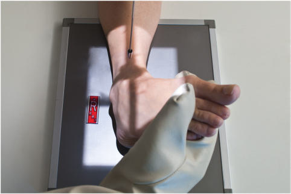
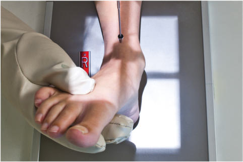
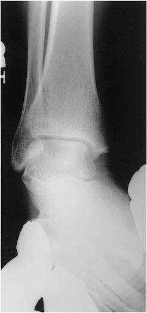
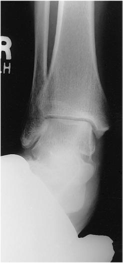

# Rx gleznă (articulație talocrurală) AP, incidență de stres (poziționare pentru INVERSIUNE ȘI EVERSIUNE)

  📷 Radiografie Convențională (Rx)
  <strong>Actualizat:</strong> 2026-09-15
  <strong>Autor:</strong> Departamentul de Radiologie / Referință Bontrager

---

-   __1. Rezumat Clinic & Indicații__

    ---

    === "Indicații Clinice"

        - patologie care implică articulația gleznei (articulația talocrurală): separare articulară secundară unei rupturi sau rupturi complete de ligament

    === "Ghid Național IRIS"

        !!! info "Referință Primară: Ghidul Național IRIS (Ordinul MS 1342/2012)"
            - **Capitol Ghid IRIS:** *Aparat locomotor & Membru inferior*
            - **Grad de Recomandare:** **Grad A**
            - **Nivel de Iradiere Estimată:** `Clasa 1 (Minimă < 0.01 mSv)`

            [:octicons-search-16: Deschide Ghidul IRIS](../../iris.md){ .md-button .md-button--primary } [:material-open-in-new: Aplicația Oficială PWA](https://radiologie-pediatrica.ro/iris/){ .md-button target="_blank" rel="noopener" }

-   __2. Poziționare & Centrare Fascicul__

    ---

    - **Poziție Pacient:** Pacient: se așază pacientul în decubit dorsal; se așază o pernă sub capul pacientului; membrul inferior trebuie să fie complet extins, cu un suport sub genunchi. Regiune anatomică: se centrează și se aliniază articulația gleznei (articulația talocrurală) cu raza centrală și cu axa longitudinală a porțiunii receptorului de imagine care urmează să fie expusă. Se flectează dorsal piciorul cât mai aproape posibil de un unghi drept față de gambă. Se aplică stresul cu membrul inferior și glezna (articulația talocrurală) în poziție pentru o incidență AP adevărată, cu absența rotației anatomice: claviculele echidistante față de linia apofizelor spinoase, întreaga suprafață plantară fiind rotită medial pentru inversiune și lateral pentru eversiune (Fig. 6.94 și 6.95) (vezi NOTA).
    - **Punct de Centrare Fascicul:** perpendicular pe receptorul de imagine, orientat la punctul situat la jumătatea distanței dintre maleole
    - **Distanță Focar-Film (DFF / SID):** 100 cm
    - **Comandă Respiratorie:** Apnee pe durata expunerii (sau conform cooperării pacientului)

-   __3. Parametri Tehnici Expunere__

    ---

    | Parametru Tehnic | Valoare Configurare Generator / Tub |
    |:-----------------|:-------------------------------------|
    | **Tensiune Tub (kV)** | 60-75 kV |
    | **Sarcină / Produs Curent-Timp (mAs)** | DE CONFIGURAT PE APARAT |
    | **Distanță Focar-Film (DFF / SID)** | 100 cm |
    | **Grilă Antidifuzoare (Bucky)** | Fără grilă (expunere directă) |
    | **Dimensiune Focar** | Focar Mic (0.6 mm) |
    | **Camere de Ionizare AEC** | DE CONFIGURAT PE APARAT |
    | **Colimare Fascicul** | Colimați până la marginile cutanate laterale, incluzând oasele metatarsiene proximale și tibiafibula distală. |
    | **Filtrare Tub** | Totală ≥ 2.5 mm Al echivalent |

-   __4. Criterii de Calitate & Reușită Imagine__

    ---

    - și poziție:
    - articulația gleznei (articulația talocrurală), pentru evaluarea separării articulare și a rupturii sau rupturii complete de ligament, este vizualizată.
    - Aspectul spațiilor articulare poate varia considerabil în funcție de gravitatea afectării ligamentelor.
    - Colimare la aria de interes diagnostic (Fig. 6.96 și 6.97). expunere:
    - expunere optimă a receptorului de imagine și contrast, fără mișcare, evidențiate prin marginile osoase și modelele trabeculare nete.
    - expunerea optimă trebuie să vizualizeze țesuturile moi, maleolele laterală și medială, astragalul (talusul), precum și tibia și fibula distale. Fig. 6.96 Stres prin inversiune. Fig. 6.97 Stres prin eversiune.

-   __5. Protecție Radiologică (ALARA)__

    ---

    - Ecranare gonadică și a organelor radiosensibile conform procedurilor locale de radioprotecție ALARA.
    - Colimare strictă la aria de interes pentru limitarea radiației difuze.
    - Verificarea posibilității unei sarcini la pacientele de vârstă fertilă înainte de expunere.

!!! note "Observații Clinice & Tehnice"
    un medic sau un alt profesionist din domeniul sănătății trebuie să fie prezent pentru a ține piciorul și glezna (articulația talocrurală) în aceste incidențe de stres (sau pentru a le fixa în poziție cu greutăți), ori pacientul trebuie să mențină această poziție cu o buclă lungă de tifon înfășurată în jurul antepiciorului. Dacă acest lucru este prea dureros pentru pacient, medicul poate injecta un anestezic local. Inversiune Eversiune Gleznă (articulație talocrurală) incidență oblică SPECIALĂ (45°) AP de stres Fig. 6.94 AP gleznă (articulație talocrurală)—stres prin inversiune. Fig. 6.95 AP gleznă (articulație talocrurală)—stres prin eversiune.

### 🖼️ Imagini

<figure class="protocol-image-card" markdown>

<figcaption><strong>Fig. 6.94 AP gleznă (articulație talocrurală)—stres prin inversiune.</strong> — Poziționarea pacientului conform Ghidului Bontrager (Fig. 6.94 AP gleznă—stres prin inversiune.)</figcaption>

</figure>

<figure class="protocol-image-card" markdown>

<figcaption><strong>Fig. 6.95 AP gleznă (articulație talocrurală)—stres prin eversiune.</strong> — Aspect radiografic de referință conform Ghidului Bontrager (Fig. 6.95 AP gleznă—stres prin eversiune.)</figcaption>

</figure>

<figure class="protocol-image-card" markdown>

<figcaption><strong>Fig. 6.96 Stres prin inversiune.</strong> — Aspect radiografic de referință conform Ghidului Bontrager (Fig. 6.96 Stres prin inversiune.)</figcaption>

</figure>

<figure class="protocol-image-card" markdown>

<figcaption><strong>Fig. 6.97 Stres prin eversiune.</strong> — Aspect radiografic de referință conform Ghidului Bontrager (Fig. 6.97 Stres prin eversiune.)</figcaption>

</figure>

=== "Ghid Rapid de Execuție"

    1. **Identificarea și verificarea pacientului:** verificare identitate, zonă de examinat, consimțământ conform procedurii și evaluarea posibilității unei sarcini, când este relevantă.
    2. **Pregătire:** îndepărtarea oricăror obiecte radiopace (bijuterii, agrafe, fermoare, proteze, pansamente dense).
    3. **Poziționare precisă:** alinierea receptorului de imagine și a tubului la distanța prescrisă (100 cm).
    4. **Colimare strictă:** adaptarea fasciculului strict la regiunea de diagnostic pentru scăderea iradierii și reducerea radiației difuze.
    5. **Radioprotecție:** verificarea [politicii RX](../radioprotectie.md), cu măsuri distincte pentru pacient, personal și însoțitor.

## Surse de documentare

- [Bontrager's Textbook of Radiographic Positioning (Ed. 9/10), Pagina 258](https://www.elsevier.com/books/textbook-of-radiographic-positioning-and-related-anatomy/lampignano/978-0-323-65367-1)
