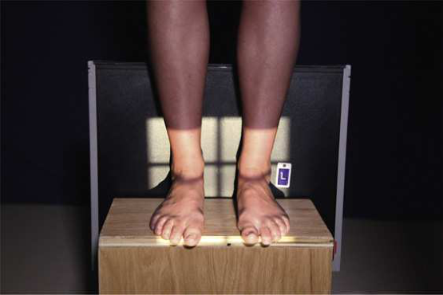

# Rx Gleznă (Articulație Talocrurală) — Incidență Antero-Posterioară (AP) — În Încărcare (Ortostatism) Method Standing (Merrill)

  📷 Radiografie Convențională (Rx)
  <strong>Actualizat:</strong> 2026-09-16
  <strong>Autor:</strong> Referință Merrill

---

-   __1. Rezumat Clinic & Indicații__

    ---

    === "Indicații Clinice"

        - Conform reperelor anatomice standard din tratat

    === "Ghid Național IRIS"

        !!! info "Referință Primară: Ghidul Național IRIS (Ordinul MS 1342/2012)"
            - **Capitol Ghid IRIS:** *Ghidul Național IRIS*
            - **Grad de Recomandare:** **De verificat pe indicație; fără grad atribuit automat**
            - **Nivel de Iradiere Estimată:** `De verificat pentru examinarea și populația selectate`

            [:octicons-search-16: Deschide Ghidul IRIS](../../iris.md){ .md-button .md-button--primary } [:material-open-in-new: Aplicația Oficială PWA](https://radiologie-pediatrica.ro/iris/){ .md-button target="_blank" rel="noopener" }
-   __2. Poziționare & Centrare Fascicul__

    ---

    - **Poziție Pacient:** se așază pacientul în ortostatism, preferably pe low platform that has receptorul de imagine groove. If such platform este unavailable, use blocks la elevate picioarele la level de x-ray tube (Fig. 7.109). Ensure that pacientul has corect support. Never stand pacientul pe masa radiologică.; Place receptorul de imagine în groove de platform sau între blocks. Se instruiește pacientul să stand cu heels pushed back pe / sprijinit de receptorul de imagine și Degete Picior pointing straight ahead spre x-ray tube. se efectuează ecranarea gonadelor cu șorț plumbat.
    - **Punct de Centrare Fascicul:** perpendicular pe centrul receptorului de imagine. TECHNICAL NOTE: If needed, use mobile unit la allow x-ray tube la reach floor level.
    - **Distanță Focar-Film (DFF / SID):** Nespecificat în fragmentul extras; de verificat în sursă
    - **Comandă Respiratorie:** Conform reperelor anatomice standard din tratat

-   __3. Parametri Tehnici Expunere__

    ---

    | Parametru Tehnic | Valoare Configurare Generator / Tub |
    |:-----------------|:-------------------------------------|
    | **Tensiune Tub (kV)** | DE CONFIGURAT PE APARAT |
    | **Sarcină / Produs Curent-Timp (mAs)** | DE CONFIGURAT PE APARAT |
    | **Distanță Focar-Film (DFF / SID)** | Nespecificat în fragmentul extras; de verificat în sursă |
    | **Grilă Antidifuzoare (Bucky)** | DE CONFIGURAT PE APARAT |
    | **Dimensiune Focar** | DE CONFIGURAT PE APARAT |
    | **Camere de Ionizare AEC** | DE CONFIGURAT PE APARAT |
    | **Colimare Fascicul** | se ajustează câmp de iradiere la 1 inch (2.5 cm) outside shadows de picioarele but nu beyond receptorul de imagine margini, și 8 inches (18 cm) vertically pentru include heel. Place marker de lateralitate (D/S) în collimated expunere field. |
    | **Filtrare Tub** | DE CONFIGURAT PE APARAT |

-   __4. Criterii de Calitate & Reușită Imagine__

    ---

    - Criterii radiologice de calitate imaginii:
    - Evidence de corect collimation și presence de marker de lateralitate (D/S) plasat clear de anatomy de interest
    - ambele ankles centrat pe imagine
    - medial mortise open
    - distal tibia și astragal (talus) partially superimpose distal fibula
    - lateral mortise closed
    - Bony detalii trabeculare osoase și surrounding soft tissues

-   __5. Protecție Radiologică (ALARA)__

    ---

    - Nespecificat în fragmentul extras; de verificat în sursă

!!! note "Observații Clinice & Tehnice"
    Conform reperelor anatomice standard din tratat

### 🖼️ Imagini

<figure class="protocol-image-card" markdown>

<figcaption><strong>Merrill — pagina PDF 533, imaginea 1</strong> — Imagine din fragmentul sursă; asocierea necesită revizie.</figcaption>

</figure>

=== "Ghid Rapid de Execuție"

    1. **Identificarea și verificarea pacientului:** verificare identitate, zonă de examinat, consimțământ conform procedurii și evaluarea posibilității unei sarcini, când este relevantă.
    2. **Pregătire:** îndepărtarea oricăror obiecte radiopace (bijuterii, agrafe, fermoare, proteze, pansamente dense).
    3. **Poziționare precisă:** alinierea receptorului de imagine și a tubului la distanța prescrisă (Nespecificat în fragmentul extras; de verificat în sursă).
    4. **Colimare strictă:** adaptarea fasciculului strict la regiunea de diagnostic pentru scăderea iradierii și reducerea radiației difuze.
    5. **Radioprotecție:** verificarea [politicii RX](../radioprotectie.md), cu măsuri distincte pentru pacient, personal și însoțitor.

## Surse de documentare

- [Merrill’s Atlas, 7. Lower Extremity, pagini PDF 532–533](../../assets/protocols/sources/a56d45c16829_Merrills_Atlas_of_Radiographic_Positioning__Procedures_3Vol_Set.pdf#page=532)

## Fragmente sursă traduse (referință tehnică)

### anatomy

AP incidență de ambele ankle articulații și relationship de distal tibia și fibula cu weight bearing. It also shows side-la-side
comparison de articulație (Fig. 7.110).

### collimation

• se ajustează câmp de iradiere la 1 inch (2.5 cm) outside shadows de picioarele but nu beyond receptorul de imagine margini, și 8 inches (18 cm)
vertically pentru include heel. Place marker de lateralitate (D/S) în collimated expunere field.

### cr

• perpendicular pe centrul receptorului de imagine.
TECHNICAL NOTE: If needed, use mobile unit la allow x-ray tube la reach floor level.

### criteria

Criterii radiologice de calitate imaginii:
• Evidence de corect collimation și presence de marker de lateralitate (D/S) plasat clear de anatomy de interest
• ambele ankles centrat pe imagine
• medial mortise open
• distal tibia și astragal (talus) partially superimpose distal fibula
• lateral mortise closed
• Bony detalii trabeculare osoase și surrounding soft tissues

### part_pos

• Place receptorul de imagine în groove de platform sau între blocks.
• Se instruiește pacientul să stand cu heels pushed back pe / sprijinit de receptorul de imagine și toes pointing straight ahead spre x-ray tube.
• se efectuează ecranarea gonadelor cu șorț plumbat.

### patient_pos

• se așază pacientul în ortostatism, preferably pe low platform that has receptorul de imagine groove. If such platform este unavailable, use
blocks la elevate picioarele la level de x-ray tube (Fig. 7.109).
• Ensure that pacientul has corect support. Never stand pacientul pe masa radiologică.

### tech

poziționat prin manufacturer sau department protocol pentru corect anatomy display orientation; raza centrală plate: 10 × 12 inches (24 × 30 cm) transversal.

