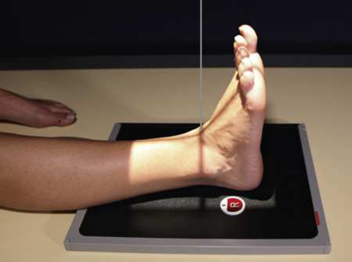
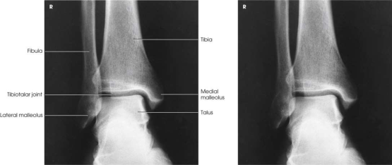

# Rx Gleznă (Articulație Talocrurală) — Incidență Antero-Posterioară (AP) (Merrill)

  📷 Radiografie Convențională (Rx)
  <strong>Actualizat:</strong> 2026-09-16
  <strong>Autor:</strong> Referință Merrill

---

-   __1. Rezumat Clinic & Indicații__

    ---

    === "Indicații Clinice"

        - Conform reperelor anatomice standard din tratat

    === "Ghid Național IRIS"

        !!! info "Referință Primară: Ghidul Național IRIS (Ordinul MS 1342/2012)"
            - **Capitol Ghid IRIS:** *Ghidul Național IRIS*
            - **Grad de Recomandare:** **De verificat pe indicație; fără grad atribuit automat**
            - **Nivel de Iradiere Estimată:** `De verificat pentru examinarea și populația selectate`

            [:octicons-search-16: Deschide Ghidul IRIS](../../iris.md){ .md-button .md-button--primary } [:material-open-in-new: Aplicația Oficială PWA](https://radiologie-pediatrica.ro/iris/){ .md-button target="_blank" rel="noopener" }
-   __2. Poziționare & Centrare Fascicul__

    ---

    - **Poziție Pacient:** se așază pacientul în Decubit dorsal sau Poziție Șezândă poziție cu afected extremity fully extins.; se ajustează Gleznă (Articulație Talocrurală) articulație în anatomic poziție (Picior pointing straight up) la obtain true Incidență Antero-Posterioară (AP). se flectează Gleznă (Articulație Talocrurală) și Picior enough la place axa longitudinală de Picior în vertical poziție (Fig. 7.91). Ball și Egbert 16 stated that appearance de Gleznă (Articulație Talocrurală) mortise este nu appreciably altered prin moderate plantar flexion sau dorsiflexion ca long ca membru inferior este nu rotit either laterally sau medially. se efectuează ecranarea gonadelor cu șorț plumbat.
    - **Punct de Centrare Fascicul:** perpendicular through Gleznă (Articulație Talocrurală) articulație la point midway între malleoli.
    - **Distanță Focar-Film (DFF / SID):** Nespecificat în fragmentul extras; de verificat în sursă
    - **Comandă Respiratorie:** Conform reperelor anatomice standard din tratat

-   __3. Parametri Tehnici Expunere__

    ---

    | Parametru Tehnic | Valoare Configurare Generator / Tub |
    |:-----------------|:-------------------------------------|
    | **Tensiune Tub (kV)** | DE CONFIGURAT PE APARAT |
    | **Sarcină / Produs Curent-Timp (mAs)** | DE CONFIGURAT PE APARAT |
    | **Distanță Focar-Film (DFF / SID)** | Nespecificat în fragmentul extras; de verificat în sursă |
    | **Grilă Antidifuzoare (Bucky)** | DE CONFIGURAT PE APARAT |
    | **Dimensiune Focar** | DE CONFIGURAT PE APARAT |
    | **Camere de Ionizare AEC** | DE CONFIGURAT PE APARAT |
    | **Colimare Fascicul** | se ajustează câmp de iradiere la 1 inch (2.5 cm) pe sides de Gleznă (Articulație Talocrurală) și 8 inches (18 cm) longitudinal pentru include heel. Place marker de lateralitate (D/S) în collimated expunere field. |
    | **Filtrare Tub** | DE CONFIGURAT PE APARAT |

-   __4. Criterii de Calitate & Reușită Imagine__

    ---

    - Criterii radiologice de calitate imaginii:
    - Evidence de corect collimation și presence de marker de lateralitate (D/S) plasat clear de anatomy de interest
    - Gleznă (Articulație Talocrurală) articulație centrat pe expunere area
    - medial și lateral malleoli
    - astragal (talus)
    - Absența rotației anatomice (simetrie bilaterală perfectă) de Gleznă (Articulație Talocrurală)
    - Normal overlapping de tibiofibular articulation cu anterior tubercle slightly superimposed over fibula
    - astragal (talus) slightly overlapping distal fibula
    - fără overlapping de medial talomalleolar articulation
    - Tibiotalar spații articulare
    - Bony detalii trabeculare osoase și surrounding soft tissues

-   __5. Protecție Radiologică (ALARA)__

    ---

    - Nespecificat în fragmentul extras; de verificat în sursă

!!! note "Observații Clinice & Tehnice"
    inferior tibiofibular articulation și talofibular articulation sunt nu “open” sau vizualizat în profile în true Incidență Antero-Posterioară (AP). This este positive sign pentru radiologist because it indicates that pacientul has fără ruptured ligaments sau other types de separations. pentru this reason, it este important that poziție de Gleznă (Articulație Talocrurală) fie anatomically “true” pentru Incidență Antero-Posterioară (AP) vizualizat (Fig. 7.92).

### 🖼️ Imagini

<figure class="protocol-image-card" markdown>

<figcaption><strong>Merrill — pagina PDF 519, imaginea 1</strong> — Imagine din fragmentul sursă; asocierea necesită revizie.</figcaption>

</figure>

<figure class="protocol-image-card" markdown>

<figcaption><strong>Merrill — pagina PDF 519, imaginea 2</strong> — Imagine din fragmentul sursă; asocierea necesită revizie.</figcaption>

</figure>

=== "Ghid Rapid de Execuție"

    1. **Identificarea și verificarea pacientului:** verificare identitate, zonă de examinat, consimțământ conform procedurii și evaluarea posibilității unei sarcini, când este relevantă.
    2. **Pregătire:** îndepărtarea oricăror obiecte radiopace (bijuterii, agrafe, fermoare, proteze, pansamente dense).
    3. **Poziționare precisă:** alinierea receptorului de imagine și a tubului la distanța prescrisă (Nespecificat în fragmentul extras; de verificat în sursă).
    4. **Colimare strictă:** adaptarea fasciculului strict la regiunea de diagnostic pentru scăderea iradierii și reducerea radiației difuze.
    5. **Radioprotecție:** verificarea [politicii RX](../radioprotectie.md), cu măsuri distincte pentru pacient, personal și însoțitor.

## Surse de documentare

- [Merrill’s Atlas, 7. Lower Extremity, pagini PDF 518–519](../../assets/protocols/sources/a56d45c16829_Merrills_Atlas_of_Radiographic_Positioning__Procedures_3Vol_Set.pdf#page=518)

## Fragmente sursă traduse (referință tehnică)

### anatomy

AP incidență de ankle articulație, distal ends de tibia și fibula, și proximal portion de astragal (talus).

### collimation

• se ajustează câmp de iradiere la 1 inch (2.5 cm) pe sides de ankle și 8 inches (18 cm) longitudinal pentru include heel. Place side
marker în collimated expunere field.

### cr

• perpendicular through ankle articulație la point midway între malleoli.

### criteria

Criterii radiologice de calitate imaginii:
• Evidence de corect collimation și presence de marker de lateralitate (D/S) plasat clear de anatomy de interest
• Ankle articulație centrat pe expunere area
• medial și lateral malleoli
• astragal (talus)
• Absența rotației anatomice (simetrie bilaterală perfectă) de ankle
• Normal overlapping de tibiofibular articulation cu anterior tubercle slightly superimposed over fibula
• astragal (talus) slightly overlapping distal fibula
• fără overlapping de medial talomalleolar articulation
• Tibiotalar spații articulare
• Bony detalii trabeculare osoase și surrounding soft tissues

### notes

inferior tibiofibular articulation și talofibular articulation sunt nu “open” sau vizualizat în profile în true AP incidență. This
este positive sign pentru radiologist because it indicates that pacientul has fără ruptured ligaments sau other types de separations. pentru this reason,
it este important that poziție de ankle fie anatomically “true” pentru AP incidență vizualizat (Fig. 7.92).

### part_pos

• se ajustează ankle articulație în anatomic poziție (picior pointing straight up) la obtain true AP incidență. se flectează ankle și picior
enough la place axa longitudinală de picior în vertical poziție (Fig. 7.91).
• Ball și Egbert 16 stated that appearance de ankle mortise este nu appreciably altered prin moderate plantar flexion sau dorsiflexion
ca long ca membru inferior este nu rotit either laterally sau medially.
• se efectuează ecranarea gonadelor cu șorț plumbat.

### patient_pos

• se așază pacientul în decubit dorsal sau așezat pe scaun poziție cu afected extremity fully extins.

### tech

poziționat prin manufacturer sau department protocol pentru corect anatomy display orientation; raza centrală plate: 10 × 12 inches (24 × 30 cm) longitudinal.

