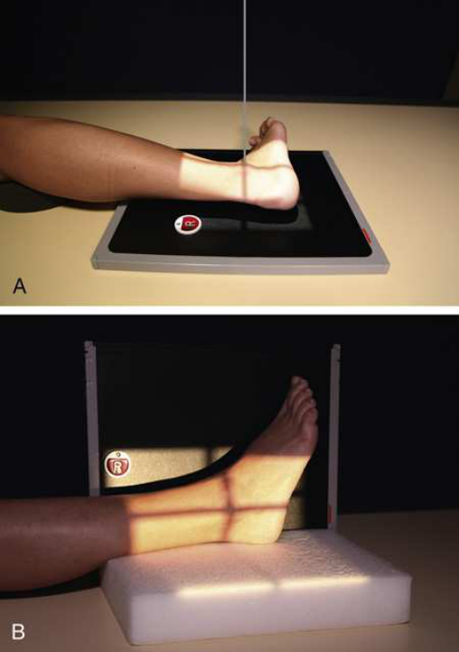
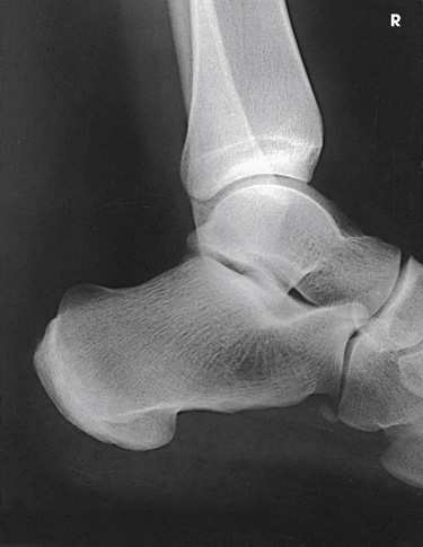

# Rx Gleznă (Articulație Talocrurală) — Incidență de Profil (Lateral) — Latero-Medial (Merrill)

  📷 Radiografie Convențională (Rx)
  <strong>Actualizat:</strong> 2026-09-16
  <strong>Autor:</strong> Referință Merrill

---

-   __1. Rezumat Clinic & Indicații__

    ---

    === "Indicații Clinice"

        - Conform reperelor anatomice standard din tratat

    === "Ghid Național IRIS"

        !!! info "Referință Primară: Ghidul Național IRIS (Ordinul MS 1342/2012)"
            - **Capitol Ghid IRIS:** *Ghidul Național IRIS*
            - **Grad de Recomandare:** **De verificat pe indicație; fără grad atribuit automat**
            - **Nivel de Iradiere Estimată:** `De verificat pentru examinarea și populația selectate`

            [:octicons-search-16: Deschide Ghidul IRIS](../../iris.md){ .md-button .md-button--primary } [:material-open-in-new: Aplicația Oficială PWA](https://radiologie-pediatrica.ro/iris/){ .md-button target="_blank" rel="noopener" }
-   __2. Poziționare & Centrare Fascicul__

    ---

    - **Poziție Pacient:** Have Decubit dorsal pacient turn away de la afected side until extins membru inferior este plasat laterally.; se centrează receptorul de imagine la Gleznă (Articulație Talocrurală) articulație și se ajustează receptorul de imagine so that its axa longitudinală este paralel cu axa longitudinală de membru inferior. se ajustează Picior în Incidență de Profil (lateral). Se instruiește pacientul să turn anteriorly sau posteriorly ca required la place Rotulă (Patelă) perpendicular pe plan orizontal (Fig. 7.96A). This incidență also poate fie performed ca cross table lateral cu pacientul Decubit dorsal (Fig. 7.96B). If necessary, place support under pacientul’s Genunchi. se efectuează ecranarea gonadelor cu șorț plumbat.
    - **Punct de Centrare Fascicul:** perpendicular through Gleznă (Articulație Talocrurală) articulație, entering ½ inch (1.3 cm) superior la maleolă laterală (fibulară).
    - **Distanță Focar-Film (DFF / SID):** Nespecificat în fragmentul extras; de verificat în sursă
    - **Comandă Respiratorie:** Conform reperelor anatomice standard din tratat

-   __3. Parametri Tehnici Expunere__

    ---

    | Parametru Tehnic | Valoare Configurare Generator / Tub |
    |:-----------------|:-------------------------------------|
    | **Tensiune Tub (kV)** | DE CONFIGURAT PE APARAT |
    | **Sarcină / Produs Curent-Timp (mAs)** | DE CONFIGURAT PE APARAT |
    | **Distanță Focar-Film (DFF / SID)** | Nespecificat în fragmentul extras; de verificat în sursă |
    | **Grilă Antidifuzoare (Bucky)** | DE CONFIGURAT PE APARAT |
    | **Dimensiune Focar** | DE CONFIGURAT PE APARAT |
    | **Camere de Ionizare AEC** | DE CONFIGURAT PE APARAT |
    | **Colimare Fascicul** | se ajustează câmp de iradiere la 1 inch (2.5 cm) pe sides de Gleznă (Articulație Talocrurală) și 8 inches (18 cm) longitudinal. Include heel și fifth metatarsal base. Place marker de lateralitate (D/S) în collimated expunere field. |
    | **Filtrare Tub** | DE CONFIGURAT PE APARAT |

-   __4. Criterii de Calitate & Reușită Imagine__

    ---

    - Criterii radiologice de calitate imaginii:
    - Colimare adecvată vizibilă și prezența markerului de lateralitate (D/S) plasat clear de anatomy de interest
    - Gleznă (Articulație Talocrurală) articulație centrat pe expunere area
    - distal tibia și fibula, astragal (talus), și adjacent oase tarsiene
    - Gleznă (Articulație Talocrurală) în true Incidență de Profil (lateral)
    - Tibiotalar articulație well visualized, cu medial și lateral talar domes superimposed
    - Fibula over posterior half de tibia
    - Bony detalii trabeculare osoase și surrounding soft tissues

-   __5. Protecție Radiologică (ALARA)__

    ---

    - Nespecificat în fragmentul extras; de verificat în sursă

!!! note "Observații Clinice & Tehnice"
    Conform reperelor anatomice standard din tratat

### 🖼️ Imagini

<figure class="protocol-image-card" markdown>

<figcaption><strong>Merrill — pagina PDF 523, imaginea 1</strong> — Imagine din fragmentul sursă; asocierea necesită revizie.</figcaption>

</figure>

<figure class="protocol-image-card" markdown>

<figcaption><strong>Merrill — pagina PDF 524, imaginea 2</strong> — Imagine din fragmentul sursă; asocierea necesită revizie.</figcaption>

</figure>

=== "Ghid Rapid de Execuție"

    1. **Identificarea și verificarea pacientului:** verificare identitate, zonă de examinat, consimțământ conform procedurii și evaluarea posibilității unei sarcini, când este relevantă.
    2. **Pregătire:** îndepărtarea oricăror obiecte radiopace (bijuterii, agrafe, fermoare, proteze, pansamente dense).
    3. **Poziționare precisă:** alinierea receptorului de imagine și a tubului la distanța prescrisă (Nespecificat în fragmentul extras; de verificat în sursă).
    4. **Colimare strictă:** adaptarea fasciculului strict la regiunea de diagnostic pentru scăderea iradierii și reducerea radiației difuze.
    5. **Radioprotecție:** verificarea [politicii RX](../radioprotectie.md), cu măsuri distincte pentru pacient, personal și însoțitor.

## Surse de documentare

- [Merrill’s Atlas, 7. Lower Extremity, pagini PDF 521–524](../../assets/protocols/sources/a56d45c16829_Merrills_Atlas_of_Radiographic_Positioning__Procedures_3Vol_Set.pdf#page=521)

## Fragmente sursă traduse (referință tehnică)

### anatomy

lateral incidență de lower third de tibia și fibula, ankle articulație, și oase tarsiene (Fig. 7.97).

### collimation

• se ajustează câmp de iradiere la 1 inch (2.5 cm) pe sides de ankle și 8 inches (18 cm) longitudinal. Include heel și fifth
metatarsal base. Place marker de lateralitate (D/S) în collimated expunere field.

### cr

• perpendicular through ankle articulație, entering ½ inch (1.3 cm) superior la maleolă laterală (fibulară).

### criteria

Criterii radiologice de calitate imaginii:
• Colimare adecvată vizibilă și prezența markerului de lateralitate (D/S) plasat clear de anatomy de interest
• Ankle articulație centrat pe expunere area
• distal tibia și fibula, astragal (talus), și adjacent oase tarsiene
• Ankle în true poziție de profil (lateral)
• Tibiotalar articulație well visualized, cu medial și lateral talar domes superimposed
• Fibula over posterior half de tibia
• Bony detalii trabeculare osoase și surrounding soft tissues

### part_pos

• se centrează receptorul de imagine la ankle articulație și se ajustează receptorul de imagine so that its axa longitudinală este paralel cu axa longitudinală de membru inferior.
• se ajustează picior în poziție de profil (lateral).
• Se instruiește pacientul să turn anteriorly sau posteriorly ca required la place rotulă (patelă) perpendicular pe plan orizontal (Fig. 7.96A). This
incidență also poate fie performed ca cross table lateral cu pacientul în decubit dorsal (Fig. 7.96B).
• If necessary, place support under pacientul’s genunchi.
• se efectuează ecranarea gonadelor cu șorț plumbat.

### patient_pos

• Have în decubit dorsal pacient turn away de la afected side until extins membru inferior este plasat laterally.

### tech

poziționat prin manufacturer sau department protocol pentru corect anatomy display orientation; raza centrală plate: 10 × 12 inches (24 × 30 cm) longitudinal.

