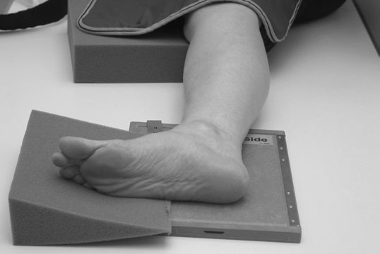
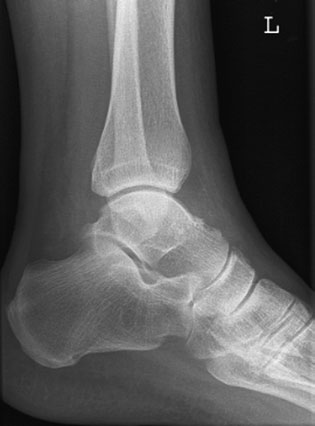
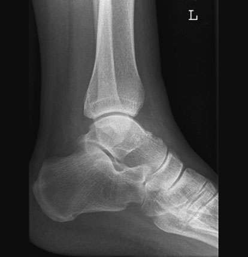
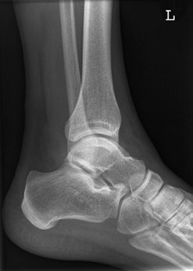
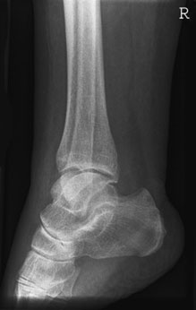

# Rx Gleznă (Articulație Talocrurală) joint Poziționare of patient and cassette

  📷 Radiografie Convențională (Rx)
  <strong>Actualizat:</strong> 2026-09-16
  <strong>Autor:</strong> Departamentul de Radiologie / Referință Clark (Ed. 12)

---

-   __1. Rezumat Clinic & Indicații__

    ---

    === "Indicații Clinice"

        - Inversion injury de Gleznă (Articulație Talocrurală) este common și poate result în suspiciune de fractură de Profil (lateral) malleolus sau base de fifth metatarsal. Investigation de injury trebuie să therefore cover ambele areas.
        - Tear de collateral ligaments fără bone suspiciune de fractură poate make Gleznă (Articulație Talocrurală) unstable, despite normal radiografie. Stress incidențe poate clarify this problem și ultrasound sau MRI poate fie useful. Complex injuries poate occur cu suspiciune de fractură de ambele malleoli, rendering Gleznă (Articulație Talocrurală) mortise very unstable, especially if associated cu suspiciune de fractură de posterior tibia – socalled trimalleolar suspiciune de fractură – și/sau disruption de distal tibio-fibular synchondrosis. These injuries frequently require surgical fixation. Profil (lateral) (basic) – medio-Profil (lateral) Normal Profil (lateral) radiografie de Gleznă (Articulație Talocrurală) cap de 1st metatarsal medial cuneiform Navicular Trochlear surface de astragal (talus) Gleznă (Articulație Talocrurală) articulație Tibia Fibula Promontory de tibia Profil (lateral) malleolus posterior talo-calcaneal articulație Calcaneu posterior tubercle de astragal (talus) Annotated radiografie de Profil (lateral) Gleznă (Articulație Talocrurală) Over rotație Under rotație

    === "Ghid Național IRIS"

        !!! info "Referință Primară: Ghidul Național IRIS (Ordinul MS 1342/2012)"
            - **Capitol Ghid IRIS:** *Ghidul Național IRIS*
            - **Grad de Recomandare:** **De verificat pe indicație; fără grad atribuit automat**
            - **Nivel de Iradiere Estimată:** `De verificat pentru examinarea și populația selectate`

            [:octicons-search-16: Deschide Ghidul IRIS](../../iris.md){ .md-button .md-button--primary } [:material-open-in-new: Aplicația Oficială PWA](https://radiologie-pediatrica.ro/iris/){ .md-button target="_blank" rel="noopener" }
-   __2. Poziționare & Centrare Fascicul__

    ---

    - **Poziție Pacient:** • cu Gleznă (Articulație Talocrurală) dorsiflexed, pacientul turns pe la partea afectată until malleoli sunt superimposed vertically și tibia este paralel cu casetă.
• A 15-grade pad este plasat under Profil (lateral) margine de forefoot și Se plasează un suport/pernă sub genunchi pentru sprijin și relaxare. lower edge de caseta este poziționat just below plantar aspect de heel.
    - **Punct de Centrare Fascicul:** • Centre over maleolă medială (tibială), cu raza centrală centrală la drept-angles la axis de tibia.
    - **Distanță Focar-Film (DFF / SID):** 100 cm
    - **Comandă Respiratorie:** Apnee pe durata expunerii (apnee în inspir pentru torace; expir pentru Abdomen/bazin).

-   __3. Parametri Tehnici Expunere__

    ---

    | Parametru Tehnic | Valoare Configurare Generator / Tub |
    |:-----------------|:-------------------------------------|
    | **Tensiune Tub (kV)** | DE CONFIGURAT PE APARAT |
    | **Sarcină / Produs Curent-Timp (mAs)** | Conform AEC / grosime anatomică |
    | **Distanță Focar-Film (DFF / SID)** | 100 cm |
    | **Grilă Antidifuzoare (Bucky)** | Conform grosimii anatomice (> 10-12 cm cu grilă) |
    | **Dimensiune Focar** | Focar Mic (0.6 mm) |
    | **Camere de Ionizare AEC** | DE CONFIGURAT PE APARAT |
    | **Colimare Fascicul** | Colimare strictă la aria anatomică de interes diagnostic |
    | **Filtrare Tub** | Totală ≥ 2.5 mm Al echivalent (conform Clark: 3.0 mm Al eq.) |

-   __4. Criterii de Calitate & Reușită Imagine__

    ---

    - lower third de Gambă (Tibie și Peroneu) trebuie să fie included.
    - medial și Profil (lateral) margini de trochlear articular surface de astragal (talus) trebuie să fie superimposed pe imagine.
    - Erori de evitat / remedii: Over-rotație causes fibula la fie projected posterior la tibia și medial și Profil (lateral) margini de trochlear articulations sunt nu superimposed.
    - Erori de evitat / remedii: Under-rotație causes shaft de fibula la fie superimposed pe tibia și medial și Profil (lateral) margini de trochlear articulations sunt nu superimposed.
    - Erori de evitat / remedii: base de fifth metatarsal și navicular bone trebuie să fie included pe imagine la exclude suspiciune de fractură.

-   __5. Protecție Radiologică (ALARA)__

    ---

    - Ecranare gonadică cu șorț plumbat dacă gonadele sunt în apropierea fasciculului util (regula ALARA).
    - Colimare precisă la dimensiunea anatomică strict necesară pentru reducerea dozei și a radiației difuze.
    - Verificarea posibilității unei sarcini la pacientele de vârstă fertilă înainte de expunere.

!!! note "Observații Clinice & Tehnice"
    Pregătirea pacientului prin îndepărtarea tuturor accesoriilor radio-opace.

### 🖼️ Imagini

<figure class="protocol-image-card" markdown>

<figcaption><strong>trebuie să fie included pe imagine la exclude suspiciune de fractură.</strong> — Poziționare pacient și centrare fascicul conform Clark (Ed. 12)</figcaption>

</figure>

<figure class="protocol-image-card" markdown>

<figcaption><strong>• Tear de collateral ligaments fără bone suspiciune de fractură poate</strong> — Aspect radiografic / ghid de poziționare conform tratatului Clark (Ed. 12)</figcaption>

</figure>

<figure class="protocol-image-card" markdown>

<figcaption><strong>make Gleznă (Articulație Talocrurală) unstable, despite normal radiografie. Stress</strong> — Aspect radiografic / ghid de poziționare conform tratatului Clark (Ed. 12)</figcaption>

</figure>

<figure class="protocol-image-card" markdown>

<figcaption><strong>poate fie useful. Complex injuries poate occur cu suspiciune de fractură de</strong> — Aspect radiografic / ghid de poziționare conform tratatului Clark (Ed. 12)</figcaption>

</figure>

<figure class="protocol-image-card" markdown>

<figcaption><strong>cially if associated cu suspiciune de fractură de posterior tibia – so-</strong> — Aspect radiografic / ghid de poziționare conform tratatului Clark (Ed. 12)</figcaption>

</figure>

=== "Ghid Rapid de Execuție"

    1. **Identificarea și verificarea pacientului:** verificare identitate, zonă de examinat, consimțământ conform procedurii și evaluarea posibilității unei sarcini, când este relevantă.
    2. **Pregătire:** îndepărtarea oricăror obiecte radiopace (bijuterii, agrafe, fermoare, proteze, pansamente dense).
    3. **Poziționare precisă:** alinierea receptorului de imagine și a tubului la distanța prescrisă (100 cm).
    4. **Colimare strictă:** adaptarea fasciculului strict la regiunea de diagnostic pentru scăderea iradierii și reducerea radiației difuze.
    5. **Radioprotecție:** verificarea [politicii RX](../radioprotectie.md), cu măsuri distincte pentru pacient, personal și însoțitor.

## Surse de documentare

- [Clark's Positioning in Radiography (Ed. 12), Pagina 130](../../assets/protocols/sources/Clark___Positioning_in_Radiography__12th_edition.pdf#page=130)
