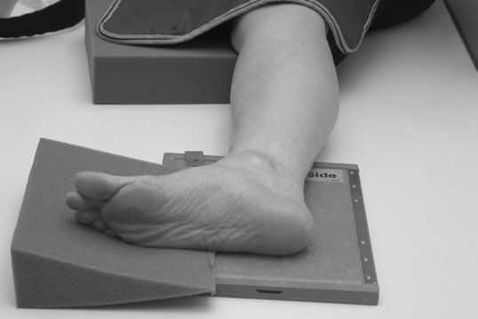
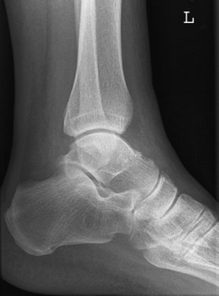
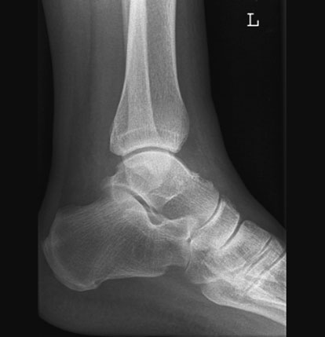
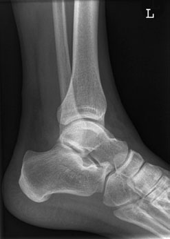
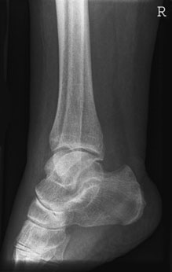

# Rx articulația gleznei Poziționarea pacientului și a casetei

  📷 Radiografie Convențională (Rx)
  <strong>Actualizat:</strong> 2026-09-16
  <strong>Autor:</strong> Departamentul de Radiologie / Referință Clark (Ed. 12)

---

-   __1. Rezumat Clinic & Indicații__

    ---

    === "Indicații Clinice"

        - Leziunea prin inversiune a gleznei (articulației talocrurale) este frecventă și poate duce la suspiciunea unei fracturi a maleolei de profil (laterale) sau a bazei celui de-al cincilea metatarsian. Investigarea leziunii trebuie, prin urmare, să acopere ambele regiuni.
        - Ruptura ligamentelor colaterale, fără suspiciune de fractură osoasă, poate face glezna (articulația talocrurală) instabilă, în ciuda unei radiografii normale. Incidențele de stres pot clarifica această problemă, iar ecografia sau IRM pot fi utile. Pot apărea leziuni complexe cu suspiciune de fractură a ambelor maleole, care fac scoaba tibioperonieră a gleznei foarte instabilă, mai ales dacă se asociază cu suspiciune de fractură a porțiunii posterioare a tibiei — așa-numita suspiciune de fractură trimaleolară — și/sau cu întreruperea sincondrozei tibiofibulare distale. Aceste leziuni necesită frecvent fixare chirurgicală.
        - Profil (lateral), incidență de bază — medio-laterală. Radiografie normală de profil a gleznei (articulația talocrurală). Capul metatarsianului 1; cuneiform medial; navicular; suprafața trohleară a astragalului (talusului); articulația gleznei (talocrurală); tibie; fibulă; promontoriul tibiei; maleolă laterală; articulație talocalcaneană posterioară; calcaneu; tubercul posterior al astragalului (talusului). Radiografie adnotată de profil a gleznei (articulația talocrurală). Rotație excesivă. Rotație insuficientă.

    === "Ghid Național IRIS"

        !!! info "Referință Primară: Ghidul Național IRIS (Ordinul MS 1342/2012)"
            - **Capitol Ghid IRIS:** *Aparat locomotor & Membru inferior*
            - **Grad de Recomandare:** **Grad A**
            - **Nivel de Iradiere Estimată:** `Clasa 1 (Minimă < 0.01 mSv)`

            [:octicons-search-16: Deschide Ghidul IRIS](../../iris.md){ .md-button .md-button--primary } [:material-open-in-new: Aplicația Oficială PWA](https://radiologie-pediatrica.ro/iris/){ .md-button target="_blank" rel="noopener" }

-   __2. Poziționare & Centrare Fascicul__

    ---

    - **Poziție Pacient:**
        - Cu glezna în dorsiflexie, pacientul se rotește spre partea afectată până când maleolele sunt suprapuse vertical, iar tibia este paralelă cu caseta.
        - Un suport de 15 grade este plasat sub marginea de profil (lateral) a antepiciorului și se plasează un suport/pernă sub genunchi pentru sprijin și relaxare. Marginea inferioară a casetei este poziționată imediat sub aspectul plantar al călcâiului.
    - **Punct de Centrare Fascicul:** • Se centrează deasupra maleolei mediale (tibiale), cu raza centrală perpendiculară pe axa tibiei.
    - **Distanță Focar-Film (DFF / SID):** 100 cm
    - **Comandă Respiratorie:** Apnee pe durata expunerii (apnee în inspir pentru torace; expir pentru Abdomen/bazin).

-   __3. Parametri Tehnici Expunere__

    ---

    | Parametru Tehnic | Valoare Configurare Generator / Tub |
    |:-----------------|:-------------------------------------|
    | **Tensiune Tub (kV)** | DE CONFIGURAT PE APARAT |
    | **Sarcină / Produs Curent-Timp (mAs)** | Conform AEC / grosimii anatomice |
    | **Distanță Focar-Film (DFF / SID)** | 100 cm |
    | **Grilă Antidifuzoare (Bucky)** | Conform grosimii anatomice (> 10-12 cm cu grilă) |
    | **Dimensiune Focar** | Focar Mic (0.6 mm) |
    | **Camere de Ionizare AEC** | DE CONFIGURAT PE APARAT |
    | **Colimare Fascicul** | Colimare strictă la aria anatomică de interes diagnostic |
    | **Filtrare Tub** | Totală ≥ 2.5 mm Al echivalent (conform Clark: 3.0 mm Al echivalent) |

-   __4. Criterii de Calitate & Reușită Imagine__

    ---

    - Treimea inferioară a gambei (tibia și peroneul) trebuie inclusă.
    - Marginile medială și de profil (lateral) ale suprafeței articulare trohleare a astragalului trebuie să fie suprapuse pe imagine.
    - Erori de evitat / remedii: Suprarotația determină proiectarea fibulei posterior față de tibie, iar marginile medială și de profil (lateral) ale articulațiilor trohleare nu sunt suprapuse.
    - Erori de evitat / remedii: Subrotația determină suprapunerea diafizei fibulei peste tibie, iar marginile medială și de profil (lateral) ale articulațiilor trohleare nu sunt suprapuse.
    - Erori de evitat / remedii: Baza celui de-al cincilea metatarsian și osul navicular trebuie incluse pe imagine pentru a exclude suspiciunea de fractură.

-   __5. Protecție Radiologică (ALARA)__

    ---

    - Ecranare gonadică cu șorț plumbat dacă gonadele sunt în apropierea fasciculului util (regula ALARA).
    - Colimare precisă la dimensiunea anatomică strict necesară pentru reducerea dozei și a radiației difuze.
    - Verificarea posibilității unei sarcini la pacientele de vârstă fertilă înainte de expunere.

!!! note "Observații Clinice & Tehnice"
    Pregătirea pacientului prin îndepărtarea tuturor accesoriilor radio-opace.

### 🖼️ Imagini

<figure class="protocol-image-card" markdown>

<figcaption><strong>trebuie să fie inclusă pe imagine pentru a exclude suspiciunea de fractură.</strong> — Poziționarea pacientului și centrarea fasciculului conform Clark (Ed. 12)</figcaption>

</figure>

<figure class="protocol-image-card" markdown>

<figcaption><strong>• Ruptura ligamentelor colaterale fără suspiciune de fractură osoasă poate</strong> — Aspect radiografic / ghid de poziționare conform tratatului Clark (Ed. 12)</figcaption>

</figure>

<figure class="protocol-image-card" markdown>

<figcaption><strong>face glezna instabilă, în ciuda unei radiografii normale. Incidențele de stres</strong> — Aspect radiografic / ghid de poziționare conform tratatului Clark (Ed. 12)</figcaption>

</figure>

<figure class="protocol-image-card" markdown>

<figcaption><strong>pot fi utile. Pot apărea leziuni complexe cu suspiciune de fractură a</strong> — Aspect radiografic / ghid de poziționare conform tratatului Clark (Ed. 12)</figcaption>

</figure>

<figure class="protocol-image-card" markdown>

<figcaption><strong>mai ales dacă este asociată cu suspiciune de fractură a porțiunii posterioare a tibiei – așa-</strong> — Aspect radiografic / ghid de poziționare conform tratatului Clark (Ed. 12)</figcaption>

</figure>

=== "Ghid Rapid de Execuție"

    1. **Identificarea și verificarea pacientului:** verificare identitate, zonă de examinat, consimțământ conform procedurii și evaluarea posibilității unei sarcini, când este relevantă.
    2. **Pregătire:** îndepărtarea oricăror obiecte radiopace (bijuterii, agrafe, fermoare, proteze, pansamente dense).
    3. **Poziționare precisă:** alinierea receptorului de imagine și a tubului la distanța prescrisă (100 cm).
    4. **Colimare strictă:** adaptarea fasciculului strict la regiunea de diagnostic pentru scăderea iradierii și reducerea radiației difuze.
    5. **Radioprotecție:** verificarea [politicii RX](../radioprotectie.md), cu măsuri distincte pentru pacient, personal și însoțitor.

## Surse de documentare

- [Clark's Positioning in Radiography (Ed. 12), Pagina 130](https://books.google.com/books/about/Clark_s_Positioning_in_Radiography.html?id=Xxu6MwEACAAJ)
