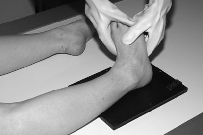
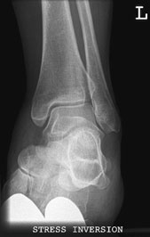
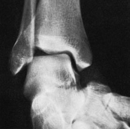
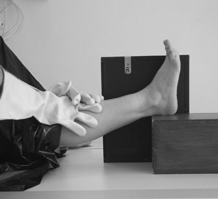
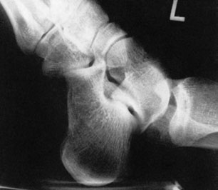
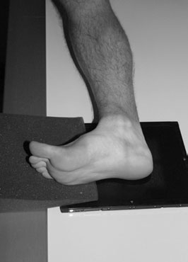
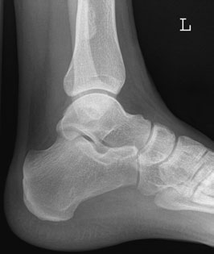
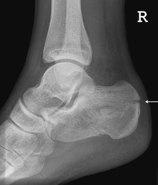
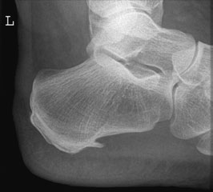

# Rx Gleznă (Articulație Talocrurală) joint Stress Incidență for subluxation

  📷 Radiografie Convențională (Rx)
  <strong>Actualizat:</strong> 2026-09-16
  <strong>Autor:</strong> Departamentul de Radiologie / Referință Clark (Ed. 12)

---

-   __1. Rezumat Clinic & Indicații__

    ---

    === "Indicații Clinice"

        - normal juvenile calcaneal apophysis este dense și often appears fragmented. appearance rarely obscures suspiciune de fractură și trebuie să rarely, if ever, require incidențe de contralateral side pentru assessment.
        - primary trabeculae de bones follow lines de maximum load. în Calcaneu, this results în apparent lucency în central area. This trebuie să nu fie mistaken pentru pathology.
        - suspiciune de fractură de Calcaneu due la heavy landing pe heel causes compression injury cu depression de central area prin astragal (talus). This este seen ca flattening de Bohler’s angle la less than 40 grade, ca vizualizat în diagram.
        - Small spurs sau ‘tug’ lesions la attachments de Achilles tendon și plantar ligament sunt common. If significant, they sunt usually ill-defined și clinically tender. Ultrasound poate help în their assessment. Computed Tomografie Liniară Convențională (CT) este very useful pentru complete evaluation de complex calcaneal suspiciune de fractură, especially utilizing direct plan coronal, multiplanar și three-dimensional reconstructions. 118 40° Normal Profil (lateral) radiografie de Calcaneu suspiciune de fractură de Calcaneu Calcaneal spur Line diagram evidențiind Bohler’s angle Profil (lateral) radiografii de Calcaneu

    === "Ghid Național IRIS"

        !!! info "Referință Primară: Ghidul Național IRIS (Ordinul MS 1342/2012)"
            - **Capitol Ghid IRIS:** *Ghidul Național IRIS*
            - **Grad de Recomandare:** **De verificat pe indicație; fără grad atribuit automat**
            - **Nivel de Iradiere Estimată:** `De verificat pentru examinarea și populația selectate`

            [:octicons-search-16: Deschide Ghidul IRIS](../../iris.md){ .md-button .md-button--primary } [:material-open-in-new: Aplicația Oficială PWA](https://radiologie-pediatrica.ro/iris/){ .md-button target="_blank" rel="noopener" }
-   __2. Poziționare & Centrare Fascicul__

    ---

    - **Poziție Pacient:** • pacientul este culcat Decubit dorsal pe masa de examinare, cu limb extins.
• Picior este ridicat și sprijinit pe firm pad.
• Gleznă (Articulație Talocrurală) este dorsiflexed și limb rotit medially until malleoli sunt echidistant față de tabletop.
• film radiologic este sprijinit vertically pe / sprijinit de medial aspect de Picior.
• doctor applies firm downward pressure pe lower membru inferior.

• de la Decubit dorsal poziție, pacientul rotates pe la partea afectată.
• membru inferior este rotit until medial și Profil (lateral) malleoli sunt superimposed vertically.
• A 15-grade pad este plasat under anterior aspect de Genunchi și Profil (lateral) margine de forefoot pentru support.
• caseta este plasat cu lower edge just below plantar aspect de heel.
    - **Punct de Centrare Fascicul:** • Centre la Profil (lateral) malleoli cu Fascicul Orizontal.

• Centre 2.5 cm distal la maleolă medială (tibială), cu raza centrală verticală centrală perpendicular pe casetă.
    - **Distanță Focar-Film (DFF / SID):** 100 cm
    - **Comandă Respiratorie:** Apnee pe durata expunerii (apnee în inspir pentru torace; expir pentru Abdomen/bazin).

-   __3. Parametri Tehnici Expunere__

    ---

    | Parametru Tehnic | Valoare Configurare Generator / Tub |
    |:-----------------|:-------------------------------------|
    | **Tensiune Tub (kV)** | DE CONFIGURAT PE APARAT |
    | **Sarcină / Produs Curent-Timp (mAs)** | Conform AEC / grosime anatomică |
    | **Distanță Focar-Film (DFF / SID)** | 100 cm |
    | **Grilă Antidifuzoare (Bucky)** | Conform grosimii anatomice (> 10-12 cm cu grilă) |
    | **Dimensiune Focar** | Focar Mic (0.6 mm) |
    | **Camere de Ionizare AEC** | DE CONFIGURAT PE APARAT |
    | **Colimare Fascicul** | Colimare strictă adaptată pe receptor 18 x 24 cm |
    | **Filtrare Tub** | Totală ≥ 2.5 mm Al echivalent (conform Clark: 3.0 mm Al eq.) |

-   __4. Criterii de Calitate & Reușită Imagine__

    ---

    - adjacent oase tarsiene trebuie să fie included în Profil (lateral) incidență, together cu Gleznă (Articulație Talocrurală) articulație.

-   __5. Protecție Radiologică (ALARA)__

    ---

    - The doctor applying the stress must wear a suitable lead protective apron and gloves.
    - If the technique is done using a mobile image intensifier, then local rules must be implemented and all staff must be provided with protective clothing. Normal Subluxation Antero-Posterior (AP) projection with inversion stress Profil (Lateral) projection with stress showing subluxation
    - Ecranare gonadică cu șorț plumbat dacă gonadele sunt în apropierea fasciculului util (regula ALARA).
    - Colimare precisă la dimensiunea anatomică strict necesară pentru reducerea dozei și a radiației difuze.
    - Verificarea posibilității unei sarcini la pacientele de vârstă fertilă înainte de expunere.

!!! note "Observații Clinice & Tehnice"
    • Antero-posterior (AP) stress incidență evidențiază widening de spații articulare if calcaneo-fibular spații articulare este torn.
• Profil (lateral) stress incidențe evidențiază anterior subluxation if anterior talo-fibular ligament este torn.
• Similar techniques sunt used în theatre, cu imagine intensifier poziționat above Gleznă (Articulație Talocrurală). grade de stress applied este viewed și recorded.

This incidență este used la evidențiază calcaneal spurs. pentru comparison, radiografie de ambele heels în Profil (lateral) poziție poate fie necessary.

### 🖼️ Imagini

<figure class="protocol-image-card" markdown>

<figcaption><strong>ing de spații articulare if calcaneo-fibular spații articulare este</strong> — Poziționare pacient și centrare fascicul conform Clark (Ed. 12)</figcaption>

</figure>

<figure class="protocol-image-card" markdown>

<figcaption><strong>Profil (lateral) incidență cu stress evidențiind subluxation</strong> — Aspect radiografic / ghid de poziționare conform tratatului Clark (Ed. 12)</figcaption>

</figure>

<figure class="protocol-image-card" markdown>

<figcaption><strong>Figura 3: Aspect radiografic / Poziționare (Clark Ed. 12)</strong> — Aspect radiografic / ghid de poziționare conform tratatului Clark (Ed. 12)</figcaption>

</figure>

<figure class="protocol-image-card" markdown>

<figcaption><strong>Figura 4: Aspect radiografic / Poziționare (Clark Ed. 12)</strong> — Aspect radiografic / ghid de poziționare conform tratatului Clark (Ed. 12)</figcaption>

</figure>

<figure class="protocol-image-card" markdown>

<figcaption><strong>Figura 5: Aspect radiografic / Poziționare (Clark Ed. 12)</strong> — Aspect radiografic / ghid de poziționare conform tratatului Clark (Ed. 12)</figcaption>

</figure>

<figure class="protocol-image-card" markdown>

<figcaption><strong>parison, radiografie de ambele heels în Profil (lateral) poziție poate fie</strong> — Aspect radiografic / ghid de poziționare conform tratatului Clark (Ed. 12)</figcaption>

</figure>

<figure class="protocol-image-card" markdown>

<figcaption><strong>• normal juvenile calcaneal apophysis este dense și often</strong> — Aspect radiografic / ghid de poziționare conform tratatului Clark (Ed. 12)</figcaption>

</figure>

<figure class="protocol-image-card" markdown>

<figcaption><strong>appears fragmented. appearance rarely obscures a</strong> — Aspect radiografic / ghid de poziționare conform tratatului Clark (Ed. 12)</figcaption>

</figure>

<figure class="protocol-image-card" markdown>

<figcaption><strong>suspiciune de fractură și trebuie să rarely, if ever, require incidențe de the</strong> — Aspect radiografic / ghid de poziționare conform tratatului Clark (Ed. 12)</figcaption>

</figure>

=== "Ghid Rapid de Execuție"

    1. **Identificarea și verificarea pacientului:** verificare identitate, zonă de examinat, consimțământ conform procedurii și evaluarea posibilității unei sarcini, când este relevantă.
    2. **Pregătire:** îndepărtarea oricăror obiecte radiopace (bijuterii, agrafe, fermoare, proteze, pansamente dense).
    3. **Poziționare precisă:** alinierea receptorului de imagine și a tubului la distanța prescrisă (100 cm).
    4. **Colimare strictă:** adaptarea fasciculului strict la regiunea de diagnostic pentru scăderea iradierii și reducerea radiației difuze.
    5. **Radioprotecție:** verificarea [politicii RX](../radioprotectie.md), cu măsuri distincte pentru pacient, personal și însoțitor.

## Surse de documentare

- [Clark's Positioning in Radiography (Ed. 12), Pagina 132](../../assets/protocols/sources/Clark___Positioning_in_Radiography__12th_edition.pdf#page=132)
