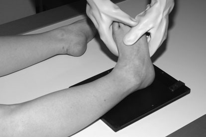
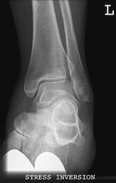
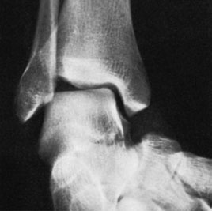
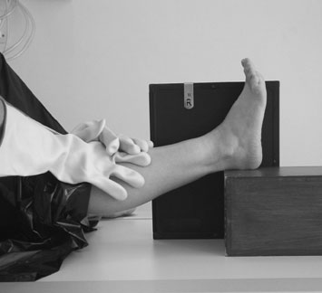
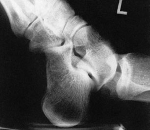
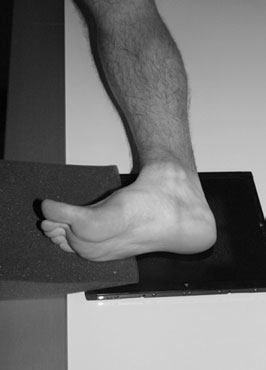
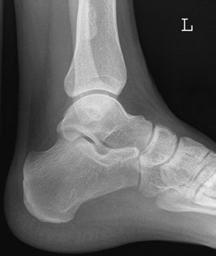
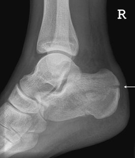
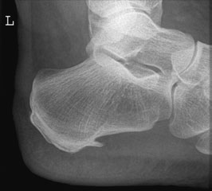

# Rx articulația gleznei Incidență de stres pentru subluxație

  📷 Radiografie Convențională (Rx)
  <strong>Actualizat:</strong> 2026-09-16
  <strong>Autor:</strong> Departamentul de Radiologie / Referință Clark (Ed. 12)

---

-   __1. Rezumat Clinic & Indicații__

    ---

    === "Indicații Clinice"

        - Apofiza calcaneană juvenilă normală este densă și apare adesea fragmentată. Aspectul rareori obstrucționează suspiciunea de fractură și, de regulă, nu trebuie să necesite incidențe ale părții contralaterale pentru evaluare.
        - Trabeculele primare ale oaselor urmează liniile încărcării maxime. În calcaneu, aceasta determină o transparență aparentă în regiunea centrală. Aceasta nu trebuie confundată cu o modificare patologică.
        - Suspiciunea de fractură a calcaneului cauzată de o aterizare grea pe călcâi determină o leziune de compresie cu deprimarea regiunii centrale prin astragal (talus). Aceasta se observă ca o aplatizare a unghiului Böhler la mai puțin de 40 grade, așa cum este reprezentat în diagramă.
        - Mici pinteni sau leziuni de tracțiune la inserțiile tendonului lui Ahile și ligamentului plantar sunt frecvente. Dacă sunt semnificative, de obicei sunt slab delimitate și dureroase clinic. Ecografia poate ajuta la evaluarea lor. Tomografia computerizată liniară convențională (CT) este foarte utilă pentru evaluarea completă a suspiciunii de fractură complexă a calcaneului, în special prin utilizarea reconstrucțiilor directe în plan coronal, multiplanare și tridimensionale. 118 40° Radiografie normală de profil (lateral) a calcaneului. Suspiciune de fractură a calcaneului. Pinten calcanean. Diagramă liniară care evidențiază unghiul Böhler. Radiografii de profil (lateral) ale calcaneului.

    === "Ghid Național IRIS"

        !!! info "Referință Primară: Ghidul Național IRIS (Ordinul MS 1342/2012)"
            - **Capitol Ghid IRIS:** *Aparat locomotor & Membru inferior*
            - **Grad de Recomandare:** **Grad A**
            - **Nivel de Iradiere Estimată:** `Clasa 1 (Minimă < 0.01 mSv)`

            [:octicons-search-16: Deschide Ghidul IRIS](../../iris.md){ .md-button .md-button--primary } [:material-open-in-new: Aplicația Oficială PWA](https://radiologie-pediatrica.ro/iris/){ .md-button target="_blank" rel="noopener" }

-   __2. Poziționare & Centrare Fascicul__

    ---

    - **Poziție Pacient:**
        - Pacientul este culcat în decubit dorsal pe masa de examinare, cu membrul extins.
        - Piciorul este ridicat și sprijinit pe un suport ferm.
        - Glezna este în dorsiflexie, iar membrul este rotit medial până când maleolele sunt echidistante față de masă.
        - Filmul radiologic este sprijinit vertical pe / de aspectul medial al piciorului.
        - Medicul aplică o presiune fermă în jos pe membrul inferior.
        - Din poziția de decubit dorsal, pacientul se rotește spre partea afectată.
        - Membrul inferior este rotit până când maleolele medială și de profil (lateral) sunt suprapuse vertical.
        - Un suport de 15 grade este plasat sub aspectul anterior al genunchiului și marginea de profil (lateral) a antepiciorului pentru sprijin.
        - Caseta este plasată cu marginea inferioară imediat sub aspectul plantar al călcâiului.
    - **Punct de Centrare Fascicul:**
        - Se centrează pe maleole în profil (lateral), cu fascicul orizontal.
        - Se centrează la 2.5 cm distal față de maleola medială (tibială), cu raza centrală verticală perpendiculară pe casetă.
    - **Distanță Focar-Film (DFF / SID):** 100 cm
    - **Comandă Respiratorie:** Apnee pe durata expunerii (apnee în inspir pentru torace; expir pentru Abdomen/bazin).

-   __3. Parametri Tehnici Expunere__

    ---

    | Parametru Tehnic | Valoare Configurare Generator / Tub |
    |:-----------------|:-------------------------------------|
    | **Tensiune Tub (kV)** | DE CONFIGURAT PE APARAT |
    | **Sarcină / Produs Curent-Timp (mAs)** | Conform AEC / grosimii anatomice |
    | **Distanță Focar-Film (DFF / SID)** | 100 cm |
    | **Grilă Antidifuzoare (Bucky)** | Conform grosimii anatomice (> 10-12 cm cu grilă) |
    | **Dimensiune Focar** | Focar Mic (0.6 mm) |
    | **Camere de Ionizare AEC** | DE CONFIGURAT PE APARAT |
    | **Colimare Fascicul** | Colimare strictă adaptată pe receptor 18 x 24 cm |
    | **Filtrare Tub** | Totală ≥ 2.5 mm Al echivalent (conform Clark: 3.0 mm Al echivalent) |

-   __4. Criterii de Calitate & Reușită Imagine__

    ---

    - Oasele tarsiene adiacente trebuie incluse în incidența de profil (lateral), împreună cu articulația gleznei.

-   __5. Protecție Radiologică (ALARA)__

    ---

    - Medicul care aplică stresul trebuie să poarte un șorț și mănuși de protecție din plumb adecvate.
    - Dacă tehnica este efectuată utilizând un intensificator mobil de imagine, trebuie implementate regulile locale, iar întregul personal trebuie să fie dotat cu îmbrăcăminte de protecție. Normal. Subluxație. Incidență antero-posterioară (AP) cu stres în inversiune. Incidență de profil (lateral) cu stres, evidențiind subluxația.
    - Ecranare gonadică cu șorț plumbat dacă gonadele sunt în apropierea fasciculului util (regula ALARA).
    - Colimare precisă la dimensiunea anatomică strict necesară pentru reducerea dozei și a radiației difuze.
    - Verificarea posibilității unei sarcini la pacientele de vârstă fertilă înainte de expunere.

!!! note "Observații Clinice & Tehnice"
    - Incidența de stres antero-posterioară (AP) evidențiază lărgirea spațiilor articulare dacă spațiul calcaneo-fibular este rupt.
    - Incidențele de stres de profil (lateral) evidențiază subluxația anterioară dacă ligamentul talo-fibular anterior este rupt.
    - Tehnici similare sunt utilizate în sala de operație, cu intensificatorul de imagine poziționat deasupra gleznei. Gradul de stres aplicat este observat și înregistrat.
    Această incidență este utilizată pentru evidențierea pintenilor calcaneeni. Pentru comparație, poate fi necesară radiografia ambelor călcâie în poziție de profil (lateral).

### 🖼️ Imagini

<figure class="protocol-image-card" markdown>

<figcaption><strong>rgirea spațiilor articulare dacă spațiul calcaneo-fibular este</strong> — Poziționarea pacientului și centrarea fasciculului conform Clark (Ed. 12)</figcaption>

</figure>

<figure class="protocol-image-card" markdown>

<figcaption><strong>Incidență de profil (lateral) cu stres, evidențiind subluxația</strong> — Aspect radiografic / ghid de poziționare conform tratatului Clark (Ed. 12)</figcaption>

</figure>

<figure class="protocol-image-card" markdown>

<figcaption><strong>Figura 3: Aspect radiografic / Poziționare (Clark Ed. 12)</strong> — Aspect radiografic / ghid de poziționare conform tratatului Clark (Ed. 12)</figcaption>

</figure>

<figure class="protocol-image-card" markdown>

<figcaption><strong>Figura 4: Aspect radiografic / Poziționare (Clark Ed. 12)</strong> — Aspect radiografic / ghid de poziționare conform tratatului Clark (Ed. 12)</figcaption>

</figure>

<figure class="protocol-image-card" markdown>

<figcaption><strong>Figura 5: Aspect radiografic / Poziționare (Clark Ed. 12)</strong> — Aspect radiografic / ghid de poziționare conform tratatului Clark (Ed. 12)</figcaption>

</figure>

<figure class="protocol-image-card" markdown>

<figcaption><strong>ntru comparație, radiografia ambelor călcâie în poziție de profil (lateral) poate fi</strong> — Aspect radiografic / ghid de poziționare conform tratatului Clark (Ed. 12)</figcaption>

</figure>

<figure class="protocol-image-card" markdown>

<figcaption><strong>• Apofiza calcaneană juvenilă normală este densă și apare adesea</strong> — Aspect radiografic / ghid de poziționare conform tratatului Clark (Ed. 12)</figcaption>

</figure>

<figure class="protocol-image-card" markdown>

<figcaption><strong>fragmentată. Aspectul rareori obstrucționează o</strong> — Aspect radiografic / ghid de poziționare conform tratatului Clark (Ed. 12)</figcaption>

</figure>

<figure class="protocol-image-card" markdown>

<figcaption><strong>suspiciune de fractură și, de regulă, nu trebuie să necesite incidențe ale</strong> — Aspect radiografic / ghid de poziționare conform tratatului Clark (Ed. 12)</figcaption>

</figure>

=== "Ghid Rapid de Execuție"

    1. **Identificarea și verificarea pacientului:** verificare identitate, zonă de examinat, consimțământ conform procedurii și evaluarea posibilității unei sarcini, când este relevantă.
    2. **Pregătire:** îndepărtarea oricăror obiecte radiopace (bijuterii, agrafe, fermoare, proteze, pansamente dense).
    3. **Poziționare precisă:** alinierea receptorului de imagine și a tubului la distanța prescrisă (100 cm).
    4. **Colimare strictă:** adaptarea fasciculului strict la regiunea de diagnostic pentru scăderea iradierii și reducerea radiației difuze.
    5. **Radioprotecție:** verificarea [politicii RX](../radioprotectie.md), cu măsuri distincte pentru pacient, personal și însoțitor.

## Surse de documentare

- [Clark's Positioning in Radiography (Ed. 12), Pagina 132](https://books.google.com/books/about/Clark_s_Positioning_in_Radiography.html?id=Xxu6MwEACAAJ)
