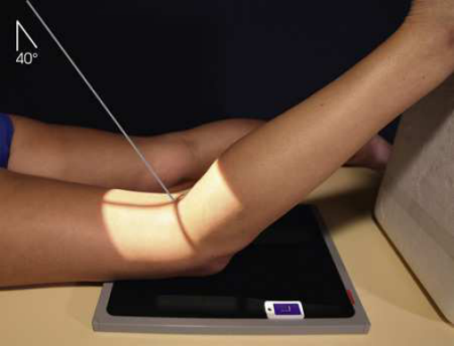
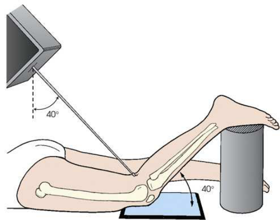
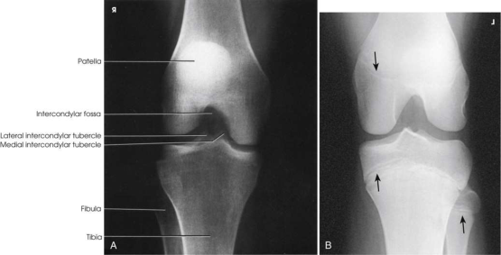
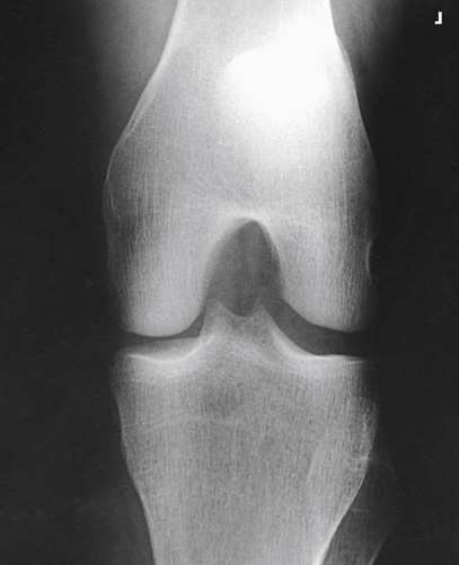

# Rx Intercondylar Fossa — Incidență PA Axială — Camp-Coventry Method 24 (Merrill)

  📷 Radiografie Convențională (Rx)
  <strong>Actualizat:</strong> 2026-09-16
  <strong>Autor:</strong> Referință Merrill

---

-   __1. Rezumat Clinic & Indicații__

    ---

    === "Indicații Clinice"

        - Conform reperelor anatomice standard din tratat

    === "Ghid Național IRIS"

        !!! info "Referință Primară: Ghidul Național IRIS (Ordinul MS 1342/2012)"
            - **Capitol Ghid IRIS:** *Ghidul Național IRIS*
            - **Grad de Recomandare:** **De verificat pe indicație; fără grad atribuit automat**
            - **Nivel de Iradiere Estimată:** `De verificat pentru examinarea și populația selectate`

            [:octicons-search-16: Deschide Ghidul IRIS](../../iris.md){ .md-button .md-button--primary } [:material-open-in-new: Aplicația Oficială PWA](https://radiologie-pediatrica.ro/iris/){ .md-button target="_blank" rel="noopener" }
-   __2. Poziționare & Centrare Fascicul__

    ---

    - **Poziție Pacient:** se așază pacientul în Decubit ventral poziție, și se ajustează corp so that it este nu rotit.; se flectează pacient’s Genunchi la a 40- sau 50-grade angle, place femoral portion de Genunchi pe receptorul de imagine, și rest Picior pe suitable support. se centrează upper half de receptorul de imagine la Genunchi articulație; raza centrală angulation projects articulație la center de receptorul de imagine (Figs. 7.140 și 7.141). protractor poate fie used beside membru inferior la determine correct membru inferior angle. se ajustează membru inferior astfel încât Genunchi has fără medial sau rotație externă (laterală). se efectuează ecranarea gonadelor cu șorț plumbat.
    - **Punct de Centrare Fascicul:** perpendicular pe axa longitudinală de Gambă, entering popliteal fossa și exiting la patellar apex. înclinat 40 grade when Genunchi este flectat 40 grade și 50 grade when Genunchi este flectat 50 grade.
    - **Distanță Focar-Film (DFF / SID):** Nespecificat în fragmentul extras; de verificat în sursă
    - **Comandă Respiratorie:** Conform reperelor anatomice standard din tratat

-   __3. Parametri Tehnici Expunere__

    ---

    | Parametru Tehnic | Valoare Configurare Generator / Tub |
    |:-----------------|:-------------------------------------|
    | **Tensiune Tub (kV)** | DE CONFIGURAT PE APARAT |
    | **Sarcină / Produs Curent-Timp (mAs)** | DE CONFIGURAT PE APARAT |
    | **Distanță Focar-Film (DFF / SID)** | Nespecificat în fragmentul extras; de verificat în sursă |
    | **Grilă Antidifuzoare (Bucky)** | DE CONFIGURAT PE APARAT |
    | **Dimensiune Focar** | DE CONFIGURAT PE APARAT |
    | **Camere de Ionizare AEC** | DE CONFIGURAT PE APARAT |
    | **Colimare Fascicul** | se ajustează câmp de iradiere la 8 × 10 inches (18 × 24 cm) pe collimator. Adjust la 1 inch (2.5 cm) beyond sides. Place marker de lateralitate (D/S) în collimated expunere field. |
    | **Filtrare Tub** | DE CONFIGURAT PE APARAT |

-   __4. Criterii de Calitate & Reușită Imagine__

    ---

    - Criterii radiologice de calitate imaginii:
    - Evidence de corect collimation și presence de marker de lateralitate (D/S) plasat clear de anatomy de interest
    - Open intercondylar fossa
    - Posteroinferior surface de femoral condyles
    - Genunchi spații articulare open, cu one sau ambele tibial plateaus în profile (superimposed anterior și posterior surfaces)
    - Apex de Rotulă (Patelă) nu superimposing fossa
    - Absența rotației anatomice (simetrie bilaterală perfectă), evidențiat prin slight tibiofibular overlap și centrat intercondylar eminence
    - Bony detalii trabeculare osoase și surrounding soft tissues

-   __5. Protecție Radiologică (ALARA)__

    ---

    - Nespecificat în fragmentul extras; de verificat în sursă

!!! note "Observații Clinice & Tehnice"
    în examinations de Genunchi articulație, intercondylar fossa incidență poate fie included la detect loose corpuri (“articulație mice”). This incidență este also used în evaluating split și displaced cartilage în osteochondritis dissecans și flattening, sau underdevelopment, de lateral femoral condyle în congenital slipped Rotulă (Patelă).

### 🖼️ Imagini

<figure class="protocol-image-card" markdown>

<figcaption><strong>Merrill — pagina PDF 559, imaginea 1</strong> — Imagine din fragmentul sursă; asocierea necesită revizie.</figcaption>

</figure>

<figure class="protocol-image-card" markdown>

<figcaption><strong>Merrill — pagina PDF 560, imaginea 2</strong> — Imagine din fragmentul sursă; asocierea necesită revizie.</figcaption>

</figure>

<figure class="protocol-image-card" markdown>

<figcaption><strong>Merrill — pagina PDF 560, imaginea 3</strong> — Imagine din fragmentul sursă; asocierea necesită revizie.</figcaption>

</figure>

<figure class="protocol-image-card" markdown>

<figcaption><strong>Merrill — pagina PDF 561, imaginea 4</strong> — Imagine din fragmentul sursă; asocierea necesită revizie.</figcaption>

</figure>

=== "Ghid Rapid de Execuție"

    1. **Identificarea și verificarea pacientului:** verificare identitate, zonă de examinat, consimțământ conform procedurii și evaluarea posibilității unei sarcini, când este relevantă.
    2. **Pregătire:** îndepărtarea oricăror obiecte radiopace (bijuterii, agrafe, fermoare, proteze, pansamente dense).
    3. **Poziționare precisă:** alinierea receptorului de imagine și a tubului la distanța prescrisă (Nespecificat în fragmentul extras; de verificat în sursă).
    4. **Colimare strictă:** adaptarea fasciculului strict la regiunea de diagnostic pentru scăderea iradierii și reducerea radiației difuze.
    5. **Radioprotecție:** verificarea [politicii RX](../radioprotectie.md), cu măsuri distincte pentru pacient, personal și însoțitor.

## Surse de documentare

- [Merrill’s Atlas, 7. Lower Extremity, pagini PDF 558–561](../../assets/protocols/sources/a56d45c16829_Merrills_Atlas_of_Radiographic_Positioning__Procedures_3Vol_Set.pdf#page=558)

## Fragmente sursă traduse (referință tehnică)

### anatomy

intercondylar fossa și posteroinferior articular surfaces de condyles de femur, ca well ca medial și lateral intercondylar
tubercles de intercondylar eminence și tibial plateaus în profile (Figs. 7.142 și 7.143).

### collimation

• se ajustează câmp de iradiere la 8 × 10 inches (18 × 24 cm) pe collimator. Adjust la 1 inch (2.5 cm) beyond sides. Place marker de lateralitate (D/S)
în collimated expunere field.

### cr

• perpendicular pe axa longitudinală de lower membru inferior, entering popliteal fossa și exiting la patellar apex.
• înclinat 40 grade when genunchi este flectat 40 grade și 50 grade when genunchi este flectat 50 grade.

### criteria

Criterii radiologice de calitate imaginii:
• Evidence de corect collimation și presence de marker de lateralitate (D/S) plasat clear de anatomy de interest
• Open intercondylar fossa
• Posteroinferior surface de femoral condyles
• genunchi spații articulare open, cu one sau ambele tibial plateaus în profile (superimposed anterior și posterior surfaces)
• Apex de rotulă (patelă) nu superimposing fossa
• Absența rotației anatomice (simetrie bilaterală perfectă), evidențiat prin slight tibiofibular overlap și centrat intercondylar eminence
• Bony detalii trabeculare osoase și surrounding soft tissues

### notes

în examinations de genunchi articulație, intercondylar fossa incidență poate fie included la detect loose corpuri (“articulație mice”). This
incidență este also used în evaluating split și displaced cartilage în osteochondritis dissecans și flattening, sau underdevelopment, de lateral femoral condyle în congenital slipped rotulă (patelă).

### part_pos

• se flectează pacient’s genunchi la a 40- sau 50-grade angle, place femoral portion de genunchi pe receptorul de imagine, și rest picior pe suitable
support.
• se centrează upper half de receptorul de imagine la genunchi articulație; raza centrală angulation projects articulație la center de receptorul de imagine (Figs. 7.140 și
7.141).
• protractor poate fie used beside membru inferior la determine correct membru inferior angle.
• se ajustează membru inferior astfel încât genunchi has fără medial sau rotație externă (laterală).
• se efectuează ecranarea gonadelor cu șorț plumbat.

### patient_pos

• se așază pacientul în decubit ventral, și se ajustează corp so that it este nu rotit.

### tech

poziționat prin manufacturer sau department protocol pentru corect anatomy display orientation; raza centrală plate: 10 × 12 inches (24 × 30 cm) longitudinal.

