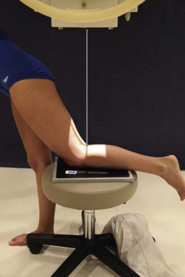
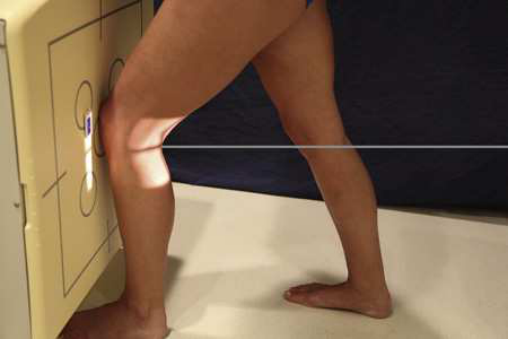
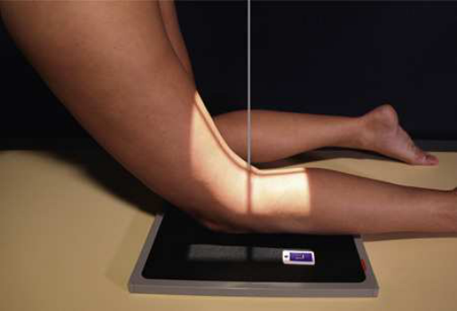
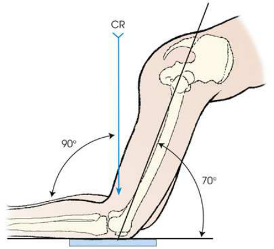
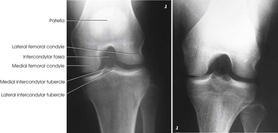

# Rx Intercondylar Fossa — Incidență PA Axială — Metoda Holmblad (Merrill)

  📷 Radiografie Convențională (Rx)
  <strong>Actualizat:</strong> 2026-09-16
  <strong>Autor:</strong> Referință Merrill

---

-   __1. Rezumat Clinic & Indicații__

    ---

    === "Indicații Clinice"

        - Conform reperelor anatomice standard din tratat

    === "Ghid Național IRIS"

        !!! info "Referință Primară: Ghidul Național IRIS (Ordinul MS 1342/2012)"
            - **Capitol Ghid IRIS:** *Ghidul Național IRIS*
            - **Grad de Recomandare:** **De verificat pe indicație; fără grad atribuit automat**
            - **Nivel de Iradiere Estimată:** `De verificat pentru examinarea și populația selectate`

            [:octicons-search-16: Deschide Ghidul IRIS](../../iris.md){ .md-button .md-button--primary } [:material-open-in-new: Aplicația Oficială PWA](https://radiologie-pediatrica.ro/iris/){ .md-button target="_blank" rel="noopener" }
-   __2. Poziționare & Centrare Fascicul__

    ---

    - **Poziție Pacient:** After consideration de pacientul’s safety, se așază pacientul în one de three poziții: (1) în ortostatism cu Genunchi de interest flectat și resting pe stool la side de masa radiologică (Fig. 7.135); (2) în ortostatism la side de masa radiologică cu afected Genunchi flectat și plasat în contact cu front de receptorul de imagine (Fig. 7.136); sau (3) kneeling pe masa radiologică, ca originally described prin Holmblad, cu afected Genunchi over receptorul de imagine (Fig. 7.137). în toate three approaches, tibial portion de Genunchi este în contact cu receptorul de imagine, și pacientul’s upper corp este stabilized cu appropriate support.; pentru toate poziții, place receptorul de imagine pe / sprijinit de anterior surface de pacientul’s Genunchi, și se centrează receptorul de imagine la apex de Rotulă (Patelă). se flectează Genunchi 70 grade de la full extension (20-grade diference de la raza centrală, ca vizualizat în Fig. 7.138). se efectuează ecranarea gonadelor cu șorț plumbat.
    - **Punct de Centrare Fascicul:** perpendicular pe Gambă, entering superior aspect de popliteal fossa și exiting la nivelul patellar apex, pentru toate three poziții.
    - **Distanță Focar-Film (DFF / SID):** Nespecificat în fragmentul extras; de verificat în sursă
    - **Comandă Respiratorie:** Conform reperelor anatomice standard din tratat

-   __3. Parametri Tehnici Expunere__

    ---

    | Parametru Tehnic | Valoare Configurare Generator / Tub |
    |:-----------------|:-------------------------------------|
    | **Tensiune Tub (kV)** | DE CONFIGURAT PE APARAT |
    | **Sarcină / Produs Curent-Timp (mAs)** | DE CONFIGURAT PE APARAT |
    | **Distanță Focar-Film (DFF / SID)** | Nespecificat în fragmentul extras; de verificat în sursă |
    | **Grilă Antidifuzoare (Bucky)** | DE CONFIGURAT PE APARAT |
    | **Dimensiune Focar** | DE CONFIGURAT PE APARAT |
    | **Camere de Ionizare AEC** | DE CONFIGURAT PE APARAT |
    | **Colimare Fascicul** | se ajustează câmp de iradiere la 8 × 10 inches (18 × 24 cm) pe collimator. Adjust la 1 inch (2.5 cm) beyond sides. Se plasează markerul de lateralitate în câmpul colimat. |
    | **Filtrare Tub** | DE CONFIGURAT PE APARAT |

-   __4. Criterii de Calitate & Reușită Imagine__

    ---

    - Criterii radiologice de calitate imaginii:
    - Evidence de corect collimation și presence de marker de lateralitate (D/S) plasat clear de anatomy de interest
    - Open intercondylar fossa
    - Posteroinferior surface de femoral condyles
    - Genunchi spații articulare open, cu one sau ambele tibial plateaus în profile (superimposed anterior și posterior surfaces)
    - Apex de Rotulă (Patelă) nu superimposing fossa
    - Absența rotației anatomice (simetrie bilaterală perfectă), evidențiat prin slight tibiofibular overlap și centrat intercondylar eminence
    - Bony detalii trabeculare osoase și surrounding soft tissues

-   __5. Protecție Radiologică (ALARA)__

    ---

    - Nespecificat în fragmentul extras; de verificat în sursă

!!! note "Observații Clinice & Tehnice"
    bilateral examination (Metoda Rosenberg) este described pe p. 353 (also see Fig. 7.130).

### 🖼️ Imagini

<figure class="protocol-image-card" markdown>

<figcaption><strong>Merrill — pagina PDF 555, imaginea 1</strong> — Imagine din fragmentul sursă; asocierea necesită revizie.</figcaption>

</figure>

<figure class="protocol-image-card" markdown>

<figcaption><strong>Merrill — pagina PDF 556, imaginea 2</strong> — Imagine din fragmentul sursă; asocierea necesită revizie.</figcaption>

</figure>

<figure class="protocol-image-card" markdown>

<figcaption><strong>Merrill — pagina PDF 556, imaginea 3</strong> — Imagine din fragmentul sursă; asocierea necesită revizie.</figcaption>

</figure>

<figure class="protocol-image-card" markdown>

<figcaption><strong>Merrill — pagina PDF 557, imaginea 4</strong> — Imagine din fragmentul sursă; asocierea necesită revizie.</figcaption>

</figure>

<figure class="protocol-image-card" markdown>

<figcaption><strong>Merrill — pagina PDF 558, imaginea 5</strong> — Imagine din fragmentul sursă; asocierea necesită revizie.</figcaption>

</figure>

=== "Ghid Rapid de Execuție"

    1. **Identificarea și verificarea pacientului:** verificare identitate, zonă de examinat, consimțământ conform procedurii și evaluarea posibilității unei sarcini, când este relevantă.
    2. **Pregătire:** îndepărtarea oricăror obiecte radiopace (bijuterii, agrafe, fermoare, proteze, pansamente dense).
    3. **Poziționare precisă:** alinierea receptorului de imagine și a tubului la distanța prescrisă (Nespecificat în fragmentul extras; de verificat în sursă).
    4. **Colimare strictă:** adaptarea fasciculului strict la regiunea de diagnostic pentru scăderea iradierii și reducerea radiației difuze.
    5. **Radioprotecție:** verificarea [politicii RX](../radioprotectie.md), cu măsuri distincte pentru pacient, personal și însoțitor.

## Surse de documentare

- [Merrill’s Atlas, 7. Lower Extremity, pagini PDF 554–558](../../assets/protocols/sources/a56d45c16829_Merrills_Atlas_of_Radiographic_Positioning__Procedures_3Vol_Set.pdf#page=554)

## Fragmente sursă traduse (referință tehnică)

### anatomy

intercondylar fossa și posteroinferior articular surfaces de condyles de femur, ca well ca medial și lateral intercondylar
tubercles de intercondylar eminence și tibial plateaus în profile (Fig. 7.139). Holmblad 22 stated that grade de flexion used în this
poziție widens spații articulare între femur și tibia și gives improved imagine de articulație și surfaces de tibia și femur.

### collimation

• se ajustează câmp de iradiere la 8 × 10 inches (18 × 24 cm) pe collimator. Adjust la 1 inch (2.5 cm) beyond sides. Place marker de lateralitate (D/S) în
collimated expunere field.

### cr

• perpendicular pe lower membru inferior, entering superior aspect de popliteal fossa și exiting la nivelul patellar apex, pentru toate
three poziții.

### criteria

Criterii radiologice de calitate imaginii:
• Evidence de corect collimation și presence de marker de lateralitate (D/S) plasat clear de anatomy de interest
• Open intercondylar fossa
• Posteroinferior surface de femoral condyles
• genunchi spații articulare open, cu one sau ambele tibial plateaus în profile (superimposed anterior și posterior surfaces)
• Apex de rotulă (patelă) nu superimposing fossa
• Absența rotației anatomice (simetrie bilaterală perfectă), evidențiat prin slight tibiofibular overlap și centrat intercondylar eminence
• Bony detalii trabeculare osoase și surrounding soft tissues

### notes

bilateral examination (Rosenberg method) este described pe p. 353 (also see Fig. 7.130).

### part_pos

• pentru toate poziții, place receptorul de imagine pe / sprijinit de anterior surface de pacientul’s genunchi, și se centrează receptorul de imagine la apex de rotulă (patelă). se flectează
genunchi 70 grade de la full extension (20-grade diference de la raza centrală, ca vizualizat în Fig. 7.138).
• se efectuează ecranarea gonadelor cu șorț plumbat.

### patient_pos

• After consideration de pacientul’s safety, se așază pacientul în one de three poziții: (1) în ortostatism cu genunchi de interest flectat și
resting pe stool la side de masa radiologică (Fig. 7.135); (2) în ortostatism la side de masa radiologică cu afected
genunchi flectat și plasat în contact cu front de receptorul de imagine (Fig. 7.136); sau (3) kneeling pe masa radiologică, ca originally described
prin Holmblad, cu afected genunchi over receptorul de imagine (Fig. 7.137). în toate three approaches, tibial portion de genunchi este în contact cu
receptorul de imagine, și pacientul’s upper corp este stabilized cu appropriate support.

### tech

poziționat prin manufacturer sau department protocol pentru corect anatomy display orientation; raza centrală plate: 10 × 12 inches (24 × 30 cm) longitudinal.

