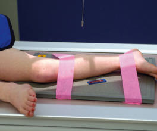
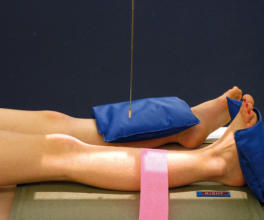
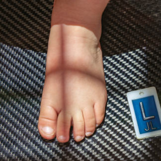
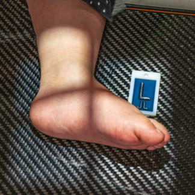

# Rx KITE METHOD

  📷 Radiografie Convențională (Rx)
  <strong>Actualizat:</strong> 2026-09-15
  <strong>Autor:</strong> Departamentul de Radiologie / Referință Bontrager

---

-   __1. Rezumat Clinic & Indicații__

    ---

    === "Indicații Clinice"

        - suspiciune de fractură, luxație / subluxație articulară, congenital deformities, or other anomalies of lower limbs

    === "Ghid Național IRIS"

        !!! info "Referință Primară: Ghidul Național IRIS (Ordinul MS 1342/2012)"
            - **Capitol Ghid IRIS:** *Ghidul Național IRIS*
            - **Grad de Recomandare:** **De verificat pe indicație; fără grad atribuit automat**
            - **Nivel de Iradiere Estimată:** `De verificat pentru examinarea și populația selectate`

            [:octicons-search-16: Deschide Ghidul IRIS](../../iris.md){ .md-button .md-button--primary } [:material-open-in-new: Aplicația Oficială PWA](https://radiologie-pediatrica.ro/iris/){ .md-button target="_blank" rel="noopener" }
-   __2. Poziționare & Centrare Fascicul__

    ---

    - **Poziție Pacient:** Pacient: and CR AP Gambă Immobilization techniques should be used when necessary. With patient Decubit Dorsal, immobilize the arms and the leg that is not being radiographed, if needed. If parent is helping with immobilization, have the parent hold the leg in this position with one Mână firmly on the Bazin (Pelvis) and the other holding the feet. Place IR under limb being radiographed; include Genunchi and Gleznă (Articulație Talocrurală). Place leg as for a true Incidență Antero-Posterioară (AP), rotating Genunchi internally slightly until the interepicondylar line is parallel to plane of IR. The feet and ankles should be in a true anatomic position (Fig. 16.45).
    - **Punct de Centrare Fascicul:** is perpendicular to midfoot.
    - **Distanță Focar-Film (DFF / SID):** 100 cm
    - **Comandă Respiratorie:** Apnee pe durata expunerii (sau conform cooperării pacientului)

-   __3. Parametri Tehnici Expunere__

    ---

    | Parametru Tehnic | Valoare Configurare Generator / Tub |
    |:-----------------|:-------------------------------------|
    | **Tensiune Tub (kV)** | 50-60 kV |
    | **Sarcină / Produs Curent-Timp (mAs)** | DE CONFIGURAT PE APARAT |
    | **Distanță Focar-Film (DFF / SID)** | 100 cm |
    | **Grilă Antidifuzoare (Bucky)** | Cu grilă antidifuzoare Bucky |
    | **Dimensiune Focar** | Focar Mic (0.6 mm) |
    | **Camere de Ionizare AEC** | Camerele laterale (sau camera centrală funcție de regiune) |
    | **Colimare Fascicul** | Field Size Collimate closely on four sides to area of the Picior. Talipes Equinovarus (Congenital Clubfoot)—Kite Method The Picior is positioned for AP and lateral views as demonstrated, with no attempt made to straighten the Picior when placing it on the iR. Because of shape distortion, it may be difficult to obtain a true AP and lateral, but two projections 90 degrees from each other should be obtained. The two feet generally are imaged separately for comparison purposes. Gambă and Picior Gambă Routine AP Lateral Picior Routine AP Lateral Fig. 16.48 Lateral Picior. Fig. 16.47 AP Picior using cassetteless detector. Fig. 16.45 AP Gambă. Fig. 16.46 Lateral Gambă. |
    | **Filtrare Tub** | Totală ≥ 2.5 mm Al echivalent |

-   __4. Criterii de Calitate & Reușită Imagine__

    ---

    - Vizualizarea completă a regiunii anatomice explorate
    - Absența artefactelor de mișcare sau a suprapunerilor neadecvate
    - Contrast și penetrare optime pentru decelarea structurilor osoase și a părților moi

-   __5. Protecție Radiologică (ALARA)__

    ---

    - Ecranare gonadică și a organelor radiosensibile conform procedurilor locale de radioprotecție ALARA.
    - Colimare strictă la aria de interes pentru limitarea radiației difuze.
    - Verificarea posibilității unei sarcini la pacientele de vârstă fertilă înainte de expunere.

!!! note "Observații Clinice & Tehnice"
    Department routines and protocols should be followed in regard to specific positioning routines for the lower limbs at various ages and for specific diagnostic indicators. If the specific area of interest is the Genunchi, Gleznă (Articulație Talocrurală), or Picior region, separate images should be obtained, with the CR centered to the joint of interest (see Figs. 16.47 and 16.48.)

### 🖼️ Imagini

<figure class="protocol-image-card" markdown>

<figcaption><strong>Fig. 16.48 Lateral Picior.</strong> — Poziționare pacient conform Ghidului Bontrager (Fig. 16.48 Lateral foot.)</figcaption>

</figure>

<figure class="protocol-image-card" markdown>

<figcaption><strong>Fig. 16.47 AP Picior using cassette-</strong> — Aspect radiografic de referință conform Ghidului Bontrager (Fig. 16.47 AP foot using cassette-)</figcaption>

</figure>

<figure class="protocol-image-card" markdown>

<figcaption><strong>Fig. 16.45 AP Gambă.</strong> — Aspect radiografic de referință conform Ghidului Bontrager (Fig. 16.45 AP lower leg.)</figcaption>

</figure>

<figure class="protocol-image-card" markdown>

<figcaption><strong>Fig. 16.46 Lateral Gambă.</strong> — Aspect radiografic de referință conform Ghidului Bontrager (Fig. 16.46 Lateral lower leg.)</figcaption>

</figure>

=== "Ghid Rapid de Execuție"

    1. **Identificarea și verificarea pacientului:** verificare identitate, zonă de examinat, consimțământ conform procedurii și evaluarea posibilității unei sarcini, când este relevantă.
    2. **Pregătire:** îndepărtarea oricăror obiecte radiopace (bijuterii, agrafe, fermoare, proteze, pansamente dense).
    3. **Poziționare precisă:** alinierea receptorului de imagine și a tubului la distanța prescrisă (100 cm).
    4. **Colimare strictă:** adaptarea fasciculului strict la regiunea de diagnostic pentru scăderea iradierii și reducerea radiației difuze.
    5. **Radioprotecție:** verificarea [politicii RX](../radioprotectie.md), cu măsuri distincte pentru pacient, personal și însoțitor.

## Surse de documentare

- [Bontrager's Textbook of Radiographic Positioning (Ed. 9/10), Pagina 660](https://www.elsevier.com/books/textbook-of-radiographic-positioning-and-related-anatomy/lampignano/978-0-323-65367-1)
