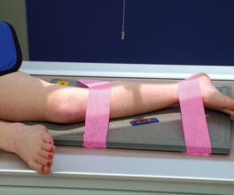
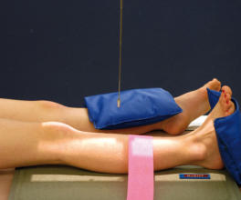
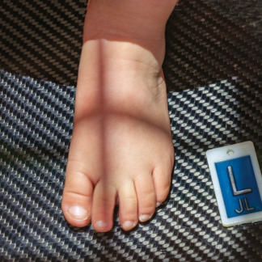
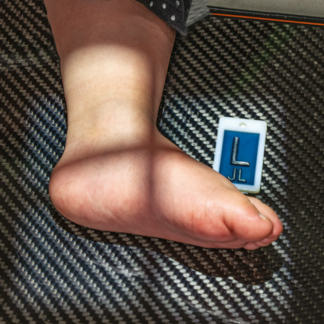

# Rx METODA KITE

  📷 Radiografie Convențională (Rx)
  <strong>Actualizat:</strong> 2026-09-15
  <strong>Autor:</strong> Departamentul de Radiologie / Referință Bontrager

---

-   __1. Rezumat Clinic & Indicații__

    ---

    === "Indicații Clinice"

        - suspiciune de fractură, luxație / subluxație articulară, deformări congenitale sau alte anomalii ale membrelor inferioare

    === "Ghid Național IRIS"

        !!! info "Referință Primară: Ghidul Național IRIS (Ordinul MS 1342/2012)"
            - **Capitol Ghid IRIS:** *Aparat locomotor & Membru inferior*
            - **Grad de Recomandare:** **Grad A**
            - **Nivel de Iradiere Estimată:** `Clasa 1 (Minimă < 0.01 mSv)`

            [:octicons-search-16: Deschide Ghidul IRIS](../../iris.md){ .md-button .md-button--primary } [:material-open-in-new: Aplicația Oficială PWA](https://radiologie-pediatrica.ro/iris/){ .md-button target="_blank" rel="noopener" }

-   __2. Poziționare & Centrare Fascicul__

    ---

    - **Poziție Pacient:** Pacient: trebuie utilizate tehnici de imobilizare și raza centrală AP a gambei atunci când este necesar. Cu pacientul în decubit dorsal, se imobilizează brațele și membrul inferior care nu este radiografiat, dacă este necesar. Dacă părintele ajută la imobilizare, acesta trebuie să țină membrul inferior în această poziție, cu o mână ferm pe bazin (bazin (pelvis)) și cu cealaltă menținând picioarele. Se plasează receptorul de imagine sub membrul radiografiat; se includ genunchiul și glezna (articulația talocrurală). Se plasează membrul inferior ca pentru o incidență anteroposterioară (AP) adevărată, rotind ușor intern genunchiul până când linia interepicondiliană este paralelă cu planul receptorului de imagine. Picioarele și gleznele trebuie să fie în poziție anatomică adevărată (Fig. 16.45).
    - **Punct de Centrare Fascicul:** este perpendiculară pe mediopicior.
    - **Distanță Focar-Film (DFF / SID):** 100 cm
    - **Comandă Respiratorie:** Apnee pe durata expunerii (sau conform cooperării pacientului)

-   __3. Parametri Tehnici Expunere__

    ---

    | Parametru Tehnic | Valoare Configurare Generator / Tub |
    |:-----------------|:-------------------------------------|
    | **Tensiune Tub (kV)** | 50-60 kV |
    | **Sarcină / Produs Curent-Timp (mAs)** | DE CONFIGURAT PE APARAT |
    | **Distanță Focar-Film (DFF / SID)** | 100 cm |
    | **Grilă Antidifuzoare (Bucky)** | Cu grilă antidifuzoare Bucky |
    | **Dimensiune Focar** | Focar Mic (0.6 mm) |
    | **Camere de Ionizare AEC** | Camerele laterale (sau camera centrală, în funcție de regiune) |
    | **Colimare Fascicul** | Dimensiunea câmpului. Se colimează strâns pe cele patru laturi la nivelul regiunii piciorului. Talipes equinovarus (picior strâmb congenital) — metoda Kite. Piciorul este poziționat pentru incidențele AP și de profil, după cum este ilustrat, fără încercarea de a-l îndrepta când este plasat pe receptorul de imagine. Din cauza distorsionării formei, poate fi dificilă obținerea unei incidențe AP și de profil adevărate, dar trebuie obținute două incidențe la 90 grade una față de cealaltă. În general, cele două picioare sunt examinate separat în scopuri comparative. Gambă și picior. Gambă: AP, profil. Picior: AP, profil. Fig. 16.48 Picior, profil. Fig. 16.47 Picior AP utilizând detector fără casetă. Fig. 16.45 Gambă AP. Fig. 16.46 Gambă, profil. |
    | **Filtrare Tub** | Totală ≥ 2.5 mm Al echivalent |

-   __4. Criterii de Calitate & Reușită Imagine__

    ---

    - Vizualizarea completă a regiunii anatomice explorate
    - Absența artefactelor de mișcare sau a suprapunerilor neadecvate
    - Contrast și penetrare optime pentru decelarea structurilor osoase și a părților moi

-   __5. Protecție Radiologică (ALARA)__

    ---

    - Ecranare gonadică și a organelor radiosensibile conform procedurilor locale de radioprotecție ALARA.
    - Colimare strictă la aria de interes pentru limitarea radiației difuze.
    - Verificarea posibilității unei sarcini la pacientele de vârstă fertilă înainte de expunere.

!!! note "Observații Clinice & Tehnice"
    Protocoalele și procedurile departamentului trebuie urmate în ceea ce privește procedurile specifice de poziționare pentru membrele inferioare la diferite vârste și pentru indicatori diagnostici specifici. Dacă aria specifică de interes diagnostic este regiunea genunchiului, gleznei (articulației talocrurale) sau piciorului, trebuie obținute imagini separate, cu raza centrală centrată pe articulația de interes (a se vedea Fig. 16.47 și 16.48.)

### 🖼️ Imagini

<figure class="protocol-image-card" markdown>

<figcaption><strong>Fig. 16.48 Picior, profil.</strong> — Poziționarea pacientului conform Ghidului Bontrager (Fig. 16.48 picior, profil.)</figcaption>

</figure>

<figure class="protocol-image-card" markdown>

<figcaption><strong>Fig. 16.47 Picior AP utilizând casetă-</strong> — Aspect radiografic de referință conform Ghidului Bontrager (Fig. 16.47 picior AP utilizând casetă-)</figcaption>

</figure>

<figure class="protocol-image-card" markdown>

<figcaption><strong>Fig. 16.45 Gambă AP.</strong> — Aspect radiografic de referință conform Ghidului Bontrager (Fig. 16.45 gambă AP.)</figcaption>

</figure>

<figure class="protocol-image-card" markdown>

<figcaption><strong>Fig. 16.46 Gambă, profil.</strong> — Aspect radiografic de referință conform Ghidului Bontrager (Fig. 16.46 gambă, profil.)</figcaption>

</figure>

=== "Ghid Rapid de Execuție"

    1. **Identificarea și verificarea pacientului:** verificare identitate, zonă de examinat, consimțământ conform procedurii și evaluarea posibilității unei sarcini, când este relevantă.
    2. **Pregătire:** îndepărtarea oricăror obiecte radiopace (bijuterii, agrafe, fermoare, proteze, pansamente dense).
    3. **Poziționare precisă:** alinierea receptorului de imagine și a tubului la distanța prescrisă (100 cm).
    4. **Colimare strictă:** adaptarea fasciculului strict la regiunea de diagnostic pentru scăderea iradierii și reducerea radiației difuze.
    5. **Radioprotecție:** verificarea [politicii RX](../radioprotectie.md), cu măsuri distincte pentru pacient, personal și însoțitor.

## Surse de documentare

- [Bontrager's Textbook of Radiographic Positioning (Ed. 9/10), Pagina 660](https://www.elsevier.com/books/textbook-of-radiographic-positioning-and-related-anatomy/lampignano/978-0-323-65367-1)
