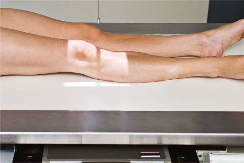
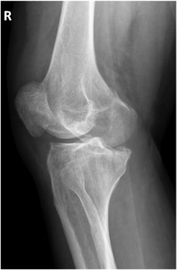
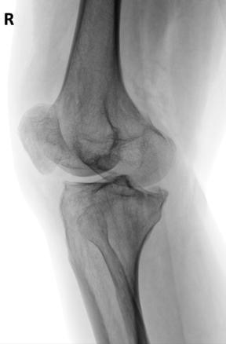

# Rx LATERAL (EXTERNAL) ROTATION AP Oblică (Genunchi)

  📷 Radiografie Convențională (Rx)
  <strong>Actualizat:</strong> 2026-09-15
  <strong>Autor:</strong> Departamentul de Radiologie / Referință Bontrager

---

-   __1. Rezumat Clinic & Indicații__

    ---

    === "Indicații Clinice"

        - Pathology involving femorotibial (Genunchi) articulation
        - suspiciune de fractură, lesions, și bony changes related la degenerative articulație disease, especially pe anterior și lateral sau posterior și medial aspects de Genunchi

    === "Ghid Național IRIS"

        !!! info "Referință Primară: Ghidul Național IRIS (Ordinul MS 1342/2012)"
            - **Capitol Ghid IRIS:** *Ghidul Național IRIS*
            - **Grad de Recomandare:** **De verificat pe indicație; fără grad atribuit automat**
            - **Nivel de Iradiere Estimată:** `De verificat pentru examinarea și populația selectate`

            [:octicons-search-16: Deschide Ghidul IRIS](../../iris.md){ .md-button .md-button--primary } [:material-open-in-new: Aplicația Oficială PWA](https://radiologie-pediatrica.ro/iris/){ .md-button target="_blank" rel="noopener" }
-   __2. Poziționare & Centrare Fascicul__

    ---

    - **Poziție Pacient:** Pacient: Place pacient în semisupine poziție, cu entire corp și membru inferior rotit partially away de la side de interest; place support under ridicat Șold; give pillow pentru cap.; Regiune anatomică: Align și center membru inferior și Genunchi la raza centrală și la linia mediană mesei sau receptorul de imagine. Rotate entire membru inferior externally 45° (interepicondylar line trebuie să fie 45° la plane de receptorul de imagine) (Fig. 6.109). If needed, stabilize Picior și Gleznă (Articulație Talocrurală) în this poziție cu săculeți cu nisip.
    - **Punct de Centrare Fascicul:** Angle raza centrală 0° pe average pacient (see AP Genunchi incidență, p. 247). Raza centrală se orientează spre midpoint de Genunchi la level ½ inch (1.25 cm) distal la apex de Rotulă (Patelă).
    - **Distanță Focar-Film (DFF / SID):** 100 cm
    - **Comandă Respiratorie:** Apnee pe durata expunerii (sau conform cooperării pacientului)

-   __3. Parametri Tehnici Expunere__

    ---

    | Parametru Tehnic | Valoare Configurare Generator / Tub |
    |:-----------------|:-------------------------------------|
    | **Tensiune Tub (kV)** | 65-80 kV |
    | **Sarcină / Produs Curent-Timp (mAs)** | DE CONFIGURAT PE APARAT |
    | **Distanță Focar-Film (DFF / SID)** | 100 cm |
    | **Grilă Antidifuzoare (Bucky)** | Fără grilă (expunere directă) |
    | **Dimensiune Focar** | Focar Mic (0.6 mm) |
    | **Camere de Ionizare AEC** | DE CONFIGURAT PE APARAT |
    | **Colimare Fascicul** | Collimate pe ambele părți (bilateral) la skin margins, cu full collimation la ends la receptorul de imagine margini la include maximum Femur și tibiafibula. |
    | **Filtrare Tub** | Totală ≥ 2.5 mm Al echivalent |

-   __4. Criterii de Calitate & Reușită Imagine__

    ---

    - distal Femur și proximal tibia și fibula, cu Rotulă (Patelă) superimposing lateral femoral condyle, sunt vizualizat.
    - medial condyles de Femur și tibia sunt evidențiat în profile (Figs. 6.110 și 6.111). poziție:
    - corect amount de part obliquity evidențiază proximal fibula superimposed prin proximal tibia, medial condyles de Femur, și tibia seen în profile.
    - Approximately half de Rotulă (Patelă) trebuie să fie seen liber de superimposition prin Femur.
    - Femorotibial (Genunchi) spații articulare este center de câmp colimat. expunere:
    - optim receptorul de imagine expunere și contrast la visualize părți moi în Genunchi articulație area, și trabecular markings de toate bones trebuie să appear clear și net, indicating fără mișcare.
    - Technique trebuie să fie sufficient la evidențiază capul și neck area de fibula through superimposed tibia.

-   __5. Protecție Radiologică (ALARA)__

    ---

    - Ecranare gonadică și a organelor radiosensibile conform procedurilor locale de radioprotecție ALARA.
    - Colimare strictă la aria de interes pentru limitarea radiației difuze.
    - Verificarea posibilității unei sarcini la pacientele de vârstă fertilă înainte de expunere.

!!! note "Observații Clinice & Tehnice"
    terms medial (intern) oblic și lateral (extern) oblic poziții refer la direction de rotație de anterior sau patellar surface de Genunchi. This este true pentru descriptions de either AP sau PA oblic incidențe. Fig. 6.110 AP lateral oblic. (Courtesy Joss Wertz, DO.) Femoral lateral condyle Rotulă (Patelă) Superimposed cap peronier (fibular) și neck Tibial medial condyle Femoral medial condyle Fig. 6.111 AP lateral oblic. (Courtesy Joss Wertz, DO.) Genunchi ROUTINE AP oblic (medial și lateral) lateral Fig. 6.109 AP lateral oblic.

### 🖼️ Imagini

<figure class="protocol-image-card" markdown>

<figcaption><strong>Fig. 6.110 AP lateral oblic. (Courtesy Joss Wertz, DO.)</strong> — Poziționare pacient conform Ghidului Bontrager (Fig. 6.110 AP lateral oblic. (Courtesy Joss Wertz, DO.))</figcaption>

</figure>

<figure class="protocol-image-card" markdown>

<figcaption><strong>Fig. 6.111 AP lateral oblic. (Courtesy Joss Wertz, DO.)</strong> — Aspect radiografic de referință conform Ghidului Bontrager (Fig. 6.111 AP lateral oblic. (Courtesy Joss Wertz, DO.))</figcaption>

</figure>

<figure class="protocol-image-card" markdown>

<figcaption><strong>Fig. 6.109 AP lateral oblic.</strong> — Aspect radiografic de referință conform Ghidului Bontrager (Fig. 6.109 AP lateral oblic.)</figcaption>

</figure>

=== "Ghid Rapid de Execuție"

    1. **Identificarea și verificarea pacientului:** verificare identitate, zonă de examinat, consimțământ conform procedurii și evaluarea posibilității unei sarcini, când este relevantă.
    2. **Pregătire:** îndepărtarea oricăror obiecte radiopace (bijuterii, agrafe, fermoare, proteze, pansamente dense).
    3. **Poziționare precisă:** alinierea receptorului de imagine și a tubului la distanța prescrisă (100 cm).
    4. **Colimare strictă:** adaptarea fasciculului strict la regiunea de diagnostic pentru scăderea iradierii și reducerea radiației difuze.
    5. **Radioprotecție:** verificarea [politicii RX](../radioprotectie.md), cu măsuri distincte pentru pacient, personal și însoțitor.

## Surse de documentare

- [Bontrager's Textbook of Radiographic Positioning (Ed. 9/10), Pagina 263](https://www.elsevier.com/books/textbook-of-radiographic-positioning-and-related-anatomy/lampignano/978-0-323-65367-1)
