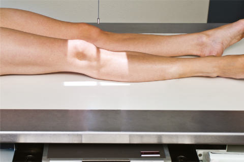
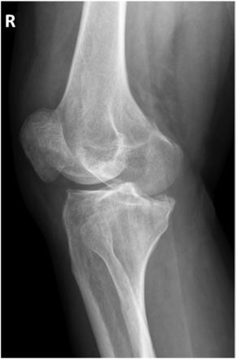
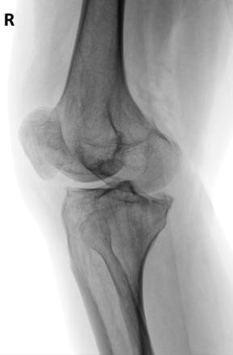

# Rx incidență AP oblică cu rotație laterală (externă) a genunchiului

  📷 Radiografie Convențională (Rx)
  <strong>Actualizat:</strong> 2026-09-15
  <strong>Autor:</strong> Departamentul de Radiologie / Referință Bontrager

---

-   __1. Rezumat Clinic & Indicații__

    ---

    === "Indicații Clinice"

        - Patologie care implică articulația femorotibială (a genunchiului)
        - suspiciune de fractură, leziuni și modificări osoase asociate bolii degenerative articulare, în special pe aspectele anterior și lateral sau posterior și medial ale genunchiului

    === "Ghid Național IRIS"

        !!! info "Referință Primară: Ghidul Național IRIS (Ordinul MS 1342/2012)"
            - **Capitol Ghid IRIS:** *Aparat locomotor & Membru inferior*
            - **Grad de Recomandare:** **Grad A**
            - **Nivel de Iradiere Estimată:** `Clasa 1 (Minimă < 0.05 mSv)`

            [:octicons-search-16: Deschide Ghidul IRIS](../../iris.md){ .md-button .md-button--primary } [:material-open-in-new: Aplicația Oficială PWA](https://radiologie-pediatrica.ro/iris/){ .md-button target="_blank" rel="noopener" }

-   __2. Poziționare & Centrare Fascicul__

    ---

    - **Poziție Pacient:** Pacient: Se așază pacientul în poziție semisupină, cu întregul corp și membrul inferior rotite parțial în direcția opusă părții de interes; se plasează un suport sub șoldul ridicat; se pune o pernă pentru cap.; Regiune anatomică: Se aliniază și se centrează membrul inferior și genunchiul față de raza centrală și linia mediană a mesei sau a receptorului de imagine. Se rotește întregul membru inferior extern cu 45° (linia interepicondiliană trebuie să fie la 45° față de planul receptorului de imagine) (Fig. 6.109). Dacă este necesar, se stabilizează piciorul și glezna (articulația talocrurală) în această poziție cu săculeți cu nisip.
    - **Punct de Centrare Fascicul:** Unghiul razei centrale 0° la pacientul mediu (vezi incidența AP a genunchiului, p. 247). Raza centrală se orientează spre punctul mijlociu al genunchiului, la nivelul situat la ½ țol (1.25 cm) distal față de vârful rotulei (patela).
    - **Distanță Focar-Film (DFF / SID):** 100 cm
    - **Comandă Respiratorie:** Apnee pe durata expunerii (sau conform cooperării pacientului)

-   __3. Parametri Tehnici Expunere__

    ---

    | Parametru Tehnic | Valoare Configurare Generator / Tub |
    |:-----------------|:-------------------------------------|
    | **Tensiune Tub (kV)** | 65-80 kV |
    | **Sarcină / Produs Curent-Timp (mAs)** | DE CONFIGURAT PE APARAT |
    | **Distanță Focar-Film (DFF / SID)** | 100 cm |
    | **Grilă Antidifuzoare (Bucky)** | Fără grilă (expunere directă) |
    | **Dimensiune Focar** | Focar Mic (0.6 mm) |
    | **Camere de Ionizare AEC** | DE CONFIGURAT PE APARAT |
    | **Colimare Fascicul** | Se colimează pe ambele părți (bilateral) până la marginile cutanate, cu colimare completă la capetele marginilor receptorului de imagine, pentru a include maximum posibil din femur și tibie-fibulă. |
    | **Filtrare Tub** | Totală ≥ 2.5 mm Al echivalent |

-   __4. Criterii de Calitate & Reușită Imagine__

    ---

    - Femurul distal și tibia și fibula proximale, cu rotula (patela) suprapusă peste condilul femural lateral, sunt vizualizate.
    - condilii mediali ai femurului și tibiei sunt evidențiați în profil (Figs. 6.110 și 6.111). poziție:
    - cantitatea corectă de oblicitate evidențiază fibula proximală suprapusă peste tibia proximală, condilii mediali ai femurului și tibia vizibile în profil.
    - Aproximativ jumătate din rotulă (patela) trebuie să fie vizibilă liberă de suprapunerea femurului.
    - Spațiile articulare femorotibiale (ale genunchiului) sunt centrate în câmpul colimat. expunere:
    - expunerea și contrastul optime ale receptorului de imagine pentru vizualizarea țesuturilor moi din regiunea articulației genunchiului, iar desenul trabecular al tuturor oaselor trebuie să apară clar și net, indicând absența mișcării.
    - Tehnica trebuie să fie suficientă pentru a evidenția capul și regiunea colului fibulei prin tibia suprapusă.

-   __5. Protecție Radiologică (ALARA)__

    ---

    - Ecranare gonadică și a organelor radiosensibile conform procedurilor locale de radioprotecție ALARA.
    - Colimare strictă la aria de interes pentru limitarea radiației difuze.
    - Verificarea posibilității unei sarcini la pacientele de vârstă fertilă înainte de expunere.

!!! note "Observații Clinice & Tehnice"
    Termenii oblic medial (intern) și oblic lateral (extern) se referă la direcția de rotație a aspectului anterior sau a suprafeței rotuliene a genunchiului. Acest lucru este valabil pentru descrierile incidențelor oblice AP sau PA. Fig. 6.110 Incidență AP oblică laterală. (Cu permisiunea lui Joss Wertz, DO.) Condil femural lateral Rotulă (patelă) Cap și col peronier (fibular) suprapuse Condil tibial medial Condil femural medial Fig. 6.111 Incidență AP oblică laterală. (Cu permisiunea lui Joss Wertz, DO.) Genunchi, incidență AP oblică de rutină (medială și laterală) laterală Fig. 6.109 Incidență AP oblică laterală.

### 🖼️ Imagini

<figure class="protocol-image-card" markdown>

<figcaption><strong>Fig. 6.110 Incidență AP oblică laterală. (Cu permisiunea lui Joss Wertz, DO.)</strong> — Poziționarea pacientului conform Ghidului Bontrager (Fig. 6.110 Incidență AP oblică laterală. (Cu permisiunea lui Joss Wertz, DO.))</figcaption>

</figure>

<figure class="protocol-image-card" markdown>

<figcaption><strong>Fig. 6.111 Incidență AP oblică laterală. (Cu permisiunea lui Joss Wertz, DO.)</strong> — Aspect radiografic de referință conform Ghidului Bontrager (Fig. 6.111 Incidență AP oblică laterală. (Cu permisiunea lui Joss Wertz, DO.))</figcaption>

</figure>

<figure class="protocol-image-card" markdown>

<figcaption><strong>Fig. 6.109 Incidență AP oblică laterală.</strong> — Aspect radiografic de referință conform Ghidului Bontrager (Fig. 6.109 Incidență AP oblică laterală.)</figcaption>

</figure>

=== "Ghid Rapid de Execuție"

    1. **Identificarea și verificarea pacientului:** verificare identitate, zonă de examinat, consimțământ conform procedurii și evaluarea posibilității unei sarcini, când este relevantă.
    2. **Pregătire:** îndepărtarea oricăror obiecte radiopace (bijuterii, agrafe, fermoare, proteze, pansamente dense).
    3. **Poziționare precisă:** alinierea receptorului de imagine și a tubului la distanța prescrisă (100 cm).
    4. **Colimare strictă:** adaptarea fasciculului strict la regiunea de diagnostic pentru scăderea iradierii și reducerea radiației difuze.
    5. **Radioprotecție:** verificarea [politicii RX](../radioprotectie.md), cu măsuri distincte pentru pacient, personal și însoțitor.

## Surse de documentare

- [Bontrager's Textbook of Radiographic Positioning (Ed. 9/10), Pagina 263](https://www.elsevier.com/books/textbook-of-radiographic-positioning-and-related-anatomy/lampignano/978-0-323-65367-1)
