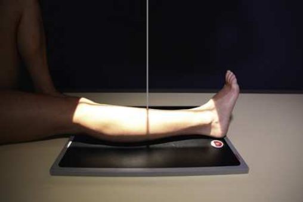
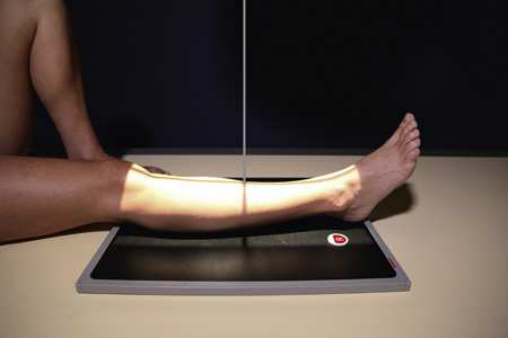
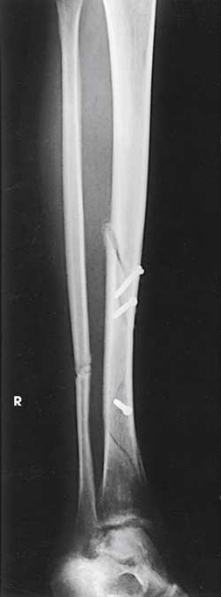

# Rx Leg — Oblică Antero-Posterioară (AP) — Medial and Rotație Externă (Laterală)s (Merrill)

  📷 Radiografie Convențională (Rx)
  <strong>Actualizat:</strong> 2026-09-16
  <strong>Autor:</strong> Referință Merrill

---

-   __1. Rezumat Clinic & Indicații__

    ---

    === "Indicații Clinice"

        - Conform reperelor anatomice standard din tratat

    === "Ghid Național IRIS"

        !!! info "Referință Primară: Ghidul Național IRIS (Ordinul MS 1342/2012)"
            - **Capitol Ghid IRIS:** *Ghidul Național IRIS*
            - **Grad de Recomandare:** **De verificat pe indicație; fără grad atribuit automat**
            - **Nivel de Iradiere Estimată:** `De verificat pentru examinarea și populația selectate`

            [:octicons-search-16: Deschide Ghidul IRIS](../../iris.md){ .md-button .md-button--primary } [:material-open-in-new: Aplicația Oficială PWA](https://radiologie-pediatrica.ro/iris/){ .md-button target="_blank" rel="noopener" }
-   __2. Poziționare & Centrare Fascicul__

    ---

    - **Poziție Pacient:** se așază pacientul în Decubit dorsal poziție pe masa radiologică.; Perform oblic incidențe de membru inferior prin alternately rotating extremity 45 grade medially (Fig. 7.115) sau laterally (Fig. 7.116). pentru rotație internă (medială), ensure that membru inferior este turned inward, nu just Picior. pentru medial Incidență Oblică, elevate afected Șold enough la rest medial side de Picior și Gleznă (Articulație Talocrurală) against a 45-grade foam wedge, și place support under mare trohanter. se efectuează ecranarea gonadelor cu șorț plumbat.
    - **Punct de Centrare Fascicul:** perpendicular pe midpoint de receptorul de imagine.
    - **Distanță Focar-Film (DFF / SID):** Nespecificat în fragmentul extras; de verificat în sursă
    - **Comandă Respiratorie:** Conform reperelor anatomice standard din tratat

-   __3. Parametri Tehnici Expunere__

    ---

    | Parametru Tehnic | Valoare Configurare Generator / Tub |
    |:-----------------|:-------------------------------------|
    | **Tensiune Tub (kV)** | DE CONFIGURAT PE APARAT |
    | **Sarcină / Produs Curent-Timp (mAs)** | DE CONFIGURAT PE APARAT |
    | **Distanță Focar-Film (DFF / SID)** | Nespecificat în fragmentul extras; de verificat în sursă |
    | **Grilă Antidifuzoare (Bucky)** | DE CONFIGURAT PE APARAT |
    | **Dimensiune Focar** | DE CONFIGURAT PE APARAT |
    | **Camere de Ionizare AEC** | DE CONFIGURAT PE APARAT |
    | **Colimare Fascicul** | se ajustează câmp de iradiere la 1 inch (2.5 cm) pe sides și 1½ inches (3.8 cm) beyond Gleznă (Articulație Talocrurală) și Genunchi articulații. Place marker de lateralitate (D/S) în collimated expunere field. |
    | **Filtrare Tub** | DE CONFIGURAT PE APARAT |

-   __4. Criterii de Calitate & Reușită Imagine__

    ---

    - Criterii radiologice de calitate imaginii:
    - Evidence de corect collimation și presence de marker de lateralitate (D/S) plasat clear de anatomy de interest
    - Gleznă (Articulație Talocrurală) și Genunchi articulații pe one sau more imagini
    - Bony detalii trabeculare osoase și surrounding soft tissues rotație internă (medială)
    - corect rotație de membru inferior
    - proximal și distal tibiofibular articulations
    - Maximum interosseous space între tibia și fibula rotație externă (laterală)
    - corect rotație de membru inferior
    - Fibula superimposed prin lateral portion de tibia

-   __5. Protecție Radiologică (ALARA)__

    ---

    - Nespecificat în fragmentul extras; de verificat în sursă

!!! note "Observații Clinice & Tehnice"
    Conform reperelor anatomice standard din tratat

### 🖼️ Imagini

<figure class="protocol-image-card" markdown>

<figcaption><strong>Merrill — pagina PDF 539, imaginea 1</strong> — Imagine din fragmentul sursă; asocierea necesită revizie.</figcaption>

</figure>

<figure class="protocol-image-card" markdown>

<figcaption><strong>Merrill — pagina PDF 539, imaginea 2</strong> — Imagine din fragmentul sursă; asocierea necesită revizie.</figcaption>

</figure>

<figure class="protocol-image-card" markdown>

<figcaption><strong>Merrill — pagina PDF 540, imaginea 3</strong> — Imagine din fragmentul sursă; asocierea necesită revizie.</figcaption>

</figure>

=== "Ghid Rapid de Execuție"

    1. **Identificarea și verificarea pacientului:** verificare identitate, zonă de examinat, consimțământ conform procedurii și evaluarea posibilității unei sarcini, când este relevantă.
    2. **Pregătire:** îndepărtarea oricăror obiecte radiopace (bijuterii, agrafe, fermoare, proteze, pansamente dense).
    3. **Poziționare precisă:** alinierea receptorului de imagine și a tubului la distanța prescrisă (Nespecificat în fragmentul extras; de verificat în sursă).
    4. **Colimare strictă:** adaptarea fasciculului strict la regiunea de diagnostic pentru scăderea iradierii și reducerea radiației difuze.
    5. **Radioprotecție:** verificarea [politicii RX](../radioprotectie.md), cu măsuri distincte pentru pacient, personal și însoțitor.

## Surse de documentare

- [Merrill’s Atlas, 7. Lower Extremity, pagini PDF 538–540](../../assets/protocols/sources/a56d45c16829_Merrills_Atlas_of_Radiographic_Positioning__Procedures_3Vol_Set.pdf#page=538)

## Fragmente sursă traduse (referință tehnică)

### anatomy

A 45-grade oblic incidență de bones și soft tissues de membru inferior și one sau ambele de adjacent articulații (Figs. 7.117 și 7.118).

### collimation

• se ajustează câmp de iradiere la 1 inch (2.5 cm) pe sides și 1½ inches (3.8 cm) beyond ankle și genunchi articulații. Place marker de lateralitate (D/S) în
collimated expunere field.

### cr

• perpendicular pe midpoint de receptorul de imagine.

### criteria

Criterii radiologice de calitate imaginii:
• Evidence de corect collimation și presence de marker de lateralitate (D/S) plasat clear de anatomy de interest
• Ankle și genunchi articulații pe one sau more imagini
• Bony detalii trabeculare osoase și surrounding soft tissues
rotație internă (medială)
• corect rotație de membru inferior
• proximal și distal tibiofibular articulations
• Maximum interosseous space între tibia și fibula
rotație externă (laterală)
• corect rotație de membru inferior
• Fibula superimposed prin lateral portion de tibia

### part_pos

• Perform oblic incidențe de membru inferior prin alternately rotating extremity 45 grade medially (Fig. 7.115) sau laterally (Fig. 7.116). pentru
rotație internă (medială), ensure that membru inferior este turned inward, nu just picior.
• pentru medial oblic incidență, elevate afected hip enough la rest medial side de picior și ankle against a 45-grade foam
wedge, și place support under mare trohanter.
• se efectuează ecranarea gonadelor cu șorț plumbat.

### patient_pos

• se așază pacientul în decubit dorsal pe masa radiologică.

### tech

poziționat prin manufacturer sau department protocol pentru corect anatomy display orientation; raza centrală plate: 14 × 17 inches (35 × 43 cm) longitudinal sau
diagonal.

