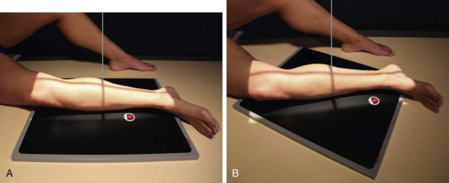
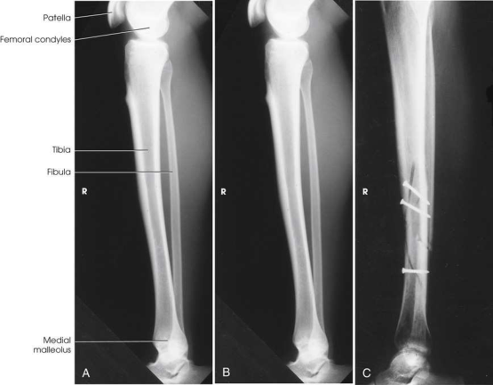

# Rx Leg — Incidență de Profil (Lateral) — Medio-Lateral (Merrill)

  📷 Radiografie Convențională (Rx)
  <strong>Actualizat:</strong> 2026-09-16
  <strong>Autor:</strong> Referință Merrill

---

-   __1. Rezumat Clinic & Indicații__

    ---

    === "Indicații Clinice"

        - Conform reperelor anatomice standard din tratat

    === "Ghid Național IRIS"

        !!! info "Referință Primară: Ghidul Național IRIS (Ordinul MS 1342/2012)"
            - **Capitol Ghid IRIS:** *Ghidul Național IRIS*
            - **Grad de Recomandare:** **De verificat pe indicație; fără grad atribuit automat**
            - **Nivel de Iradiere Estimată:** `De verificat pentru examinarea și populația selectate`

            [:octicons-search-16: Deschide Ghidul IRIS](../../iris.md){ .md-button .md-button--primary } [:material-open-in-new: Aplicația Oficială PWA](https://radiologie-pediatrica.ro/iris/){ .md-button target="_blank" rel="noopener" }
-   __2. Poziționare & Centrare Fascicul__

    ---

    - **Poziție Pacient:** se așază pacientul în Decubit dorsal poziție.; Turn pacientul spre afected side cu membru inferior pe receptorul de imagine. se ajustează rotație de corp la place Rotulă (Patelă) perpendicular pe receptorul de imagine (RI) și ensure that line drawn through femoral condyles este also perpendicular (Fig. 7.113). Place săculeți cu nisip supports where needed pentru pacientul’s comfort și la stabilize corp poziție (Fig. 7.113A). Genunchi poate fie flectat, if necessary, la ensure true Incidență de Profil (lateral). incidență poate fie done cu receptorul de imagine diagonal pentru include Gleznă (Articulație Talocrurală) și Genunchi articulații sau two incidențe sunt made—one de membru inferior la include articulație, și one pentru include other articulație. Alternative method When pacientul cannot fie turned de la Decubit dorsal poziție, lateromedial Incidență de Profil (lateral) poate fie taken cross-table using orizontal raza centrală. Lift membru inferior high enough pentru assistant la slide rigid support under pacientul’s membru inferior. receptorul de imagine poate fie plasat între membre inferioare, și raza centrală poate fie orientat de la lateral side. se efectuează ecranarea gonadelor cu șorț plumbat.
    - **Punct de Centrare Fascicul:** perpendicular pe midpoint de membru inferior.
    - **Distanță Focar-Film (DFF / SID):** Nespecificat în fragmentul extras; de verificat în sursă
    - **Comandă Respiratorie:** Conform reperelor anatomice standard din tratat

-   __3. Parametri Tehnici Expunere__

    ---

    | Parametru Tehnic | Valoare Configurare Generator / Tub |
    |:-----------------|:-------------------------------------|
    | **Tensiune Tub (kV)** | DE CONFIGURAT PE APARAT |
    | **Sarcină / Produs Curent-Timp (mAs)** | DE CONFIGURAT PE APARAT |
    | **Distanță Focar-Film (DFF / SID)** | Nespecificat în fragmentul extras; de verificat în sursă |
    | **Grilă Antidifuzoare (Bucky)** | DE CONFIGURAT PE APARAT |
    | **Dimensiune Focar** | DE CONFIGURAT PE APARAT |
    | **Camere de Ionizare AEC** | DE CONFIGURAT PE APARAT |
    | **Colimare Fascicul** | se ajustează câmp de iradiere la 1 inch (2.5 cm) pe sides și 1½ inches (3.8 cm) beyond Gleznă (Articulație Talocrurală) și Genunchi articulații. Se plasează markerul de lateralitate în câmpul colimat. |
    | **Filtrare Tub** | DE CONFIGURAT PE APARAT |

-   __4. Criterii de Calitate & Reușită Imagine__

    ---

    - Criterii radiologice de calitate imaginii:
    - Evidence de corect collimation și presence de marker de lateralitate (D/S) plasat clear de anatomy de interest
    - Gleznă (Articulație Talocrurală) și Genunchi articulații pe one sau more imagini
    - Entire membru inferior în true Incidență de Profil (lateral)
    - distal fibula superimposed prin posterior half de tibia
    - Slight overlap de tibia pe proximal cap peronier (fibular)
    - Moderate separation de tibial și fibular corpuri sau shafts (except la their articular ends)
    - Possibly reduced superimposition de femoral condyles because de divergence de fascicul
    - Bony detalii trabeculare osoase și surrounding soft tissues

-   __5. Protecție Radiologică (ALARA)__

    ---

    - Nespecificat în fragmentul extras; de verificat în sursă

!!! note "Observații Clinice & Tehnice"
    Conform reperelor anatomice standard din tratat

### 🖼️ Imagini

<figure class="protocol-image-card" markdown>

<figcaption><strong>Merrill — pagina PDF 537, imaginea 1</strong> — Imagine din fragmentul sursă; asocierea necesită revizie.</figcaption>

</figure>

<figure class="protocol-image-card" markdown>

<figcaption><strong>Merrill — pagina PDF 538, imaginea 2</strong> — Imagine din fragmentul sursă; asocierea necesită revizie.</figcaption>

</figure>

=== "Ghid Rapid de Execuție"

    1. **Identificarea și verificarea pacientului:** verificare identitate, zonă de examinat, consimțământ conform procedurii și evaluarea posibilității unei sarcini, când este relevantă.
    2. **Pregătire:** îndepărtarea oricăror obiecte radiopace (bijuterii, agrafe, fermoare, proteze, pansamente dense).
    3. **Poziționare precisă:** alinierea receptorului de imagine și a tubului la distanța prescrisă (Nespecificat în fragmentul extras; de verificat în sursă).
    4. **Colimare strictă:** adaptarea fasciculului strict la regiunea de diagnostic pentru scăderea iradierii și reducerea radiației difuze.
    5. **Radioprotecție:** verificarea [politicii RX](../radioprotectie.md), cu măsuri distincte pentru pacient, personal și însoțitor.

## Surse de documentare

- [Merrill’s Atlas, 7. Lower Extremity, pagini PDF 536–538](../../assets/protocols/sources/a56d45c16829_Merrills_Atlas_of_Radiographic_Positioning__Procedures_3Vol_Set.pdf#page=536)

## Fragmente sursă traduse (referință tehnică)

### anatomy

tibia, fibula, și adjacent articulații (Fig. 7.114).

### collimation

• se ajustează câmp de iradiere la 1 inch (2.5 cm) pe sides și 1½ inches (3.8 cm) beyond ankle și genunchi articulații. Place marker de lateralitate (D/S) în
collimated expunere field.

### cr

• perpendicular pe midpoint de membru inferior.

### criteria

Criterii radiologice de calitate imaginii:
• Evidence de corect collimation și presence de marker de lateralitate (D/S) plasat clear de anatomy de interest
• Ankle și genunchi articulații pe one sau more imagini
• Entire membru inferior în true poziție de profil (lateral)
• distal fibula superimposed prin posterior half de tibia
• Slight overlap de tibia pe proximal cap peronier (fibular)
• Moderate separation de tibial și fibular corpuri sau shafts (except la their articular ends)
• Possibly reduced superimposition de femoral condyles because de divergence de fascicul
• Bony detalii trabeculare osoase și surrounding soft tissues

### part_pos

• Turn pacientul spre afected side cu membru inferior pe receptorul de imagine.
• se ajustează rotație de corp la place rotulă (patelă) perpendicular pe receptorul de imagine (RI) și ensure that line drawn through femoral condyles
este also perpendicular (Fig. 7.113).
• Place săculeți cu nisip supports where needed pentru pacientul’s comfort și la stabilize corp poziție (Fig. 7.113A).
• genunchi poate fie flectat, if necessary, la ensure true poziție de profil (lateral).
• incidență poate fie done cu receptorul de imagine diagonal pentru include ankle și genunchi articulații sau two incidențe sunt made—one de membru inferior la
include articulație, și one pentru include other articulație.
Alternative method
• When pacientul cannot fie turned de la decubit dorsal, lateromedial lateral incidență poate fie taken cross-table using orizontal raza centrală.
• Lift membru inferior high enough pentru assistant la slide rigid support under pacientul’s membru inferior.
• receptorul de imagine poate fie plasat între membre inferioare, și raza centrală poate fie orientat de la lateral side.
• se efectuează ecranarea gonadelor cu șorț plumbat.

### patient_pos

• se așază pacientul în decubit dorsal.

### tech

poziționat prin manufacturer sau department protocol pentru corect anatomy display orientation; raza centrală plate: 14 × 17 inches (35 × 43 cm) longitudinal sau
diagonal.

