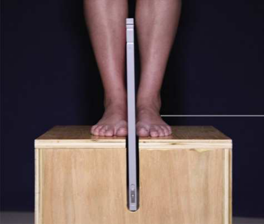
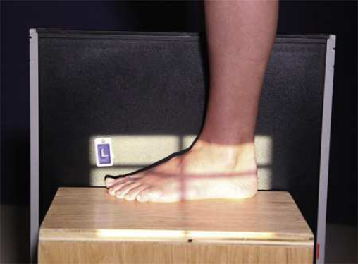

# Rx Longitudinal Arch — Incidență de Profil (Lateral) — Latero-Medial În Încărcare (Ortostatism) Method Standing (Merrill)

  📷 Radiografie Convențională (Rx)
  <strong>Actualizat:</strong> 2026-09-16
  <strong>Autor:</strong> Referință Merrill

---

-   __1. Rezumat Clinic & Indicații__

    ---

    === "Indicații Clinice"

        - Conform reperelor anatomice standard din tratat

    === "Ghid Național IRIS"

        !!! info "Referință Primară: Ghidul Național IRIS (Ordinul MS 1342/2012)"
            - **Capitol Ghid IRIS:** *Ghidul Național IRIS*
            - **Grad de Recomandare:** **De verificat pe indicație; fără grad atribuit automat**
            - **Nivel de Iradiere Estimată:** `De verificat pentru examinarea și populația selectate`

            [:octicons-search-16: Deschide Ghidul IRIS](../../iris.md){ .md-button .md-button--primary } [:material-open-in-new: Aplicația Oficială PWA](https://radiologie-pediatrica.ro/iris/){ .md-button target="_blank" rel="noopener" }
-   __2. Poziționare & Centrare Fascicul__

    ---

    - **Poziție Pacient:** se așază pacientul în ortostatism, preferably pe low riser that has receptorul de imagine groove. If such riser este unavailable, use blocks la elevate picioarele la level de x-ray tube (Figs. 7.53 și 7.54). If needed, use mobile unit la allow x-ray tube la reach floor level.; Place receptorul de imagine în receptorul de imagine groove de stool sau între blocks. Se instruiește pacientul să stand în natural poziție, one Picior pe fiecare side receptorul de imagine, cu weight de corp equally distributed pe picioarele. se ajustează receptorul de imagine so that it este centrat pe base de third metatarsal, și place medial surface de Picior pe / sprijinit de receptorul de imagine. After expunere, repeat above steps la imagine opposite Picior. se efectuează ecranarea gonadelor cu șorț plumbat.
    - **Punct de Centrare Fascicul:** perpendicular la point just above base de third metatarsal.
    - **Distanță Focar-Film (DFF / SID):** Nespecificat în fragmentul extras; de verificat în sursă
    - **Comandă Respiratorie:** Conform reperelor anatomice standard din tratat

-   __3. Parametri Tehnici Expunere__

    ---

    | Parametru Tehnic | Valoare Configurare Generator / Tub |
    |:-----------------|:-------------------------------------|
    | **Tensiune Tub (kV)** | DE CONFIGURAT PE APARAT |
    | **Sarcină / Produs Curent-Timp (mAs)** | DE CONFIGURAT PE APARAT |
    | **Distanță Focar-Film (DFF / SID)** | Nespecificat în fragmentul extras; de verificat în sursă |
    | **Grilă Antidifuzoare (Bucky)** | DE CONFIGURAT PE APARAT |
    | **Dimensiune Focar** | DE CONFIGURAT PE APARAT |
    | **Camere de Ionizare AEC** | DE CONFIGURAT PE APARAT |
    | **Colimare Fascicul** | se ajustează câmp de iradiere la 1 inch (2.5 cm) pe toate sides de shadow de Picior including 1 inch (2.5 cm) above maleolă medială (tibială). Place marker de lateralitate (D/S) în collimated expunere field. |
    | **Filtrare Tub** | DE CONFIGURAT PE APARAT |

-   __4. Criterii de Calitate & Reușită Imagine__

    ---

    - Criterii radiologice de calitate imaginii:
    - Evidence de corect collimation și presence de marker de lateralitate (D/S) plasat clear de anatomy de interest
    - Entire Picior și distal membru inferior
    - Superimposed plantar surfaces de metatarsal heads
    - Fibula overlapping posterior portion de tibia
    - Tibiotalar articulație
    - Bony detalii trabeculare osoase și surrounding soft tissues

-   __5. Protecție Radiologică (ALARA)__

    ---

    - Nespecificat în fragmentul extras; de verificat în sursă

!!! note "Observații Clinice & Tehnice"
    Conform reperelor anatomice standard din tratat

### 🖼️ Imagini

<figure class="protocol-image-card" markdown>

<figcaption><strong>Merrill — pagina PDF 491, imaginea 1</strong> — Imagine din fragmentul sursă; asocierea necesită revizie.</figcaption>

</figure>

<figure class="protocol-image-card" markdown>

<figcaption><strong>Merrill — pagina PDF 491, imaginea 2</strong> — Imagine din fragmentul sursă; asocierea necesită revizie.</figcaption>

</figure>

=== "Ghid Rapid de Execuție"

    1. **Identificarea și verificarea pacientului:** verificare identitate, zonă de examinat, consimțământ conform procedurii și evaluarea posibilității unei sarcini, când este relevantă.
    2. **Pregătire:** îndepărtarea oricăror obiecte radiopace (bijuterii, agrafe, fermoare, proteze, pansamente dense).
    3. **Poziționare precisă:** alinierea receptorului de imagine și a tubului la distanța prescrisă (Nespecificat în fragmentul extras; de verificat în sursă).
    4. **Colimare strictă:** adaptarea fasciculului strict la regiunea de diagnostic pentru scăderea iradierii și reducerea radiației difuze.
    5. **Radioprotecție:** verificarea [politicii RX](../radioprotectie.md), cu măsuri distincte pentru pacient, personal și însoțitor.

## Surse de documentare

- [Merrill’s Atlas, 7. Lower Extremity, pagini PDF 490–491](../../assets/protocols/sources/a56d45c16829_Merrills_Atlas_of_Radiographic_Positioning__Procedures_3Vol_Set.pdf#page=490)

## Fragmente sursă traduse (referință tehnică)

### anatomy

lateromedial incidență de bones de picior cu weight bearing. incidență este used la show structural status de longitudinal
arch. drept și stâng sides sunt examined pentru comparison (Figs. 7.55 și 7.56).

### collimation

• se ajustează câmp de iradiere la 1 inch (2.5 cm) pe toate sides de shadow de picior including 1 inch (2.5 cm) above maleolă medială (tibială).
Place marker de lateralitate (D/S) în collimated expunere field.

### cr

• perpendicular la point just above base de third metatarsal.

### criteria

Criterii radiologice de calitate imaginii:
• Evidence de corect collimation și presence de marker de lateralitate (D/S) plasat clear de anatomy de interest
• Entire picior și distal membru inferior
• Superimposed plantar surfaces de metatarsal heads
• Fibula overlapping posterior portion de tibia
• Tibiotalar articulație
• Bony detalii trabeculare osoase și surrounding soft tissues

### part_pos

• Place receptorul de imagine în receptorul de imagine groove de stool sau între blocks.
• Se instruiește pacientul să stand în natural poziție, one picior pe fiecare side receptorul de imagine, cu weight de corp equally distributed pe picioarele.
• se ajustează receptorul de imagine so that it este centrat pe base de third metatarsal, și place medial surface de picior pe / sprijinit de receptorul de imagine.
• After expunere, repeat above steps la imagine opposite picior.
• se efectuează ecranarea gonadelor cu șorț plumbat.

### patient_pos

• se așază pacientul în ortostatism, preferably pe low riser that has receptorul de imagine groove. If such riser este unavailable, use blocks la
elevate picioarele la level de x-ray tube (Figs. 7.53 și 7.54).
• If needed, use mobile unit la allow x-ray tube la reach floor level.

### tech

poziționat prin manufacturer sau department protocol pentru corect anatomy display orientation; raza centrală plate: 10 × 12 inches (24 × 30 cm) longitudinal.

