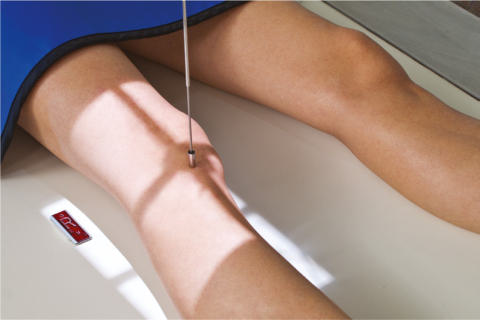
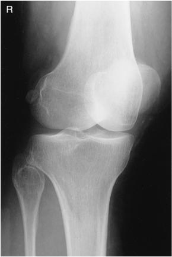
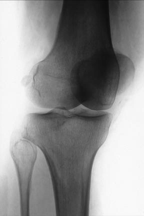

# Rx MEDIAL (INTERNAL) ROTATION AP Oblică (Genunchi)

  📷 Radiografie Convențională (Rx)
  <strong>Actualizat:</strong> 2026-09-15
  <strong>Autor:</strong> Departamentul de Radiologie / Referință Bontrager

---

-   __1. Rezumat Clinic & Indicații__

    ---

    === "Indicații Clinice"

        - Pathology involving the proximal tibiofibular and femorotibial (Genunchi) joint articulations
        - suspiciune de fractură, lesions, and bony changes related to degenerative joint disease, especially on the anterior and medial or posterior and lateral portions of Genunchi

    === "Ghid Național IRIS"

        !!! info "Referință Primară: Ghidul Național IRIS (Ordinul MS 1342/2012)"
            - **Capitol Ghid IRIS:** *Ghidul Național IRIS*
            - **Grad de Recomandare:** **De verificat pe indicație; fără grad atribuit automat**
            - **Nivel de Iradiere Estimată:** `De verificat pentru examinarea și populația selectate`

            [:octicons-search-16: Deschide Ghidul IRIS](../../iris.md){ .md-button .md-button--primary } [:material-open-in-new: Aplicația Oficială PWA](https://radiologie-pediatrica.ro/iris/){ .md-button target="_blank" rel="noopener" }
-   __2. Poziționare & Centrare Fascicul__

    ---

    - **Poziție Pacient:** Pacient: Place patient in semisupine position with entire body and leg rotated partially away from side of interest; place support under elevated Șold; provide a pillow for patient’s head.; Regiune anatomică: Align and center leg and Genunchi to CR and to midline of table or IR. Rotate entire leg internally 45°. (Interepicondylar line should be 45° to plane of IR.) (Fig. 6.106) If needed, stabilize Picior and Gleznă (Articulație Talocrurală) in this position with sandbags.
    - **Punct de Centrare Fascicul:** Angle CR 0° on average patient (see AP Genunchi, p. 247). Direct CR to midpoint of Genunchi at a level ½ inch (1.25 cm) distal to apex of Rotulă (Patelă).
    - **Distanță Focar-Film (DFF / SID):** 100 cm
    - **Comandă Respiratorie:** Apnee pe durata expunerii (sau conform cooperării pacientului)

-   __3. Parametri Tehnici Expunere__

    ---

    | Parametru Tehnic | Valoare Configurare Generator / Tub |
    |:-----------------|:-------------------------------------|
    | **Tensiune Tub (kV)** | 65-80 kV |
    | **Sarcină / Produs Curent-Timp (mAs)** | DE CONFIGURAT PE APARAT |
    | **Distanță Focar-Film (DFF / SID)** | 100 cm |
    | **Grilă Antidifuzoare (Bucky)** | Fără grilă (expunere directă) |
    | **Dimensiune Focar** | Focar Mic (0.6 mm) |
    | **Camere de Ionizare AEC** | DE CONFIGURAT PE APARAT |
    | **Colimare Fascicul** | Collimate on both sides to skin margins, with full collimation at ends to IR borders to include maximum Femur and tibiafibula. |
    | **Filtrare Tub** | Totală ≥ 2.5 mm Al echivalent |

-   __4. Criterii de Calitate & Reușită Imagine__

    ---

    - Distal Femur and proximal tibia and fibula with the Rotulă (Patelă) superimposing the medial femoral condyle are shown.
    - Lateral condyles of the Femur and tibia are well demonstrated, and the medial and lateral Genunchi joint spaces appear unequal (Figs. 6.107 and 6.108). Position:
    - The proper amount of part obliquity demonstrates the proximal tibiofibular articulation open with the lateral condyles of the Femur and tibia seen in profile.
    - The head and neck of the fibula are visualized without superimposition, and approximately half of the Rotulă (Patelă) should be seen free of superimposition by the Femur. The center of the collimated field is to the femorotibial (Genunchi) joint space. Exposure:
    - Optimal image receptor exposure and contrast with no motion should visualize soft tissue in the Genunchi joint area, and trabecular markings of all bones should appear clear and sharp.
    - Head and neck area of fibula should not appear overexposed. Fig. 6.107 AP medial oblique. Femur Rotulă (Patelă) Tibia R Medial condyle Proximal tibiofibular joint Lateral condyle of Femur Lateral condyle of tibia Neck of fibula Head Fig. 6.108 AP medial oblique.

-   __5. Protecție Radiologică (ALARA)__

    ---

    - Ecranare gonadică și a organelor radiosensibile conform procedurilor locale de radioprotecție ALARA.
    - Colimare strictă la aria de interes pentru limitarea radiației difuze.
    - Verificarea posibilității unei sarcini la pacientele de vârstă fertilă înainte de expunere.

!!! note "Observații Clinice & Tehnice"
    The terms medial (internal) oblique and lateral (external) oblique positions refer to the direction of rotation of the anterior or patellar surface of the Genunchi. This is true for descriptions of AP or PA oblique projections. Genunchi ROUTINE AP Oblique (medial and lateral) Lateral Fig. 6.106 AP 45° medial oblique.

### 🖼️ Imagini

<figure class="protocol-image-card" markdown>

<figcaption><strong>Fig. 6.106 AP 45° medial oblique.</strong> — Poziționare pacient conform Ghidului Bontrager (Fig. 6.106 AP 45° medial oblique.)</figcaption>

</figure>

<figure class="protocol-image-card" markdown>

<figcaption><strong>Fig. 6.107 AP medial oblique.</strong> — Aspect radiografic de referință conform Ghidului Bontrager (Fig. 6.107 AP medial oblique.)</figcaption>

</figure>

<figure class="protocol-image-card" markdown>

<figcaption><strong>Fig. 6.108 AP medial oblique.</strong> — Aspect radiografic de referință conform Ghidului Bontrager (Fig. 6.108 AP medial oblique.)</figcaption>

</figure>

=== "Ghid Rapid de Execuție"

    1. **Identificarea și verificarea pacientului:** verificare identitate, zonă de examinat, consimțământ conform procedurii și evaluarea posibilității unei sarcini, când este relevantă.
    2. **Pregătire:** îndepărtarea oricăror obiecte radiopace (bijuterii, agrafe, fermoare, proteze, pansamente dense).
    3. **Poziționare precisă:** alinierea receptorului de imagine și a tubului la distanța prescrisă (100 cm).
    4. **Colimare strictă:** adaptarea fasciculului strict la regiunea de diagnostic pentru scăderea iradierii și reducerea radiației difuze.
    5. **Radioprotecție:** verificarea [politicii RX](../radioprotectie.md), cu măsuri distincte pentru pacient, personal și însoțitor.

## Surse de documentare

- [Bontrager's Textbook of Radiographic Positioning (Ed. 9/10), Pagina 262](https://www.elsevier.com/books/textbook-of-radiographic-positioning-and-related-anatomy/lampignano/978-0-323-65367-1)
