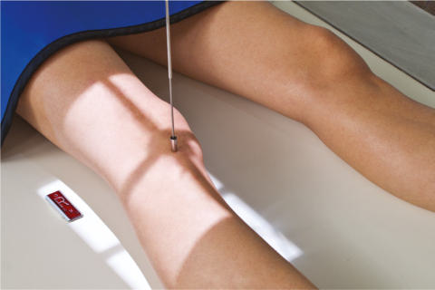
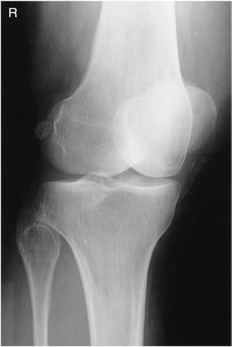
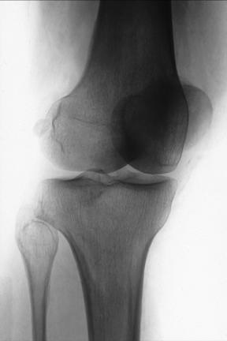

# Rx rotație MEDIALĂ (INTERNĂ), AP oblică (genunchi)

  📷 Radiografie Convențională (Rx)
  <strong>Actualizat:</strong> 2026-09-15
  <strong>Autor:</strong> Departamentul de Radiologie / Referință Bontrager

---

-   __1. Rezumat Clinic & Indicații__

    ---

    === "Indicații Clinice"

        - Patologie care implică articulațiile tibiofibulară proximală și femorotibială (a genunchiului)
        - suspiciune de fractură, leziuni și modificări osoase asociate bolii degenerative articulare, în special la porțiunile anterioară și medială sau posterioară și laterală ale genunchiului

    === "Ghid Național IRIS"

        !!! info "Referință Primară: Ghidul Național IRIS (Ordinul MS 1342/2012)"
            - **Capitol Ghid IRIS:** *Aparat locomotor & Membru inferior*
            - **Grad de Recomandare:** **Grad A**
            - **Nivel de Iradiere Estimată:** `Clasa 1 (Minimă < 0.05 mSv)`

            [:octicons-search-16: Deschide Ghidul IRIS](../../iris.md){ .md-button .md-button--primary } [:material-open-in-new: Aplicația Oficială PWA](https://radiologie-pediatrica.ro/iris/){ .md-button target="_blank" rel="noopener" }

-   __2. Poziționare & Centrare Fascicul__

    ---

    - **Poziție Pacient:** Pacient: Se plasează pacientul în poziție semisupină, cu întregul corp și gamba rotite parțial în direcția opusă părții de interes; se plasează un suport sub șoldul ridicat; se oferă o pernă pentru capul pacientului. Regiune anatomică: Se aliniază și se centrează gamba și genunchiul față de raza centrală și linia mediană a mesei sau receptorului de imagine. Se rotește întreaga gambă intern la 45°. Linia interepicondiliană trebuie să fie la 45° față de planul receptorului de imagine. (Fig. 6.106) Dacă este necesar, se stabilizează piciorul și glezna în această poziție cu săculeți cu nisip.
    - **Punct de Centrare Fascicul:** Se angulează raza centrală la 0° pentru pacientul mediu (vezi AP genunchi, p. 247). Raza centrală se orientează spre punctul median al genunchiului, la nivelul de ½ țol (1.25 cm) distal față de apexul rotulei.
    - **Distanță Focar-Film (DFF / SID):** 100 cm
    - **Comandă Respiratorie:** Apnee pe durata expunerii (sau conform cooperării pacientului)

-   __3. Parametri Tehnici Expunere__

    ---

    | Parametru Tehnic | Valoare Configurare Generator / Tub |
    |:-----------------|:-------------------------------------|
    | **Tensiune Tub (kV)** | 65-80 kV |
    | **Sarcină / Produs Curent-Timp (mAs)** | DE CONFIGURAT PE APARAT |
    | **Distanță Focar-Film (DFF / SID)** | 100 cm |
    | **Grilă Antidifuzoare (Bucky)** | Fără grilă (expunere directă) |
    | **Dimensiune Focar** | Focar Mic (0.6 mm) |
    | **Camere de Ionizare AEC** | DE CONFIGURAT PE APARAT |
    | **Colimare Fascicul** | Se colimează pe ambele părți (bilateral) până la marginile cutanate, cu colimare completă la capetele marginilor receptorului de imagine, pentru a include maximum posibil din femur și tibie-fibulă. |
    | **Filtrare Tub** | Totală ≥ 2.5 mm Al echivalent |

-   __4. Criterii de Calitate & Reușită Imagine__

    ---

    - Se vizualizează femurul distal și tibia și fibula proximale, cu rotula suprapusă peste condilul femural medial.
    - condilii laterali ai femurului și tibia sunt bine evidențiați, iar spațiile articulare medial și lateral ale genunchiului apar inegale (Figs. 6.107 și 6.108). Poziție:
    - Gradul corect de oblicitate evidențiază articulația tibiofibulară proximală deschisă, cu condilii laterali ai femurului și tibia vizualizați de profil.
    - Capul și colul fibulei sunt vizualizate fără suprapunere, iar aproximativ jumătate din rotulă trebuie să fie vizibilă liber de suprapunerea femurului. Centrul câmpului colimat este la nivelul spațiilor articulare femorotibiale. Expunere:
    - O expunere și un contrast optime ale receptorului de imagine, fără mișcare, trebuie să vizualizeze părțile moi din regiunea articulației genunchiului, iar desenul trabecular al tuturor oaselor trebuie să apară clar și net.
    - Regiunea capului și colului fibulei nu trebuie să apară supraexpusă. Fig. 6.107 AP oblică medială. Femur. Rotulă. Tibia. R. Condil medial. Articulație tibiofibulară proximală. Condil lateral al femurului. Condil lateral al tibiei. Colul fibulei. Cap. Fig. 6.108 AP oblică medială.

-   __5. Protecție Radiologică (ALARA)__

    ---

    - Ecranare gonadică și a organelor radiosensibile conform procedurilor locale de radioprotecție ALARA.
    - Colimare strictă la aria de interes pentru limitarea radiației difuze.
    - Verificarea posibilității unei sarcini la pacientele de vârstă fertilă înainte de expunere.

!!! note "Observații Clinice & Tehnice"
    Termenii oblic medial (intern) și oblic lateral (extern) se referă la direcția de rotație a suprafeței anterioare sau patelare a genunchiului. Acest lucru este valabil pentru descrierile incidențelor oblice AP sau PA. Genunchi — examinare de rutină, AP oblică (medială și laterală), laterală, Fig. 6.106, AP oblică medială la 45°.

### 🖼️ Imagini

<figure class="protocol-image-card" markdown>

<figcaption><strong>Fig. 6.106 AP oblică medială la 45°.</strong> — Poziționarea pacientului conform Ghidului Bontrager (Fig. 6.106 AP oblică medială la 45°.)</figcaption>

</figure>

<figure class="protocol-image-card" markdown>

<figcaption><strong>Fig. 6.107 AP oblică medială.</strong> — Aspect radiografic de referință conform Ghidului Bontrager (Fig. 6.107 AP oblică medială.)</figcaption>

</figure>

<figure class="protocol-image-card" markdown>

<figcaption><strong>Fig. 6.108 AP oblică medială.</strong> — Aspect radiografic de referință conform Ghidului Bontrager (Fig. 6.108 AP oblică medială.)</figcaption>

</figure>

=== "Ghid Rapid de Execuție"

    1. **Identificarea și verificarea pacientului:** verificare identitate, zonă de examinat, consimțământ conform procedurii și evaluarea posibilității unei sarcini, când este relevantă.
    2. **Pregătire:** îndepărtarea oricăror obiecte radiopace (bijuterii, agrafe, fermoare, proteze, pansamente dense).
    3. **Poziționare precisă:** alinierea receptorului de imagine și a tubului la distanța prescrisă (100 cm).
    4. **Colimare strictă:** adaptarea fasciculului strict la regiunea de diagnostic pentru scăderea iradierii și reducerea radiației difuze.
    5. **Radioprotecție:** verificarea [politicii RX](../radioprotectie.md), cu măsuri distincte pentru pacient, personal și însoțitor.

## Surse de documentare

- [Bontrager's Textbook of Radiographic Positioning (Ed. 9/10), Pagina 262](https://www.elsevier.com/books/textbook-of-radiographic-positioning-and-related-anatomy/lampignano/978-0-323-65367-1)
