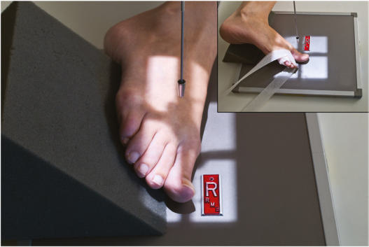
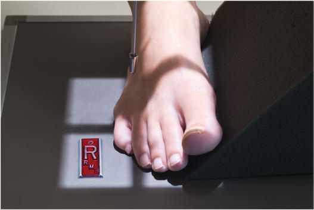
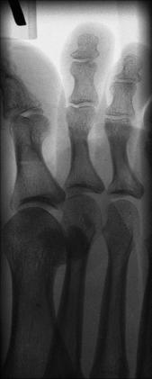
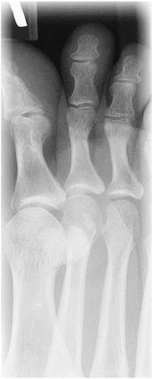

# Rx MEDIAL OR LATERAL ROTATION AP Oblică (Degete Picior)

  📷 Radiografie Convențională (Rx)
  <strong>Actualizat:</strong> 2026-09-15
  <strong>Autor:</strong> Departamentul de Radiologie / Referință Bontrager

---

-   __1. Rezumat Clinic & Indicații__

    ---

    === "Indicații Clinice"

        - suspiciune de fractură or luxație / subluxație articulară of the phalanges of the digits in question
        - Pathologies such as artroză / modificări degenerative articulare and gouty arthritis (gout), especially in the first digit

    === "Ghid Național IRIS"

        !!! info "Referință Primară: Ghidul Național IRIS (Ordinul MS 1342/2012)"
            - **Capitol Ghid IRIS:** *Ghidul Național IRIS*
            - **Grad de Recomandare:** **De verificat pe indicație; fără grad atribuit automat**
            - **Nivel de Iradiere Estimată:** `De verificat pentru examinarea și populația selectate`

            [:octicons-search-16: Deschide Ghidul IRIS](../../iris.md){ .md-button .md-button--primary } [:material-open-in-new: Aplicația Oficială PWA](https://radiologie-pediatrica.ro/iris/){ .md-button target="_blank" rel="noopener" }
-   __2. Poziționare & Centrare Fascicul__

    ---

    - **Poziție Pacient:** Pacient: Place patient Decubit Dorsal or Poziție Șezândă on table; Genunchi should be flexed with plantar surface of Picior resting on IR.; Regiune anatomică: Center and align long axis of digit to CR and long axis of portion of IR being exposed. Ensure that MTP joint of digit in question is centered to CR. Rotate the leg and Picior 30° to 45° medially for the first, second, and third digits (Fig. 6.43) and laterally for the fourth and fifth digits (Fig. 6.44). (See oblique Picior projections for degree of obliquity.) Use 45° radiolucent support under elevated portion of Picior to prevent motion.
    - **Punct de Centrare Fascicul:** perpendicular to IR, directed to MTP joint in question
    - **Distanță Focar-Film (DFF / SID):** 100 cm
    - **Comandă Respiratorie:** Apnee pe durata expunerii (sau conform cooperării pacientului)

-   __3. Parametri Tehnici Expunere__

    ---

    | Parametru Tehnic | Valoare Configurare Generator / Tub |
    |:-----------------|:-------------------------------------|
    | **Tensiune Tub (kV)** | 50-60 kV |
    | **Sarcină / Produs Curent-Timp (mAs)** | DE CONFIGURAT PE APARAT |
    | **Distanță Focar-Film (DFF / SID)** | 100 cm |
    | **Grilă Antidifuzoare (Bucky)** | Fără grilă (expunere directă) |
    | **Dimensiune Focar** | Focar Mic (0.6 mm) |
    | **Camere de Ionizare AEC** | DE CONFIGURAT PE APARAT |
    | **Colimare Fascicul** | Collimate on four sides to include phalanges and a minimum of distal half of metatarsals. On side margins, include a minimum of one digit on each side of digit in question. Degete Picior ROUTINE AP Oblique Lateral Fig. 6.43 Medial oblique rotation—first digit. Fig. 6.44 Lateral oblique rotation—fourth digit. |
    | **Filtrare Tub** | Totală ≥ 2.5 mm Al echivalent |

-   __4. Criterii de Calitate & Reușită Imagine__

    ---

    - Digits in question and distal half of metatarsals should be included without overlap (superimposition) (Figs. 6.45 and 6.46). Position:
    - Long axis of Picior is aligned to long axis of portion of IR being exposed.
    - Correct obliquity should be evident by increased concavity on one side of shafts and by overlapping of soft tissues of digits.
    - Heads of metatarsals should appear directly side by side with no (or only minimal) overlapping.4
    - Collimation to area of interest. Exposure:
    - No motion as evidenced by sharply defined cortical margins of bone and detailed bony trabeculae.
    - Optimal image receptor exposure and contrast to allow visualization of bony cortical margins and trabeculae and soft tissue structures. Fig. 6.45 Medial oblique—second digit. Distal phalanx Middle phalanx 2nd MTP joint (CR) Distal 2nd metatarsal Proximal phalanx Fig. 6.46 Medial obliquesecond digit.

-   __5. Protecție Radiologică (ALARA)__

    ---

    - Ecranare gonadică și a organelor radiosensibile conform procedurilor locale de radioprotecție ALARA.
    - Colimare strictă la aria de interes pentru limitarea radiației difuze.
    - Verificarea posibilității unei sarcini la pacientele de vârstă fertilă înainte de expunere.

### 🖼️ Imagini

<figure class="protocol-image-card" markdown>

<figcaption><strong>Fig. 6.43 Medial oblique rotation—first digit.</strong> — Poziționare pacient conform Ghidului Bontrager (Fig. 6.43 Medial oblique rotation—first digit.)</figcaption>

</figure>

<figure class="protocol-image-card" markdown>

<figcaption><strong>Fig. 6.44 Lateral oblique rotation—fourth digit.</strong> — Aspect radiografic de referință conform Ghidului Bontrager (Fig. 6.44 Lateral oblique rotation—fourth digit.)</figcaption>

</figure>

<figure class="protocol-image-card" markdown>

<figcaption><strong>Fig. 6.45 Medial</strong> — Aspect radiografic de referință conform Ghidului Bontrager (Fig. 6.45 Medial)</figcaption>

</figure>

<figure class="protocol-image-card" markdown>

<figcaption><strong>Fig. 6.46 Medial oblique—</strong> — Aspect radiografic de referință conform Ghidului Bontrager (Fig. 6.46 Medial oblique—)</figcaption>

</figure>

=== "Ghid Rapid de Execuție"

    1. **Identificarea și verificarea pacientului:** verificare identitate, zonă de examinat, consimțământ conform procedurii și evaluarea posibilității unei sarcini, când este relevantă.
    2. **Pregătire:** îndepărtarea oricăror obiecte radiopace (bijuterii, agrafe, fermoare, proteze, pansamente dense).
    3. **Poziționare precisă:** alinierea receptorului de imagine și a tubului la distanța prescrisă (100 cm).
    4. **Colimare strictă:** adaptarea fasciculului strict la regiunea de diagnostic pentru scăderea iradierii și reducerea radiației difuze.
    5. **Radioprotecție:** verificarea [politicii RX](../radioprotectie.md), cu măsuri distincte pentru pacient, personal și însoțitor.

## Surse de documentare

- [Bontrager's Textbook of Radiographic Positioning (Ed. 9/10), Pagina 243](https://www.elsevier.com/books/textbook-of-radiographic-positioning-and-related-anatomy/lampignano/978-0-323-65367-1)
