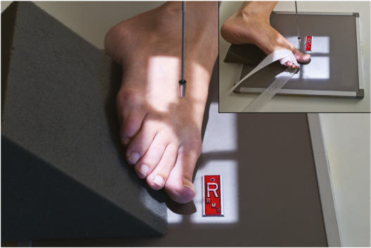
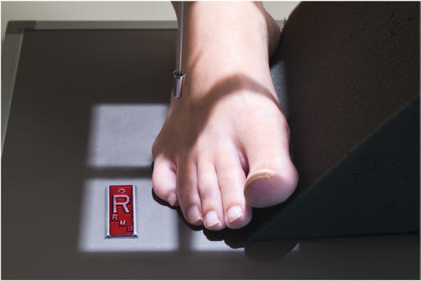
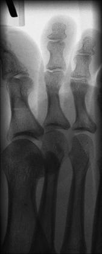
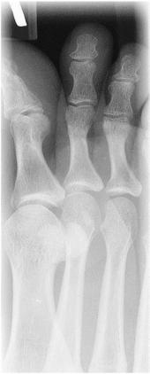

# Rx rotație MEDIALĂ sau EXTERNĂ (LATERALĂ), AP oblică (degete de la picior)

  📷 Radiografie Convențională (Rx)
  <strong>Actualizat:</strong> 2026-09-15
  <strong>Autor:</strong> Departamentul de Radiologie / Referință Bontrager

---

-   __1. Rezumat Clinic & Indicații__

    ---

    === "Indicații Clinice"

        - suspiciune de fractură sau luxație / subluxație articulară a falangei în cauză
        - Patologii precum artroza / modificările degenerative articulare și artrita gutoasă (gută), în special la nivelul primei falange

    === "Ghid Național IRIS"

        !!! info "Referință Primară: Ghidul Național IRIS (Ordinul MS 1342/2012)"
            - **Capitol Ghid IRIS:** *Aparat locomotor & Membru inferior*
            - **Grad de Recomandare:** **Grad A**
            - **Nivel de Iradiere Estimată:** `Clasa 1 (Minimă < 0.01 mSv)`

            [:octicons-search-16: Deschide Ghidul IRIS](../../iris.md){ .md-button .md-button--primary } [:material-open-in-new: Aplicația Oficială PWA](https://radiologie-pediatrica.ro/iris/){ .md-button target="_blank" rel="noopener" }

-   __2. Poziționare & Centrare Fascicul__

    ---

    - **Poziție Pacient:** Pacient: Se așază pacientul în decubit dorsal sau în poziție șezândă pe masă; genunchiul trebuie flectat, cu suprafața plantară a piciorului sprijinită pe receptorul de imagine. Regiune anatomică: Se centrează și se aliniază axa longitudinală a falangei cu raza centrală și cu axa longitudinală a porțiunii receptorului de imagine care este expusă. Se verifică dacă articulația metatarsofalangiană (MTF) a falangei examinate este centrată pe raza centrală. Se rotesc membrul inferior și piciorul la 30° până la 45°, medial pentru prima, a doua și a treia falangă (Fig. 6.43), respectiv lateral pentru a patra și a cincea falangă (Fig. 6.44). (Pentru gradul de oblicitate, se consultă incidențele oblice ale piciorului.) Se utilizează un suport radiotransparent de 45° sub porțiunea ridicată a piciorului pentru a preveni mișcarea. [Sursa folosește ambiguu termenul «falange» în descrierea degetelor piciorului.]
    - **Punct de Centrare Fascicul:** perpendicular pe receptorul de imagine, orientată spre articulația metatarsofalangiană (MTF) în cauză
    - **Distanță Focar-Film (DFF / SID):** 100 cm
    - **Comandă Respiratorie:** Apnee pe durata expunerii (sau conform cooperării pacientului)

-   __3. Parametri Tehnici Expunere__

    ---

    | Parametru Tehnic | Valoare Configurare Generator / Tub |
    |:-----------------|:-------------------------------------|
    | **Tensiune Tub (kV)** | 50-60 kV |
    | **Sarcină / Produs Curent-Timp (mAs)** | DE CONFIGURAT PE APARAT |
    | **Distanță Focar-Film (DFF / SID)** | 100 cm |
    | **Grilă Antidifuzoare (Bucky)** | Fără grilă (expunere directă) |
    | **Dimensiune Focar** | Focar Mic (0.6 mm) |
    | **Camere de Ionizare AEC** | DE CONFIGURAT PE APARAT |
    | **Colimare Fascicul** | Se colimează pe patru laturi pentru a include falangele și cel puțin jumătatea distală a oaselor metatarsiene. La marginile laterale, se include cel puțin câte o falangă de fiecare parte a falangei în cauză. Degete de la picior — examinare de rutină, AP oblică, laterală. Fig. 6.43 rotație oblică medială — prima falangă. Fig. 6.44 rotație oblică laterală — a patra falangă. |
    | **Filtrare Tub** | Totală ≥ 2.5 mm Al echivalent |

-   __4. Criterii de Calitate & Reușită Imagine__

    ---

    - Falanga în cauză și jumătatea distală a oaselor metatarsiene trebuie incluse fără suprapunere (superimpoziție) (Figs. 6.45 și 6.46). Poziție:
    - Axa longitudinală a piciorului este aliniată cu axa longitudinală a porțiunii receptorului de imagine care urmează să fie expusă.
    - Oblicitatea corectă trebuie evidențiată prin concavitatea crescută pe o parte a diafizelor și prin suprapunerea țesuturilor moi ale falangelor.
    - Capetele oaselor metatarsiene trebuie să apară direct unul lângă altul, fără suprapunere sau cu suprapunere minimă.4
    - Colimare la aria de interes diagnostic. Expunere:
    - fără mișcare, evidențiată prin marginile corticale bine definite ale osului și trabeculele osoase detaliate.
    - Expunerea receptorului de imagine și contrastul trebuie să fie optime pentru vizualizarea marginilor corticale osoase, a trabeculelor și a structurilor de părți moi. Fig. 6.45 Incidență oblică medială — a doua falangă. Falangă distală; falangă mijlocie; a 2-a articulație metatarsofalangiană (MTF) (raza centrală); porțiunea distală a celui de-al 2-lea metatarsian; falangă proximală. Fig. 6.46 Incidență oblică medială — a doua falangă. [Sursa folosește ambiguu termenul «falange» în descrierea degetelor piciorului.]

-   __5. Protecție Radiologică (ALARA)__

    ---

    - Ecranare gonadică și a organelor radiosensibile conform procedurilor locale de radioprotecție ALARA.
    - Colimare strictă la aria de interes pentru limitarea radiației difuze.
    - Verificarea posibilității unei sarcini la pacientele de vârstă fertilă înainte de expunere.

### 🖼️ Imagini

<figure class="protocol-image-card" markdown>

<figcaption><strong>Fig. 6.43 rotație oblică medială — prima falangă.</strong> — Poziționarea pacientului conform Ghidului Bontrager (Fig. 6.43 rotație oblică medială — prima falangă.)</figcaption>

</figure>

<figure class="protocol-image-card" markdown>

<figcaption><strong>Fig. 6.44 rotație oblică laterală — a patra falangă.</strong> — Aspect radiografic de referință conform Ghidului Bontrager (Fig. 6.44 rotație oblică laterală — a patra falangă.)</figcaption>

</figure>

<figure class="protocol-image-card" markdown>

<figcaption><strong>Fig. 6.45 medială</strong> — Aspect radiografic de referință conform Ghidului Bontrager (Fig. 6.45 medială)</figcaption>

</figure>

<figure class="protocol-image-card" markdown>

<figcaption><strong>Fig. 6.46 oblică medială —</strong> — Aspect radiografic de referință conform Ghidului Bontrager (Fig. 6.46 oblic medial—)</figcaption>

</figure>

=== "Ghid Rapid de Execuție"

    1. **Identificarea și verificarea pacientului:** verificare identitate, zonă de examinat, consimțământ conform procedurii și evaluarea posibilității unei sarcini, când este relevantă.
    2. **Pregătire:** îndepărtarea oricăror obiecte radiopace (bijuterii, agrafe, fermoare, proteze, pansamente dense).
    3. **Poziționare precisă:** alinierea receptorului de imagine și a tubului la distanța prescrisă (100 cm).
    4. **Colimare strictă:** adaptarea fasciculului strict la regiunea de diagnostic pentru scăderea iradierii și reducerea radiației difuze.
    5. **Radioprotecție:** verificarea [politicii RX](../radioprotectie.md), cu măsuri distincte pentru pacient, personal și însoțitor.

## Surse de documentare

- [Bontrager's Textbook of Radiographic Positioning (Ed. 9/10), Pagina 243](https://www.elsevier.com/books/textbook-of-radiographic-positioning-and-related-anatomy/lampignano/978-0-323-65367-1)
