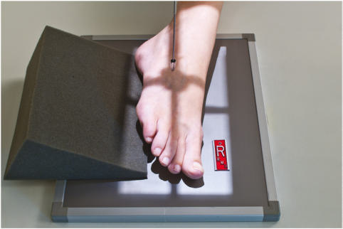
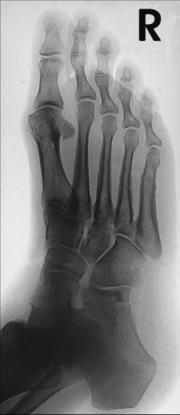
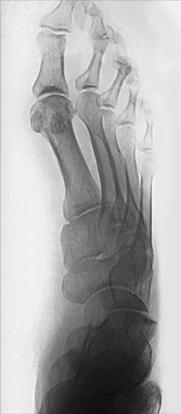
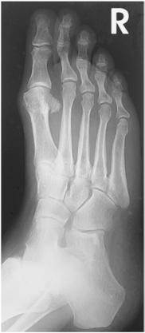

# Rx Rotație Internă (Medială) AP Oblică (Picior)

  📷 Radiografie Convențională (Rx)
  <strong>Actualizat:</strong> 2026-09-15
  <strong>Autor:</strong> Departamentul de Radiologie / Referință Bontrager

---

-   __1. Rezumat Clinic & Indicații__

    ---

    === "Indicații Clinice"

        - Location și extent de suspiciune de fractură și fragment alignments, spații articulare abnormalities, părți moi effusions
        - Location de opaque Corp străin / corpuri străine radio-opace

    === "Ghid Național IRIS"

        !!! info "Referință Primară: Ghidul Național IRIS (Ordinul MS 1342/2012)"
            - **Capitol Ghid IRIS:** *Ghidul Național IRIS*
            - **Grad de Recomandare:** **De verificat pe indicație; fără grad atribuit automat**
            - **Nivel de Iradiere Estimată:** `De verificat pentru examinarea și populația selectate`

            [:octicons-search-16: Deschide Ghidul IRIS](../../iris.md){ .md-button .md-button--primary } [:material-open-in-new: Aplicația Oficială PWA](https://radiologie-pediatrica.ro/iris/){ .md-button target="_blank" rel="noopener" }
-   __2. Poziționare & Centrare Fascicul__

    ---

    - **Poziție Pacient:** Pacient: Place pacient Decubit dorsal sau așezat; flex Genunchi, cu plantar surface de Picior pe table; turn corp slightly away de la side în question.; Regiune anatomică: Align și center axa longitudinală de Picior la raza centrală și la axa longitudinală de portion de receptorul de imagine being exposed. Rotate Picior medially la place plantar surface 30° la 40° la plane de receptorul de imagine (see NOTE). general plane de dorsum de Picior trebuie să fie paralel cu receptorul de imagine și perpendicular la raza centrală (Fig. 6.59). Use 45° radiolucent support block la prevent mișcare. Use săculeți cu nisip if necessary la prevent receptorul de imagine de la slipping pe tabletop.
    - **Punct de Centrare Fascicul:** perpendicular pe receptorul de imagine, orientat la base de third metatarsal
    - **Distanță Focar-Film (DFF / SID):** 100 cm
    - **Comandă Respiratorie:** Apnee pe durata expunerii (sau conform cooperării pacientului)

-   __3. Parametri Tehnici Expunere__

    ---

    | Parametru Tehnic | Valoare Configurare Generator / Tub |
    |:-----------------|:-------------------------------------|
    | **Tensiune Tub (kV)** | 60-70 kV |
    | **Sarcină / Produs Curent-Timp (mAs)** | DE CONFIGURAT PE APARAT |
    | **Distanță Focar-Film (DFF / SID)** | 100 cm |
    | **Grilă Antidifuzoare (Bucky)** | Fără grilă (expunere directă) |
    | **Dimensiune Focar** | Focar Mic (0.6 mm) |
    | **Camere de Ionizare AEC** | DE CONFIGURAT PE APARAT |
    | **Colimare Fascicul** | Collimate la outer margins de skin pe four sides. |
    | **Filtrare Tub** | Totală ≥ 2.5 mm Al echivalent |

-   __4. Criterii de Calitate & Reușită Imagine__

    ---

    - Entire Picior trebuie să fie evidențiat de la distal falange la posterior Calcaneu și proximal astragal (talus) (Figs. 6.61 și 6.62). poziție:
    - axa longitudinală de Picior trebuie să fie aliniat la axa longitudinală de receptorul de imagine.
    - Correct obliquity este evidențiat when third through fifth oase metatarsiene sunt liber de superimposition.
    - First și second oase metatarsiene also trebuie să fie liber de superimposition except pentru base area.
    - Tuberosity la base de fifth metatarsal este seen în profile și este well visualized.
    - spații articulare around cuboid și sinus tarsi sunt open și well evidențiat when Picior este poziționat obliquely correctly.
    - Collimation la aria de interes diagnostic. expunere:
    - optim receptorul de imagine expunere și contrast cu fără mișcare trebuie să visualize net margini și trabecular markings de falange, oase metatarsiene, și oase tarsiene.

-   __5. Protecție Radiologică (ALARA)__

    ---

    - Ecranare gonadică și a organelor radiosensibile conform procedurilor locale de radioprotecție ALARA.
    - Colimare strictă la aria de interes pentru limitarea radiației difuze.
    - Verificarea posibilității unei sarcini la pacientele de vârstă fertilă înainte de expunere.

!!! note "Observații Clinice & Tehnice"
    Some references suggest only a 30° oblic routinely. This text recommends greater obliquity, 40°, la evidențiază oase tarsiene și proximal oase metatarsiene best relatively liber de superimposition pentru Picior cu average transverse arch. Optional lateral oblic (Fig. 6.60) se rotește Picior laterally 30° (less obliquity este required because de natural arch de Picior). lateral oblic best evidențiază space între first și second oase metatarsiene și între first și second cuneiforms. navicular also este well visualized pe lateral oblic. Fig. 6.61 40° AP medial oblic. Navicular Cuboid 3rd cuneiform oase metatarsiene falange Sinus tarsi Calcaneu astragal (talus) Fig. 6.62 40° medial oblic. Picior ROUTINE AP oblic lateral Fig. 6.59 30° la 40° AP medial oblic. Fig. 6.60 30° AP lateral oblic.

### 🖼️ Imagini

<figure class="protocol-image-card" markdown>

<figcaption><strong>Fig. 6.61 40° AP</strong> — Poziționare pacient conform Ghidului Bontrager (Fig. 6.61 40° AP)</figcaption>

</figure>

<figure class="protocol-image-card" markdown>

<figcaption><strong>Fig. 6.62 40° medial</strong> — Aspect radiografic de referință conform Ghidului Bontrager (Fig. 6.62 40° medial)</figcaption>

</figure>

<figure class="protocol-image-card" markdown>

<figcaption><strong>Fig. 6.59 30° la 40° AP medial oblic.</strong> — Aspect radiografic de referință conform Ghidului Bontrager (Fig. 6.59 30° la 40° AP medial oblic.)</figcaption>

</figure>

<figure class="protocol-image-card" markdown>

<figcaption><strong>Fig. 6.60 30° AP lateral</strong> — Aspect radiografic de referință conform Ghidului Bontrager (Fig. 6.60 30° AP lateral)</figcaption>

</figure>

=== "Ghid Rapid de Execuție"

    1. **Identificarea și verificarea pacientului:** verificare identitate, zonă de examinat, consimțământ conform procedurii și evaluarea posibilității unei sarcini, când este relevantă.
    2. **Pregătire:** îndepărtarea oricăror obiecte radiopace (bijuterii, agrafe, fermoare, proteze, pansamente dense).
    3. **Poziționare precisă:** alinierea receptorului de imagine și a tubului la distanța prescrisă (100 cm).
    4. **Colimare strictă:** adaptarea fasciculului strict la regiunea de diagnostic pentru scăderea iradierii și reducerea radiației difuze.
    5. **Radioprotecție:** verificarea [politicii RX](../radioprotectie.md), cu măsuri distincte pentru pacient, personal și însoțitor.

## Surse de documentare

- [Bontrager's Textbook of Radiographic Positioning (Ed. 9/10), Pagina 247](https://www.elsevier.com/books/textbook-of-radiographic-positioning-and-related-anatomy/lampignano/978-0-323-65367-1)
